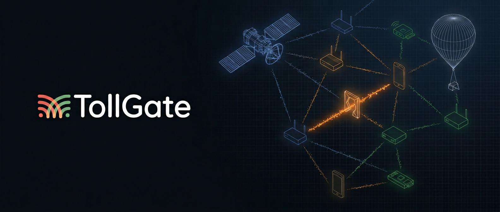

# tollgate-rs



Rust implementation of the [TollGate](https://github.com/OpenTollGate)
protocol — autonomous, device-to-device payment for metered resource
delivery, built on Cashu ecash and Spilman payment channels.

This repo contains:

- **tollgate-protocol** — the wire format and lifecycle, defined in
  the design documents under `docs/design/`. Resource-agnostic.
- **tollgate-core** — Rust library implementing the protocol's
  resource-agnostic logic (channels, metering, pricing, access control).
- **tollgate-net** — binary that uses `tollgate-core` to (re)sell
  network access over traditional IP networks or a self-organizing mesh
  such as [FIPS](https://github.com/nicobao/fips). This is the first
  deployment of TollGate.

A constrained-device variant (`tollgate-net-esp32`) lives in a separate
project and consumes the same `tollgate-core`.

→ **Start here:** [tollgate-intro.md](docs/design/core/tollgate-intro.md) — goals, architecture, payment model, security.

> tollgate-rs is in the design phase. The protocol and design documents
> are being finalized before implementation begins.

## Overview

TollGate enables any device that delivers a metered resource to another
device to charge for that service using Cashu ecash micropayments.
Devices negotiate prices, open payment channels, and settle autonomously
based on observed usage — no accounts, no registration, no central
billing authority.

TollGate is not a network protocol. It is a payment layer that operates
alongside any system where peers are authenticated and can deliver
resources to each other. `tollgate-core` is resource-agnostic — it
works for network forwarding, electricity metering, fluid delivery, or
any metered resource.

## How It Works

Each peer charges its own rate for delivering resources. Prices can be
positive, zero, or negative. Payment flows through Cashu Spilman
channels — unidirectional payment channels with streaming micropayments.
Two channels per peer pair (one per direction) enable bidirectional
payment with netting.


> **The operator's margin is the spread between what they charge for delivery and what they pay their peers.**

Each hop is its own independent commercial relationship. Clients don't
need path knowledge; operators earn the margin between what they buy
upstream and what they sell downstream.

At each metering interval (default: 5 seconds), both sides exchange
metering reports. The net debtor signs a single balance update — only the
delta moves.

## Key Properties

- **Hop-by-hop payment** — each peer pays its direct neighbor, no path
  knowledge needed
- **Per-peer pricing** — every relationship has its own price, per product,
  per mint, dynamically adjustable
- **Resource-agnostic** — core library works for bytes, watt-hours,
  milliliters, or any metered unit
- **Cashu-native** — Spilman channels for streaming payment, regular tokens
  for bootstrap
- **Offline-resilient** — balance updates don't need the mint; channels
  survive connectivity loss
- **Operator sovereignty** — the operator controls pricing, accepted mints,
  and peering policy

## Project Structure

```
tollgate-rs/
├── docs/
│   └── design/
│       ├── core/              Core protocol design documents (resource-agnostic)
│       └── network-peering/   Network-specific integration (IP, FIPS)
└── reference/
    ├── fips/                  FIPS mesh network (ideal substrate)
    ├── tollgate-module-basic-go/  TollGate v1 (Go, OpenWrt)
    └── cashu_spilman_channels/    Cashu Spilman channel implementation
```

## Design Documents

Start with the [introduction](docs/design/core/tollgate-intro.md), then
follow the reading order in the [design README](docs/design/README.MD).

| Document | Description |
| -------- | ----------- |
| [tollgate-intro.md](docs/design/core/tollgate-intro.md) | Goals, architecture, payment model, security |
| [tollgate-pricing.md](docs/design/core/tollgate-pricing.md) | Dual pricing (time + units), products, dynamic adjustment |
| [tollgate-protocol.md](docs/design/core/tollgate-protocol.md) | CBOR wire protocol, interval flow, negotiation |
| [tollgate-payment-channels.md](docs/design/core/tollgate-payment-channels.md) | Spilman channel lifecycle, rollover, netting |
| [tollgate-bootstrap.md](docs/design/core/tollgate-bootstrap.md) | Bootstrap tokens, bootstrap-only mode |
| [tollgate-access-control.md](docs/design/core/tollgate-access-control.md) | Access gates, access levels, FIPS bloom filter visibility |
| [tollgate-metering.md](docs/design/core/tollgate-metering.md) | Metering: counters, calibration, transit loss resolution |
| [tollgate-configuration.md](docs/design/core/tollgate-configuration.md) | YAML configuration reference |
| [peering-ip.md](docs/design/network-peering/peering-ip.md) | Traditional IP network integration |
| [peering-fips.md](docs/design/network-peering/peering-fips.md) | FIPS mesh network integration |
| [FIPS_FEATURE_REQUESTS.md](docs/design/FIPS_FEATURE_REQUESTS.md) | Required FIPS changes |

## Architecture

`tollgate-core` is a resource-agnostic library; deployments are binaries
that consume it and provide a `Wallet` and a `ResourceAdapter`.

```
tollgate-core (lib)              Pure logic, resource-agnostic
    │
    ├── tollgate-net (this binary)  Network forwarding, feature-flagged per OS
    │     ├── Linux / macOS / Windows / OpenWrt
    │     ├── FIPS or IP network adapter
    │     └── Cashu wallet (cdk-spilman based)
    │
    └── tollgate-net-esp32 (separate project)
          ├── ESP-IDF / constrained runtime
          └── Custom wallet + resource adapter
```

`tollgate-core` defines traits (`Wallet`, `ResourceAdapter`,
`ProductSelector`) that consumers provide. `tollgate-net` targets
Linux, macOS, Windows, and OpenWrt with feature flags for OS-specific
differences. ESP32 lives in a separate project due to fundamentally
different runtime constraints.

## Prior Work

- [TollGate v1](https://github.com/OpenTollGate/tollgate-module-basic-go) — Go implementation for OpenWrt, tree topology, Cashu token payments
- [FIPS](https://github.com/nicobao/fips) — Self-organizing encrypted mesh network
- [Cashu Spilman Channels](reference/cashu_spilman_channels/ARCHITECTURE.md) — Unidirectional payment channels for Cashu ecash
- [Cashu Protocol](https://cashu.space/) — Ecash protocol

## License

MIT
