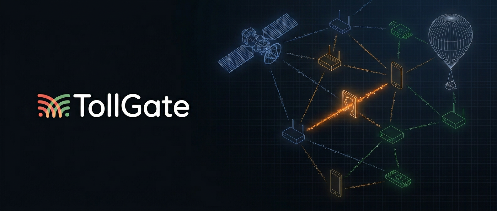

# tollgate-rs



Rust implementation of the [TollGate](https://github.com/OpenTollGate)
protocol — autonomous, device-to-device payment for metered resource
delivery, built on Cashu ecash and Spilman payment channels.

This repo contains:

- **[tollgate-protocol](docs/design/core/tollgate-protocol.md)** — the
  wire format and lifecycle. Resource-agnostic.
- **[tollgate-core](docs/design/core/)** — Rust library implementing the
  protocol's resource-agnostic logic (grants, buying, metering, access
  control).
- **[tollgate-market](docs/design/market/README.md)** — how vouchers are
  bought, sold and priced. Deliberately outside the payment protocol;
  served beside a node's mint, and implemented in `tollgate-net` for now.
- **tollgate-net** — binary that uses `tollgate-core` to (re)sell
  network access over traditional
  [IP networks](docs/design/network-peering/peering-ip.md) or a
  self-organizing mesh such as
  [FIPS](docs/design/network-peering/peering-fips.md). This is the first
  deployment of TollGate.

A constrained-device variant (`tollgate-net-esp32`) lives in a separate
project and consumes the same `tollgate-core`.

→ **Start here:** [tollgate-intro.md](docs/design/core/tollgate-intro.md) — goals, architecture, payment model, security.

Two nodes buy and sell network capacity from each other end to end: each
runs its own Cashu mint, sells vouchers against it for sats, and delivers
exactly the rate a peer bought. Nothing has been released yet; see
[CHANGELOG.md](CHANGELOG.md).

## Overview

TollGate enables any device that delivers a metered resource to another
device to charge for that service using Cashu ecash. Devices buy capacity
from each other, pay over Spilman channels, and are held to what they
paid for — no accounts, no registration, no central billing authority.

TollGate is not a network protocol. It is a payment layer that operates
alongside any system where peers are authenticated and can deliver
resources to each other. `tollgate-core` is resource-agnostic — it
works for network forwarding, electricity metering, fluid delivery, or
any metered resource.

## How It Works

**The protocol does not price anything.** Peers pay in *vouchers*: Cashu
tokens denominated in the resource itself — bytes, for network
forwarding — issued by the node that will deliver it. One voucher buys
one unit ([tollgate-vouchers.md](docs/design/core/tollgate-vouchers.md)).
What a unit costs in money is settled where vouchers are bought, in the
[market](docs/design/market/README.md), which the payment protocol never
sees.

A buyer prepays a **grant**: a quantity paired with a window, so what it
buys is a rate. The seller shapes the buyer to exactly that rate. A
purchase takes effect on arrival — the signed channel state is
cumulative, so a lost message costs nothing — and raising a rate
mid-window forfeits what was left of the grant in force. A peer that has
bought nothing is held at a small minimum flow, enough to reach a mint
and buy.

Payment flows over Cashu Spilman channels: the buyer funds a 2-of-2
multisig token in the seller's mint, and each purchase is a signed
balance update the seller can take to the mint.


> **The operator's margin is the spread between what they charge for delivery and what they pay their peers.**

Each hop is its own independent commercial relationship. Clients don't
need path knowledge; operators earn the margin between what they buy
upstream and what they sell downstream.

## Key Properties

- **Hop-by-hop payment** — each peer pays its direct neighbor, no path
  knowledge needed
- **Prepaid, never on credit** — nothing is delivered before it is paid
  for, and a seller refuses a purchase before taking any money
- **Resource-agnostic** — core library works for bytes, watt-hours,
  milliliters, or any metered unit
- **Cashu-native** — vouchers are ecash from each node's own mint, paid
  over Spilman channels
- **Offline-resilient** — balance updates don't need the mint; a node
  settling its own vouchers never leaves the node
- **Operator sovereignty** — the operator controls the price of its
  vouchers, which mints it takes payment in, and what one peer may buy

## Project Structure

```
tollgate-rs/
├── crates/
│   ├── tollgate-protocol/     Wire format: messages, CBOR codec, TCP framing (no_std)
│   ├── tollgate-core/         Pure logic: grants, buying, metering, access (no_std, sans-IO)
│   └── tollgate-net/          The node (tollgated) and its dashboard (tolltop)
├── docs/
│   └── design/
│       ├── core/              Core protocol design documents (resource-agnostic)
│       ├── market/            How vouchers are bought, sold and priced
│       └── network-peering/   Network-specific integration (IP, FIPS)
├── testing/                   Docker topologies that run nodes against each other
├── packaging/                 OpenWrt (.ipk) and macOS (.pkg) packages
├── .github/workflows/         CI and package builds
└── .ngit/                     Nostr CI (ngit-ci) workflow
```

## Design Documents

Start with the [introduction](docs/design/core/tollgate-intro.md), then
follow the reading order in the [design README](docs/design/README.MD).

| Document | Description |
| -------- | ----------- |
| [tollgate-intro.md](docs/design/core/tollgate-intro.md) | Goals, architecture, payment model, security |
| [tollgate-vouchers.md](docs/design/core/tollgate-vouchers.md) | Vouchers: denomination, grants and windows, who pays |
| [tollgate-protocol.md](docs/design/core/tollgate-protocol.md) | CBOR wire protocol and message flow |
| [tollgate-payment-channels.md](docs/design/core/tollgate-payment-channels.md) | Spilman channel lifecycle and rollover |
| [tollgate-access-control.md](docs/design/core/tollgate-access-control.md) | Delivery gates, access levels, FIPS bloom filter visibility |
| [tollgate-metering.md](docs/design/core/tollgate-metering.md) | Local counters: what they are and are not used for |
| [tollgate-hazards.md](docs/design/core/tollgate-hazards.md) | Constraints that exist because removing them reintroduces a known abuse |
| [tollgate-configuration.md](docs/design/core/tollgate-configuration.md) | YAML configuration reference |
| [market/](docs/design/market/README.md) | Buying and swapping vouchers, their price, issuer risk |
| [peering-ip.md](docs/design/network-peering/peering-ip.md) | Traditional IP network integration |
| [peering-fips.md](docs/design/network-peering/peering-fips.md) | FIPS mesh network integration |
| [FIPS_FEATURE_REQUESTS.md](docs/design/FIPS_FEATURE_REQUESTS.md) | Required FIPS changes |

## Architecture

`tollgate-core` is a resource-agnostic library and never does I/O: a
deployment drives it by turning real events into `Event`s and executing
the `Action`s it returns. Deployments are binaries that do the rest.

```
tollgate-core (lib)                Pure logic, resource-agnostic
    │
    ├── tollgate-net (this repo)   Network forwarding
    │     ├── Linux / OpenWrt / macOS
    │     ├── Resource adapter: nftables + tc, FIPS, or loopback
    │     ├── Cashu mint, market and wallet (cdk)
    │     └── Spilman channels (cdk-spilman)
    │
    └── tollgate-net-esp32 (separate project)
          ├── ESP-IDF / constrained runtime
          └── Its own wallet and resource adapter
```

In `tollgate-net`, a `ResourceAdapter` enforces what core decides — an
access level and a shaping rate per peer — and a `ChannelBackend` carries
the money. `nftables` gates and shapes the kernel's forwarding path on
Linux; `fips` hands the same decisions to a FIPS node; `loopback` shapes a
socket of its own and runs anywhere. ESP32 lives in a separate project due
to fundamentally different runtime constraints.

## Prior Work

- [TollGate v1](https://github.com/OpenTollGate/tollgate-module-basic-go) — Go implementation for OpenWrt, tree topology, Cashu token payments
- [FIPS](https://github.com/jmcorgan/fips) — Self-organizing encrypted mesh network
- [Cashu Spilman Channels](https://github.com/SatsAndSports/cashu_spilman_channels) — Unidirectional payment channels for Cashu ecash
- [Cashu Protocol](https://cashu.space/) — Ecash protocol

## License

MIT
