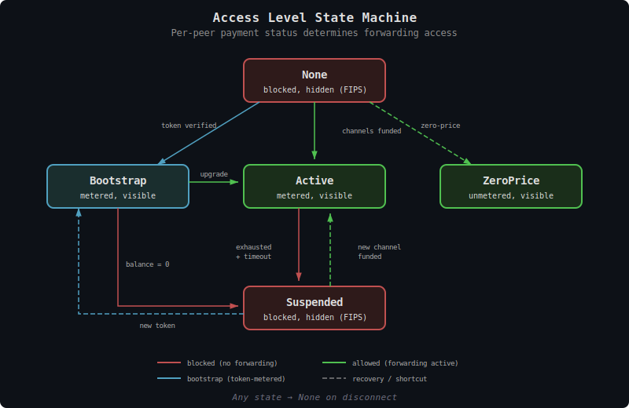

# TollGate Access Control

This document specifies how TollGate gates forwarding per-peer based on payment status, meters traffic, and enforces restrictions on unpaid peers.

## Overview

TollGate controls forwarding at the peer level. Each peer has an **access level** determined by their payment status. The implementation (FIPS, IP stack, etc.) enforces access control on the forwarding path — TollGate core decides *what* to enforce, the network adapter enforces *how*.

The core principle: **no pay, no forwarding**. A peer that hasn't paid cannot have transit traffic forwarded through this node. It can only exchange TollGate protocol messages with this node (Announce, PriceSheet, BootstrapToken, etc.) to negotiate payment.

---

## Access Levels

Each peer is in exactly one access level at any time:

| Level | Forwarding | TollGate messages | Bloom filter visibility (FIPS) | When |
|-------|-----------|-------------------|-------------------------------|------|
| `None` | Blocked | Allowed | Hidden | Peer connected, no payment yet |
| `Bootstrap` | Allowed (metered against token balance) | Allowed | Visible | Bootstrap token verified |
| `Active` | Allowed (metered, Spilman channels) | Allowed | Visible | Spilman channels funded |
| `ZeroPrice` | Allowed (unmetered) | Allowed | Visible | Both sides agreed on zero pricing |
| `Suspended` | Blocked | Allowed | Hidden | Balance exhausted, awaiting top-up or renegotiation |

### Transitions

```
None --> Bootstrap (token verified)
None --> Active (Spilman channels funded)
None --> ZeroPrice (zero-price PriceSheet accepted)
Bootstrap --> Active (upgrade to Spilman)
Bootstrap --> Suspended (balance exhausted)
Active --> Suspended (channel exhausted, rollover timeout)
Suspended --> Bootstrap (new token received)
Suspended --> Active (new channel funded)
Any --> None (disconnect)
```



### None (Default)

Every newly connected peer starts at `None`. The peer can exchange TollGate protocol messages — Announce, PriceSheet, Accept, BootstrapToken — but **no traffic is forwarded** for or through this peer.

This means:
- Packets originating from this peer and addressed to other nodes are **dropped**
- Packets from other nodes destined for or through this peer are **not forwarded to it**
- Only TollGate protocol messages (identified by the implementation) are allowed

### Bootstrap

The peer has sent a bootstrap token that was verified with the mint. Forwarding is allowed and metered against the token balance. When the balance reaches zero, the peer transitions to `Suspended`.

### Active

Spilman channels are funded and operational. Forwarding is allowed and metered. Balance updates happen at each settlement interval via the normal Spilman flow.

### ZeroPrice

Both sides agreed on zero pricing for all products. No payment infrastructure is needed. Forwarding is allowed and unmetered. No settlement messages are exchanged.

### Suspended

The peer's payment has been exhausted (bootstrap balance = 0, or Spilman channel exhausted with rollover timeout expired). Forwarding is blocked. The peer can still exchange TollGate messages to send a new token or fund a new channel.

---

## What "Blocked" Means

When forwarding is blocked (`None` or `Suspended`), the node:

1. **Drops transit traffic from this peer** — packets originating from the peer addressed to other nodes are silently dropped
2. **Does not forward to this peer** — packets from other nodes destined for this peer are not forwarded (they may be re-routed via other paths)
3. **Allows local-addressed traffic** — packets from the peer addressed to *this node* are delivered (this is how TollGate protocol messages reach the node)
4. **Allows TollGate protocol messages** — the peer must be able to negotiate payment

The implementation decides how to enforce this. In FIPS, this could be a forwarding filter that checks the peer's access level before forwarding. In a traditional IP network, this could be firewall rules.

---

## Bloom Filter Visibility (FIPS)

In FIPS, bloom filters advertise reachability — "I can reach destination X through peer Y." If an unpaid peer is included in bloom filters, other nodes may route traffic through it, only to have it blackholed at the gate.

**Rule: unpaid peers are hidden from bloom filters.**

| Access level | Included in bloom filters? |
|-------------|---------------------------|
| `None` | No — hidden (FIPS) |
| `Bootstrap` | Yes — visible (FIPS) |
| `Active` | Yes — visible (FIPS) |
| `ZeroPrice` | Yes — visible (FIPS) |
| `Suspended` | No — hidden (FIPS) |

Bloom filter visibility is **inferred from the access level** — the implementation maps `set_peer_access(None/Suspended)` to hidden and `set_peer_access(Bootstrap/Active/ZeroPrice)` to visible. No separate API call needed.

This requires a FIPS modification — the ability to selectively include/exclude peers from bloom filter computation. See [FIPS_FEATURE_REQUESTS.md](../v1-to-v2-migration/FIPS_FEATURE_REQUESTS.md).

---

## Metering

### What is Metered

Each node meters **bytes forwarded to each peer** (outbound). This is what the node charges for — it did the work of forwarding those packets.

```
Node A forwards 1000 bytes to Peer B this interval
A's metering: bytes_forwarded_to_B += 1000
```

Both sides meter independently. At each settlement interval, both exchange MeteringReports containing:
- `bytes_forwarded`: bytes we forwarded TO this peer
- `bytes_received`: bytes we received FROM this peer
- `elapsed_ms`: milliseconds since last report

### Calibration

Both sides report what they sent and what they received. This allows calibration:
- A says: "I forwarded 1000 bytes to you" (`bytes_forwarded = 1000`)
- B says: "I received 980 bytes from you" (`bytes_received = 980`)
- Drift = |1000 - 980| / 1000 = 2% (within default 5% tolerance)

### Drift Resolution

When the two sides disagree on byte counts, **the higher value is used** for billing. The forwarder claims they did more work; even if the receiver dropped some packets, the forwarder still expended resources sending them.

**Note:** This rule is honest-forwarder-optimistic. A dishonest forwarder could inflate byte counts. Dealing with dishonest peers (proof-of-forwarding, reputation systems, etc.) requires further design work in future phases.

| Situation | Billable amount | Action |
|-----------|----------------|--------|
| Drift within tolerance (default 5%) | Higher value | Normal — both sides note discrepancy |
| Drift exceeds tolerance | Higher value | Warning sent (Reject: drift tolerance exceeded) |
| Persistent drift (3+ intervals) | Higher value | Close and renegotiate |

### Metering Scope

All bytes forwarded to a peer are metered — including TollGate protocol messages and locally-addressed traffic. Distinguishing control plane from data plane at the metering layer adds complexity for negligible savings (protocol messages are tiny relative to forwarded traffic). The cost of protocol overhead is effectively zero at normal traffic volumes.

---

## NetworkAdapter Trait

The core library uses the `NetworkAdapter` trait to interact with the network layer. The implementation provides access control enforcement and traffic counters.

```rust
pub trait NetworkAdapter: Send + Sync {
    /// Set the access level for a peer. The implementation enforces forwarding rules
    /// AND infers bloom filter visibility from the access level:
    /// - None/Suspended -> hidden from bloom filters (FIPS)
    /// - Bootstrap/Active/ZeroPrice -> visible in bloom filters (FIPS)
    fn set_peer_access(&self, peer: &Pubkey, access: AccessLevel) -> Result<(), AdapterError>;

    /// Subscribe to traffic counter updates for a peer. The implementation pushes
    /// cumulative byte counts as they change. Core takes a snapshot at each
    /// settlement interval to compute the delta.
    fn subscribe_traffic(&self, peer: &Pubkey) -> Result<TrafficStream, AdapterError>;

    /// Get network metrics for a peer (for dynamic pricing). None for networks without metrics.
    fn peer_metrics(&self, peer: &Pubkey) -> Option<PeerMetrics>;
}

/// Continuous traffic counter stream. Implementation pushes updates as traffic flows.
pub struct TrafficStream {
    /// Cumulative bytes forwarded TO this peer (outbound)
    pub outbound_bytes: watch::Receiver<u64>,
    /// Cumulative bytes received FROM this peer (inbound)
    pub inbound_bytes: watch::Receiver<u64>,
}

pub enum AccessLevel {
    /// No forwarding. Only TollGate protocol messages allowed.
    None,
    /// Forwarding allowed, metered against bootstrap token balance.
    Bootstrap,
    /// Forwarding allowed, metered via Spilman channels.
    Active,
    /// Forwarding allowed, unmetered. Zero-price peering.
    ZeroPrice,
    /// Forwarding blocked. Balance exhausted, awaiting payment.
    Suspended,
}
```

### PeerMetrics (Optional)

Available from FIPS MMP or equivalent. Used for dynamic pricing, not access control.

```rust
pub struct PeerMetrics {
    pub srtt_ms: Option<f64>,
    pub loss_rate: Option<f64>,
    pub etx: Option<f64>,
    pub goodput_bps: Option<f64>,
    pub jitter_ms: Option<u32>,
}
```

---

## Access Control Flow

### New Peer Connects

```
1. Network layer authenticates peer (FIPS Noise IK, WireGuard, etc.)
2. Core sets access level to None
3. Peer and node exchange Announce
4. Peer and node exchange PriceSheet
5. Peer sends Accept (or BootstrapToken)
6. Access level transitions based on payment
```

### Bootstrap Payment

```
1. Peer sends BootstrapToken
2. Forwarder verifies with mint
3. If valid: set access to Bootstrap (bloom visible in FIPS)
4. Metering begins
5. When balance exhausted: set access to Suspended (bloom hidden in FIPS)
```

### Spilman Channels Funded

```
1. Both peers send Accept with channel funding
2. Both verify funding proofs
3. Both send ChannelReady
4. Set access to Active (bloom visible in FIPS)
5. Metering and settlement begin
```

### Balance Exhausted (Suspended)

```
1. Bootstrap balance = 0 OR channel exhausted + rollover timeout
2. Set access to Suspended (bloom hidden in FIPS)
3. Forwarding stops
4. Peer can send BootstrapToken or fund new channel
5. On payment: transition back to Bootstrap or Active
```

---

## Design Decisions

| Decision | Resolution | Rationale |
|----------|-----------|-----------|
| Default access | None (blocked) | No pay, no service |
| Unpaid traffic | Only local-addressed + TollGate protocol | Peer must be able to negotiate payment |
| Metering target | All outbound bytes (forwarded to peer) | What we charge for — includes protocol overhead (negligible) |
| Metering delivery | Push/stream (cumulative counters) | Continuous updates, snapshot at settlement |
| Drift resolution | Use higher value | Favors forwarder, deterministic. Dishonest peer mitigation is future work. |
| Drift tolerance | 5% default, configurable | Accounts for packet loss between measurement points |
| Bloom filter visibility | Inferred from access level (FIPS) | No separate API — access level implies visibility |
| Zero-price peers | Skip all payment, go to Active | Simplest path for free peering |
| Suspended state | Blocked but can still negotiate | Peer can recover without reconnecting |
| Protocol messages | Always allowed regardless of access level | Payment negotiation must work even when blocked |
