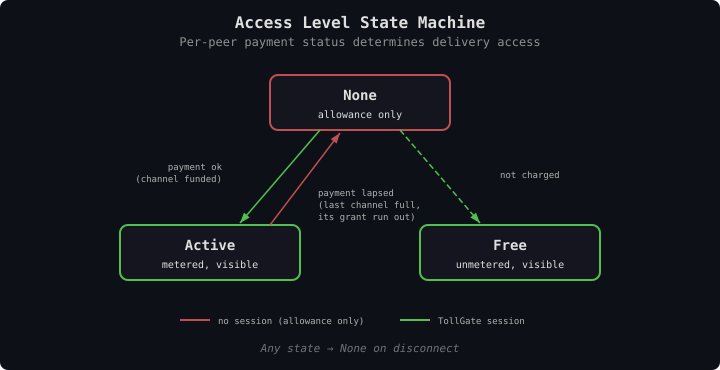

# TollGate Access Control

This document specifies how TollGate gates delivery per-peer based on payment status, meters resource usage, and enforces restrictions on unpaid peers.

## Overview

TollGate controls delivery at the peer level. Each peer has an **access level** determined by their payment status. The implementation (FIPS, IP stack, etc.) enforces access control on the delivery path — `tollgate-core` decides *what* to enforce, the resource adapter enforces *how*.

The core principle: **no pay, no delivery**. A peer that hasn't paid cannot have resources delivered through this node. It can only exchange TollGate protocol messages with this node (Announce, Offer, Accept) to establish payment.

---

## Access Levels

Each peer is in exactly one access level at any time:

| Level | Delivery | TollGate messages | Bloom filter visibility (FIPS) | When |
|-------|---------|-------------------|-------------------------------|------|
| `None` | Blocked | Allowed | Hidden | Peer connected, no payment yet |
| `Active` | Allowed (metered) | Allowed | Visible | Spilman channels funded |
| `Free` | Allowed (unmetered) | Allowed | Visible | Neither side charges the other |
| `Suspended` | Blocked | Allowed | Hidden | Balance exhausted, awaiting top-up or renegotiation |

The access level says only whether delivery is allowed and how (metered or not). How much the peer has left to spend is tracked by the payment subsystem and does not surface as an access level.

### Transitions

```
None --> Active (Spilman channels funded)
None --> Free (free peering agreed)
Active --> Suspended (channel exhausted with rollover timeout)
Suspended --> Active (new channel funded)
Any --> None (disconnect)
```


<details><summary>Text version</summary>

```
                       ┌──────────────┐
                       │     None     │ (blocked, hidden)
                       └──┬─────────┬─┘
              payment ok  │         │ free
                          ▼         ▼
                   ┌──────────┐    ┌───────────┐
                   │  Active  │    │ Free │
                   └────┬─────┘    └───────────┘
                        │ exhausted (+ timeout for Spilman)
                        ▼
                   ┌──────────┐
                   │ Suspended│ (blocked, hidden)
                   └────┬─────┘
                        │ payment restored
                        └─────────► Active

  Red = blocked    Green = allowed
  Any state → None on disconnect
```
</details>

### None (Default)

Every newly connected peer starts at `None`. The peer can exchange TollGate protocol messages — Announce, Offer, Accept — but **no resources are delivered** for or through this peer.

This means:
- Packets originating from this peer and addressed to other nodes are **dropped**
- Packets from other nodes destined for or through this peer are **not delivered to it**
- Only TollGate protocol messages (identified by the implementation) are allowed

### Active

Spilman channels are funded. Delivery is allowed up to what each side has bought, and each peer's grant is drawn down as traffic passes.

### Free

Neither side charges the other — two nodes under one operator, or any pair whose operators decided not to. No payment infrastructure is needed: neither issues vouchers to the other, delivery is unmetered, and no metering or balance update messages are exchanged.

This is a decision about the relationship rather than a price set to zero, and each side decides only for itself. Where only one side charges, that side's peer sits in `Active` and funds one channel; `Free` covers the case where neither does.

**Free is not transitive.** It means free for *that peer's own traffic*, never free for anything that peer is nominally the beneficiary of — otherwise an uncharged peer becomes a way to launder free transit for others. See [tollgate-hazards.md](tollgate-hazards.md).

### Suspended

The peer's channel is exhausted and the rollover timeout has expired. Delivery is blocked. The peer can still exchange TollGate messages to fund a new channel.

---

## What "Blocked" Means

When delivery is blocked (`None` or `Suspended`), the node:

1. **Suspends resource delivery from this peer** — packets originating from the peer addressed to other nodes are silently dropped
2. **Does not deliver to this peer** — packets from other nodes destined for this peer are not delivered (they may be re-routed via other paths)
3. **Allows control messages** — packets from the peer addressed to *this node* are delivered (this is how TollGate protocol messages reach the node)
4. **Allows TollGate protocol messages** — the peer must be able to negotiate payment

The implementation decides how to enforce this. In FIPS, this could be a delivery filter that checks the peer's access level before delivering. In a traditional IP network, this could be firewall rules.

---

## Bloom Filter Visibility (FIPS)

In FIPS, bloom filters advertise reachability — "I can reach destination X through peer Y." If an unpaid peer is included in bloom filters, other nodes may route resources through it, only to have them blackholed at the gate.

**Rule: unpaid peers are hidden from bloom filters.**

| Access level | Included in bloom filters? |
|-------------|---------------------------|
| `None` | No — hidden (FIPS) |
| `Active` | Yes — visible (FIPS) |
| `Free` | Yes — visible (FIPS) |
| `Suspended` | No — hidden (FIPS) |

Bloom filter visibility is **inferred from the access level** — the implementation maps `set_peer_access(None/Suspended)` to hidden and `set_peer_access(Active/Free)` to visible. No separate API call needed.

This requires a FIPS modification — the ability to selectively include/exclude peers from bloom filter computation. See [FIPS_FEATURE_REQUESTS.md](../FIPS_FEATURE_REQUESTS.md).

---

## ResourceAdapter Trait (Access Control Members)

The `ResourceAdapter` trait spans both access control and metering. The access-control-related members:

```rust
pub trait ResourceAdapter: Send + Sync {
    /// Set the access level for a peer. The implementation enforces delivery rules
    /// AND infers bloom filter visibility from the access level:
    /// - None/Suspended -> hidden from bloom filters (FIPS)
    /// - Active/Free -> visible in bloom filters (FIPS)
    fn set_peer_access(&self, peer: &Pubkey, access: AccessLevel) -> Result<(), AdapterError>;

    // ... metering members documented in tollgate-metering.md
}

pub enum AccessLevel {
    /// No delivery. Only TollGate protocol messages allowed.
    None,
    /// Delivery allowed, metered against funded Spilman channels.
    Active,
    /// Delivery allowed, unmetered. Free peering.
    Free,
    /// Delivery blocked. Balance exhausted, awaiting payment.
    Suspended,
}
```

Counting units delivered, transit-loss reconciliation, and peer metrics are documented in [tollgate-metering.md](tollgate-metering.md).

---

## Access Control Flow

### New Peer Connects

```
1. Network layer authenticates peer (FIPS Noise IK, WireGuard, etc.)
2. Core sets access level to None
3. Peer and node exchange Announce
4. Peer and node exchange Offer
5. Peer sends Accept with channel funding
6. Access level transitions based on payment
```

### Spilman Channels Funded

```
1. Both peers send Accept with channel funding
2. Both verify funding proofs
3. Both send ChannelReady
4. Set access to Active (bloom visible in FIPS)
5. Each side buys grants on its own channel; delivery is shaped to what each has bought
```

### Balance Exhausted (Suspended)

```
1. Channel exhausted + rollover timeout
2. Set access to Suspended (bloom hidden in FIPS)
3. Delivery stops
4. Peer funds a new channel
5. On payment: transition back to Active
```

---

## Scope and Future Work

The access level governs **outbound delivery** — whether we forward, transit, or deliver to the peer. It is determined by the peer's payment to us.

The reverse direction — whether we *accept* what the peer delivers to us — is not modeled by the access enum today. Locally-addressed packets from a peer are always accepted, and our payment to the peer (which gates whether we are buying from them) lives in the wallet/channel state, not in the access enum. This works in practice but leaves the asymmetric case (e.g., we paid them, but they stopped paying us) implicit.

A future revision may replace the enum with a directional model that captures both directions in a single type:

| State | Outbound (we deliver) | Inbound (we accept) |
|---|---|---|
| `None` | Blocked | Blocked |
| `InboundOnly` | Blocked | Allowed (we pay them) |
| `OutboundOnly` | Allowed (they pay us) | Blocked |
| `Full` | Allowed | Allowed |
| `Free` | Allowed (unmetered) | Allowed (unmetered) |

This makes the asymmetric case (`InboundOnly` / `OutboundOnly`) a first-class state, simplifies bloom-filter-inclusion logic, and maps cleanly to FIPS forwarding policy variants. Out of scope for v1 — flagged for future design work.

---

## Design Decisions

| Decision | Resolution | Rationale |
|----------|-----------|-----------|
| Default access | None (blocked) | No pay, no service |
| Unpaid resources | Only local-addressed + TollGate protocol | Peer must be able to negotiate payment |
| Bloom filter visibility | Inferred from access level (FIPS) | No separate API — access level implies visibility |
| Free peers | Skip all payment, go to Active; not transitive | Simplest path for free peering; transitivity would launder free transit |
| Suspended state | Blocked but can still negotiate | Peer can recover without reconnecting |
| Protocol messages | Always allowed regardless of access level | Payment negotiation must work even when blocked |
