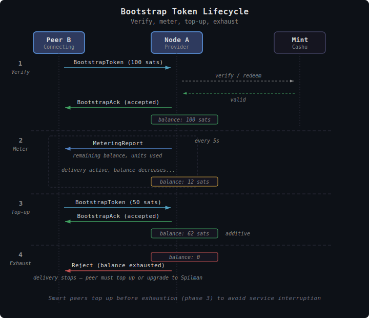

# TollGate Bootstrap Tokens

This document specifies how TollGate handles regular Cashu token payments — the bootstrap mechanism that exists before (or instead of) Spilman payment channels.

## Overview

Bootstrap tokens are regular Cashu ecash tokens (not Spilman channels) used in two scenarios:

1. **Channel setup**: A peer needs to pay to get online and reach a mint so it can fund a Spilman channel. The bootstrap token is a one-time payment to establish connectivity.
2. **Bootstrap-only mode**: A peer runs its entire session on regular tokens, never upgrading to Spilman channels. The peer sends tokens to top up as balance is consumed.

In both cases, the same mechanism applies: the peer sends a token, the provider verifies it with the mint, and grants metered service until the token value is consumed.

**No service without verification.** The provider must be able to reach the mint to verify the token. If the provider is offline, it cannot accept bootstrap tokens — the peer must wait or find another route.

---

## When Bootstrap is Needed

Bootstrap is needed when the connecting peer **cannot fund a Spilman channel** — either because it has no mint connectivity, or because it doesn't support Spilman channels at all.

| Scenario | Bootstrap needed? | Notes |
|----------|-------------------|-------|
| Peer has mint connectivity through other peers | No | Proceed directly to Spilman channel funding |
| Peer's first connection, no other peers | Yes | Bootstrap token gets peer online |
| All other peer connections have failed | Yes | Bootstrap token is the only payment option |
| Peer doesn't support Spilman (bootstrap-only device) | Yes | Entire session runs on bootstrap tokens |
| Both peers have mint connectivity | No | Proceed directly to Spilman |

---

## Token Flow


<details><summary>Text version</summary>

```
  1. Verify
     B → A: BootstrapToken (100 sats)
     A → Mint: verify/redeem
     Mint → A: valid
     A → B: BootstrapAck (accepted)         balance: 100 sats

  2. Meter (every 5s)
     A → B: MeteringReport (remaining balance, units used)
     delivery active, balance decreases...   balance: 12 sats

  3. Top-up (proactive, before exhaustion)
     B → A: BootstrapToken (50 sats)
     A → B: BootstrapAck (accepted)         balance: 62 sats (additive)

  4. Exhaust (if no top-up)
     balance: 0
     A → B: Reject (balance exhausted)
     delivery stops — peer must top up or upgrade to Spilman
```
</details>

### Sending a Bootstrap Token

```
Peer B sends a BootstrapToken to Node A:

B → A: BootstrapToken { token: <raw Cashu token> }
A verifies token with mint
A → B: BootstrapAck { status: accepted } or { status: rejected, reason: "..." }
```

The token is a standard Cashu ecash token in NUT-00 format. The provider:
1. Decodes the token
2. Checks that the mint is in the accepted mints list (from the PriceSheet)
3. Submits the token to the mint for verification/redemption
4. If valid: credits the token value to the peer's balance, sends BootstrapAck (accepted)
5. If invalid (spent, malformed, wrong mint): sends BootstrapAck (rejected) with reason

### Verification Requirement

The provider **must** be able to reach the mint to verify the token. There is no "pending" or "trust on faith" mode. If the provider cannot reach the mint:
- BootstrapAck is sent with status: rejected, reason: "mint unreachable"
- The peer must wait for mint connectivity to return, or find an alternative peer

This is a strict policy: **no pay, no service**. The provider does not grant access based on unverified tokens.

---

## Balance Tracking

Once a bootstrap token is accepted, the provider tracks the peer's balance internally **at scaled precision** (not whole sats). The balance is stored in scaled units (milli-sats with pricing_scale=1000) so that sub-unit costs accumulate correctly across metering intervals without rounding away small amounts.

```
token_value_scaled = token_value_sats x pricing_scale

each metering interval:
  cost_scaled = (elapsed_seconds x price_per_second) + (units_delivered x price_per_unit)
  balance_scaled = balance_scaled - cost_scaled

balance exhausted when: balance_scaled <= 0
```

For example, with pricing_scale=1000 and price_per_unit=1 (0.001 sat/unit):
- Token value: 10 sats -> balance_scaled = 10,000
- Each interval delivering 1000 units: cost_scaled = 1000 -> balance_scaled decreases by 1000
- After 10 intervals: balance_scaled = 0 (exhausted)

The balance never rounds to whole sats between intervals — sub-sat costs accumulate precisely. The pricing comes from the product the peer accepted in the PriceSheet.

### Usage Reporting

Both sides send **MeteringReport** at each metering interval — resources flow in both directions even in bootstrap mode. The provider reports units delivered to the peer (what the peer is being charged for), and the peer reports units delivered to the provider (for calibration).

However, only the provider's direction has pricing applied against the bootstrap balance. The bootstrap-only peer's delivery price **must be zero** (or negative) — because the provider has no way to pay the peer (the peer can't receive Spilman channels). This means bootstrap-only mode is only viable for peers that provide delivery for free — typically leaf nodes / consumers that just want access, not relay nodes charging for transit.

### Balance Exhaustion

When the balance reaches zero:
1. The provider stops delivery for this peer
2. The provider sends Reject (reason code: 0x09 — balance exhausted)
3. The peer can send another BootstrapToken to top up

The Reject message signals the peer that it needs to pay more. The peer's options:
- Send another BootstrapToken (top up)
- If the peer now has mint connectivity: upgrade to Spilman channels (send Accept with channel funding)
- Disconnect

---

## Token Renewal (Top-Up)

The peer can send additional BootstrapTokens at any time — before or after balance exhaustion. Each accepted token's value is **added** to the current balance (at scaled precision).

```
B → A: BootstrapToken { token: 100 sats }
A → B: BootstrapAck { accepted }
[balance_scaled: 100,000]

... delivery metered, balance decreases ...
[balance_scaled: 20,000]

B → A: BootstrapToken { token: 50 sats }
A → B: BootstrapAck { accepted }
[balance_scaled: 70,000]
```

There is no negotiation for top-ups — the pricing was already agreed in the PriceSheet. The peer just sends more tokens when their balance runs low.

### Proactive Top-Up

A smart peer monitors the MeteringReports from the provider and sends a new token *before* balance exhaustion to avoid service interruption. The provider never stops service if the balance is positive.

---

## Upgrade to Spilman


<details><summary>Text version</summary>

```
  1. Bootstrap (peer offline, no mint path)
     B → A: BootstrapToken
     A → Mint: verify → valid
     A → B: BootstrapAck (accepted)
     B now has connectivity — can reach the mint

  2. Upgrade to Spilman
     B creates Spilman funding via mint
     B → A: Accept + Spilman funding
     A → B: Accept + Spilman funding
     B → A: ChannelReady
     A → B: ChannelReady

     Spilman channels active — remaining bootstrap balance abandoned
```
</details>

Once a peer has mint connectivity (gained through the bootstrap-funded connection), it upgrades by sending Accept with channel funding (see the diagram above).

The remaining bootstrap balance is **abandoned** at upgrade — the provider keeps it. This is acceptable because the bootstrap amount is meant to be small (sized for channel setup, not for sustained use), and any residual value is bounded by that size. Clients that plan to upgrade should size their bootstrap token accordingly.

> **Future:** carrying the remaining balance over as a credit toward the first Spilman metering intervals would avoid the small loss, but requires the credit to be tracked deterministically by both sides (otherwise the per-interval netting computation diverges). A possible mechanism is a one-time `BootstrapCredit` message announcing the amount, with both sides tracking it identically across intervals. Out of scope for v1.

---

## Bootstrap-only Mode

A bootstrap-only client pays for received resources via bootstrap tokens only — it cannot fund a Spilman channel for outgoing payment (no ECDH, no balance signing capability). The entire session runs on BootstrapToken messages. **Spilman channels are highly recommended** when the client supports them, but bootstrap-only is a fully supported lifecycle for devices that can't run channel signing.

**Bootstrap-only is a special case of pay-only.** Pay-only means the client only pays peers and never charges them — so the peer doesn't fund a channel back toward the client (no payment ever flows in that direction). Bootstrap-only goes further: even the client's *outgoing* payment must use bootstrap tokens because it cannot sign Spilman balance updates. A Spilman-capable client can still be pay-only by simply not charging peers; its outgoing payment uses Spilman channels efficiently.

In bootstrap-only mode:
- The client never sends Accept with channel funding (can't sign balance updates)
- The peer never sends Accept with channel funding (no receiving channel — not needed because the client doesn't charge)
- The entire session runs on BootstrapToken messages
- The client sends tokens to top up as balance is consumed
- The provider tracks balance and sends MeteringReports
- No metering interval signatures, no netting, no rollover
- **The client's delivery price must be zero or negative** — otherwise the peer would owe the client money it has no way to deliver (there is no channel back to the client). This is what makes the client pay-only.

### Bootstrap-only Limitations

| Aspect | Spilman channels (bidirectional) | Bootstrap-only |
|--------|---------------------------------|----------------|
| Payment overhead | One signature per interval | Full token per payment |
| Granularity | Streaming (per-interval) | Chunked (per-token) |
| Change | Sender claims back via mint | No change — provider keeps remainder |
| Bidirectional payment | Yes (netting) | No — one direction only |
| Offline operation | Balance updates continue | No — each token needs mint verification |
| Min. device capability | Spilman signing, ECDH | Just create Cashu tokens |

Bootstrap-only is strictly inferior in efficiency but serves constrained devices that can't participate in channel management, and any client that prefers it.

---

## Bootstrap Token Amount

### For Spilman Setup

The ideal bootstrap token covers just enough to:
1. Fund a Spilman channel (minimum channel capacity)
2. Cover mint fees for channel creation
3. Cover the brief period of resource delivery while setting up the channel

A reasonable default: **2x minimum channel capacity** — enough for the channel plus setup overhead.

### For Bootstrap-only Sessions

Bootstrap-only peers should send tokens sized for practical usage periods. Too small = frequent top-ups with high overhead. Too large = more wasted change if the session ends early.

Guidance for bootstrap-only peers:
- Estimate session duration x pricing rate
- Add a small buffer (10-20%)
- Send tokens in practical chunks (e.g., 5-10 minutes of expected usage)

---

## Error Cases

### Token Rejected

| Reason | Provider action | Peer action |
|--------|-----------------|-------------|
| Mint not in accepted list | Reject: mint not accepted | Use a different mint |
| Token already spent | Reject: token spent | Send a fresh token |
| Token malformed | Reject: invalid token | Fix token encoding |
| Mint unreachable | Reject: mint unreachable | Wait and retry, or find another peer |
| Wrong unit | Reject: unit not accepted | Use the unit from PriceSheet |

### Balance Exhausted

The provider sends Reject (0x09: balance exhausted). Delivery stops immediately. The peer must top up or upgrade to Spilman.

### Forwarder Goes Offline

If the provider loses mint connectivity after accepting a token:
- Service continues normally — the balance was already verified and credited
- The peer's balance continues to decrease as delivery is metered
- If the peer tries to send a new token while the provider is offline, it will be rejected (mint unreachable)
- When mint returns, the peer can send new tokens again

---

## Design Decisions

| Decision | Resolution | Rationale |
|----------|-----------|-----------|
| Verification | Always verify with mint before granting service | No pay, no service — no risk of spent tokens |
| Balance precision | Tracked at scaled units (milli-sats), not whole sats | Sub-sat costs accumulate correctly without rounding |
| Balance tracking | Provider tracks internally, same pricing formula as Spilman | Consistent metering across payment modes |
| Usage reporting | Bidirectional MeteringReport, pricing applied one direction only | Both sides calibrate; bootstrap-only peer delivers for free |
| Top-up | Additive — new token value added to current balance | Simple, no negotiation needed |
| Upgrade path | Peer sends Accept with Spilman funding when ready | Seamless transition; remaining bootstrap balance abandoned |
| Bootstrap residual | Abandoned at upgrade in v1 | Avoids per-interval netting exception; future BootstrapCredit message could reclaim it deterministically |
| Bootstrap-only pricing | Client's delivery price must be zero or negative | No receiving channel to the client; peer would have no way to pay positive amounts |
| Exhaustion signal | Reject (balance exhausted) | Reuses existing message type |
| Offline provider | Existing balance continues, new tokens rejected until mint returns | Already-verified balance is safe to use |
