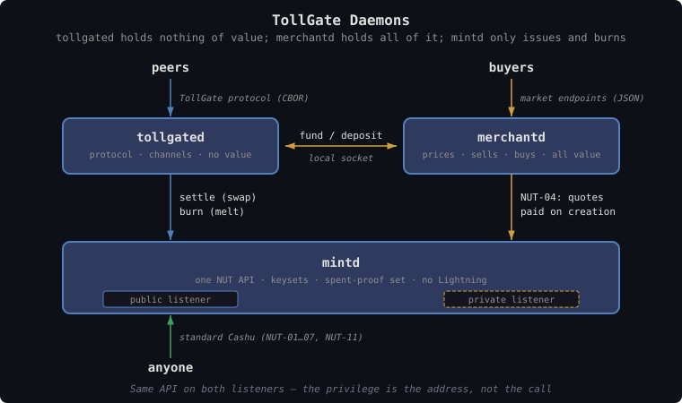
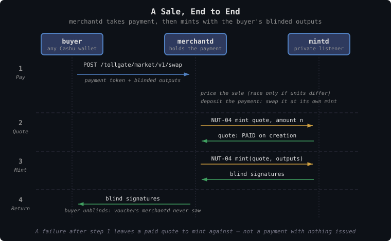

# TollGate Daemons

A node runs as three processes, each with one job and a boundary that
matches it:

| Daemon | Job | Holds | Resource-specific? |
|---|---|---|---|
| **tollgated** | Runs the protocol with peers: Offers, channels, grants, delivery | Channel state and channel backups. **No money, no stock of vouchers** | Yes — it meters and gates the resource |
| **mintd** | Issues this node's vouchers and redeems them | Its own seed, the keysets derived from it, and the spent-proof set | No — a NUT-compliant Cashu mint in one unit |
| **merchantd** | Decides what to sell, when, and for what; buys what the node needs from its upstreams | All money, and every voucher kept that is not this node's own | No — it trades claims, whatever they are claims on |

The split follows the line the rest of these documents already draw. The
payment protocol never touches money ([tollgate-protocol.md](tollgate-protocol.md)),
so the process that speaks it should not hold any. Pricing lives on the
market ([market/README.md](../market/README.md)), so the process that prices
can be replaced, moved, or run by somebody else without touching delivery.
And issuing is the one power that has to be guarded, so it sits in the
process that does nothing else.

Each daemon is its own executable with its own configuration file
([tollgate-configuration.md](tollgate-configuration.md)).

The primary target is **all three on one machine**, talking over local
sockets. Nothing in the split requires that, but running `merchantd` on
another host raises questions this document leaves open (see
[Open Problems](#open-problems)).

---

## Architecture


<details><summary>Text version</summary>

```
                  peers                           buyers
                    │                               │
       TollGate protocol (CBOR)            market endpoints (JSON)
                    │                               │
            ┌───────▼───────┐    fund / deposit   ┌─▼─────────────┐
            │   tollgated   │◄───────────────────►│   merchantd   │
            │   no value    │    (local socket)   │   all value   │
            └───────┬───────┘                     └───────┬───────┘
                    │ settle, burn                        │ NUT-04, quotes
                    │ (public listener)                   │ paid on creation
                    │                                     │ (private listener)
            ┌───────▼─────────────────────────────────────▼───────┐
            │                        mintd                        │
            │      one NUT API · keysets · spent-proof set        │
            └───────▲─────────────────────────────────────────────┘
                    │ standard Cashu (NUT-01…07, NUT-11), public listener
                  anyone
```

</details>

`mintd` serves **one API, the standard Cashu one, on two listeners**. They
differ only in how a mint quote gets paid. `tollgated` uses the public one
like any other holder. `merchantd` is the only party that can reach the
private one.

---

## tollgated

The protocol daemon: `tollgate-core` plus a `ResourceAdapter` and a Spilman
`ChannelBackend` ([tollgate-intro.md](tollgate-intro.md#architecture)).

**It holds no money and no stock of vouchers.** What it keeps on disk is
channel backups — enough to settle or reclaim a live channel after a reboot
([tollgate-payment-channels.md](tollgate-payment-channels.md)) — and every
voucher that reaches it leaves again:

| It receives | It does | Why |
|---|---|---|
| A channel funded in **this node's own** vouchers | Settles at `mintd`, then **burns** its share | The resource has been delivered. The claim is honored, so it is cancelled |
| A channel funded in **another mint's** vouchers | Settles at that mint, then **keeps** or **burns** the proceeds, per mint | See below |
| Vouchers from `merchantd` to **fund a channel** upstream | Locks them into the channel | They are spent as they are received |
| **Change** from a channel it funded, or a **refund** reclaimed after expiry | Swaps it at that mint for fresh proofs, then reuses them for the next channel in that mint or deposits them with `merchantd` | The peer can re-derive the change outputs from the shared channel secret; the swap makes them this node's alone and unlinks them from the channel |

### Other mints: keep or burn

A node may accept no mint but its own. Where it does accept another, what
the proceeds are worth depends on the relationship, so it is set per mint
in `tollgated`'s configuration:

- **keep** — the vouchers are worth something to this node: it can spend
  them upstream, sell them, or is reimbursed for them. `tollgated` swaps them
  at their mint and deposits the fresh proofs with `merchantd`, which holds
  everything of value. Without a `merchantd` to deposit into, `tollgated`
  warns at startup and the deposit fails, to be retried with the settlement
  it came from until `merchantd` is there.
- **burn** — they are worth nothing to this node, and accepting them was a
  courtesy: free transit for a neighbor, say, whose paper this node has no
  use for. `tollgated` melts them at their mint so the claim is gone rather
  than left lying about.

**Either way, the vouchers are swapped at their mint before anything else
happens to them.** Until they are, the proofs the payer handed over are
still ones the payer knows the secrets of. The swap is what makes them this
node's: it spends the payer's proofs at the issuer and returns new ones only
this node can spend. Settling a Spilman channel is such a swap — the closing
transaction goes to the funding mint — so kept vouchers leave `tollgated` as
proofs the payer has never seen, and `merchantd` receives nothing a customer
could still spend. A token that reaches `tollgated` any other way, unswapped,
is swapped first.

Burning at another mint uses that mint's melt, and only works where the
mint offers a burn method — any `mintd` does. Where it does not, the
vouchers are dropped, which cancels nothing at the issuer but costs this
node nothing either.

### Funding upstream

A relay pays its upstream in the upstream's vouchers
([tollgate-vouchers.md](tollgate-vouchers.md)), so `tollgated` needs them on
hand when a channel opens or rolls over. It asks `merchantd` for them.
**The need comes from `tollgated`; the decision is `merchantd`'s.** A `fund`
call is a request, and `merchantd` may refuse one it judges not worth paying
for. `tollgated` then opens or rolls over no channel to that peer, and the
peer's traffic falls back to whatever it gets unpaid.
"Upstream" here means any peer this node pays, not only the one towards the
internet: under the default rule each side pays for what it receives
([tollgate-vouchers.md](tollgate-vouchers.md)), so a node funds channels to
downstream peers too, whenever they charge it.
**Whether it also keeps a buffer** — upstream vouchers fetched ahead in the
background — is decided by measurement, not in advance: if a round trip to
`merchantd` is short next to the rollover safety margin, it fetches on
demand and holds nothing; if not, it buffers. Both sit behind the same
funding call, so the choice is configuration rather than design.

A buffer cannot be one number. A node may pay many upstreams, each in its
own mint, and each channel's capacity is different and grows with the
peering ([tollgate-payment-channels.md](tollgate-payment-channels.md)). So a
buffer is counted **in fundings, per upstream peer**: holding one means
holding enough of that peer's vouchers for its next channel, at whatever
capacity that channel will have. The default is none, and a peer can be
given its own count.

How much of each issuer's paper the node owns beyond that — bought ahead,
held as inventory, kept from settlement — is `merchantd`'s business, not
`tollgated`'s.

On a single machine a local socket round trip is sub-millisecond against a
rollover margin measured in seconds, so on-demand is expected to be enough.

---

## mintd

A **NUT-compliant Cashu mint** in one unit — `byte` for network forwarding.
Anything that speaks Cashu can use it: wallets, `merchantd`, a proxy buying
on behalf of a client, and `tollgated` itself.

It implements the standard NUTs a voucher mint needs — keys, keysets, swap,
mint, melt, info, state check (NUT-01…07) — and NUT-11, which Spilman channel
funding locks against ([tollgate-payment-channels.md](tollgate-payment-channels.md)).
It has **no Lightning backend**. Money never reaches it.

**No custom endpoints.** Everything that makes it a TollGate mint is
behavior behind standard ones: which payment methods it advertises in NUT-06
info, and how a quote on each gets paid. A client that has never heard of
TollGate can use every part of it that is open to the public.

### Two listeners, one API

`mintd` serves the same NUT API twice:

| Listener | Reachable by | Mint quotes |
|---|---|---|
| **Public** | Anyone | Never paid — unless auto-accept is on, in which case paid on creation, within a rate limit |
| **Private** | `merchantd` alone — on loopback | **Paid on creation** |

The private listener is how the node sells. `merchantd` takes payment, asks
for a NUT-04 quote in the amount sold, and mints against it with the buyer's
blinded outputs, so the buyer's vouchers stay as unlinkable as any others.

Why a quote on a private listener rather than a signing call:

- **No custom API.** It is NUT-04, unchanged. What is privileged is the
  address, not the operation.
- **Blind signing stays inside the mint.** `merchantd` never holds a key, and
  cannot sign anything the mint would not have signed through NUT-04 anyway.
- **A sale survives a crash.** If `merchantd` has taken payment and the mint
  call fails, the paid quote is still there to mint against. Today's
  in-process market has no such record — taking payment and failing to issue
  is the one outcome it cannot make good.

Reaching the private listener is the power to print this node's vouchers.
It listens on loopback only, so nothing off the machine can reach it; on a
router, everything on the machine is the operator's own software. A Unix
socket whose permissions admit `merchantd` alone would narrow it further, and
is left for later — see [Security](#security).

There is **no issuance ceiling.** How much to issue is `merchantd`'s
decision, and overissuing is bounded by what it does to the issuer's own
paper ([issuer-risk.md](../market/issuer-risk.md)), not by the mint.

### Auto-accept

The free-service mode that exists today: public mint quotes paid on
creation, bounded by an issue rate across everyone who asks. It is what the
private listener does, opened to the world at a price of zero. It is on by
default while the market is deferred, since it is how peers come to hold this
node's vouchers at all ([tollgate-configuration.md](tollgate-configuration.md#mintd));
a node running it gives its service away without needing `merchantd`, and one
that sells turns it off.

### Burn

A NUT-05 melt that **pays nothing out**: the proofs are marked spent and the
claim is gone. It is a melt method, `burn`, that `mintd` advertises in NUT-06
info, and the only melt it advertises — the standard melt quote and melt
endpoints (`/v1/melt/quote/burn`, `/v1/melt/burn`), with a method that
settles by doing nothing. The quote request carries **the amount to burn** as
its `request`, in the quote's unit, the way a Bolt11 invoice names what it
pays; an `amount`, if also given, must agree with it. The fee reserve is zero.
It is on both listeners and needs no credential: anyone who burns vouchers is
only destroying their own.

Plain Cashu has no other way to do this: a swap must produce outputs, and
the usual melt pays a Lightning invoice. Burning is what `tollgated` does
with vouchers whose resource has been delivered, so that what the mint has
outstanding is what the node still owes.

---

## merchantd

The node's commercial side. It **decides when to sell this node's capacity
and at what price**, buys what the node needs from other issuers, and holds
everything of value the node owns. Later, it is also what would sell
capacity forward — a claim on a future window rather than on now.

Nothing in it is specific to network forwarding. It trades claims on a
resource in that resource's unit, against money, and would work unchanged in
front of any TollGate resource.

| Side | What it does |
|---|---|
| Selling | Serves the market endpoints ([market-protocol.md](../market/market-protocol.md)). Takes payment into its wallet, then mints at `mintd`'s private listener |
| Buying | Acquires whatever issuer's vouchers `tollgated` asks it to fund — any upstream, no fixed list — if it judges them worth the price. It tries the upstream's mint first, which is free where the upstream auto-accepts, then buys at the upstream's market, paying from its wallet at the price in that market's `info` — and hands them to `tollgated` to fund channels |
| Holding | One wallet: payment tokens taken (sat, usd, eur), other mints' vouchers `tollgated` kept, and any upstream vouchers bought ahead |
| Pricing | What this node's capacity sells for, and which mints it takes as payment |

The operator's margin — what the node's vouchers sell for minus what its
upstreams' vouchers cost ([tollgate-intro.md](tollgate-intro.md)) — is
therefore entirely inside `merchantd`. `tollgated` delivers one unit per
voucher and never sees either price.

### Pricing

The base implementation is configured with **a price per Mbit** for network
forwarding — one quantity to reason about — **in a unit the operator
chooses**: `usd` or `eur` for an operator who thinks in dollars or euros,
`sat` for one who thinks in sats.

The unit decides whether an exchange rate is needed at all. A price in
`sat` paid in sat tokens, or in `eur` paid in eur tokens, is applied as it
stands. Only when the price and the payment are in different units — a
`eur` price paid in sats, say — does `merchantd` need the BTC price in that
currency, and only then does it fetch one: on an interval, from a **list of
public price APIs, tried in order**. A source that fails, times out, or answers zero
is skipped for the next. If every source fails, the **last good rate stays in
use** — sales carry on at the most recent price rather than stopping.

The price and the source list are **changeable at runtime**. A new price
applies to the next swap. There is no quote step: a buyer reads the price
from `info`, and a swap that no longer matches it is refused and retried.

### Accepted payment

A configurable **list of mints whose tokens `merchantd` will swap for this
node's vouchers**, each with the unit it takes — `sat`, `usd` or `eur` — and
optionally **its own price**. An operator prices issuer risk by pricing
issuers: a sat from a mint it trusts can buy more than a sat from one it does
not. Entries without a price use the default. A price in the token's own unit
applies directly; any other goes through the exchange rate. Tokens from a mint
or unit not on the list are refused rather than guessed at.

Each mint taken on is that issuer's credit risk until `merchantd` spends or
redeems what it took, so the list is a trust decision as much as a
convenience ([issuer-risk.md](../market/issuer-risk.md)).

### The sale, end to end


<details><summary>Text version</summary>

```
buyer                      merchantd                    mintd (private)
  │  POST /tollgate/market/v1/│
  │       swap                │                              │
  │  (payment token, blinded  │                              │
  │   outputs)                │                              │
  │──────────────────────────►│                              │
  │                           │  price the sale (rate only   │
  │                           │   if units differ)           │
  │                           │  deposit the payment         │
  │                           │  (swap at its own mint)      │
  │                           │                              │
  │                           │  NUT-04 quote, amount n      │
  │                           │─────────────────────────────►│
  │                           │◄──────────── paid ───────────│
  │                           │  NUT-04 mint(quote, outputs) │
  │                           │─────────────────────────────►│
  │                           │◄─────────── signatures ──────│
  │◄────────── signatures ────│                              │
```

</details>

The trust is the same as today's: the buyer pays first and trusts the node
to issue, just as it is about to trust the node to deliver. What changes is
that a failure between the two steps leaves a paid quote behind instead of
nothing.

**How big one sale may be.** `merchantd` sells no more at once than the
lower of its own `mint.max_amount` and what `mintd` issues against one quote
(its NUT-06 `nut04` bolt11 `max_amount`, read from the private listener), and
publishes that as `max_amount` in `info`. The check is made **before** the
payment is deposited, so a sale the mint would refuse costs the buyer nothing.
A buyer whose payment buys more splits it into several sales under the limit
(proxyd does, through `Wallet::split`). `mintd`'s `max_amount` is read at
every start and overrides the copy of its info cdk keeps in the database.

**When issuing fails after the payment was taken** — `mintd` down, or
refusing — `merchantd` hands the payment back: it spends what cleared (less
the paying mint's input fee) out of its wallet in the same paper, and answers
`502` with `{"error", "refund": "<token>"}`. `market::buy` turns that into
`market::Refunded`, and the buyer keeps the refund to try again with. Only if
that spend fails too is the money left in `merchantd`'s wallet for the
operator to return, and logged as such.

### Between tollgated and merchantd

A private interface on a local socket. Two calls:

| Call | Direction | Meaning |
|---|---|---|
| `fund(mint, unit, amount) → token` | tollgated → merchantd | Vouchers of `mint` to fund a channel with. `merchantd` pays from what it holds, acquires them first, or **refuses** if they are not worth it |
| `deposit(token)` | tollgated → merchantd | Proceeds of a channel settled in another mint this node **keeps**, and swapped change or refunds it does not reuse |

Everything else — prices, what to sell, which upstreams to buy from — is
`merchantd`'s own configuration and its own control socket. `tollgated` does
not know the price list exists.

---

## What Runs Where

Not every node needs all three:

| Node | Runs | Why |
|---|---|---|
| Gives service away, no upstream | tollgated + mintd (auto-accept on) | Nothing to sell, nothing to buy |
| Gateway selling its capacity | tollgated + mintd + merchantd | Something has to take payment |
| Relay | tollgated + mintd + merchantd | Something has to buy the upstream's vouchers |
| Pass-through relay, issues nothing | tollgated + merchantd | No `mint` block: it takes payment in its upstream's vouchers (`keep`) and spends them upstream |
| Market maker, forwards nothing | merchantd | Trades paper without delivering any |
| Constrained device (ESP32) | Deferred | Likely a remote `merchantd` selling its vouchers, or all three linked into one binary. The split is a boundary, not a requirement for separate processes |

---

## Security

| Asset | Who holds it | What protects it |
|---|---|---|
| Mint seed and keys | mintd | Its own seed, separate from the node's identity key; neither leaves the process. Losing the seed retires every outstanding voucher |
| The private listener | merchantd | The power to print vouchers. Loopback only, so nothing off the machine reaches it; every issue is a quote the mint records |
| Money and kept vouchers | merchantd | Its wallet. `tollgated` and `mintd` hold none |
| Channel state | tollgated | Loss costs unsettled channel balance, not stored value |

A compromised `tollgated` can refuse service, settle badly, or burn vouchers
it was paid — none of which reaches the node's money. A compromised
`merchantd` can print vouchers, and the quotes in `mintd`'s database are
what show it.

---

## Open Problems

| Problem | Notes |
|---|---|
| `merchantd` on another host | The private listener needs authentication in place of socket permissions, and `merchantd` needs a route to upstream mints that today are reached over `tollgated`'s own peering link — possibly before any channel exists. Deferred: the target is one machine |
| Buffer or on-demand funding | Decided by measuring `fund` round trips against the rollover safety margin |
| Kept vouchers | `merchantd` receives them; whether it spends them upstream, sells them, or redeems them is its own policy, and unspecified |
| Burning at a mint without a burn method | The vouchers are dropped, which leaves the claim outstanding at their issuer. Harmless to this node, but not a cancellation |

---

## Design Decisions

| Decision | Resolution | Rationale |
|---|---|---|
| Process split | tollgated, mintd, merchantd — one executable and one config file each | Delivery, issuing and trading fail, scale and get compromised differently |
| Where value lives | merchantd only | The protocol daemon never touches money, so it should not hold any |
| Own vouchers after delivery | Burned at mintd | The claim has been honored. Burning keeps what is outstanding equal to what the node still owes |
| Other mints' vouchers after settlement | Keep (deposit with merchantd) or burn, set per mint in tollgated | Whether another issuer's paper is worth anything depends on the relationship, not on the protocol |
| mintd API | NUT-compliant only; custom behavior, no custom endpoints | Any Cashu client works against it unchanged |
| mintd seed | Its own `seed_file`, not derived from the node's identity | The mint's secret is never shared with `tollgated`, and either key can be rotated or stored apart from the other |
| How merchantd issues | NUT-04 on a private listener where quotes are paid on creation | The privilege is the address, not a new call. Signing stays in the mint, and a paid quote survives a crash |
| Burn | A NUT-05 melt method that pays nothing out, unauthenticated | Plain Cashu cannot destroy proofs. Burning only costs the burner |
| Issuance ceiling | None | Issuing is merchantd's decision; overissuing punishes the issuer's own paper |
| mintd and Lightning | No Lightning backend | Money never reaches the mint |
| Pricing | Per Mbit, in `usd`, `eur` or `sat`; a fallback list of rate APIs only when price and payment units differ; runtime-changeable | One quantity to reason about, in the unit the operator thinks in. A `sat` price with sat payment fetches nothing. Zero answers are ignored; with every source down, the last good rate is used |
| Accepted payment | A configured list of mints and units, each optionally with its own price | Each is a credit decision, priced as one; anything off the list is refused |
| Quote step | None for now; swap at the price in force, refused and retried if it moved | Selling today's capacity needs no locked price. Quotes, cross-mint pricing and futures can be added beside `swap` later |
| Upstream funding | tollgated asks merchantd, which may refuse; any buffer counted in next fundings per upstream peer, decided by measurement | Keeps tollgated free of value without guessing at latency. Upstreams differ in mint and capacity, so one global amount means nothing |
| Lightning at merchantd | None: Cashu tokens from `accepts` only | No Lightning node on the router. A Lightning-only buyer mints at one of the accepted mints first |
| Link metrics in pricing | Read by the operator, who sets prices by hand | `fund` and `deposit` stay the whole interface. A read-only feed from `tollgated` is future work, and never a price input for a single peer ([tollgate-hazards.md](tollgate-hazards.md)) |
| Deployment target | One machine, local sockets | Remote merchantd is possible later; its open questions are deferred |
