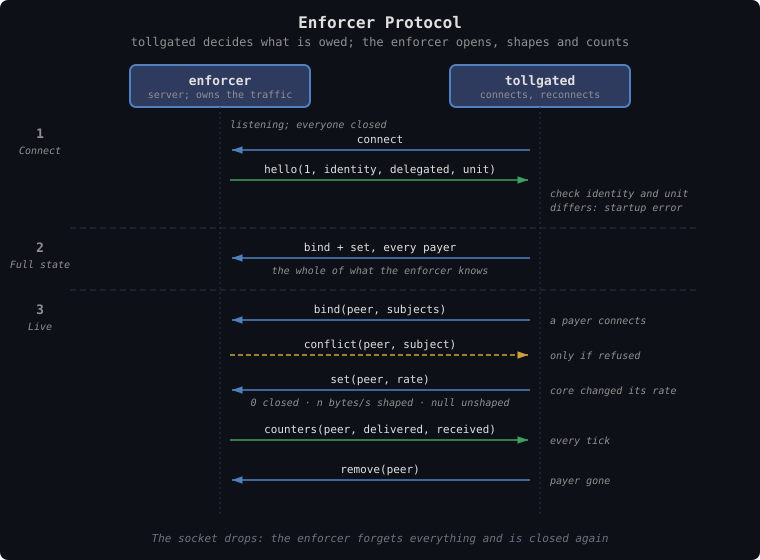

# TollGate Enforcer Protocol

This document specifies how `tollgated` controls delivery through a separate
program, over a local socket. The resource adapters built into `tollgated`
are covered in [tollgate-access-control.md](tollgate-access-control.md).

## Overview

`tollgated` decides who has paid and how much they may use. Something else has
to act on that: let a peer's traffic through, slow it to the rate it bought,
and count what it used. Normally that is one of `tollgated`'s own resource
adapters, such as the `nftables` firewall adapter or the `fips` adapter.

An **enforcer** is a program outside `tollgated` that does the same job. It
owns the traffic it controls — a firewall, a proxy, a tunnel — and for each
paying peer it opens that traffic, shapes it, and counts it, as `tollgated`
tells it. `tollgated` still decides what is owed. The enforcer applies the
decision and reports back what it carried.

**A new use case is then a new enforcer, not a new `tollgated`.** The built-in
adapters stay. Setting `forwarding.mode: external` puts an enforcer behind the
same `ResourceAdapter` trait instead, reached over a local socket.

**An enforcer sells a service this node delivers, to whoever pays for it.**
That is a different thing from a paid peer link, where a direct neighbor pays
this node to forward its traffic. Over FIPS, paid peer links stay on the
built-in `fips` adapter (`forwarding.mode: fips`). There the FIPS node itself
enforces who may send traffic through it, neighbor by neighbor, and the
enforcer socket is never used
([peering-fips.md](../network-peering/peering-fips.md)).

---

## Payer, Subject, Binding

The protocol keeps three ideas apart:

| Term | What it is | Who knows it |
|---|---|---|
| **Payer** | The TollGate key that signs payments and owns the grant. `tollgated` keeps its accounts by this key | `tollgated` |
| **Subject** | The thing the enforcer recognizes in traffic, such as an address or a key, so it can let that traffic through or stop it. On the wire it is plain bytes, and the Identify mode fixes their form ([below](#what-a-subject-is)) | The enforcer |
| **Binding** | The link that says "this subject's traffic is paid for by this payer" | Both: `tollgated` states it, the enforcer applies it |

**A payer and its subject need not be the same party.** A proxy can buy a
session for a phone: the proxy pays with its own key, and the subject is the
phone's address. An exit node's allowlist holds subjects with no payer at all.
So the protocol never guesses a subject from a payer's key. Every subject the
enforcer opens for a payer arrives in a binding.

In the messages below, `peer` always means the payer. It is the key a
TollGate session runs under, and the key `ResourceAdapter` is called with.
State and counters are kept per payer. One payer may hold several subjects,
but a subject belongs to at most one payer.

### What a Subject Is

Each `tollgated` runs as a named instance, such as `tollgate-ip`,
`tollgate-fips` or `tollgate-fips-exit`. Each instance is paired with exactly
one enforcer, for one task. The operator configures the two together, outside
this protocol.

That pairing already says what the enforcer looks for in traffic, so the
protocol does not repeat it. A subject on the wire is plain bytes, with no
field saying what kind of thing it is. Its form follows from the instance's
**Identify mode**: the setting that decides how `tollgated` tells who a
connecting peer is ([Identify Coupling](#identify-coupling)).

| Identify mode | Subject |
|---|---|
| `fips` | The peer's key as 32 bytes, in the short form that leaves out the parity byte (an "x-only" secp256k1 key). It is the key itself, not the `npub` text a FIPS node displays |
| `claimed` | The source address of the peer's connection to `tollgated`, as 16 bytes. An IPv4 address is written in its IPv6 form, `::ffff:a.b.c.d` (an "IPv4-mapped" address), so it fits the same 16 bytes |
| delegated | Whatever the client that asked for the binding and the enforcer agreed on, up to 64 bytes ([Delegated Bindings](#delegated-bindings)) |

**Every address has exactly one encoding.** Two subjects are therefore the
same subject exactly when their bytes are equal. `192.168.1.23` never arrives
once as four bytes and once as sixteen.

**A FIPS address is never a subject.** A FIPS address is derived from a key:
the byte `0xfd` followed by the first 15 bytes of the SHA-256 hash of the
32-byte key (`crates/tollgate-net/src/fips.rs`). So it carries less than the
key does, and `tollgated` never has one without the key it came from.
`tollgated` binds the key. An enforcer that matches FIPS traffic works out the
address from the key ([Deriving Subjects](#deriving-subjects)), and matches it
only on the FIPS interface, `fips0`. A `claimed` subject that happens to start
with `fd` is just an address. An enforcer never takes it for a FIPS identity.

### Where the Trust Comes From

A binding is only as trustworthy as whatever tied the subject to the payer.
The deployment decides that, not the message. There are three cases:

- **Over FIPS, the network checks the key.** The mesh delivers traffic from a
  key's address only for the node that proved it holds that key when the link
  was set up (the Noise IK handshake), however many hops away that node is.
- **On a LAN, it rests on the link.** A source address, or an entry in the
  neighbor table, is only what this node saw. Any host on the same network
  segment can fake it.
- **A delegated binding rests on the local program that asked for it.** For
  example, a proxy on the same machine saying a phone is paid for by one of
  its sessions.

So the wire carries no grades of trust and no subject kinds. The Identify mode
tells the enforcer which of the first two cases it is in, and what form its
subjects take. A single flag on a subject tells it the third.

---

## Transport

**The enforcer listens on a Unix socket, and `tollgated` connects to it.**
`tollgated` reconnects whenever the connection drops. The enforcer is the
server because it owns the traffic: it may start before `tollgated`, and it
keeps running when `tollgated` restarts. `tollgated` needs only the socket's
path, `forwarding.enforcer_socket`.

**Whoever can open the socket can open the traffic.** The socket's file
permissions must therefore admit `tollgated` alone. The enforcer serves one
connection at a time. A second connection replaces the first, and the
enforcer resets to closed, as if the first had dropped.

**The encoding is CBOR, framed the same way as the TollGate wire protocol.**
Each message is preceded by its length as a 2-byte little-endian integer, so
a message is at most 65535 bytes
([tollgate-protocol.md](tollgate-protocol.md#raw-tcp)). The encoding rules are
the wire protocol's too:

- each message is a definite-length map
- key `0` is the message type
- keys are integers `0..255`
- unknown keys are skipped

Why not JSON? An enforcer written in Rust links the message types directly.
One written in any other language gets a CBOR schema to check its messages
against, rather than a convention to follow.

The message types live in **`tollgate-protocol`**, in a module of their own.
Like the rest of that crate they need only `alloc`, not the full standard
library (`no_std`), so an enforcer depends on that crate and nothing else of
TollGate. Their normative schema is a CDDL file, `enforcer.cddl`, next to
[`tollgate.cddl`](../../../crates/tollgate-protocol/tollgate.cddl), and the
same schema tests check it. The [Schema Sketch](#schema-sketch) below shows
what that file will say.

---

## Messages

| Message | Direction | Meaning |
|---|---|---|
| `hello(version, identify, delegated)` | enforcer → tollgated | The first message on every connection. It names the Identify mode the enforcer requires (`fips` or `claimed`), which also fixes the form of its subjects, and says whether it accepts delegated bindings |
| `bind(peer, [subject, delegated])` | tollgated → enforcer | Every subject this payer holds. It replaces any earlier set; an empty list unbinds them all |
| `set(peer, rate)` | tollgated → enforcer | The payer's state: `0` is closed; a number is open and shaped to that many bytes per second; `null` is open and unshaped |
| `remove(peer)` | tollgated → enforcer | Forget the payer. Its subjects go back to closed |
| `counters(peer, delivered, received)` | enforcer → tollgated | Bytes carried to and from the payer's subjects, counted from the start of this connection |
| `conflict(peer, subject)` | enforcer → tollgated | The enforcer refused to bind `subject` to `peer`. See [Conflicts](#conflicts) |

The messages from `tollgated` stand in for the calls on `ResourceAdapter`, the
trait `tollgated` uses to enforce and count:

| `ResourceAdapter` call | What `tollgated` sends |
|---|---|
| `register(peer, addr)` | A `bind` of what `tollgated` knows about `addr` ([Identify Coupling](#identify-coupling)) |
| `set_shaping_rate` | A `set`. Core's `u64::MAX`, meaning a peer it does not meter, is written as `null`, as the FIPS adapter already does |
| `set_access` | Nothing |
| `remove` | A `remove` |
| `counters()` | Nothing: it returns the last `counters` the enforcer reported |
| `demand` | Nothing: it belongs to the buyer and never reaches the enforcer |

**One number is a payer's whole state.** Access levels, grants and the minimum
flow allowance all stay inside `tollgated`. The rate core shapes a payer to
already includes them:

- it never falls below the allowance
- it is `u64::MAX` for a peer this node does not charge
- it is `0` exactly when `AccessLevel::carried` says the peer is blocked

So all the enforcer needs is whether a payer is open, and how fast, and `set`
says both at once. There is never a moment when a payer is open at a rate it
has not bought.

**The enforcer never closes the path to the node itself.** A payer must always
be able to reach `tollgated` to pay, and `mintd` and `merchantd` to buy
vouchers ([tollgate-access-control.md](tollgate-access-control.md#what-blocked-means)).
How the enforcer keeps that path open is up to it. A firewall exempts the
node's own addresses; a proxy serves its payment page to anyone.

### Sequence


<details><summary>Text version</summary>

```
enforcer                               tollgated
  │  (listening; everyone closed)          │
  │◄────────────── connect ────────────────│
  │── hello(1, identify, delegated) ──────►│  check against own Identify
  │                                        │  (mismatch: startup error)
  │◄──── bind + set, every payer ──────────│  full state
  │                                        │
  │◄──────── bind(peer, subjects) ─────────│  a payer connects
  │──────── conflict(peer, subject) ──────►│  only if refused
  │◄──────────── set(peer, rate) ──────────│  core changed its rate
  │─────── counters(peer, d, r) ──────────►│  every tick
  │◄──────────── remove(peer) ─────────────│  payer gone

  The socket drops: the enforcer forgets everything and is closed again.
```
</details>

**The enforcer speaks first, with `hello`.** `tollgated` sends nothing until
it has one. It closes a connection whose `version` it does not speak.
Otherwise it sends the **full state**: a `bind` and a `set` for every payer it
tracks. After that, every message reports a change.

**`bind` replaces.** It always carries every subject the payer holds, so
sending it twice does no harm. `tollgated` binds a payer when the payer's
connection to `tollgated` arrives, before it sends its Offer. It binds again
whenever the payer's subjects change — when a delegated binding is added, for
example.

**`counters` are sent every tick**, once a second by default, for every payer
whose counts changed. Each count is a running total: it starts at zero when the
payer is first bound on this connection, and adds up all the payer's subjects.
`delivered` is what went to them; `received` is what came from them.

Because every connection starts from zero, `tollgated` carries the totals
across a reconnect. It adds the last counts it had from the previous
connection to the new ones, so the totals core sees never go backwards.

**A protocol error closes the connection.** The receiver closes the socket on
any of these:

- an unknown message type
- a malformed message
- a subject that is not delegated and has the wrong length for the mode: 32
  bytes under `fips`, 16 under `claimed`
- a delegated subject sent to an enforcer that refuses them

Closing is the safe outcome for both ends. The enforcer goes back to closed,
and `tollgated` stops selling (see below).

---

## Failure Rules

The rules here all follow one principle: **when in doubt, carry nothing.**
Nobody's traffic should flow unless someone is metering it.

**An enforcer starts closed.** Until `tollgated` binds a payer and `set`s it
open, every subject is blocked, and nothing is carried for anyone. A subject
that no payer holds stays closed.

**Losing the connection closes everything too.** When the socket drops, the
enforcer forgets every binding and rate it was given, and is back where it
started. It does not go on carrying peers at their last rate, because the one
party that knows when their grants run out is gone.

**`tollgated` resends the full state on every reconnect.** Every connection
starts from closed, so the full state sent after `hello` is all the enforcer
knows. Nothing resumes, and there is nothing to reconcile.

**While the enforcer is unreachable, `tollgated` sells nothing.** It keeps
trying to reconnect, about once a second. Meanwhile:

- it answers every TopUp with a TopUpReject, with `max-rate-available` 0 and
  reason `rate-exceeds-capacity` — the capacity it can deliver is zero
- it does not fund or accept new channels
- it keeps the sessions and channels already running, so peers pick up where
  they left off once the enforcer is back

The same holds before the first connection. A `tollgated` in `external` mode
starts selling when it has a `hello` it accepts, not when it starts.

What an outage costs a payer is the rest of its current grant: it paid for a
window the enforcer stopped carrying. That loss is bounded by one grant, and
the payer sees it in its own counters
([tollgate-metering.md](tollgate-metering.md)). It is the price of never
carrying traffic that nobody is metering.

---

## Identify Coupling

Before any binding exists, `tollgated` has already decided who a peer is. The
setting that decides how is the **Identify mode**, `wire::Identify`, and it
has two values:

- **`Identify::Fips`**: the peer's connection to `tollgated` must come from
  the FIPS address of the key the peer announces
  ([peering-fips.md](../network-peering/peering-fips.md#verifying-the-peer)).
  The key is checked.
- **`Identify::Claimed`**: the key the peer announces is taken at its word.
  Nothing is checked.

That decides what `tollgated` has to bind:

| Identify mode | What `tollgated` has | What it binds |
|---|---|---|
| `Fips` | A connection from the FIPS address of the announced key, checked. The key itself is proven | The 32-byte key |
| `Claimed` | The connection's source address, unchecked | The address, 16 bytes |
| either | The word of a trusted local program | The bytes it named, flagged delegated |

**So the enforcer states the mode it requires.** In `external` mode,
`forwarding.mode` cannot say which network the TollGate messages arrive over,
so the `hello` says it instead. An enforcer that matches keys trusts each
subject to be the key at the other end of the traffic. Only the FIPS check
makes that true, so such an enforcer requires `fips`. An enforcer that matches
addresses requires `claimed`.

`tollgated` then runs in the mode the enforcer asked for. The enforcer reads
every subject that is not delegated in that mode's form. Since the wire
carries no subject kinds, this is the one check that the two ends of a pairing
agree.

**A mismatch is a startup error, not a silent hole.** `tollgated` refuses to
start in either of these cases. If it happens on a reconnect instead,
`tollgated` refuses that enforcer and stays in the not-selling state described
under [Failure Rules](#failure-rules).

- The operator pinned the mode (`forwarding.identify: fips` or `claimed`,
  which is optional in `external` mode), and the `hello` asks for the other
  one.
- A reconnecting enforcer asks for a different mode from the one `tollgated`
  is running. The live sessions were identified under the old mode. Switching
  would either trust peers that were never checked, or strand peers that were.

The hole this closes is a FIPS enforcer paired by mistake with a `claimed`
instance. The enforcer takes its subjects to be proven keys. The instance
believes whatever key a peer claims, and binds source addresses. Left to run,
the mistake would show up long after startup, if at all: as a stream of
protocol errors, or as an enforcer treating bytes nobody checked as a proven
key. Running on regardless is never the answer; refusing at startup is.

---

## Deriving Subjects

**Working out a peer's other subjects is the enforcer's job.** `tollgated`
passes only what it actually has. The enforcer adds whatever else its own
traffic lets it see:

- An enforcer on a LAN goes from an address to the device's hardware (MAC)
  address through the neighbor table, and from the MAC to the device's other
  IPv6 addresses ([peering-ip.md](../network-peering/peering-ip.md#a-customers-ipv6)).
- An enforcer on a FIPS node goes from a key to its FIPS address, and matches
  that address on `fips0` only.

A derived subject belongs to the payer of the subject it came from. The same
conflict rule applies to it as to a bound one.

This keeps `tollgated` free of the details of every kind of traffic. It never
learns that a neighbor table exists, and an enforcer that matches something
new needs no new `tollgated`. The trade-off: an enforcer cannot ask
`tollgated` for several forms of one peer's subject. It gets the one form its
mode fixes, and derives the rest.

---

## Delegated Bindings

A **trusted local client** is a program on the same machine that talks to
`tollgated` over its control socket. The socket's file permissions are what
make it trusted. Such a client may ask `tollgated` to add a subject to a
payer's bindings. That is a **delegated binding**. `tollgated` did not see the
subject itself; it is taking the client's word.

The typical client is a proxy that buys a session for each phone it serves.
The proxy's session key is the payer, and the phone's address is the subject.

**The binding reaches the enforcer through `tollgated`**, in the payer's next
`bind`, with the subject flagged **delegated**:

- The subject is bytes, in whatever form the client and the enforcer agreed,
  up to 64 of them.
- `tollgated` passes them on untouched, and only ever compares them for
  equality.
- The client never talks to the enforcer. `tollgated` stays the one party that
  tells the enforcer who has paid.
- The payer must be one that `tollgated` tracks.

**An enforcer may refuse delegated bindings**, and says so in its `hello`.
`tollgated` then turns the client's request down itself, so a binding the
enforcer refuses is never sent. The flag is the only trust distinction on the
wire. An enforcer that accepts delegated bindings may still treat them
differently, but it can always tell which ones they are.

What the client's request looks like on the control socket is a matter for the
control socket, not for this protocol.

---

## Conflicts

> **PLACEHOLDER.** These rules are the minimum that keeps traffic closed when
> in doubt. They are not the design. Conflict handling is an open problem,
> tracked separately, and its design will replace this section.

A **conflict** is two payers claiming one subject. For example:

- several keys behind one address, because a router doing address translation
  (NAT) sits between them and this node
- a device on the LAN answering neighbor lookups with someone else's hardware
  address, to take over their traffic
- a delegated binding that overlaps a direct one

If the later binding quietly won, one party would ride on another's payment,
or someone would be charged for traffic that is not theirs. So, for now:

1. **The enforcer refuses the second binding.** The first payer keeps the
   subject. The latest binding never wins.
2. **The refused subject stays closed.** It is not carried for the second
   payer, and nothing is derived from it for that payer.
3. **The enforcer reports back** with `conflict(peer, subject)`, naming the
   payer it refused and the subject in question.
4. **`tollgated` refuses service to that payer.** It sells it nothing, rejects
   its TopUps as it does while the enforcer is unreachable, and logs the
   conflict for the operator.

`tollgated` binds a payer when it connects, before its Offer, so a conflict
normally arrives long before the payer could buy a grant. Nothing guarantees
that, because a `bind` that succeeds is not acknowledged. A conflict that
arrives mid-session is handled the same way.

---

## Schema Sketch

This sketch is informative. The normative schema is `enforcer.cddl` in
`tollgate-protocol`, and where the two differ, that file wins.

Message type numbers start at `0x20`, clear of the wire protocol's. A message
sent to the wrong socket then fails to decode, rather than being read as
something else.

```cddl
enforcer-message = hello / bind / set / remove / counters / conflict

u8  = uint .size 1
u64 = uint .size 8
payer = bstr .size 33             ; compressed secp256k1 key

; Plain bytes; the Identify mode fixes the form. fips: the 32-byte
; x-only key. claimed: the source address, 16 bytes, IPv4 v4-mapped.
; Delegated: as the client and the enforcer agreed.
subject = bstr .size (1..64)

binding = [subject, delegated: bool]

identify = &(
  identify-claimed: 0,
  identify-fips:    1,
)

; 0x20 -- enforcer -> tollgated. First message on every connection.
hello = {
  0: 0x20,
  1: u8,                          ; version; 1
  2: identify,                    ; the mode tollgated must run
  3: bool,                        ; accepts delegated bindings
  * uint => any,
}

; 0x21 -- tollgated -> enforcer. Every subject the payer holds; replaces.
bind = {
  0: 0x21,
  1: payer,
  2: [0*8 binding],               ; empty unbinds everything
  * uint => any,
}

; 0x22 -- tollgated -> enforcer. The payer's whole state.
set = {
  0: 0x22,
  1: payer,
  2: u64 / null,                  ; 0 closed, n bytes/s shaped, null unshaped
  * uint => any,
}

; 0x23 -- tollgated -> enforcer. The payer and its subjects are forgotten.
remove = {
  0: 0x23,
  1: payer,
  * uint => any,
}

; 0x24 -- enforcer -> tollgated. Cumulative on this connection.
counters = {
  0: 0x24,
  1: payer,
  2: u64,                         ; delivered: to the payer's subjects
  3: u64,                         ; received: from them
  * uint => any,
}

; 0x25 -- enforcer -> tollgated. A binding refused because another payer
; holds the subject. PLACEHOLDER semantics, see Conflicts.
conflict = {
  0: 0x25,
  1: payer,                       ; the payer refused
  2: subject,
  * uint => any,
}
```

A `bind` carries at most eight subjects, which keeps the largest message under
1 KiB. The subjects an enforcer derives — a device's many IPv6 addresses, say
— are its own, and never cross the socket.

---

## Worked Example: LAN

A router sells internet access to devices on its LAN, `br-lan`. Its enforcer
is a firewall program that matches addresses and hardware (MAC) addresses, and
takes no third party's word for them. It is paired with the instance
`tollgate-ip`.

The enforcer starts and says what it needs:

```
hello(1, identify: claimed, delegated: false)
```

`tollgated` runs in `Identify::Claimed` mode and sends its full state, which
is empty so far.

A laptop running TollGate, with key `02ab…`, connects to `tollgated` from
`192.168.1.23`. That source address is all `tollgated` has, and it is
unchecked. `tollgated` binds it in the one form `claimed` uses: 16 bytes, with
the IPv4 address written in IPv6 form.

```
tollgated → enforcer   bind(02ab…, [[::ffff:192.168.1.23, false]])
tollgated → enforcer   set(02ab…, 0)           no allowance on this node
```

The enforcer sees the `::ffff:` prefix, so it knows this is an IPv4 address.
It looks `192.168.1.23` up in the neighbor table and finds the MAC
`aa:bb:cc:00:11:22`. From that MAC it finds the laptop's IPv6 address
`2001:db8::5` and a temporary privacy address. All four belong to the payer,
and all four are closed. The laptop can still reach the router itself, so it
can pay.

The laptop funds a channel and buys 3.12 MiB/s:

```
tollgated → enforcer   set(02ab…, 3276800)
```

The enforcer opens the IPv4 address, the MAC and both IPv6 addresses. It
shapes their downloads together, as one class, to that rate. Each second it
reports the running totals:

```
enforcer → tollgated   counters(02ab…, 1841203, 90210)
enforcer → tollgated   counters(02ab…, 5102337, 188400)
```

`tollgated` draws the grant down by the difference between reports, as it
would with its own adapter. When the grant runs out, `set(02ab…, 0)` closes
all four again.

**A conflict.** A second key, `03cd…`, also connects from `192.168.1.23`. It
is another machine, behind a NAT router plugged into the LAN:

```
tollgated → enforcer   bind(03cd…, [[::ffff:192.168.1.23, false]])
enforcer → tollgated   conflict(03cd…, ::ffff:192.168.1.23)
```

`02ab…` keeps the address. `tollgated` sells `03cd…` nothing and logs the
conflict. The operator decides what that NAT router is doing there.

**A delegated binding.** Suppose the enforcer had said `delegated: true`. A
proxy on the router could then have its session key `02ef…` pay for a phone at
`192.168.1.40`, using the same 16-byte form by agreement with the enforcer.
The proxy asks `tollgated` on the control socket, and `tollgated` sends
`bind(02ef…, [[::ffff:192.168.1.40, true]])`. This enforcer refuses delegated
bindings, though, so `tollgated` turns the proxy down instead.

---

## Worked Example: FIPS Exit Proxy

A FIPS node with internet access sells a SOCKS proxy to the rest of the mesh.
It is an **exit**: other mesh nodes reach the internet through it.

**The payer is a mesh node buying proxy access from the exit.** It may be a
direct neighbor or many hops away. It is not a neighbor paying for forwarding.
Nothing is sold per link here. The exit's traffic to the payer crosses
whatever mesh path FIPS picks, and any paid peering along that path is a
separate matter, handled by the built-in `fips` adapter.

The enforcer is the proxy itself, paired with the instance
`tollgate-fips-exit`. FIPS tells the proxy which address a connection came
from. The proxy wants to know which key.

```
hello(1, identify: fips, delegated: false)
```

`tollgated` runs in `Identify::Fips` mode. A peer whose connection does not
come from the FIPS address of the key it announces is dropped before a session
exists. `tollgated` sends its full state.

A mesh node holds a key whose 32-byte form is `3bf0c63f…aefa459d`. As a payer,
the key travels in its 33-byte form, with the parity byte in front:
`023bf0c63f…aefa459d`. The node connects to `tollgated` from its FIPS address,
and the check passes. So `tollgated` has proven the key itself, and that is
what it binds:

```
tollgated → enforcer   bind(023bf0c63f…aefa459d, [[3bf0c63f…aefa459d, false]])
tollgated → enforcer   set(023bf0c63f…aefa459d, 0)
```

The subject is the 32 bytes of the key and nothing else. The enforcer reads
them as a key because its mode is `fips`. Payer and subject are the same key
here, but `tollgated` still says so explicitly: the enforcer infers nothing
from the payer.

The enforcer works out the address it will see that key's traffic come from:

```
SHA-256(3bf0c63f…aefa459d) = 10 93 b2 85 86 60 46 e4 2d c0 89 32 28 cc ff …
FIPS address               = fd + first 15 bytes
                           = fd10:93b2:8586:6046:e42d:c089:3228:ccff
match                      : iifname "fips0" and source fd10:93b2:…:ccff
```

For now the proxy refuses connections from that address, so nothing is
carried. The node can still reach the exit's own address to pay. It funds a
channel and buys a rate:

```
tollgated → enforcer   set(023bf0c63f…aefa459d, 1048576)
```

The proxy now accepts connections from `fd10:93b2:…:ccff` that arrive on
`fips0`. It never accepts the same address on any other interface, where
anyone could fake it. It shapes those connections to 1 MiB/s together, counts
the bytes each one carries, and reports the sums as `counters`. A mesh node
the operator does not charge would get `set(…, null)`: open, unshaped, and
still counted.

**A mismatch.** Take the same enforcer, but with `tollgated` configured to pin
`forwarding.identify: claimed`. The `hello` asks for `fips`, so `tollgated`
exits at startup and names both modes. Without that check, the instance would
believe whatever key a peer claimed and bind its source address. The
enforcer, which reads its subjects as proven keys, would be handed bytes that
are neither.

---

## Open Problems

| Problem | Notes |
|---|---|
| Binding conflicts | [Conflicts](#conflicts) is a placeholder: refuse the second binding, keep the subject closed, report it |
| No acknowledgment of a successful bind | A refused `bind` is reported; an accepted one is silent. In practice a conflict arrives before any grant, but nothing guarantees it. To be settled with conflict handling |
| Outage cost | Closing everything on disconnect makes a paying peer lose the rest of its current grant. A grace period would instead carry peers unmetered for as long as it lasts |
| The delegating client's request | Its form on the control socket is left to the control socket |
| Delegated subject forms | Agreed per deployment between the delegating client and the enforcer; `tollgated` never reads them |
| Moving built-in adapters behind the socket | The built-in `nftables` LAN adapter could become an enforcer program. Not planned; nothing requires it |

---

## Design Decisions

| Decision | Resolution | Rationale |
|---|---|---|
| Name | The enforcer protocol; the external program is the **enforcer** | It names the role. `tollgated` decides who has paid and at what rate; the enforcer applies that to its own traffic and reports the counts. The first name, "gate", clashed with the product name TollGate |
| Who is who | Payer, subject and binding kept apart; `peer` always means the payer | A proxy pays for a phone, and an allowlist has no payer. Treating payer and subject as one makes both impossible, and lets a key stand in for an address it never proved |
| Subject from payer | Never guessed; every subject arrives in a binding | Payer and subject need not be the same party |
| Subject kinds | None on the wire. A subject is bytes whose form the Identify mode fixes: under `fips` the 32-byte key, under `claimed` the source address in 16 bytes, with IPv4 in its IPv6 form. Delegated subjects are bytes too, passed on untouched and only compared for equality | Each `tollgated` is a named instance paired with one enforcer for one task, configured together by the operator, so the pairing already says what a subject is. A kind field would only repeat it. One encoding per address makes equal subjects equal bytes. The trade-off: one enforcer cannot ask `tollgated` for several kinds of subject for the same peer. Working out the others — a MAC from an address, an `fd` address from a key — is the enforcer's job |
| Trust on the wire | No trust grades. `hello` states the Identify mode the enforcer requires and whether it accepts delegated bindings; a subject carries only a `delegated` flag | The deployment already fixes what trust there is: FIPS checks keys, a LAN address can be faked, a delegated binding is the local client's word. Per-subject grades would repeat that without letting an enforcer do anything the mode and the flag do not. A field nobody can act on invites an enforcer to trust it |
| Payer state | One `set(peer, rate)`: `0` closed, a rate open and shaped, `null` open and unshaped. Access levels stay in `tollgated` | Open or closed, and how fast, is all an enforcer applies, and core's rate already says both. One message means no moment open at a rate nobody bought |
| Transport | Unix socket; the enforcer listens, `tollgated` connects and reconnects | The enforcer owns the traffic and may start first or outlive `tollgated`. The socket's file permissions decide who may connect |
| Encoding | CBOR with the wire protocol's 2-byte framing; types in `tollgate-protocol` | One codec and one framing in the codebase. A Rust enforcer links the types, even without the standard library; others get a CDDL schema |
| Type numbers | `0x20` upwards, clear of the wire protocol's | A message on the wrong socket fails to decode instead of being misread |
| `bind` | Replaces the payer's whole set of subjects | Sending it twice does no harm, so resending the full state uses the same messages as normal operation |
| Startup | The enforcer is closed until told otherwise | Nobody is carried before someone is metering them |
| Disconnect | The enforcer goes back to closed; `tollgated` resends the full state, and sells nothing in the meantime | Nothing to reconcile, and nothing carried that nobody meters. Costs a paying peer at most its current grant |
| Counters | Running totals per payer for the life of the connection, sent every tick. On a reconnect `tollgated` adds the previous connection's last totals | A running total survives a lost report. Carrying totals across a reconnect keeps core's totals from going backwards |
| Identify | Required by the enforcer's `hello`; an enforcer that matches keys requires `fips`. A pinned mode the `hello` contradicts, or a reconnecting enforcer changing mode, is refused | With no kinds on the wire, it is the one check that the two ends of a pairing agree. Believing a claimed key while the enforcer takes its subjects as proven keys opens a paying peer's traffic to anyone |
| FIPS addresses | Never a subject. `tollgated` binds the key; the enforcer works out the address and matches it on `fips0` | Under `Identify::Fips` what is proven is the key, and the address is a hash of it. `tollgated` never has an address without its key, so binding the address too would only repeat what the enforcer can compute |
| Scope | Enforcers sell a service this node delivers; paid FIPS peer links stay on the built-in `fips` adapter | Traffic passing between neighbors is controlled by the FIPS node itself, neighbor by neighbor. An enforcer sells what its own traffic delivers, to any payer that can reach this node |
| Deriving subjects | The enforcer's job | `tollgated` stays free of the details of every kind of traffic |
| Delegated bindings | Through `tollgated`, flagged, refusable in `hello` | One party tells the enforcer who has paid. An enforcer that takes no third party's word says so once |
| Conflicts | Placeholder: refuse the second binding, keep it closed, report it | If the latest binding won, one party could ride on another's payment. The full rule is open |
| Protocol errors | Close the connection | Both ends then fall back to their safe state |
