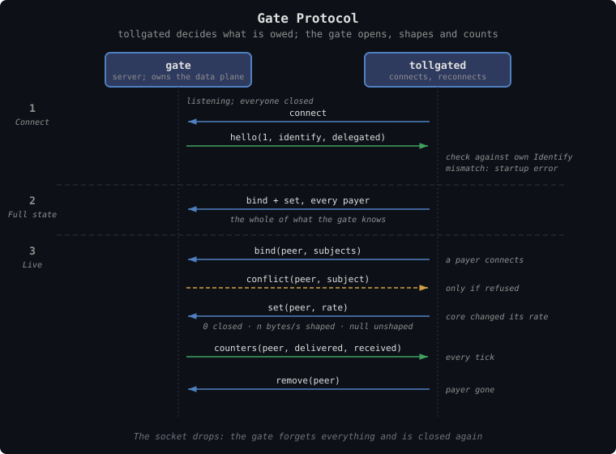

# TollGate Gate Protocol

How `tollgated` drives an enforcement program it does not contain. The
**gate** is a separate process that owns a data plane — a firewall, a proxy,
a tunnel — and opens, shapes and counts it per peer as `tollgated` tells it.
`tollgated` keeps deciding what is owed; the gate enforces it and reports
what it carried.

The point is that a new use case is a new gate, not a new `tollgated`. The
built-in adapters ([tollgate-access-control.md](tollgate-access-control.md))
stay; `forwarding.mode: external` puts a gate behind the same
`ResourceAdapter` seam instead, over a local socket.

A gate sells a service this node delivers, to whoever pays for it. That is
not the same as a paid peer link, where a direct neighbour pays this node for
forwarding its traffic: over FIPS that stays on the built-in `fips` adapter
(`forwarding.mode: fips`), which has the FIPS node enforce transit policy
per neighbour, and never uses the gate socket
([peering-fips.md](../network-peering/peering-fips.md)).

---

## Payer, Subject, Binding

Three things, never conflated:

| Term | What it is | Who knows it |
|---|---|---|
| **Payer** | The TollGate key that signs payments and owns the grant. `tollgated`'s ledger is keyed by it | `tollgated` |
| **Subject** | What the gate's data plane matches to open or close: an IPv4 or IPv6 address, a MAC, a public key, a WireGuard key, anything | The gate |
| **Binding** | What ties a payer to a subject | Both: `tollgated` states it, the gate enforces it |

**A payer and its subject need not be the same party.** A proxy buying a
session for a phone pays with its own key for the phone's address; an exit's
allowlist is subjects with no payer at all. So the protocol never infers a
subject from a payer's key. Every subject the gate opens for a payer arrives
in a binding.

In the messages below, `peer` is always the payer: the key a TollGate session
runs under, the key `ResourceAdapter` is called with. State and counters are
per payer; a payer may hold several subjects, and a subject is held by at
most one payer.

### Subject kinds

| Kind | Value | Example |
|---|---|---|
| `ipv4` | 4 bytes | `192.168.1.23` |
| `ipv6` | 16 bytes | `2001:db8::5` |
| `mac` | 6 bytes | `aa:bb:cc:00:11:22` |
| `pubkey` | 32-byte x-only secp256k1 key | `3bf0c63f…aefa459d` |
| `opaque` | a `u32` kind and up to 64 bytes | a WireGuard public key, under a kind the two ends agree |

A `pubkey` is the key itself, not its bech32 display form (the npub a FIPS
node shows).

**A FIPS address is not a kind on the wire.** It is a hash of a key — `0xfd`
and the first 15 bytes of SHA-256 of the x-only key
(`crates/tollgate-net/src/fips.rs`) — so it says less than the key, and
`tollgated` never has one without the key it came from. `tollgated` binds the
`pubkey`; a gate that matches FIPS traffic derives the address from it
([Deriving Subjects](#deriving-subjects)) and matches it only on `fips0`. An
`ipv6` subject in `fd00::/8` is just an address: a gate never takes it for a
FIPS identity.

`opaque` is for subjects this protocol has no name for yet. The kind number is
agreed between whoever delegates the subject and the gate; `tollgated`
neither interprets nor derives it, and can only pass one on as delegated.

### Where the trust comes from

A binding is only as good as whatever tied the subject to the payer, and the
deployment fixes that, not the message. Over FIPS the transport
authenticates the key itself: the mesh delivers from a key's address only for
the node that completed the Noise IK handshake for that key, however many
hops away it is. On a LAN it rests on
the link: a source address or a neighbour-table entry is what this node saw,
and any host on the segment can forge it. A **delegated** binding rests on the
local client that asked for it — a proxy on the same machine saying a phone
is paid for by one of its sessions. So the wire carries no grades of evidence.
The gate learns the first two from the Identify mode it requires, and the
third from one flag on the subject.

---

## Transport

A **Unix socket**. **The gate is the server**; `tollgated` connects, and
reconnects whenever the connection drops. The gate owns the data plane and
outlives `tollgated` restarts or starts before it, so it holds the listening
end; `tollgated` needs nothing but the path, `forwarding.gate_socket`.

**Access to the socket is the power to open the gate.** Its permissions admit
`tollgated` alone. The gate serves one connection at a time: a second one
replaces the first, and the gate resets to closed as if the first had dropped.

**Encoding: CBOR, with the same framing as the TollGate wire protocol** — each
message preceded by its length as a 2-byte little-endian integer, so at most
65535 bytes ([tollgate-protocol.md](tollgate-protocol.md#raw-tcp)). The
encoding rules are the wire protocol's too: a definite-length map, key `0`
the message type, integer keys `0..255`, unknown keys skipped. Not JSON: a
gate in Rust links the message types, and one in any other language gets a
CBOR schema to validate against rather than a convention.

The message types live in **`tollgate-protocol`**, in a module of their own,
`no_std` + `alloc` like the rest of it, so a gate needs that crate and nothing
else of TollGate. Their normative schema is a CDDL file beside
[`tollgate.cddl`](../../../crates/tollgate-protocol/tollgate.cddl),
`gate.cddl`, checked by the same schema tests; the sketch
[below](#schema-sketch) is what it will say.

---

## Messages

| Message | Direction | Meaning |
|---|---|---|
| `hello(version, kinds, identify, delegated, opaque_kinds)` | gate → tollgated | First message on every connection. The subject kinds this gate matches, the Identify mode it requires (`fips` or `claimed`), whether it accepts delegated bindings, and the `opaque` kinds it knows |
| `bind(peer, [subject, delegated])` | tollgated → gate | The complete set of subjects this payer holds, replacing any earlier set. Empty unbinds them all |
| `set(peer, rate)` | tollgated → gate | The payer's state: `0` closed, a number open and shaped to that many bytes per second, `null` open and unshaped |
| `remove(peer)` | tollgated → gate | Forget the payer: its subjects return to closed |
| `counters(peer, delivered, received)` | gate → tollgated | Bytes carried to and from the payer's subjects, cumulative on this connection |
| `conflict(peer, subject)` | gate → tollgated | The gate refused to bind `subject` to `peer`. See [Conflicts](#conflicts) |

These map onto the members of `ResourceAdapter` that enforce and count.
`register(peer, addr)` becomes a `bind` of what `tollgated` knows about `addr`
([Identify Coupling](#identify-coupling)). `set_shaping_rate` becomes `set`,
with core's `u64::MAX` for a peer it does not meter written as `null`, as the
FIPS adapter already does. `set_access` sends nothing. `remove` becomes
`remove`, and `counters()` returns the last `counters` the gate reported.
`demand` belongs to the buyer and never reaches the gate.

**One number is the whole of a payer's state.** Access levels, grants and
the minimum flow allowance stay inside `tollgated`: the rate core shapes a
payer to already has the allowance as its floor, is `u64::MAX` for a peer it
does not charge, and is `0` exactly when `AccessLevel::carried` says the peer
is shut out. So the gate needs to know whether a payer is open and how fast,
and `set` says both at once. There is never a moment where a payer is open at
a rate it has not bought.

**What the gate never closes is the path to the node itself.** A payer must
always reach `tollgated` to pay, and `mintd` and `merchantd` to buy vouchers
([tollgate-access-control.md](tollgate-access-control.md#what-blocked-means)).
How a gate keeps that path open is its own business; a firewall exempts the
node's own addresses, a proxy serves its portal to anyone.

### Sequence


<details><summary>Text version</summary>

```
gate                                   tollgated
  │  (listening; everyone closed)          │
  │◄────────────── connect ────────────────│
  │── hello(1, kinds, identify, …) ───────►│  check against own Identify
  │                                        │  (mismatch: startup error)
  │◄──── bind + set, every payer ──────────│  full state
  │                                        │
  │◄──────── bind(peer, subjects) ─────────│  a payer connects
  │──────── conflict(peer, subject) ──────►│  only if refused
  │◄──────────── set(peer, rate) ──────────│  core changed its rate
  │─────── counters(peer, d, r) ──────────►│  every tick
  │◄──────────── remove(peer) ─────────────│  payer gone

  The socket drops: the gate forgets everything and is closed again.
```
</details>

**`hello` comes first, from the gate.** `tollgated` sends nothing until it has
one, and closes a connection whose `version` it does not speak. It then sends
the **full state**: for every payer it tracks, a `bind` and a `set`. After
that everything is incremental.

**`bind` replaces.** It always carries every subject the payer holds, so it is
idempotent and a resend is harmless. `tollgated` binds a payer when its
control connection arrives, before it sends its Offer, and again whenever the
payer's subjects change — a delegated binding added, say.

**`counters`** are sent every tick, by default once a second, for every payer
whose counts changed. Each is cumulative from the payer's first `bind` on
this connection and summed over all its subjects: `delivered` is what went to
them, `received` what came from them. Because each connection starts from zero,
`tollgated` rebases on reconnect — it adds the last counts of the previous
connection — so the totals core sees never go backwards.

**Protocol errors close the connection.** An unknown message type, a
malformed message, a `bind` naming a kind the gate did not list, or a
delegated subject sent to a gate that refuses them: the receiver closes the
socket. Closing is the safe failure for both ends — the gate returns to
closed, and `tollgated` stops selling (below).

---

## Failure Rules

**A gate starts closed.** Until `tollgated` binds a payer and `set`s it open,
every subject is denied: nothing is carried for anyone. A subject no payer
holds stays closed.

**Losing the connection closes the gate too.** When the socket drops the gate
forgets every binding and rate it was given and is back where it started. It
does not go on carrying peers at their last rate, because the one party that
knows when their grants run out is gone.

**`tollgated` resends full state on every reconnect.** Every connection starts
from closed, so the full state after `hello` is the whole of what the gate
knows. There is no resume and nothing to reconcile.

**While the gate is unreachable, `tollgated` sells nothing.** It keeps
reconnecting, about once a second. Meanwhile it answers every TopUp with a
TopUpReject, `max-rate-available` 0 and reason `rate-exceeds-capacity` — the
capacity it can deliver is zero — and does not fund or accept new channels.
Sessions and channels already running are kept, so the peers pick up where
they were once the gate is back. The same holds before the first connection:
a `tollgated` in `external` mode starts selling when it has a `hello` it
accepts, not when it starts.

What an outage costs a payer is the rest of the grant in force: it paid for a
window the gate stopped carrying. That is bounded by one grant, the payer sees
it in its own counters ([tollgate-metering.md](tollgate-metering.md)), and it
is the price of never carrying anyone nobody is metering.

---

## Identify Coupling

`tollgated` decides who a peer is — `wire::Identify` — before any binding
exists. Under `Identify::Fips` a control connection must come from the FIPS
address of the key it announces
([peering-fips.md](../network-peering/peering-fips.md#verifying-the-peer));
under `Identify::Claimed` the announced key is taken at its word. That decides
what `tollgated` can bind:

| Identify | What `tollgated` has | What it binds |
|---|---|---|
| `Fips` | A connection from the FIPS address of the key announced, checked: the key itself is authenticated | `pubkey` |
| `Claimed` | The connection's source address, unchecked | `ipv4` or `ipv6` |
| either | A local trusted client's word | whatever it named, flagged delegated |

**So the gate states the mode it requires.** In `external` mode
`forwarding.mode` cannot say which network carries the control plane, so the
`hello` does. A gate that matches `pubkey` is trusting the subject to be
the key at the other end of the traffic, which only the FIPS check makes
true, so it requires `fips`; any other gate requires `claimed`. `tollgated` then runs in the mode
the gate asked for.

**A mismatch is a startup error, not a silent hole.** `tollgated` refuses to
start — or, on a reconnect, refuses that gate and stays in the not-selling
state above — when:

- the operator pinned the mode (`forwarding.identify: fips` or `claimed`,
  optional in `external` mode) and the `hello` asks for the other one;
- the `hello` contradicts itself: it matches `pubkey` but requires
  `claimed`, or requires `fips` but does not match `pubkey`;
- a reconnecting gate asks for a different mode from the one `tollgated` is
  running. Live sessions were identified under the old mode, and switching
  would either re-trust peers that were checked or strand peers that were not.

The hole this closes: a gate that takes a `pubkey` as authenticated, fed by a
`tollgated` that believes whatever key it is told, would open a paying peer's
subject to anyone who claims its key. Running on regardless is never the
answer; refusing is.

---

## Deriving Subjects

**Deriving subjects is the gate's job.** `tollgated` passes only what it
genuinely has, and the gate extends it with what its own data plane can see:

- a LAN gate goes from an `ipv4` to its `mac` through the neighbour table,
  and from the `mac` to the device's `ipv6` addresses
  ([peering-ip.md](../network-peering/peering-ip.md#a-customers-ipv6));
- a gate on a FIPS node goes from a `pubkey` to its FIPS address, and
  matches that address on `fips0` only.

A derived subject belongs to the payer of the one it came from, and falls
under the same conflict rule as a bound one.

This keeps `tollgated` free of every data plane's details. It never learns
the neighbour table exists; a new gate that matches something new needs no
new `tollgated`.

---

## Delegated Bindings

A **local trusted client** — a program on the same machine that reaches
`tollgated` over its control socket, whose permissions are the trust — may
ask `tollgated` to add a subject to a payer's bindings. The typical one is a
proxy buying a session per phone: its session's key is the payer, the phone's
address the subject.

The binding reaches the gate **through `tollgated`**, in the payer's next
`bind`, with the subject flagged **delegated**. The client never talks to the
gate: `tollgated` remains the one party that tells the gate who has paid, and
the payer must be one `tollgated` tracks.

**A gate may refuse delegated bindings**, and says so in its `hello`.
`tollgated` then turns the client's request down itself, so no refused
binding is ever sent. The flag is the only trust distinction on the wire: a
gate that accepts delegated bindings may still treat them differently, but
it can always tell which they are.

What the request looks like on the control socket belongs to the control
socket, not to this protocol.

---

## Conflicts

> **PLACEHOLDER.** These rules are the minimum that fails safe. They are not
> the design; conflict handling is an open problem, tracked separately, and
> will replace this section.

A **conflict** is two payers claiming one subject: several keys behind one
NAT address, a neighbour answering NDP with a victim's MAC, a delegated
binding that overlaps a direct one. If the later binding silently won, one
party would ride on another's payment, or a victim would be charged for
someone else's traffic. So, for now:

1. **The gate refuses the second binding.** The first payer keeps the
   subject. Never last-wins.
2. **It fails closed.** The refused subject is not carried for the second
   payer, and nothing is derived from it for that payer.
3. **It reports back** with `conflict(peer, subject)`, naming the payer it
   refused and the subject in question.
4. **`tollgated` refuses service to that payer**: it sells it nothing,
   rejects its TopUps as while the gate is unreachable, and logs the conflict
   for the operator.

`tollgated` binds a payer when it connects, before its Offer, so a conflict
normally arrives long before a grant could be bought. Nothing guarantees it —
a `bind` that succeeds is not acknowledged — and a conflict that arrives
mid-session is handled the same way.

---

## Schema Sketch

Informative. The normative schema is `gate.cddl` in `tollgate-protocol`, and
where the two differ it wins. Message type tags start at `0x20` so a frame
sent to the wrong socket fails to decode rather than meaning something else.

```cddl
gate-message = hello / bind / set / remove / counters / conflict

u8  = uint .size 1
u32 = uint .size 4
u64 = uint .size 8
payer = bstr .size 33             ; compressed secp256k1 key

subject-kind = &(
  kind-ipv4:      0,
  kind-ipv6:      1,
  kind-mac:       2,
  kind-pubkey:    3,
  kind-opaque:    4,
)

subject = [0, bstr .size 4]       ; ipv4
        / [1, bstr .size 16]      ; ipv6
        / [2, bstr .size 6]       ; mac
        / [3, bstr .size 32]      ; pubkey, x-only
        / [4, u32, bstr .size (0..64)]   ; opaque: kind, value

binding = [subject, delegated: bool]

identify = &(
  identify-claimed: 0,
  identify-fips:    1,
)

; 0x20 -- gate -> tollgated. First message on every connection.
hello = {
  0: 0x20,
  1: u8,                          ; version; 1
  2: [+ subject-kind],            ; kinds matched
  3: identify,                    ; the mode tollgated must run
  4: bool,                        ; accepts delegated bindings
  ? 5: [* u32],                   ; opaque kinds matched; absent means none
  * uint => any,
}

; 0x21 -- tollgated -> gate. Every subject the payer holds; replaces.
bind = {
  0: 0x21,
  1: payer,
  2: [0*8 binding],               ; empty unbinds everything
  * uint => any,
}

; 0x22 -- tollgated -> gate. The payer's whole state.
set = {
  0: 0x22,
  1: payer,
  2: u64 / null,                  ; 0 closed, n bytes/s shaped, null unshaped
  * uint => any,
}

; 0x23 -- tollgated -> gate. The payer and its subjects are forgotten.
remove = {
  0: 0x23,
  1: payer,
  * uint => any,
}

; 0x24 -- gate -> tollgated. Cumulative on this connection.
counters = {
  0: 0x24,
  1: payer,
  2: u64,                         ; delivered: to the payer's subjects
  3: u64,                         ; received: from them
  * uint => any,
}

; 0x25 -- gate -> tollgated. A binding refused because another payer
; holds the subject. PLACEHOLDER semantics, see Conflicts.
conflict = {
  0: 0x25,
  1: payer,                       ; the payer refused
  2: subject,
  * uint => any,
}
```

At most eight subjects per `bind` keeps the largest message under 1 KiB.
The derived ones — a device's many IPv6 addresses — are the gate's, and never
cross the socket.

---

## Worked Example: LAN

A router sells internet access on `br-lan`. Its gate is a firewall program
that matches addresses and MACs, and takes no third party's word for them.

```
hello(1, kinds: [ipv4, ipv6], identify: claimed, delegated: false)
```

`tollgated` runs `Identify::Claimed` and sends full state — nothing yet.

A laptop running TollGate with key `02ab…` connects to the control plane from
`192.168.1.23`. The source address is all `tollgated` has, unchecked:

```
tollgated → gate   bind(02ab…, [[ipv4 192.168.1.23, false]])
tollgated → gate   set(02ab…, 0)           no allowance on this node
```

The gate looks `192.168.1.23` up in the neighbour table, finds
`aa:bb:cc:00:11:22`, and from that MAC the laptop's `2001:db8::5` and a
privacy address. All four are the payer's, and all closed. The laptop can
still reach the router itself, so it pays.

It funds a channel and buys 3.12 MiB/s:

```
tollgated → gate   set(02ab…, 3276800)
```

The gate opens the IPv4 address, the MAC and both IPv6 addresses, and shapes
their downloads to one class at that rate. Each second:

```
gate → tollgated   counters(02ab…, 1841203, 90210)
gate → tollgated   counters(02ab…, 5102337, 188400)
```

`tollgated` draws the grant down by the difference, as it would from its own
adapter. When the grant lapses, `set(02ab…, 0)` closes all four again.

**A conflict.** A second key, `03cd…`, connects from `192.168.1.23` too —
another machine behind a NAT router plugged into the LAN:

```
tollgated → gate   bind(03cd…, [[ipv4 192.168.1.23, false]])
gate → tollgated   conflict(03cd…, ipv4 192.168.1.23)
```

`02ab…` keeps the address. `tollgated` sells `03cd…` nothing and logs the
conflict; the operator decides what the NAT is doing there.

**A delegated binding.** Had the gate said `delegated: true`, a proxy on the
router could have its session key `02ef…` pay for a phone at
`192.168.1.40`: it asks `tollgated` on the control socket, and `tollgated`
sends `bind(02ef…, [[ipv4 192.168.1.40, true]])`. This gate refuses them, so
`tollgated` turns the proxy down instead.

---

## Worked Example: FIPS Exit Proxy

A FIPS node with internet access sells a SOCKS proxy to the rest of the mesh.
**The payer is a mesh node buying proxy access from the exit**, directly
connected or many hops away — not a link neighbour paying for forwarding.
Nothing is sold per link here: the exit's traffic to the payer crosses
whatever mesh path FIPS picks, and any paid peering along that path is a
separate matter, on the built-in `fips` adapter.

The gate is the proxy itself. FIPS tells it which address a connection came
from; it wants to know which key.

```
hello(1, kinds: [pubkey], identify: fips, delegated: false)
```

`tollgated` runs `Identify::Fips`: a control connection that does not come
from the FIPS address of the key it announces is dropped before a session
exists. It sends full state.

A mesh node holds the key with x-only form `3bf0c63f…aefa459d`. As a payer the
key travels compressed, with its parity byte: `023bf0c63f…aefa459d`. It
connects to the control plane from its FIPS address, the check passes, and so
`tollgated` has authenticated the key itself. That is what it binds:

```
tollgated → gate   bind(023bf0c63f…aefa459d, [[pubkey 3bf0c63f…aefa459d, false]])
tollgated → gate   set(023bf0c63f…aefa459d, 0)
```

Payer and subject are the same key here, but `tollgated` still says so
explicitly; the gate infers nothing from the payer.

The gate derives the address it will see that key's traffic from:

```
SHA-256(3bf0c63f…aefa459d) = 10 93 b2 85 86 60 46 e4 2d c0 89 32 28 cc ff …
FIPS address               = fd + first 15 bytes
                           = fd10:93b2:8586:6046:e42d:c089:3228:ccff
match                      : iifname "fips0" and source fd10:93b2:…:ccff
```

The proxy refuses connections from it: carried nothing. The node can still
reach the exit's own address to pay. After it funds a channel and buys a
rate:

```
tollgated → gate   set(023bf0c63f…aefa459d, 1048576)
```

The proxy accepts connections from `fd10:93b2:…:ccff` arriving on `fips0` —
never the same address on any other interface, where it would be forgeable —
shapes them to 1 MiB/s together, counts the bytes each carries, and reports
the sums as `counters`. A mesh node the operator does not charge would get
`set(…, null)`: open, unshaped, still counted.

**A mismatch.** The same gate, with `tollgated` configured to pin
`forwarding.identify: claimed`: the `hello` asks for `fips`, and `tollgated`
exits at startup naming both. Without the check it would bind whatever key a
peer claimed, and the gate would open that key's address to the claimant.

---

## Open Problems

| Problem | Notes |
|---|---|
| Binding conflicts | [Conflicts](#conflicts) is a placeholder: refuse the second, fail closed, report |
| No positive bind acknowledgement | A refused `bind` is reported; an accepted one is silent. In practice the conflict arrives before any grant, but nothing guarantees it. Settled with conflict handling |
| Outage cost | Closing on disconnect makes a paying peer lose the rest of its grant in force. A grace period would carry peers unmetered for as long as it lasts |
| The delegating client's request | Its form on the control socket is left to the control socket |
| Opaque kind numbers | Agreed per deployment between the delegating client and the gate. A registry, if kinds get common enough to need one |
| Moving built-in adapters behind the socket | The `nftables` LAN gate could become a gate program. Not planned; nothing requires it |

---

## Design Decisions

| Decision | Resolution | Rationale |
|---|---|---|
| Identity model | Payer, subject and binding kept apart; `peer` is always the payer | A proxy pays for a phone, an allowlist has no payer. Conflating them makes both impossible and lets a key stand in for an address it never proved |
| Subject from payer | Never inferred; every subject arrives in a binding | Payer and subject need not be the same party |
| Trust on the wire | No evidence levels. `hello` states the Identify mode the gate requires and whether it accepts delegated bindings; a subject carries only a `delegated` flag | The deployment already fixes which trust exists: FIPS authenticates, a LAN is spoofable, a delegated binding is the local client's word. Per-subject grades would restate that without letting a gate do anything the mode and the flag do not, and a field nobody can act on invites a gate to trust it |
| Payer state | One `set(peer, rate)`: `0` closed, a rate open and shaped, `null` open and unshaped. Access levels stay in `tollgated` | Open-or-closed and how fast is all a gate enforces, and core's rate already says both. One message means no moment open at an unbought rate |
| Transport | Unix socket, gate as server, `tollgated` reconnects | The gate owns the data plane and may start first or outlive `tollgated`; socket permissions are the authentication |
| Encoding | CBOR with the wire protocol's 2-byte framing; types in `tollgate-protocol` | One codec and one framing in the codebase; a Rust gate links the types, `no_std` included, and others get a CDDL schema |
| Type tags | `0x20` upwards, disjoint from the wire protocol's | A frame on the wrong socket fails to decode instead of being misread |
| `bind` | Replaces the payer's whole subject set | Idempotent, so a full-state resend is the same messages as live operation |
| Startup | Gate closed until told otherwise | Nobody is carried before someone is metering them |
| Disconnect | Gate returns to closed; `tollgated` resends full state; sells nothing meanwhile | Nothing to reconcile, and nothing carried that nobody meters. Costs a paying peer at most its grant in force |
| Counters | Cumulative per payer per connection, every tick; `tollgated` rebases on reconnect | Cumulative counts survive a lost report; rebasing keeps core's totals monotonic |
| Identify | Required by the gate's `hello`; a gate matching `pubkey` requires `fips`; a mismatch is a startup error | Believing a claimed key while the gate takes a `pubkey` as authenticated opens a paying peer's subject to anyone |
| FIPS addresses | Not a wire kind. `tollgated` binds the `pubkey`; the gate derives the address and matches it on `fips0` | Under `Identify::Fips` what is authenticated is the key, and the address is a hash of it. `tollgated` never has an address without its key, so a second kind would only duplicate one the gate can compute |
| Scope | Gates sell a service this node delivers; paid FIPS peer links stay on the built-in `fips` adapter | Transit between neighbours is enforced by the FIPS node itself, per neighbour. A gate sells what its own data plane delivers, to any payer that can reach this node |
| Deriving subjects | The gate's job | `tollgated` stays free of every data plane's details |
| Delegated bindings | Through `tollgated`, flagged, refusable in `hello` | One party tells the gate who has paid; a gate that takes no third party's word says so once |
| Conflicts | Placeholder: refuse the second, fail closed, report | Last-wins lets one party ride on another's payment. The full rule is open |
| Protocol errors | Close the connection | Both ends then fall back to their safe state |
