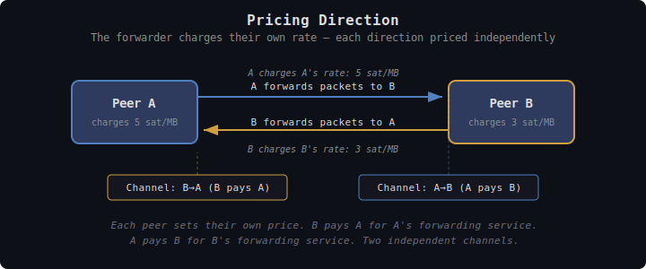
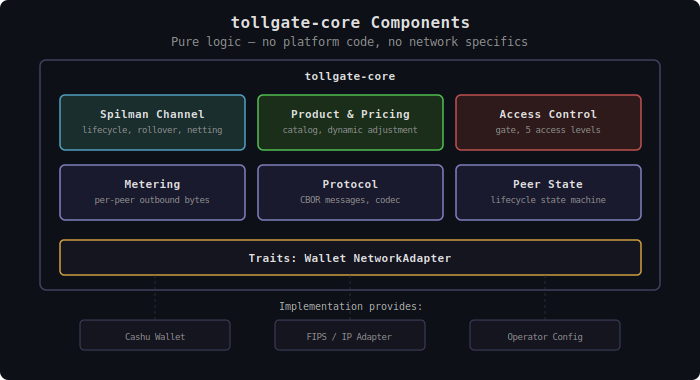

# TollGate: Permissionless Internet Commerce

## What is TollGate?

TollGate is a protocol and library for **autonomous, device-to-device payment for network forwarding**. Any device that forwards packets for another device can charge for that service using Cashu ecash micropayments — no accounts, no registration, no central billing authority. Devices negotiate prices, open payment channels, and settle autonomously based on observed traffic.

TollGate is not a network protocol. It is a payment layer that operates alongside any network where peers are authenticated and can forward traffic for each other. The first deployment target is [FIPS](https://github.com/nicobao/fips) (Free Internetworking Peering System), a self-organizing encrypted mesh, but TollGate's core logic is network-agnostic and transport-agnostic — it works over any topology where peers are identified by Nostr keypairs (npubs) and authenticated out-of-band.

## Why TollGate?

**Permissionless provision**: Anyone with a device and a network connection can sell forwarding services. No ISP license, no terms of service, no permission needed. A router on a rooftop, a phone sharing its cellular connection, a node in a community mesh — any device that forwards packets can earn for doing so.

**Zero-trust commerce**: TollGate uses Cashu ecash — bearer tokens that require no identity, no credit check, no account. Payment is atomic: you pay, packets flow. You stop paying, packets stop. No invoices, no billing cycles, no disputes. The cryptographic properties of Cashu Spilman channels ensure neither party can cheat without detection.

**Autonomous operation**: Devices negotiate, pay, and settle without human intervention. A TollGate node can operate unattended indefinitely — adjusting prices based on demand, opening and rolling over payment channels, surviving network partitions and mint outages. The operator sets pricing policy; the device executes it.

**Operator sovereignty**: The operator controls their node's economic behavior. Pricing is per-peer, per-product, and dynamically adjustable based on any metrics the network exposes — congestion, demand, link quality, time of day. The operator's margin is the spread between what they charge for forwarding and what they pay their peers. TollGate provides the tools; the operator makes the business decisions.

**Network and transport agnostic**: TollGate doesn't care how your packets travel or how TollGate messages reach the peer. The underlying network handles routing and forwarding; TollGate handles commerce. The TollGate protocol itself is transport-agnostic — messages can travel over any channel the implementation provides between authenticated peers. This means the same core logic runs on a high-end Linux router, a constrained OpenWrt device, or an ESP32 microcontroller, each with their own network and transport adapter.

## How Payment Works

TollGate operates on a single principle: **the forwarder charges for forwarding**. When node A forwards packets to node B, A charges A's own rate for that service. If B also forwards packets to A, B charges B's rate. Each direction is independently priced and independently paid.

```
    A ──────[forwards to B]──────→ B
    A charges A's rate (A is doing the work)

    B ──────[forwards to A]──────→ A
    B charges B's rate (B is doing the work)
```


<details><summary>Text version</summary>

```
    A ──────[forwards to B]──────→ B
    A charges A's rate (A is doing the work)
    Channel B→A: B pays A (B funds)

    B ──────[forwards to A]──────→ A
    B charges B's rate (B is doing the work)
    Channel A→B: A pays B (A funds)

    ── traffic (packets)    ╌╌ payment (Spilman channel)
```
</details>

Prices can be positive, zero, or negative. A well-connected node (e.g., one with direct internet access) charges a positive price because its forwarding is valuable. A leaf node willing to pay for inbound traffic can accept a negative price from its peer — effectively paying the peer to forward traffic *to* the leaf. A pair of peers owned by the same operator can set zero prices in both directions, skipping payment entirely. Pricing naturally reflects network topology, resource scarcity, and the economic relationship between each pair of peers.

Payment flows through **Cashu Spilman channels** — unidirectional payment channels where the sender locks ecash in a 2-of-2 multisig and signs incremental balance updates as traffic is metered. The receiver can settle at any time by submitting the latest update to a Cashu mint. Two channels per peer pair (one per direction) enable bidirectional payment.

### Payment Lifecycle

When two peers first connect:

1. **Bootstrap (if needed)**: If the connecting peer already has mint connectivity through other peers, it proceeds directly to channel establishment. If this is its first connection and it has no path to a mint, it sends a regular Cashu token — enough to fund a Spilman channel. This solves the chicken-and-egg problem: you need to pay to get online, but Spilman channels need mint connectivity. The bootstrap token is a one-time cost to get connected.

2. **Channel establishment**: Once both peers can reach a mint, they open Spilman channels (one per direction). The peer with the lower npub leads channel lifecycle management to avoid coordination races.

3. **Streaming payment**: As traffic flows, the sender signs balance updates at a negotiated interval (default: 5 seconds). Each update reflects the cumulative bytes forwarded since the channel opened. Only the delta since the last update needs to be signed — not a per-packet payment.

4. **Rollover**: When a channel approaches exhaustion (default: at 80% capacity), a new channel is opened alongside it. The old channel continues to be drained to 100%. Once exhausted, charging seamlessly continues on the new channel. For example: if the old channel has 2 sats remaining and the settlement costs 5 sats, the old channel exhausts and the remaining 3 sats are charged to the new one.

5. **Settlement**: Either party can settle at any time. The receiver submits the latest signed balance update to the mint, receiving their earned amount while the sender gets the remaining change back.

### Pay-Only Clients

Not all devices support full Spilman channels. A constrained device may only be able to send regular Cashu tokens — no channel management, no receiving. TollGate supports this as a degraded but functional mode. The pay-only client sends tokens for access; it just doesn't get the efficiency benefits of streaming micropayments.

### Offline Resilience

A TollGate node can lose mint connectivity at any moment — power loss, network partition, upstream failure. The design accounts for this:

- **Balance updates don't need the mint** — they are signed between peers without mint involvement. Payment continues normally during outages.
- **Core buffers bootstrap tokens** — when a peer sends a bootstrap token while the node is offline, the token is buffered. It cannot be verified as unspent without the mint, so it enters a pending state. Once mint connectivity returns, buffered tokens are verified and spent tokens discarded. This means accepting some risk during offline operation — a peer could send already-spent tokens — but limits exposure to the bootstrap amount.
- **Channels survive outages** — the receiver holds the latest signed update and settles when the mint returns.
- **Spilman's time-locked refund** — if the receiver disappears, the sender reclaims funds after expiry.
- **Channel expiry management** — nodes monitor channel expiry and trigger settlement before the refund timelock activates, even if the mint was temporarily unavailable.

## Specific Design Goals

- **Hop-by-hop payment** — Each peer pays its direct neighbor. No knowledge of the full path is needed. Payment relationships are strictly between adjacent peers.


<details><summary>Text version</summary>

```
                 10 sat/MB            3 sat/MB
  Client ──────────────→ Relay ──────────────→ Gateway ──→ internet
    │    ←══ download ══   │   ←══ download ══   │
    │    ── upload ───────→│   ── upload ───────→│
    │    ╌╌ pays 10/MB ──→ │   ╌╌ pays 3/MB ──→ │
    │                      │                     │
    └── independent ───────┘── independent ──────┘

  Relay margin: 10 - 3 = 7 sat/MB profit
  Client doesn't know about Gateway. Gateway doesn't know about Client.
```
</details>

- **Per-peer pricing** — Every peer relationship has its own price. Prices can differ per peer, per product, per mint, and can change dynamically.
- **Dynamic pricing** — Prices adjust based on network metrics (congestion, demand, link quality), operator policy, or any other signal the implementation provides.
- **Metering accuracy** — Per-peer traffic accounting with configurable drift tolerance (default: 5%) to account for packet loss between measurement points.
- **Operator control** — The operator defines pricing policy, accepted mints, product offerings, and peering arrangements. The protocol executes; the operator decides.
- **Cashu-native** — All payment uses Cashu ecash. No Lightning invoices, no on-chain transactions in the critical path. Spilman channels for efficiency; regular tokens for bootstrap and degraded operation.

Non-goals:

- **Routing decisions** — TollGate does not make routing decisions. The underlying network (FIPS, IP, etc.) handles routing. *Future: payment status may influence routing policy (e.g., well-paying peers get favorable routing), but this is a network-layer concern, not a TollGate concern.*
- **Wallet implementation** — TollGate-core defines a wallet trait; the implementation provides the actual wallet. Different platforms have different constraints (full Cashu wallet on Linux, constrained wallet on ESP32).
- **Network authentication** — Peers are authenticated by the implementation before TollGate sees them. FIPS uses Noise IK handshakes; a traditional network might use WireGuard; TollGate doesn't care.
- **Captive portal / user interface** — TollGate is device-to-device. Human-facing UI (captive portals, web dashboards) is built on top, not inside.
- **Anonymity** — TollGate peers know each other's identities (they have payment channels). Privacy comes from Cashu's blind signatures — the mint cannot link payments to identities.
- **Reliable delivery** — Like FIPS, TollGate operates on best-effort traffic. Metering counts what was forwarded, not what was requested.

---

## Architecture

TollGate is structured as a core library consumed by platform-specific implementations.

### tollgate-core (Library)

The core library contains all payment logic, pricing, metering, and access control. It is network-agnostic — it does not know about FIPS, IP, or any specific transport. The implementation provides three things via traits:

1. **Wallet** — Token operations, Spilman channel funding, balance signing, settlement. Must support token locking (NUT-11 2-of-2 multisig).
2. **Network Adapter** — Peer identification, traffic counters (bytes forwarded per peer), access control enforcement, and optional network metrics for dynamic pricing.
3. **Peer Identifiers** — Peers are always identified by their Nostr public key (npub). The implementation provides npubs for connected peers, similar to how FIPS transports provide identifiers to FMP.

### Separation Model

```
tollgate-core (lib)              ← Pure logic, no platform code
    │
    ├── tollgate (this project)  ← Single binary, feature-flagged per OS
    │     ├── Linux / macOS / Windows / OpenWrt
    │     ├── FIPS integration (native, compile-time)
    │     └── Cashu wallet (cdk-spilman based)
    │
    └── tollgate-esp32 (separate project)
          ├── ESP-IDF / constrained runtime
          └── Custom wallet + network adapter
```

The main binary targets Linux, macOS, Windows, and OpenWrt with feature flags for OS-specific differences. OpenWrt is Linux — the differences are config paths (UCI vs. XDG), packaging (ipk vs. deb/brew), and resource constraints. ESP32 is fundamentally different (different runtime, different toolchain, possibly `no_std`) and lives in its own project.

### Core Components


<details><summary>Text version</summary>

```
┌────────────────────────────────────────────────────────────┐
│                     tollgate-core                           │
│                                                            │
│  ┌──────────────┐  ┌──────────────┐  ┌───────────────┐    │
│  │   Spilman    │  │   Product    │  │   Access      │    │
│  │   Channel    │  │   Catalog &  │  │   Control     │    │
│  │   Manager    │  │   Pricing    │  │   (gate)      │    │
│  │  + rollover  │  │   Engine     │  │               │    │
│  └──────────────┘  └──────────────┘  └───────────────┘    │
│  ┌──────────────┐  ┌──────────────┐  ┌───────────────┐    │
│  │   Metering   │  │   Protocol   │  │   Peer State  │    │
│  │  (per-peer   │  │   Messages   │  │   Machine     │    │
│  │   outbound)  │  │   & Codec    │  │               │    │
│  └──────────────┘  └──────────────┘  └───────────────┘    │
│                                                            │
│  Traits: Wallet, NetworkAdapter                            │
└────────────────────────────────────────────────────────────┘

  Implementation provides: Cashu Wallet | FIPS/IP Adapter | Operator Config
```
</details>

- **Spilman Channel Manager**: Manages bi-directional channel pairs per peer. Handles the full lifecycle: bootstrap token → channel funding → active payments → rollover → settlement. Delegates cryptographic operations to the Wallet trait. Manages channel leadership (lowest peer ID leads). Handles offline scenarios gracefully.

- **Product Catalog & Pricing Engine**: Each node advertises products (offerings) with a metric (milliseconds or bytes), step size, bandwidth cap, and per-mint pricing. Product IDs are hashes of attributes (excluding prices) so peers detect changes. Dynamic pricing adjusts based on metrics from the NetworkAdapter.

- **Access Control**: Gates forwarding per peer based on payment status. Unpaid peers can only send traffic addressed to the local node (for payment negotiation). Zero-price peers bypass payment entirely.

- **Metering**: Tracks bytes forwarded per peer (outbound — what we charge for). Reports to the Channel Manager for balance updates. Handles drift between peers' measurements with configurable tolerance (default 5%).

- **Protocol Messages**: Wire format for product advertisements, channel negotiation, balance updates, pricing updates. Designed for minimal back-and-forth between peers.

- **Peer State Machine**: Tracks each peer's payment lifecycle: `new → bootstrap_received → channel_opening → active → rolling_over → settling → closed`. Zero-price peers go directly to `active`.

---

## Products and Pricing

A TollGate node advertises one or more **products** — each defining what is being sold and at what price. Products are the unit of negotiation between peers.

Each product specifies:
- **Metric**: What is being metered — milliseconds of access or bytes of forwarding
- **Step size**: Granularity of metering (e.g., 60,000 ms = 1 minute, or 1,048,576 bytes = 1 MB)
- **Bandwidth limit** (optional): Maximum throughput for this product
- **Per-mint pricing**: Price per step for each accepted Cashu mint (price is always mint-specific)

The product ID is a hash of the product's structural attributes (metric, step size, bandwidth limit) but **excludes prices**. This means a price change doesn't create a new product — peers can detect when a product's structure changes (requiring renegotiation) versus when only the price changed (which can be accepted or rejected without renegotiating the product).

Pricing is explored in depth in [tollgate-pricing.md](tollgate-pricing.md).

---

## Settlement and Netting

Each peer pair maintains two independent Spilman channels. At each settlement interval (default: 5 seconds):

1. Both sides report their metered traffic
2. The sender signs a balance update reflecting cumulative forwarded bytes
3. If both sides owe each other, only the net delta needs to move — avoiding unnecessary channel drain

Metering drift is expected — packet loss means the two sides may disagree on exact byte counts. At each settlement interval, both parties communicate their measured bytes sent and received, allowing both sides to calibrate their counters. Peers agree on a drift tolerance (default: 5%); as long as measurements stay within tolerance, the higher value is used.

Settlement details are explored in a dedicated design document.

---

## Security Considerations

### Threat Model

TollGate assumes that peers are authenticated by the underlying network (FIPS Noise IK, WireGuard, etc.) before any payment interaction occurs. The threats TollGate addresses are economic, not cryptographic:

**Freeloading**: A peer attempts to have traffic forwarded without paying. Mitigated by access control — unpaid peers cannot have transit traffic forwarded. In FIPS, unpaid peers are also excluded from bloom filters to prevent blackholing.

**Overpayment/Underpayment**: Metering drift causes disagreement about how much was forwarded. Mitigated by configurable drift tolerance and reconciliation.

**Rugpull (receiver)**: The receiver settles a channel and keeps the funds without providing service. Mitigated by short settlement intervals (5s default) — maximum exposure is one interval's worth of traffic.

**Rugpull (sender)**: The sender stops paying and expects continued service. Mitigated by access control — forwarding stops when payment stops.

**Offline exploitation**: A peer exploits a mint outage to receive service without settlement. Mitigated by channel expiry management — the receiver settles before the refund timelock activates, even if the mint was temporarily unavailable.

**Mint collusion**: A malicious mint could refuse to honor tokens. Mitigated by supporting multiple mints and per-mint pricing — operators choose which mints to trust.

### Privacy

TollGate peers know each other's payment identities (they share Spilman channels). However, Cashu's blind signatures mean the mint cannot link:
- Which channels belong to which real-world identities
- Which payments correspond to which forwarding relationships
- The total volume of commerce between any two peers

The mint sees token operations but not the economic relationships behind them. This is a significant privacy improvement over traditional billing systems.

---

## Prior Work

### TollGate v1 (tollgate-module-basic-go)

The original TollGate implementation runs on OpenWrt routers and sells WiFi access using Cashu tokens over HTTP. It uses a tree topology (parent-child) where each node has one upstream provider. Payment is per-session (time or data allotment) using individual Cashu tokens — no payment channels. Traffic control uses Nodogsplash (captive portal).

TollGate v2 differs fundamentally:
- **Mesh vs. tree**: Every peer is an independent payment relationship, not just parent-child
- **Spilman channels vs. individual tokens**: Streaming micropayments instead of bulk prepayment
- **Device-to-device vs. human-to-device**: No captive portal; autonomous operation
- **Network-agnostic vs. OpenWrt-only**: Core library works on any platform
- **Per-peer pricing vs. single price**: Each relationship has its own terms

### Cashu Spilman Channels

TollGate uses the [Cashu Spilman channel](reference/cashu_spilman_channels/ARCHITECTURE.md) implementation for streaming micropayments. Spilman channels are unidirectional payment channels where the sender funds a 2-of-2 multisig and signs off-chain balance updates. This is adapted from Bitcoin's [Spilman channels](https://en.bitcoin.it/wiki/Payment_channels#Spillman-style_payment_channels) to work with Cashu ecash instead of on-chain Bitcoin.

### FIPS (Free Internetworking Peering System)

FIPS provides the mesh networking substrate for TollGate's primary deployment target. FIPS handles peer discovery, authentication, encrypted forwarding, and quality metrics (MMP). TollGate consumes FIPS's per-peer metrics for dynamic pricing and hooks into its forwarding path for access control.

See [peering-fips.md](peering/peering-fips.md) for FIPS-specific integration details.

---

## Further Reading

### Core Protocol

| Document | Description |
| -------- | ----------- |
| [tollgate-pricing.md](core/tollgate-pricing.md) | Pricing model: products, per-peer pricing, dynamic adjustment |
| [tollgate-protocol.md](core/tollgate-protocol.md) | Wire protocol: messages, negotiation, codec |
| [tollgate-payment-channels.md](core/tollgate-payment-channels.md) | Spilman channel lifecycle, bootstrap, rollover, offline resilience |
| [tollgate-access-control.md](core/tollgate-access-control.md) | Forwarding gates, metering, unpaid peer restrictions |
| [tollgate-configuration.md](core/tollgate-configuration.md) | Configuration schema and runtime parameters |

### Network Integration

| Document | Description |
| -------- | ----------- |
| [peering-fips.md](peering/peering-fips.md) | FIPS mesh integration: metrics, bloom filters, forwarding hooks |
| [peering-ip.md](peering/peering-ip.md) | Traditional IP network integration |

### Migration

| Document | Description |
| -------- | ----------- |
| [FIPS_FEATURE_REQUESTS.md](../v1-to-v2-migration/FIPS_FEATURE_REQUESTS.md) | Required FIPS changes for TollGate integration |

### External References

- [Cashu Protocol](https://cashu.space/) — Ecash protocol used for payments
- [NUT-11: Spending Conditions](https://github.com/cashubtc/nuts/blob/main/11.md) — P2PK conditions for channel funding
- [NUT-28: P2BK](https://github.com/cashubtc/nuts/blob/main/28.md) — Pay-to-Blinded-Key for privacy
- [Spilman Channels (Bitcoin Wiki)](https://en.bitcoin.it/wiki/Payment_channels#Spillman-style_payment_channels) — Original concept
- [FIPS](https://github.com/nicobao/fips) — Free Internetworking Peering System
- [TollGate v1](https://github.com/OpenTollGate/tollgate-module-basic-go) — Original implementation
