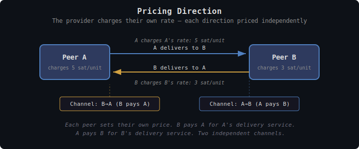
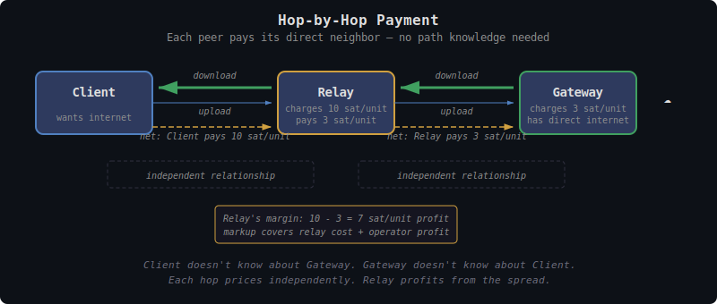
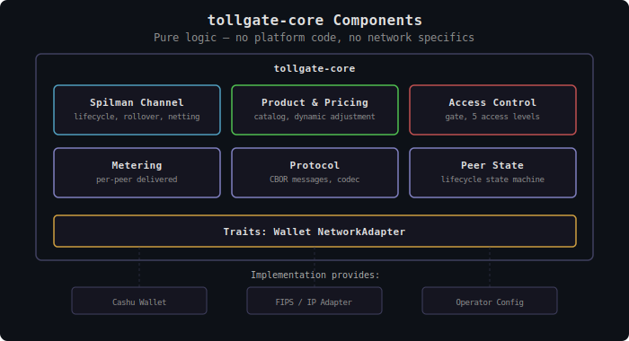

# TollGate: Permissionless Internet Commerce

## What is TollGate?

**TollGate** is a protocol for autonomous, device-to-device payment for metered resource delivery. Any device that delivers resources to another can charge for that service using Cashu ecash micropayments — no accounts, no registration, no central billing authority. Devices negotiate prices, open payment channels, and settle autonomously based on observed usage. The protocol is **resource-agnostic**: the same wire format and lifecycle work for forwarded bytes, watt-hours, milliliters, or any metered unit.

TollGate is not a network protocol. It is a payment layer that operates alongside any system where peers are authenticated and can deliver resources to each other.

### What's in this repo

| Layer | What it is |
|---|---|
| **tollgate-protocol** | Wire format and lifecycle defined in these design documents. Resource-agnostic. Currently lives as a `protocol` module inside `tollgate-core`; it may be extracted into its own crate when there's a real second consumer (a Go or TypeScript implementation, or another Rust crate that needs only message types). |
| **tollgate-core** | Rust library implementing the protocol's resource-agnostic logic: channels, metering, pricing, access control. Consumers plug in a `Wallet` and a `ResourceAdapter` via traits. |
| **tollgate-net** | First deployment of TollGate: **(re)selling network access**. Built on `tollgate-core`, it ships the network-forwarding `ResourceAdapter` (traditional IP or a mesh such as [FIPS](https://github.com/nicobao/fips)) and a Cashu wallet. |

A constrained-device variant (`tollgate-net-esp32`) lives in a separate project and consumes the same `tollgate-core`.

## Why TollGate?

**Permissionless provision**: Anyone with a device and a resource to share can sell delivery services. No ISP license, no terms of service, no permission needed. A router on a rooftop, a phone sharing its cellular connection, a node in a community mesh — any device that delivers resources can earn for doing so.

**Zero-trust commerce**: TollGate uses Cashu ecash — bearer tokens that require no identity, no credit check, no account. Payment is atomic: you pay, resources flow. You stop paying, resources stop. No invoices, no billing cycles, no disputes. The cryptographic properties of Cashu Spilman channels ensure neither party can cheat without detection.

**Autonomous operation**: Devices negotiate, pay, and settle without human intervention. A TollGate node can operate unattended indefinitely — adjusting prices based on demand, opening and rolling over payment channels, surviving network partitions and mint outages. The operator sets pricing policy; the device executes it.

**Operator sovereignty**: The operator controls their node's economic behavior. Pricing is per-peer, per-product, and dynamically adjustable based on any metrics the system exposes — congestion, demand, link quality, time of day. **The operator's margin is the spread between what they charge for delivery and what they pay their peers.** TollGate provides the tools; the operator makes the business decisions.

**Network and transport agnostic**: The protocol doesn't dictate how resources travel or how protocol messages reach the peer. The underlying system handles routing and delivery; TollGate handles commerce. Messages can travel over any bidirectional channel between authenticated peers. The same `tollgate-core` library can power a high-end Linux router, a constrained OpenWrt device, or an ESP32 microcontroller — each with its own wallet and resource adapter.

## How Payment Works

TollGate operates on a single principle: **the provider charges for delivery**. When node A delivers resources to node B, A charges A's own rate for that service. If B also delivers resources to A, B charges B's rate. Each direction is independently priced and independently paid.


<details><summary>Text version</summary>

```
    A ──────[delivers to B]──────→ B
    A charges A's rate (A is doing the work)
    Channel B→A: B pays A (B funds)

    B ──────[delivers to A]──────→ A
    B charges B's rate (B is doing the work)
    Channel A→B: A pays B (A funds)

    ── resources    ╌╌ payment (Spilman channel)
```
</details>

Prices can be positive, zero, or negative. A well-connected node (e.g., one with direct internet access) charges a positive price because its delivery is valuable. A leaf node is more likely to set a negative price for forwarding traffic — paying its peer to take its outgoing traffic, effectively subsidizing the relationship to ensure peers stay willing to forward on its behalf. A pair of peers owned by the same operator can set zero prices in both directions, skipping payment entirely. Pricing naturally reflects topology, resource scarcity, and the economic relationship between each pair of peers.

Payment flows through **Cashu Spilman channels** — unidirectional payment channels where the sender locks ecash in a 2-of-2 multisig and signs incremental balance updates as resources are metered. The receiver can settle at any time by submitting the latest update to a Cashu mint. Two channels per peer pair (one per direction) enable bidirectional payment.

### Payment Lifecycle

When two peers first connect:

1. **Bootstrap (if needed)**: If the connecting peer already has mint connectivity through other peers, it can proceed directly to channel establishment. If this is its first connection and it has no path to a mint, it sends a regular Cashu token — enough to fund a Spilman channel. This solves the chicken-and-egg problem: you need to pay to get online, but Spilman channels need mint connectivity. The bootstrap token is a one-time cost to get connected. **A client can also choose to remain on bootstrap tokens for the entire session** — Spilman channels are not mandatory, but highly recommended for efficiency (see [Bootstrap-only Clients](#bootstrap-only-clients)).

2. **Channel establishment**: Once both peers can reach a mint, they open Spilman channels (one per direction). Each peer manages rollover for its own outgoing channel — only the funder needs to initiate, since only the funder puts up new funds.

3. **Streaming payment**: As resources flow, the sender signs balance updates at the negotiated **metering interval** (default: 5 seconds). Each update reflects the cumulative units delivered since the channel opened. Only the delta since the last update needs to be signed — not a per-unit payment.

4. **Rollover**: When a channel approaches exhaustion (default: at 80% capacity), a new channel is opened alongside it. The old channel continues to be drained to 100%. Once exhausted, charging seamlessly continues on the new channel. For example: if the old channel has 2 sats remaining and the metering interval costs 5 sats, the old channel exhausts and the remaining 3 sats are charged to the new one.

5. **Settlement**: Either party can settle at any time. The receiver submits the latest signed balance update to the mint, receiving their earned amount while the sender can claim back the remaining change with the mint.

### Pay-only and Bootstrap-only Clients

Two related but distinct lifecycles exist:

- **Pay-only** — the client only pays its peers; it never charges them. Because the peer never owes the client anything, the peer doesn't fund a channel back toward the client (it would only ever sit at zero balance). The client's outgoing payment can still use Spilman channels (efficient) or bootstrap tokens.
- **Bootstrap-only** — like pay-only, but the client cannot fund Spilman channels for its outgoing payment either (no ECDH, no balance signing). The entire session runs on bootstrap tokens. Bootstrap-only ⊂ pay-only.

A pay-only client is typically a leaf consumer (a phone, a laptop) that wants to buy resources but has nothing chargeable to deliver. The client's delivery price is zero or negative, which is what tells the peer not to bother funding a receiving channel.

**Spilman channels are highly recommended** when the client can run them: they avoid the per-token mint round-trip and amortize signing overhead across many metering intervals. Bootstrap-only clients are forced into per-token payment because they can't sign balance updates.

### Offline Resilience

A TollGate node can lose mint connectivity at any moment — power loss, network partition, upstream failure. The design accounts for this:

- **Balance updates don't need the mint** — they are signed between peers without mint involvement. Payment continues normally during outages.
- **Pre-stored bootstrap tokens** — a node starting without connectivity can carry pre-funded Cashu proofs (e.g., loaded via QR code). When it connects to a peer, it sends these as bootstrap tokens. The provider always verifies each token with the mint before granting service. If a token has already been spent, the provider rejects it and the sender tries the next proof in its set. This avoids any trust-before-verification — the sender bears the cost of carrying potentially-spent proofs, not the provider.
- **Channels survive outages** — the receiver holds the latest signed update and settles when the mint returns.
- **Spilman's time-locked refund** — if the receiver disappears, the sender reclaims funds after expiry.
- **Channel expiry management** — nodes monitor channel expiry and trigger settlement before the refund timelock activates, even if the mint was temporarily unavailable.

## Specific Design Goals

- **Resource-agnostic core, network-specific implementation** — `tollgate-core` knows nothing about what is being sold. This repo ships it as a reusable library and `tollgate-net` as a network-forwarding binary built on top. Other resource types (electricity, fluids, compute) get their own implementations on the same core.
- **Hop-by-hop payment** — Each peer pays its direct neighbor. No knowledge of the full path is needed. Payment relationships are strictly between adjacent peers.


<details><summary>Text version</summary>

```
                 10 sat/MB            3 sat/MB
  Client ──────────────→ Relay ──────────────→ Gateway ──→ internet
    │    ←══ download ══   │   ←══ download ══   │
    │    ── upload ───────→│   ── upload ───────→│
    │    ╌╌ pays 10/MB ──→ │   ╌╌ pays 3/MB ──→ │
    │                      │                     │
    └── independent ───────┘── independent ──────┘

  Relay margin: 10 - 3 = 7 sat/MB profit
  Client doesn't know about Gateway. Gateway doesn't know about Client.
```
</details>

- **Per-peer pricing** — Every peer relationship has its own price. Prices can differ per peer, per product, per mint, and can change dynamically.
- **Dynamic pricing** — Prices adjust based on metrics (congestion, demand, link quality), operator policy, or any other signal the implementation provides.
- **Metering accuracy** — Per-peer accounting with configurable transit loss tolerance (default: 5%) to account for transit loss between measurement points.
- **Operator control** — The operator defines pricing policy, accepted mints, product offerings, and peering arrangements. The protocol executes; the operator decides.
- **Cashu-native** — All payment uses Cashu ecash. No Lightning invoices, no on-chain transactions in the critical path. Spilman channels for efficiency; regular tokens for bootstrap and degraded operation.

Non-goals:

- **Routing decisions** — TollGate does not make routing decisions. The underlying system (FIPS, IP, etc.) handles routing. *Future: payment status may influence routing policy (e.g., well-paying peers get favorable routing), but this is an implementation-layer concern, not a TollGate concern.*
- **Wallet implementation** — `tollgate-core` defines a wallet trait; the implementation provides the actual wallet. Different platforms have different constraints (full Cashu wallet on Linux, constrained wallet on ESP32).
- **Network authentication** — Peers are authenticated by the implementation before TollGate sees them. FIPS uses Noise IK handshakes; a traditional network might use WireGuard; TollGate doesn't care.
- **Captive portal / user interface** — TollGate is device-to-device. Human-facing UI (captive portals, web dashboards) is built on top, not inside.
- **Anonymity** — TollGate peers know each other's identities (they have payment channels). Privacy comes from Cashu's blind signatures — the mint cannot link payments to identities.
- **Reliable delivery** — TollGate operates on best-effort delivery. Metering counts what was delivered, not what was requested.

---

## Architecture

The three layers introduced in [What's in this repo](#whats-in-this-repo) — `tollgate-protocol`, `tollgate-core`, `tollgate-net` — give the structure. This section covers what each layer contains and the trait boundary between them.

### tollgate-core (Library)

`tollgate-core` contains all payment logic, pricing, metering, and access control. It is network-agnostic — it does not know about FIPS, IP, or any specific transport. The consumer provides three things via traits:

1. **Wallet** — Token operations, Spilman channel funding, balance signing, settlement. Must support token locking (NUT-11 2-of-2 multisig).
2. **Resource Adapter** — Peer identification, metering counters (units delivered per peer), access control enforcement, and optional metrics for dynamic pricing.
3. **Peer Identifiers** — Peers are always identified by their Nostr public key (npub). The consumer provides npubs for connected peers, similar to how FIPS transports provide identifiers to FMP.

### Separation Model

```
tollgate-core (lib)              ← Pure logic, no platform code
    │
    ├── tollgate-net (this binary)  ← Network forwarding, feature-flagged per OS
    │     ├── Linux / macOS / Windows / OpenWrt
    │     ├── FIPS or IP network adapter
    │     └── Cashu wallet (cdk-spilman based)
    │
    └── tollgate-net-esp32 (separate project)
          ├── ESP-IDF / constrained runtime
          └── Custom wallet + resource adapter
```

`tollgate-net` targets Linux, macOS, Windows, and OpenWrt with feature flags for OS-specific differences. OpenWrt is Linux — the differences are config paths (UCI vs. XDG), packaging (ipk vs. deb/brew), and resource constraints. ESP32 is fundamentally different (different runtime, different toolchain, possibly `no_std`) and lives in its own project.

### Core Components


<details><summary>Text version</summary>

```
┌────────────────────────────────────────────────────────────┐
│                     tollgate-core                           │
│                                                            │
│  ┌──────────────┐  ┌──────────────┐  ┌───────────────┐    │
│  │   Spilman    │  │   Product    │  │   Access      │    │
│  │   Channel    │  │   Catalog &  │  │   Control     │    │
│  │   Manager    │  │   Pricing    │  │   (gate)      │    │
│  │  + rollover  │  │   Engine     │  │               │    │
│  └──────────────┘  └──────────────┘  └───────────────┘    │
│  ┌──────────────┐  ┌──────────────┐  ┌───────────────┐    │
│  │   Metering   │  │   Protocol   │  │   Peer State  │    │
│  │  (per-peer   │  │   Messages   │  │   Machine     │    │
│  │   outbound)  │  │   & Codec    │  │               │    │
│  └──────────────┘  └──────────────┘  └───────────────┘    │
│                                                            │
│  Traits: Wallet, ResourceAdapter                           │
└────────────────────────────────────────────────────────────┘

  Implementation provides: Cashu Wallet | FIPS/IP Resource Adapter | Operator Config
```
</details>

- **Spilman Channel Manager**: Manages the channel pair per peer (one per direction). Handles the full lifecycle: bootstrap token → channel funding → active payments → rollover → settlement. Each peer initiates rollover for its own outgoing channel — only the funder needs to act, since only the funder puts up new funds. Delegates cryptographic operations to the Wallet trait. Handles offline scenarios gracefully.

- **Product Catalog & Pricing Engine**: Each node advertises products (offerings) with a pricing scale, per-mint pricing, and optional extensions. Product IDs are hashes of attributes so peers detect changes. Dynamic pricing adjusts based on metrics from the ResourceAdapter.

- **Access Control**: Gates delivery per peer based on payment status. Unpaid peers can only send data addressed to the local node (for payment negotiation). Zero-price peers bypass payment entirely.

- **Metering**: Tracks units delivered per peer (outbound — what we charge for). Reports to the Channel Manager for balance updates. Handles transit loss between peers' measurements with configurable tolerance (default 5%).

- **Protocol Messages**: Wire format for product advertisements, channel negotiation, balance updates, pricing updates. Designed for minimal back-and-forth between peers.

- **Peer State Machine**: Tracks each peer's payment lifecycle: `new → bootstrap_received → channel_opening → active → rolling_over → settling → closed`. Zero-price peers go directly to `active`.

---

## Products and Pricing

A TollGate node advertises one or more **products** — each defining what is being sold and at what price. Products are the unit of negotiation between peers.

Each product specifies:
- **Pricing scale**: Divisor for sub-unit precision (default: 1000)
- **Per-mint pricing**: Price per unit for each accepted Cashu mint (price is always mint-specific)
- **Extensions** (optional): Opaque implementation-specific parameters (e.g., bandwidth limits for network resources)

The product ID is a hash of the product's structural attributes (pricing scale, pricing, extensions). Any change produces a new product ID, allowing peers to instantly detect when renegotiation is needed with a single hash comparison.

Pricing is explored in depth in [tollgate-pricing.md](tollgate-pricing.md).

---

## Interval Netting

Each peer pair maintains two independent Spilman channels. At each metering interval (default: 5 seconds):

1. Both sides report their metered usage
2. The sender signs a balance update reflecting cumulative units delivered
3. If both sides owe each other, only the net delta needs to move — avoiding unnecessary channel drain

Metering drift is expected — transit loss means the two sides may disagree on exact counts. At each metering interval, both parties communicate their measured units sent and received, allowing both sides to calibrate their counters. Peers agree on a transit loss tolerance (default: 5%); as long as measurements stay within tolerance, the higher value is used.

Netting details are explored in a dedicated design document.

---

## Security Considerations

### Threat Model

TollGate assumes that peers are authenticated by the underlying network (FIPS Noise IK, WireGuard, etc.) before any payment interaction occurs. The threats TollGate addresses are economic, not cryptographic:

**Freeloading**: A peer attempts to have resources delivered without paying. Mitigated by access control — unpaid peers cannot have transit resources delivered. Mesh implementations additionally hide unpaid peers from routing advertisements to prevent blackholing.

**Overpayment/Underpayment**: Metering drift causes disagreement about how much was delivered. Mitigated by configurable transit loss tolerance and reconciliation.

**Rugpull (receiver)**: The receiver settles a channel and keeps the funds without providing service. Mitigated by short metering intervals (5s default) — maximum exposure is one interval's worth of delivery.

**Rugpull (sender)**: The sender stops paying and expects continued service. Mitigated by access control — delivery stops when payment stops.

**Offline exploitation**: A peer exploits a mint outage to receive service without settlement. Mitigated by channel expiry management — the receiver settles before the refund timelock activates, even if the mint was temporarily unavailable.

**Mint collusion**: A malicious mint could refuse to honor tokens. Mitigated by supporting multiple mints and per-mint pricing — operators choose which mints to trust.

**Mint outage**: A mint going offline blocks channel funding, rollover, and settlement. Operators should aim to maintain overlapping channels across at least two mints (three preferred) so that if one mint goes down, channels on the remaining mint(s) continue operating. Diversifying across mints reduces the impact of correlated failures. *Future: automated inter-mint fund movement to rebalance when a mint becomes unavailable.*

### Privacy

TollGate peers know each other's payment identities (they share Spilman channels). However, Cashu's blind signatures mean the mint cannot link:
- Which channels belong to which real-world identities
- Which payments correspond to which delivery relationships
- The total volume of commerce between any two peers

The mint sees token operations but not the economic relationships behind them. This is a significant privacy improvement over traditional billing systems.

---

## Prior Work

### TollGate v1 (tollgate-module-basic-go)

The original TollGate implementation runs on OpenWrt routers and sells WiFi access using Cashu tokens over HTTP. It uses a tree topology (parent-child) where each node has one upstream provider. Payment is per-session (time or data allotment) using individual Cashu tokens — no payment channels. Traffic control uses Nodogsplash (captive portal).

TollGate v2 differs fundamentally:
- **Mesh vs. tree**: Every peer is an independent payment relationship, not just parent-child
- **Spilman channels vs. individual tokens**: Streaming micropayments instead of bulk prepayment
- **Device-to-device vs. human-to-device**: No captive portal; autonomous operation
- **Network-agnostic vs. OpenWrt-only**: Core library works on any platform
- **Per-peer pricing vs. single price**: Each relationship has its own terms

### Cashu Spilman Channels

TollGate uses the [Cashu Spilman channel](../../../reference/cashu_spilman_channels/ARCHITECTURE.md) implementation for streaming micropayments. Spilman channels are unidirectional payment channels where the sender funds a 2-of-2 multisig and signs off-chain balance updates. This is adapted from Bitcoin's [Spilman channels](https://en.bitcoin.it/wiki/Payment_channels#Spillman-style_payment_channels) to work with Cashu ecash instead of on-chain Bitcoin.

### FIPS (Free Internetworking Peering System)

[FIPS](https://github.com/nicobao/fips) is a self-organizing encrypted mesh that TollGate can run on as one of several supported substrates. See [peering-fips.md](../network-peering/peering-fips.md) for integration details.

---

## Further Reading

### Core Protocol

| Document | Description |
| -------- | ----------- |
| [tollgate-pricing.md](tollgate-pricing.md) | Pricing model: products, per-peer pricing, dynamic adjustment |
| [tollgate-protocol.md](tollgate-protocol.md) | Wire protocol: messages, negotiation, codec |
| [tollgate-bootstrap.md](tollgate-bootstrap.md) | Bootstrap tokens, bootstrap-only mode, upgrade path |
| [tollgate-payment-channels.md](tollgate-payment-channels.md) | Spilman channel lifecycle, rollover, offline resilience |
| [tollgate-access-control.md](tollgate-access-control.md) | Delivery gates, access levels, unpaid peer restrictions |
| [tollgate-metering.md](tollgate-metering.md) | Metering counters, calibration, transit loss resolution |
| [tollgate-configuration.md](tollgate-configuration.md) | Configuration schema and runtime parameters |

### Network Integration

| Document | Description |
| -------- | ----------- |
| [peering-fips.md](../network-peering/peering-fips.md) | FIPS mesh integration: metrics, bloom filters, delivery hooks |
| [peering-ip.md](../network-peering/peering-ip.md) | Traditional IP network integration |

### Migration

| Document | Description |
| -------- | ----------- |
| [FIPS_FEATURE_REQUESTS.md](../FIPS_FEATURE_REQUESTS.md) | Required FIPS changes for TollGate integration |

### External References

- [Cashu Protocol](https://cashu.space/) — Ecash protocol used for payments
- [NUT-11: Spending Conditions](https://github.com/cashubtc/nuts/blob/main/11.md) — P2PK conditions for channel funding
- [NUT-28: P2BK](https://github.com/cashubtc/nuts/blob/main/28.md) — Pay-to-Blinded-Key for privacy
- [Spilman Channels (Bitcoin Wiki)](https://en.bitcoin.it/wiki/Payment_channels#Spillman-style_payment_channels) — Original concept
- [FIPS](https://github.com/nicobao/fips) — Free Internetworking Peering System
- [TollGate v1](https://github.com/OpenTollGate/tollgate-module-basic-go) — Original implementation
