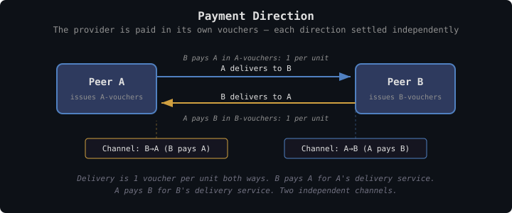
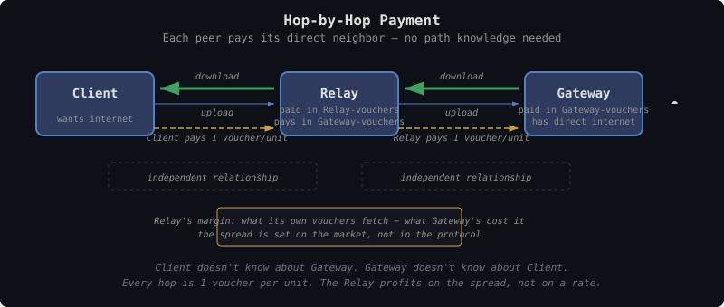
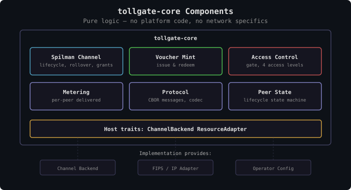

# TollGate: Permissionless Internet Commerce

## What is TollGate?

**TollGate** is a protocol for autonomous, device-to-device payment for metered resource delivery. Any device that delivers resources to another can charge for that service using Cashu ecash micropayments — no accounts, no registration, no central billing authority. Devices negotiate prices, open payment channels, and settle autonomously based on observed usage. The protocol is **resource-agnostic**: the same wire format and lifecycle work for forwarded bytes, watt-hours, milliliters, or any metered unit.

TollGate is not a network protocol. It is a payment layer that operates alongside any system where peers are authenticated and can deliver resources to each other.

### What's in this repo

| Layer | What it is |
|---|---|
| **tollgate-protocol** | Wire format and lifecycle defined in these design documents. Resource-agnostic. Currently lives as a `protocol` module inside `tollgate-core`; it may be extracted into its own crate when there's a real second consumer (a Go or TypeScript implementation, or another Rust crate that needs only message types). |
| **market** | Where vouchers get their money price: acquisition routes, the reliability signal, issuer risk. Specification only — no code depends on it, and a node works without any of it. |
| **tollgate-core** | Rust library implementing the protocol's resource-agnostic logic: channels, metering, vouchers, access control. Consumers plug in a `Wallet` and a `ResourceAdapter` via traits. |
| **tollgate-net** | First deployment of TollGate: **(re)selling network access**. Built on `tollgate-core`, it ships the network-forwarding `ResourceAdapter` (traditional IP or a mesh such as [FIPS](https://github.com/nicobao/fips)) and a Cashu wallet. |

A constrained-device variant (`tollgate-net-esp32`) lives in a separate project and consumes the same `tollgate-core`.

## Why TollGate?

**Permissionless provision**: Anyone with a device and a resource to share can sell delivery services. No ISP license, no terms of service, no permission needed. A router on a rooftop, a phone sharing its cellular connection, a node in a community mesh — any device that delivers resources can earn for doing so.

**Accountless commerce**: TollGate uses Cashu ecash — bearer tokens that require no identity, no credit check, no account. Payment is atomic: you pay, resources flow. You stop paying, resources stop. No invoices, no billing cycles, no disputes.

**Payment is not zero-trust, and that is deliberate.** Each node is the mint for its own vouchers ([tollgate-vouchers.md](tollgate-vouchers.md)), so the party that could refuse to redeem is also the party that would have to honor a refund. No cryptography fixes that. What bounds it instead is exposure — hold one grant's worth, risk one grant's worth, and the payer picks the window — and reputation, since an issuer that stops redeeming sees its vouchers sell for less. Any claim of a cryptographic guarantee against a defaulting issuer would be false.

**Autonomous operation**: Devices negotiate, pay, and settle without human intervention. A TollGate node can operate unattended indefinitely — opening and rolling over payment channels, surviving network partitions and upstream failures. The operator decides what to sell vouchers for; the device executes delivery.

**Operator sovereignty**: The operator controls their node's economic behavior by deciding what to sell its vouchers for, and to whom. **The operator's margin is the spread between what they earn for delivery, and what they pay their peers.** TollGate provides the tools; the operator makes the business decisions.

**Network and transport agnostic**: The protocol doesn't dictate how resources travel or how protocol messages reach the peer. The underlying system handles routing and delivery; TollGate handles commerce. Messages can travel over any bidirectional channel between authenticated peers. The same `tollgate-core` library can power a high-end Linux router, a constrained OpenWrt device, or an ESP32 microcontroller — each with its own wallet and resource adapter.

## How Payment Works

TollGate operates on a single principle: **each side pays for what it received, in the vouchers of whoever delivered it**. Both peers owe each other by default, so both fund a channel.


<details><summary>Text version</summary>

```
    B ──────[delivers to A]──────→ A
    A pays B in B-vouchers for what it received
    Channel A→B: A pays B (A funds)

    A ──────[delivers to B]──────→ B
    B pays A in A-vouchers for what it received
    Channel B→A: B pays A (B funds)

    ── resources    ╌╌ payment (Spilman channel)
```
</details>

**Delivery has no price in the protocol.** One voucher is a claim on one unit of capacity, so `n` units received costs `n` vouchers ([tollgate-vouchers.md](tollgate-vouchers.md)). What a unit costs in money is settled where the peer buys those vouchers, which the protocol never sees.

A well-connected node sells its vouchers dearly because its delivery is valuable. A node that wants to favor a peer sells that peer vouchers cheaply. A pair of peers owned by the same operator skips payment entirely by deciding not to charge each other. Topology, scarcity and relationships all show up in what vouchers fetch, rather than in a price sheet.

One number is quoted peer-to-peer: the **received multiplier**, a surcharge on what a peer pushes at this node, on top of that peer already being paid for delivering it. Default `0`; only above `1` does the peer pay net for both directions. Unsigned, so a node can discourage traffic but never pay a bonus for it. See [tollgate-vouchers.md](tollgate-vouchers.md).

Payment flows through **Cashu Spilman channels** — unidirectional payment channels where the sender locks vouchers in a 2-of-2 multisig and signs successively larger balance updates. Two channels per peer pair (one per direction) enable bidirectional payment. Under vouchers their job is to keep the issuer's spent-proof set bounded rather than to prevent theft.

### Payment Lifecycle

A peer arrives already holding vouchers for the node it wants service from, or it gets no service. How it acquired them is outside the protocol — see [voucher-acquisition.md](../market/voucher-acquisition.md).

1. **Channel establishment**: The peers open Spilman channels (one per direction). Each peer manages rollover for its own outgoing channel — only the funder needs to initiate, since only the funder puts up new funds. The mint each channel is funded against is the counterparty's own, so it is always reachable.

2. **Buying capacity**: The payer sends a **TopUp** whenever it wants a rate — a signed channel update carrying a cumulative total and a **window** to spend the new units in. The rate is one divided by the other. A new grant replaces the one in force, so raising the rate mid-window forfeits the remainder; that is what makes the product bandwidth rather than a stored quantity of bytes. Nothing is acknowledged, so a payer can raise its rate and use it in the same breath.

3. **Rollover**: When a channel approaches exhaustion (default: at 80% capacity), a new channel is opened alongside it. The old channel continues to be drained to 100%. Once exhausted, grants seamlessly continue on the new channel. For example: if the old channel has 2 vouchers remaining and the next grant is 5, the old channel exhausts and the remaining 3 are signed onto the new one.

4. **Settlement**: Either party can settle at any time. The receiver submits the latest signed channel state to the mint — its own — and the sender reclaims the remaining change.

### How Many Channels

**A channel exists in each direction where that side handled traffic for the other, and charges for it.** Two independent questions, so several shapes are normal:

| | B charges A | A charges B | Channels |
|---|---|---|---|
| **Default, any peering** | yes | yes | **two** |
| One-way free | `no_charge` | yes | one (B→A) |
| Free peering | `no_charge` | `no_charge` | none |

A leaf is not a special case: it delivers its uploads, so the relay owes it for those, and both channels exist. What makes a leaf a net payer is the relay's `received_multiplier`, which surcharges the upload above what it earns.

A node may also decide not to charge a particular peer at all. That decision is **one-sided**: it controls only whether *it* charges, never whether the peer charges back.

### Offline Resilience

A TollGate node can lose upstream connectivity at any moment — power loss, network partition, upstream failure. The design accounts for this:

- **The mint that matters is the peer you are talking to.** Funding, verification and settlement against a counterparty's vouchers all work over the peering link alone, with no upstream path. This is the single largest resilience gain of the voucher model: payment liveness and service liveness fail together instead of separately.
- **Balance updates don't need any mint** — they are signed between peers. Payment continues normally during outages.
- **Double-spend checks are local** — a node is the authority on its own vouchers, so verification is a database lookup rather than a network round-trip.
- **Channels survive outages** — the receiver holds the latest signed update and settles when convenient.
- **Channel expiry management** — nodes monitor channel expiry and trigger settlement before the refund timelock activates.

What does *not* survive an outage is acquiring vouchers for a node you have never met, which needs either another link or a node willing to swap locally.

## Specific Design Goals

- **Resource-agnostic core, network-specific implementation** — `tollgate-core` knows nothing about what is being sold. This repo ships it as a reusable library and `tollgate-net` as a network-forwarding binary built on top. Other resource types (electricity, fluids, compute) get their own implementations on the same core.
- **Hop-by-hop payment** — Each peer pays its direct neighbor, in vouchers that neighbor accepts. No knowledge of the full path is needed. Payment relationships are strictly between adjacent peers.


<details><summary>Text version</summary>

```
              Relay-vouchers        Gateway-vouchers
  Client ──────────────→ Relay ──────────────→ Gateway ──→ internet
    │    ←══ download ══   │   ←══ download ══   │
    │    ── upload ───────→│   ── upload ───────→│
    │    ╌╌ 1 voucher/unit→│   ╌╌ 1 voucher/unit→│
    │                      │                     │
    └── independent ───────┘── independent ──────┘

  Every hop is 1 voucher per unit. The Relay's margin is not a rate
  difference — it is what its own vouchers fetch minus what the
  Gateway's cost it. That spread lives on the market, not in the protocol.

  Client doesn't know about Gateway. Gateway doesn't know about Client.
```
</details>

- **Per-peer pricing without per-peer machinery** — A node favors a peer by selling it vouchers cheaply. Nothing in the protocol has to know.
- **Pricing outside the protocol** — What a unit costs in money is decided where vouchers are sold, so the wire format carries no rates.
- **Metering that decides nothing** — Counters are local and never exchanged. Payment lands before the traffic it covers, so no shared number decides how much money moves and there is nothing to reconcile.
- **Operator control** — The operator decides what its vouchers sell for, which peers' vouchers it will hold and at what price, and which peerings exist. The protocol executes; the operator decides.
- **Cashu-native** — All payment uses Cashu ecash. No Lightning invoices, no on-chain transactions in the critical path. Spilman channels batch the per-interval payments.

Non-goals:

- **Routing decisions** — TollGate does not make routing decisions. The underlying system (FIPS, IP, etc.) handles routing. *Future: payment status may influence routing policy (e.g., well-paying peers get favorable routing), but this is an implementation-layer concern, not a TollGate concern.*
- **Wallet implementation** — `tollgate-core` defines a wallet trait; the implementation provides the actual wallet. Different platforms have different constraints (full Cashu wallet on Linux, constrained wallet on ESP32).
- **Network authentication** — Peers are authenticated by the implementation before TollGate sees them. FIPS uses Noise IK handshakes; a traditional network might use WireGuard; TollGate doesn't care.
- **Captive portal / user interface** — TollGate is device-to-device. Human-facing UI (captive portals, web dashboards) is built on top, not inside.
- **Anonymity** — TollGate peers know each other's identities (they have payment channels). Privacy comes from Cashu's blind signatures — the mint cannot link payments to identities.
- **Reliable delivery** — TollGate operates on best-effort delivery. Metering counts what was delivered, not what was requested.

---

## Architecture

The three layers introduced in [What's in this repo](#whats-in-this-repo) — `tollgate-protocol`, `tollgate-core`, `tollgate-net` — give the structure. This section covers what each layer contains and the trait boundary between them.

### tollgate-core (Library)

`tollgate-core` contains all payment logic, pricing, metering, and access control. It is network-agnostic — it does not know about FIPS, IP, or any specific transport. The consumer provides three things via traits:

1. **Wallet** — Token operations, Spilman channel funding, balance signing, settlement. Must support token locking (NUT-11 2-of-2 multisig).
2. **Resource Adapter** — Peer identification, metering counters (units delivered per peer), access control enforcement, and optional metrics for operator visibility.
3. **Peer Identifiers** — Peers are always identified by their Nostr public key (npub). The consumer provides npubs for connected peers, similar to how FIPS transports provide identifiers to FMP.

### Separation Model

```
tollgate-core (lib)              ← Pure logic, no platform code
    │
    ├── tollgate-net (this binary)  ← Network forwarding, feature-flagged per OS
    │     ├── Linux / macOS / Windows / OpenWrt
    │     ├── FIPS or IP network adapter
    │     └── Cashu wallet (cdk-spilman based)
    │
    └── tollgate-net-esp32 (separate project)
          ├── ESP-IDF / constrained runtime
          └── Custom wallet + resource adapter
```

`tollgate-net` targets Linux, macOS, Windows, and OpenWrt with feature flags for OS-specific differences. OpenWrt is Linux — the differences are config paths (UCI vs. XDG), packaging (ipk vs. deb/brew), and resource constraints. ESP32 is fundamentally different (different runtime, different toolchain, possibly `no_std`) and lives in its own project.

### Core Components


<details><summary>Text version</summary>

```
┌────────────────────────────────────────────────────────────┐
│                     tollgate-core                           │
│                                                            │
│  ┌──────────────┐  ┌──────────────┐  ┌───────────────┐    │
│  │   Spilman    │  │   Voucher    │  │   Access      │    │
│  │   Channel    │  │   Catalog &  │  │   Control     │    │
│  │   Manager    │  │   Mint       │  │   (gate)      │    │
│  │  + rollover  │  │   Engine     │  │               │    │
│  └──────────────┘  └──────────────┘  └───────────────┘    │
│  ┌──────────────┐  ┌──────────────┐  ┌───────────────┐    │
│  │   Metering   │  │   Protocol   │  │   Peer State  │    │
│  │  (per-peer   │  │   Messages   │  │   Machine     │    │
│  │   outbound)  │  │   & Codec    │  │               │    │
│  └──────────────┘  └──────────────┘  └───────────────┘    │
│                                                            │
│  Traits: Wallet, ResourceAdapter                           │
└────────────────────────────────────────────────────────────┘

  Implementation provides: Cashu Wallet | FIPS/IP Resource Adapter | Operator Config
```
</details>

- **Spilman Channel Manager**: Manages the channel pair per peer (one per direction). Handles the full lifecycle: channel funding → active payments → rollover → settlement. Each peer initiates rollover for its own outgoing channel — only the funder needs to act, since only the funder puts up new funds. Delegates cryptographic operations to the Wallet trait. Handles offline scenarios gracefully.

- **Voucher Mint**: Each node issues vouchers against its own capacity and redeems them on delivery. Redemption is a local spent-proof check — the node is the authority on its own paper.

- **Access Control**: Gates delivery per peer based on payment status. Unpaid peers can only send data addressed to the local node (for payment negotiation). Free peers bypass payment entirely.

- **Metering**: Tracks units delivered and received per peer, link-local. Draws each peer's grant down as traffic passes and shapes when it is spent. Counters stay local — they are not reported to the peer and decide no payment.

- **Protocol Messages**: Wire format for offers, channel negotiation, and grants. Designed for minimal back-and-forth between peers — a grant needs no reply.

- **Peer State Machine**: Tracks each peer's payment lifecycle: `new → channel_opening → active → rolling_over → settling → closed`. Free peers go directly to `active`.

---

## What a Node Advertises

A node's offer is short: the mints whose vouchers it will take, most preferred first; the unit it denominates in; the range of grant windows it will accept; and one unsigned multiplier saying how welcome the peer's uploads are.

There are no products, no rate tables, and no price anywhere. Delivery costs one voucher per unit, and the peer already holds the vouchers.

Covered in depth in [tollgate-vouchers.md](tollgate-vouchers.md).

---

## Two Independent Payment Streams

Each peer pair maintains two Spilman channels, and each side buys its own grants on its own — different mints, different windows, different moments. They never meet.

There is therefore **nothing to net**. Under metered settlement both sides owed each other at the same instant and the two amounts could sometimes be subtracted, but only when both settled in the same mint, since claims on different issuers are not commensurable. Prepaid grants remove the shared instant, so the condition and the rule both go.

Nothing is lost by it: netting saved one signature per interval, and a grant costs one signature whether or not anything is netted.

Details are in [tollgate-payment-channels.md](tollgate-payment-channels.md).

---

## Security Considerations

### Threat Model

TollGate assumes that peers are authenticated by the underlying network (FIPS Noise IK, WireGuard, etc.) before any payment interaction occurs. The threats TollGate addresses are economic, not cryptographic:

**Freeloading**: A peer attempts to have resources delivered without paying. Mitigated by access control — unpaid peers cannot have transit resources delivered. Mesh implementations additionally hide unpaid peers from routing advertisements to prevent blackholing.

**Under-delivery**: A provider takes a grant and delivers less than it sold. The payer detects this on its own — it knows what it bought and what arrived, both from local counters — and feeds it into which peers it buys from and how large a grant it risks. What it cannot do is prove it to a third party, so a provider skimming from every peer stays invisible outside those peerings. Bounded by the size of one grant.

**Rugpull (receiver)**: The receiver takes a grant and provides nothing. Bounded by the window the payer chose — maximum exposure is one grant's worth, and short windows make it small.

**Rugpull (sender)**: The sender stops paying and expects continued service. Mitigated by access control — delivery stops when payment stops.

**Offline exploitation**: A peer exploits a mint outage to receive service without settlement. Mitigated by channel expiry management — the receiver settles before the refund timelock activates, even if the mint was temporarily unavailable.

**Issuer default**: A node could refuse to redeem its own vouchers. Not mitigable cryptographically — it is the mint. Bounded by how many of its vouchers a peer holds at once and by what refusing does to what its vouchers fetch. See [issuer-risk.md](../market/issuer-risk.md).

**Mint outage**: A mint going offline blocks channel funding, rollover, and settlement. Operators should aim to maintain overlapping channels across at least two mints (three preferred) so that if one mint goes down, channels on the remaining mint(s) continue operating. Diversifying across mints reduces the impact of correlated failures. *Future: automated inter-mint fund movement to rebalance when a mint becomes unavailable.*

### Privacy

TollGate peers know each other's payment identities (they share Spilman channels). However, Cashu's blind signatures mean the mint cannot link:
- Which channels belong to which real-world identities
- Which payments correspond to which delivery relationships
- The total volume of commerce between any two peers

The mint sees token operations but not the economic relationships behind them. This is a significant privacy improvement over traditional billing systems.

---

## Prior Work

### TollGate v1 (tollgate-module-basic-go)

The original TollGate implementation runs on OpenWrt routers and sells WiFi access using Cashu tokens over HTTP. It uses a tree topology (parent-child) where each node has one upstream provider. Payment is per-session (time or data allotment) using individual Cashu tokens — no payment channels. Traffic control uses Nodogsplash (captive portal).

tollgate-rs differs fundamentally:
- **Mesh vs. tree**: Every peer is an independent payment relationship, not just parent-child
- **Spilman channels vs. individual tokens**: Streaming micropayments instead of bulk prepayment
- **Device-to-device vs. human-to-device**: No captive portal; autonomous operation
- **Network-agnostic vs. OpenWrt-only**: Core library works on any platform
- **Vouchers vs. a shared unit of account**: Each node issues claims on its own capacity, so its reliability is priced

### Cashu Spilman Channels

TollGate uses the [Cashu Spilman channel](../../../reference/cashu_spilman_channels/ARCHITECTURE.md) implementation for streaming micropayments. Spilman channels are unidirectional payment channels where the sender funds a 2-of-2 multisig and signs off-chain balance updates. This is adapted from Bitcoin's [Spilman channels](https://en.bitcoin.it/wiki/Payment_channels#Spillman-style_payment_channels) to work with Cashu ecash instead of on-chain Bitcoin.

### FIPS (Free Internetworking Peering System)

[FIPS](https://github.com/nicobao/fips) is a self-organizing encrypted mesh that TollGate can run on as one of several supported substrates. See [peering-fips.md](../network-peering/peering-fips.md) for integration details.

---

## Further Reading

### Core Protocol

| Document | Description |
| -------- | ----------- |
| [tollgate-vouchers.md](tollgate-vouchers.md) | What peers pay each other with: denomination, grants and windows, who pays, the received multiplier, channels as state compression |
| [tollgate-protocol.md](tollgate-protocol.md) | Wire protocol: messages, negotiation, codec |
| [tollgate-payment-channels.md](tollgate-payment-channels.md) | Spilman channel lifecycle, rollover, offline resilience |
| [tollgate-access-control.md](tollgate-access-control.md) | Delivery gates, access levels, unpaid peer restrictions |
| [tollgate-metering.md](tollgate-metering.md) | Local metering counters and what they are and are not used for |
| [tollgate-hazards.md](tollgate-hazards.md) | Constraints that exist because removing them reintroduces a known abuse |
| [tollgate-configuration.md](tollgate-configuration.md) | Configuration schema and runtime parameters |

### Market

| Document | Description |
| -------- | ----------- |
| [market/README.md](../market/README.md) | Index: where vouchers get their money price |
| [market-protocol.md](../market/market-protocol.md) | Separate endpoints for buying and swapping |
| [voucher-acquisition.md](../market/voucher-acquisition.md) | Lightning mint quotes, direct purchase, local swaps, cross-mint swaps |
| [voucher-price-signal.md](../market/voucher-price-signal.md) | Selling price against face value as a reliability signal; liquidity |
| [issuer-risk.md](../market/issuer-risk.md) | Overissuance, selling without redeeming, redemption congestion, shutdown |

### Network Integration

| Document | Description |
| -------- | ----------- |
| [peering-fips.md](../network-peering/peering-fips.md) | FIPS mesh integration: metrics, bloom filters, delivery hooks |
| [peering-ip.md](../network-peering/peering-ip.md) | Traditional IP network integration |

### Migration

| Document | Description |
| -------- | ----------- |
| [FIPS_FEATURE_REQUESTS.md](../FIPS_FEATURE_REQUESTS.md) | Required FIPS changes for TollGate integration |

### External References

- [Cashu Protocol](https://cashu.space/) — Ecash protocol used for payments
- [NUT-11: Spending Conditions](https://github.com/cashubtc/nuts/blob/main/11.md) — P2PK conditions for channel funding
- [NUT-28: P2BK](https://github.com/cashubtc/nuts/blob/main/28.md) — Pay-to-Blinded-Key for privacy
- [Spilman Channels (Bitcoin Wiki)](https://en.bitcoin.it/wiki/Payment_channels#Spillman-style_payment_channels) — Original concept
- [FIPS](https://github.com/nicobao/fips) — Free Internetworking Peering System
- [TollGate v1](https://github.com/OpenTollGate/tollgate-module-basic-go) — Original implementation
