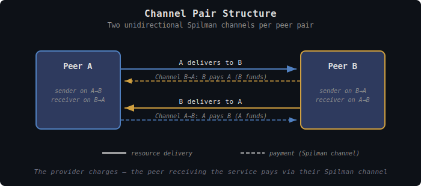
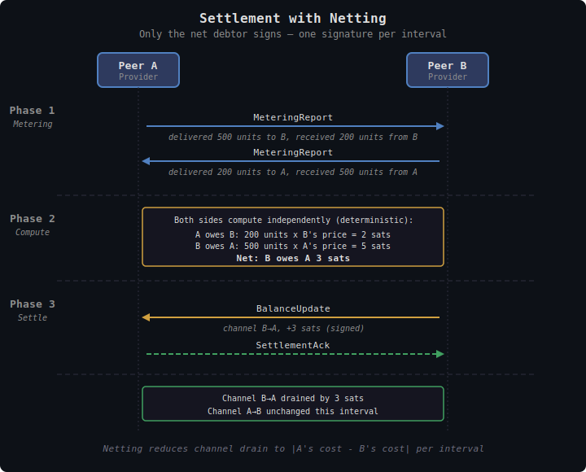
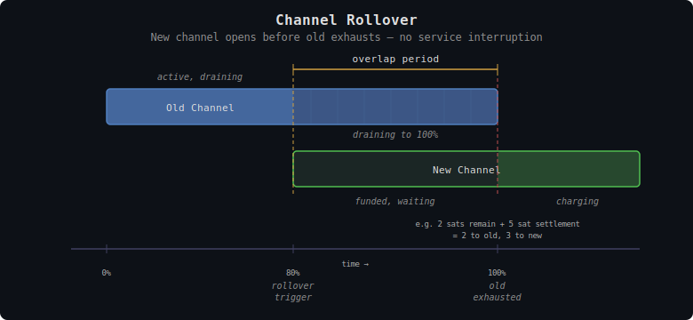

# TollGate Payment Channels

This document specifies how TollGate manages Cashu Spilman payment channels between peers — the channel lifecycle, rollover mechanics, offline resilience, netting, and the Wallet trait.

Bootstrap tokens and pay-only mode are documented separately in [tollgate-bootstrap.md](tollgate-bootstrap.md).

## Overview

Each pair of TollGate peers maintains **two unidirectional Spilman channels** — one per delivery direction. Each channel is funded by the party that owes payment (the peer receiving the delivery service).


<details><summary>Text version</summary>

```
  Peer A                                          Peer B
  ┌──────────┐                              ┌──────────┐
  │ sender   │── A delivers to B ──────────→│ receiver │
  │ on A→B   │╌╌ Channel A→B: A pays B ───→│ on A→B   │
  │          │                              │          │
  │ receiver │←────────── B delivers to A ──│ sender   │
  │ on B→A   │←╌╌ Channel B→A: B pays A ╌╌╌│ on B→A   │
  └──────────┘                              └──────────┘

  ── resource   ╌╌ payment (Spilman channel)
  The provider charges — the peer receiving the service pays.
```
</details>

Spilman channels enable **streaming micropayments**: the sender locks ecash in a 2-of-2 multisig with a time-locked refund path, then signs incremental balance updates as resource is metered. The receiver holds the latest signed update and can settle with the mint at any time.

At each settlement interval, both sides exchange metering reports. The net debtor (whichever side owes more) signs a single balance update on their channel for the net amount. Only one signature per interval, and only the delta moves.

### Settlement with Netting


<details><summary>Text version</summary>

```
  Phase 1 — Metering (cumulative since session start)
    A → B: MeteringReport (cumulative delivered 500, received 200)
    B → A: MeteringReport (cumulative delivered 200, received 500)
    Both compute interval deltas from previous cumulative values.

  Phase 2 — Compute (both sides, deterministic)
    A owes B: units B delivered to A × B's price = 2 sats
    B owes A: units A delivered to B × A's price = 5 sats
    Net: B owes A 3 sats

  Phase 3 — Settle
    B → A: BalanceUpdate (channel B→A, +3 sats, signed)
    A → B: SettlementAck

  Result: Channel B→A drained by 3 sats. Channel A→B unchanged.
```
</details>

---

## Channel Pair Lifecycle

The Spilman channel lifecycle begins after peers have exchanged Announce and PriceSheet messages. Bootstrap (if needed) has already completed — see [tollgate-bootstrap.md](tollgate-bootstrap.md). Both peers can reach a mint.

```
                    ┌─────────────────────────────────────┐
                    │                                     ▼
  Funding ──► Active ──► RollingOver ──► Settling ──► Closed
                │            │                          ▲
                │            └──────────────────────────┘
                │              (old channel settles
                │               while new one is active)
                │
          (zero-price: skip funding, go directly to Active)
```

### Funding

Both peers can reach a mint. They exchange Accept messages containing Spilman funding proofs. Each side creates a channel where they are the sender (funder):
- B creates and funds the B→A channel (B pays for A's delivery to B)
- A creates and funds the A→B channel (A pays for B's delivery to A)

The funding process follows the Cashu Spilman protocol:
1. Sender creates a 2-of-2 multisig token: `P2PK: (Sender AND Receiver) OR (Sender after expiry)`
2. Sender derives the channel secret via ECDH with the receiver's pubkey
3. Sender constructs deterministic blinded outputs using the channel secret
4. Sender sends funding proofs to receiver
5. Receiver verifies: re-derives blinded messages, verifies DLEQ proofs, checks mint/keyset policy
6. Receiver sends ChannelReady

### Active

Both channels are funded and verified. Metering and settlement proceed:
- Every settlement interval, both sides send MeteringReport
- Net debtor sends BalanceUpdate (signed Spilman balance update)
- Net creditor sends SettlementAck

### RollingOver

A channel approaches exhaustion (default: 80% capacity used). The sender (channel funder) initiates rollover:
1. Sender sends RolloverInit with new channel funding
2. Receiver verifies and sends RolloverReady
3. Old channel continues draining to 100%
4. Once exhausted, charges seamlessly continue on the new channel
5. Old channel is settled by the receiver when mint connectivity allows

Both the old (draining) and new channel are active simultaneously during the overlap period.


<details><summary>Text version</summary>

```
  0%              80% (rollover)         100% (exhausted)
  │                    │                      │
  │   Old Channel      │    draining...       │
  │████████████████████│░░░░░░░░░░░░░░░░░░░░░░│
  │                    │                      │
  │                    │   New Channel        │         charging...
  │                    │▒▒▒▒▒▒▒▒▒▒▒▒▒▒▒▒▒▒▒▒▒│████████████████████
  │                    │                      │
  │                    ├──── overlap period ───┤
  │                                           │
  │                    e.g. 2 sats remain + 5 sat settlement
  │                        = 2 to old, 3 to new
  ├──────────────────── time ─────────────────────────────→
```
</details>

### Settling

A channel is being closed — either cooperatively (ChannelClose/CloseAck) or because the channel is fully drained after rollover. Only the **receiver** submits the latest signed balance update to the mint.

Settlement produces two sets of proofs (Stage 1 → Stage 2 in Spilman terminology):
- Receiver's earned balance (receiver can spend)
- Sender's remaining change (sender can reclaim)

### Closed

Settlement complete. Proofs distributed. Channel is done.

### Zero-Price Shortcut

When both sides set all prices to zero, the pair goes directly to Active with no funding, no channels, no metering, and no settlement. Delivery is free.

---

## Channel Ownership

Each Spilman channel is unidirectional. The **sender** (funder) of each channel is responsible for managing that channel's lifecycle — including rollover, capacity decisions, and funding. No leadership election is needed because there is no shared resource to coordinate.

- A→B channel: A is the sender, A manages rollover, A decides when to fund a new channel
- B→A channel: B is the sender, B manages rollover, B decides when to fund a new channel

Each peer independently monitors their own outbound channel and initiates rollover when capacity runs low. Communication is still needed (RolloverInit/RolloverReady messages), but the sender always initiates.

---

## Rollover Mechanics

### When to Rollover

Rollover triggers when a channel reaches the **rollover threshold** — a configurable percentage of channel capacity (default: 80%).

```
Channel capacity: 1000 sats
Rollover threshold: 80% (800 sats spent)

At 800 sats spent: Sender initiates RolloverInit
New channel funded alongside old channel
Old channel continues draining: 801, 802, ... 1000 sats
At 1000 sats: old channel exhausted, charges continue on new channel
```

### Overlap Period

During rollover, **two channels exist simultaneously** for the same direction:
- Old channel: draining to 100%
- New channel: funded and ready, accepting charges once old is exhausted

The balance update at each settlement interval uses whichever channel has remaining capacity. When the old channel has less remaining capacity than the settlement amount, the remainder carries over to the new channel.

**Example:**
- Old channel: 998 of 1000 sats spent (2 remaining)
- Settlement amount this interval: 5 sats
- Result: 2 sats charged to old channel (now exhausted), 3 sats charged to new channel

### Rollover While Offline

If mint connectivity is lost during rollover:
- Balance updates on the old channel continue (they don't need the mint)
- The new channel cannot be funded until mint returns
- If the old channel exhausts before the new one is funded, delivery pauses for that direction. After a configurable timeout (default: 60 seconds), the session is considered stale and closed.
- Once mint returns: new channel is funded, old channel is settled by the receiver

---

## Offline Resilience

### What Needs the Mint

| Operation | Needs mint? | Notes |
|-----------|-------------|-------|
| Balance updates (signing) | No | Signed between peers, no mint involvement |
| Metering reports | No | Local computation |
| Settlement (interval) | No | Just signatures between peers |
| Channel funding (open) | **Yes** | Must create 2-of-2 multisig token |
| Channel settlement (close) | **Yes** | Receiver must submit swap to mint |
| Channel rollover (new) | **Yes** | New channel needs funding |
| Bootstrap token verification | **Yes** | Must check with mint |
| Keyset refresh | **Yes** | Fetch active keysets |

### Offline Scenarios

**Mint goes down during active session:**
- Balance updates continue normally (no mint needed)
- Settlement interval signatures work fine
- If a channel exhausts, rollover is blocked until mint returns
- If channel approaches expiry, urgency increases

**Mint goes down during funding:**
- Funding fails. Retry when mint connectivity returns.

**Mint goes down during settlement/close:**
- Close is queued. Receiver holds the latest signed update.
- When mint returns, submit the swap.
- Keyset errors (12xxx) trigger one retry after refresh.

---

## Channel Expiry

### Choosing TTL

The channel's expiry timestamp (`expiry_timestamp`) must balance two concerns:
- **Too short**: Frequent rollovers, more mint interaction, more overhead
- **Too long**: More capital locked up, longer exposure if peer disappears

Default TTL: **1 hour**. Configurable per product.

### Safety Margin

The sender initiates a **rollover** when a channel enters the safety margin before expiry — creating a new channel and allowing the old one to be settled before the refund timelock activates.

```
safety_margin = max(60 seconds, 2 × settlement_interval)
```

Within the safety margin:
1. Sender initiates rollover (RolloverInit) to create a new channel
2. Old channel is settled by the receiver before expiry
3. If receiver is unresponsive: sender waits for expiry and reclaims via refund path
4. If mint unreachable: receiver retries aggressively until expiry

### Expiry Timeline

```
Channel created:  T₀
Channel expiry:   T₀ + TTL (e.g., 1 hour)
Danger zone:      expiry - safety_margin (e.g., expiry - 60 seconds)
```

1. **Normal**: Well before expiry, channels rollover naturally as they exhaust
2. **Warning**: If a channel enters the danger zone without having been settled, the sender initiates rollover — even if the channel isn't near capacity
3. **Expiry**: If the receiver fails to settle before expiry, the sender reclaims funds via the refund path. The receiver loses any unsettled balance.

---

## Netting

Each settlement interval, both sides owe each other independently:

```
A owes B: B's pricing × (elapsed seconds + units B delivered to A)
B owes A: A's pricing × (elapsed seconds + units A delivered to B)
Net: A_owes - B_owes
```

If the net is positive (A owes more), A signs a BalanceUpdate on the A→B channel for the net amount. If negative, B signs on the B→A channel. If zero, no update needed.

This means:
- Only one channel is used per settlement interval (the debtor's)
- The other channel's balance doesn't change
- Channel drain is slower (only net amounts move)
- Both channels last longer before rollover

### Netting and Channel Drain

Without netting, both channels drain at their full rate. With netting, channels drain at the difference rate:

```
Without netting:
  A→B channel drains at: A's cost to B per interval
  B→A channel drains at: B's cost to A per interval

With netting:
  Only one channel drains per interval
  Drain rate = |A's cost - B's cost| per interval
```

For peers with similar resource flow in both directions, netting dramatically extends channel life.

---

## Channel Capacity

### Initial Capacity

Channel capacity starts **small** because the session may not last long. A new peer connection doesn't warrant a large upfront commitment.

Factors:
- **Estimated usage**: Based on selected product's pricing and expected consumption
- **Expected session duration**: Short for mobile peers, longer for infrastructure
- **Operator configuration**: Minimum and maximum channel capacity settings
- **Available balance**: Can't fund more than the wallet holds

### Capacity Growth

As a peer relationship proves stable (multiple successful rollovers), the node can increase channel capacity for new channels. This reduces rollover frequency and overhead.

```
First channel:    100 sats (minimum viable)
After 1 rollover: 200 sats
After 3 rollovers: 500 sats
After 10 rollovers: 1000 sats (configurable cap)
```

The exact growth curve is operator-configurable.

---

## Wallet Trait

The core library delegates all Cashu operations to a Wallet trait. The implementation provides the wallet.

```rust
#[async_trait]
pub trait Wallet: Send + Sync {
    /// Receive a regular Cashu token (bootstrap), return value in base units
    async fn receive_token(&self, token: &[u8]) -> Result<Amount, WalletError>;

    /// Create a regular Cashu token of given amount (for bootstrap payment)
    async fn create_token(&self, amount: Amount, mint: &str) -> Result<Vec<u8>, WalletError>;

    /// Fund a Spilman channel: create 2-of-2 multisig token with NUT-11 conditions
    async fn fund_channel(&self, params: &ChannelFundParams) -> Result<FundingProof, WalletError>;

    /// Verify Spilman funding proofs from a peer (DLEQ, deterministic outputs, policy)
    async fn verify_funding(&self, proofs: &FundingProof, params: &ChannelFundParams) -> Result<(), WalletError>;

    /// Sign a Spilman balance update (sender side)
    async fn sign_balance_update(
        &self,
        channel_id: &ChannelId,
        new_balance: Amount,
    ) -> Result<BalanceSignature, WalletError>;

    /// Verify a Spilman balance update signature (receiver side)
    async fn verify_balance_update(
        &self,
        channel_id: &ChannelId,
        balance: Amount,
        signature: &BalanceSignature,
    ) -> Result<(), WalletError>;

    /// Settle a channel: receiver submits swap to mint, returns proofs
    async fn settle_channel(&self, channel_id: &ChannelId) -> Result<SettlementResult, WalletError>;

    /// Check if mint is reachable
    async fn mint_reachable(&self, mint: &str) -> bool;

    /// Get available balance for a specific mint
    async fn balance(&self, mint: &str) -> Result<Amount, WalletError>;

    /// Compute channel secret via ECDH (host owns the private key)
    async fn compute_channel_secret(
        &self,
        peer_pubkey: &[u8; 33],
    ) -> Result<ChannelSecret, WalletError>;
}
```

### ChannelFundParams

```rust
pub struct ChannelFundParams {
    pub mint_url: String,
    pub mint_unit: String,
    pub capacity: Amount,
    pub sender_pubkey: [u8; 33],
    pub receiver_pubkey: [u8; 33],
    pub expiry_timestamp: u64,
    pub channel_secret: ChannelSecret,
}
```

### Key Operations by State

| State | Wallet operations used |
|-------|----------------------|
| Funding | `fund_channel`, `verify_funding`, `compute_channel_secret` |
| Active | `sign_balance_update`, `verify_balance_update` |
| Rollover | `fund_channel`, `verify_funding` (new channel), `settle_channel` (old channel) |
| Settling | `settle_channel` |
| Offline | `sign_balance_update`, `verify_balance_update` (no mint needed) |

---

## Error Handling

### Funding Failure

If channel funding fails (mint unreachable, insufficient balance, keyset error):
- Retry on next mint connectivity check

### Settlement Failure

If settlement fails (mint swap rejected):
- Check NUT-00 error code
- Keyset errors (12xxx): refresh keysets, retry once
- Proof errors (10xxx, 11xxx): fail permanently — channel state is corrupted
- Queue for retry if mint is unreachable

### Balance Verification Failure

If a received BalanceUpdate fails signature verification:
- Send Reject (reason: balance verification failed)
- Do NOT close the channel — this could be a transient error
- Log the failure for operator review
- If repeated failures: close the channel

### Transit Loss Tolerance Exceeded

If metering reports diverge beyond the agreed tolerance (default 5%):

**Resolution rule: use the higher value.** When the two sides disagree on units delivered, the higher measurement is accepted as the billable amount. Rationale: the provider (who measured higher) claims they did more work. The receiver may not have seen everything — but the provider still expended resources delivering. Using the higher value is conservative (favors the provider) and deterministic (both sides know the rule).

If transit loss is within tolerance:
- Use the higher value for billing
- Both sides note the discrepancy for their counters

If transit loss exceeds tolerance:
- Still use the higher value for this interval
- Send a warning (Reject with reason: transit loss tolerance exceeded)
- Both sides recalibrate
- If persistent (e.g., 3 consecutive intervals over tolerance): close and renegotiate — something is wrong with the link or metering

---

## Design Decisions

| Decision | Resolution | Rationale |
|----------|-----------|-----------|
| Channels per peer pair | Two unidirectional (one per direction) | Matches Spilman's unidirectional model; enables netting |
| Channel ownership | Sender manages own channel lifecycle | No leadership needed; unidirectional channels are independent |
| Rollover threshold | 80% capacity (configurable, default 20% overlap) | New channel ready before old exhausts |
| Rollover drain | Old channel drains to 100%, then new channel continues | No wasted capacity |
| Stale session timeout | 60 seconds (configurable) | Close if rollover can't complete |
| Netting | Only net debtor signs per interval | Fewer signatures, slower channel drain |
| Transit loss resolution | Use the higher value | Favors provider (did the work), deterministic |
| Channel capacity | Start small, grow with relationship | Don't over-commit to new peers |
| Channel TTL | 1 hour default, configurable | Balance between overhead and capital lockup |
| Safety margin | max(60s, 2×interval) before expiry — triggers rollover | Create new channel, settle old before expiry |
| Settlement | Only receiver submits to mint | Receiver holds the signed proof |
| Offline operation | Balance updates continue; funding/settlement queued | Mint only needed for channel lifecycle transitions |
