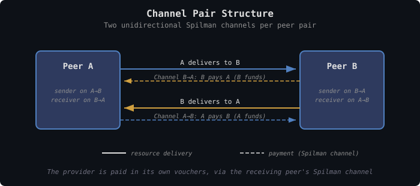
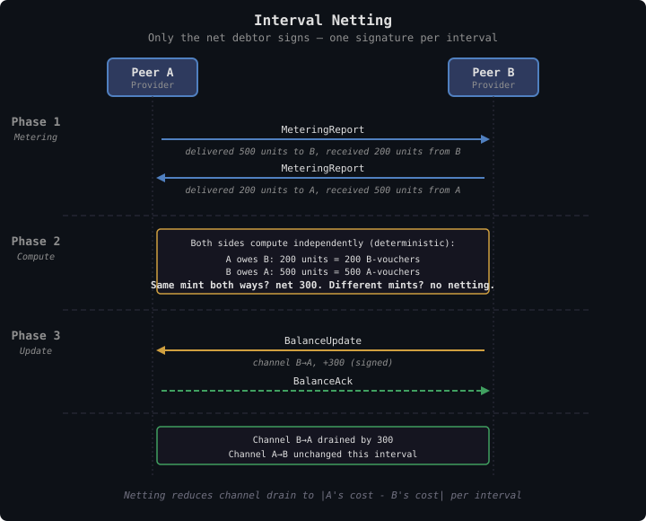
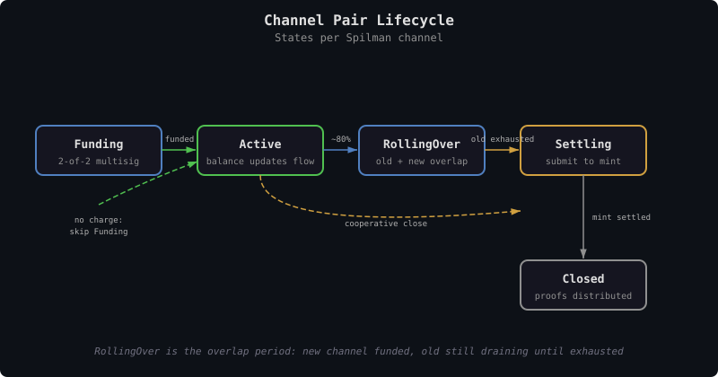
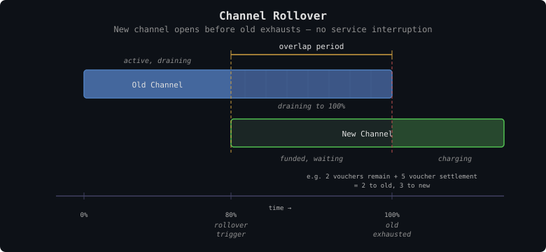

# TollGate Payment Channels

This document specifies how TollGate manages Cashu Spilman payment channels between peers — the channel lifecycle, rollover mechanics, offline resilience, netting, and the Wallet trait.

What peers pay each other with is documented in [tollgate-vouchers.md](tollgate-vouchers.md). Under vouchers, channels exist to keep the issuer's spent-proof set bounded rather than to prevent theft.

## Overview

Each pair of TollGate peers maintains **two unidirectional Spilman channels** — one per delivery direction. Each channel is funded by the party that owes payment (the peer receiving the delivery service).


<details><summary>Text version</summary>

```
  Peer A                                          Peer B
  ┌──────────┐                              ┌──────────┐
  │ sender   │── A delivers to B ──────────→│ receiver │
  │ on A→B   │╌╌ Channel A→B: A pays B ───→│ on A→B   │
  │          │                              │          │
  │ receiver │←────────── B delivers to A ──│ sender   │
  │ on B→A   │←╌╌ Channel B→A: B pays A ╌╌╌│ on B→A   │
  └──────────┘                              └──────────┘

  ── resource   ╌╌ payment (Spilman channel)
  The provider is paid in its own vouchers by whoever received the service.
```
</details>

Spilman channels enable **streaming micropayments**: the sender locks ecash in a 2-of-2 multisig with a time-locked refund path, then signs incremental balance updates as resource is metered. The receiver holds the latest signed update and can settle with the mint at any time.

At each metering interval, both sides exchange metering reports and then sign balance updates. Whether that is one signature or two depends on whether both directions settle in the same mint — see [Netting](#netting).

### Interval Netting


<details><summary>Text version</summary>

```
  Phase 1 — Metering (cumulative since session start)
    A → B: MeteringReport (cumulative delivered 500, received 200)
    B → A: MeteringReport (cumulative delivered 200, received 500)
    Both compute interval deltas from previous cumulative values.

  Phase 2 — Compute (both sides, deterministic)
    A owes B: 200 units B delivered to A  = 200 B-vouchers
    B owes A: 500 units A delivered to B  = 500 A-vouchers
    (one voucher per unit — nothing to multiply)

  Phase 3 — Settle, different mints (the usual case)
    A → B: BalanceUpdate (channel A→B, +200 B-vouchers, signed)
    B → A: BalanceUpdate (channel B→A, +500 A-vouchers, signed)
    each acks the other
    Result: both channels drain. Nothing to net — the two amounts
            are claims on different issuers.

  Phase 3' — Settle, shared mint M
    net: B owes A 300 M
    B → A: BalanceUpdate (channel B→A, +300 M, signed)
    A → B: BalanceAck
    Result: only B→A drains, at the difference rate.
```
</details>

---

## Channel Pair Lifecycle

The Spilman channel lifecycle begins after peers have exchanged Announce and Offer messages. Each channel is funded against the counterparty's own mint, which is reachable over the peering link by definition.


<details><summary>Text version</summary>

```
                    ┌─────────────────────────────────────┐
                    │                                     ▼
  Funding ──► Active ──► RollingOver ──► Settling ──► Closed
                │            │                          ▲
                │            └──────────────────────────┘
                │              (old channel settles
                │               while new one is active)
                │
          (no charge: skip funding, go directly to Active)
```
</details>

### Funding

Both peers can reach a mint. They exchange Accept messages containing Spilman funding proofs. Each side creates a channel where they are the sender (funder):
- B creates and funds the B→A channel (B pays for A's delivery to B)
- A creates and funds the A→B channel (A pays for B's delivery to A)

The funding process follows the Cashu Spilman protocol:
1. Sender creates a 2-of-2 multisig token: `P2PK: (Sender AND Receiver) OR (Sender after expiry)`
2. Sender derives the channel secret via ECDH with the receiver's pubkey
3. Sender constructs deterministic blinded outputs using the channel secret
4. Sender sends funding proofs to receiver
5. Receiver verifies: re-derives blinded messages, verifies DLEQ proofs, checks mint/keyset policy
6. Receiver sends ChannelReady

### Active

Both channels are funded and verified. Metering and balance updates proceed:
- Every metering interval, both sides send MeteringReport
- Different mints: each side sends a BalanceUpdate on its own channel
- Shared mint: the net debtor sends one BalanceUpdate, the creditor acks

### RollingOver

A channel approaches exhaustion (default: 80% capacity used). The sender (channel funder) initiates rollover:
1. Sender sends RolloverInit with new channel funding
2. Receiver verifies and sends RolloverReady
3. Old channel continues draining to 100%
4. Once exhausted, charges seamlessly continue on the new channel
5. Old channel is settled by the receiver when mint connectivity allows

Both the old (draining) and new channel are active simultaneously during the overlap period.


<details><summary>Text version</summary>

```
  0%              80% (rollover)         100% (exhausted)
  │                    │                      │
  │   Old Channel      │    draining...       │
  │████████████████████│░░░░░░░░░░░░░░░░░░░░░░│
  │                    │                      │
  │                    │   New Channel        │         charging...
  │                    │▒▒▒▒▒▒▒▒▒▒▒▒▒▒▒▒▒▒▒▒▒│████████████████████
  │                    │                      │
  │                    ├──── overlap period ───┤
  │                                           │
  │                    e.g. 2 vouchers remain + 5 voucher interval cost
  │                        = 2 to old, 3 to new
  ├──────────────────── time ─────────────────────────────→
```
</details>

### Settling

A channel is being closed — either cooperatively (ChannelClose/CloseAck) or because the channel is fully drained after rollover. Only the **receiver** submits the latest signed balance update to the mint.

Settlement produces two sets of proofs (Stage 1 → Stage 2 in Spilman terminology):
- Receiver's earned balance (receiver can spend)
- Sender's remaining change (sender can reclaim)

### Closed

Settlement complete. Proofs distributed. Channel is done.

### Free Peering Shortcut

When a node decides not to charge a peer, it funds no channel toward that peer and meters nothing for it. If **both** sides decide that, the pair goes directly to Active with no funding, no channels, no metering, and no balance updates.

This is a decision about a relationship, not a price — there is no delivery price to set to zero. It is also one-sided: a node chooses only whether it charges, so a peering can legitimately run with one channel.

---

## What the Metering Interval Is For

The interval is **not** a price renegotiation point. Delivery costs one
voucher per unit and the peer already holds the vouchers, so their claim is
fixed ([tollgate-vouchers.md](tollgate-vouchers.md)) — there is nothing to
renegotiate.

It exists for four other reasons:

- **Batching.** One signature per interval instead of one per unit. This is
  the whole point of a Spilman channel.
- **Bounding the provider's exposure.** A peer that vanishes mid-interval
  leaves at most one interval of delivered-but-unpaid resource. Shorter
  interval, smaller loss.
- **Reconciliation.** Both sides exchange counters and compare, which is how
  transit loss is detected at all ([tollgate-metering.md](tollgate-metering.md)).
- **Rate control.** What a peer pays in one interval sets its allowance for
  the next, which is the rate auction
  ([tollgate-vouchers.md](tollgate-vouchers.md)).

The two exposures are bounded by different knobs, and it is worth keeping them
apart:

| Risk | Bounded by |
|---|---|
| Provider delivers and is not paid | The metering interval |
| Peer funds a channel and the issuer refuses to honor the refund | Channel capacity |

The second is the trust cost of the issuer being the mint
([issuer-risk.md](../market/issuer-risk.md)). Shortening the interval does not
help it; funding smaller channels does.

---

## Channel Ownership

Each Spilman channel is unidirectional. The **sender** (funder) of each channel is responsible for managing that channel's lifecycle — including rollover, capacity decisions, and funding. Channels do carry shared state (cumulative balance, signatures between sender and receiver), but rollover is initiated by the funder alone because only the funder puts up new funds.

- A→B channel: A is the sender, A manages rollover, A decides when to fund a new channel
- B→A channel: B is the sender, B manages rollover, B decides when to fund a new channel

Each peer independently monitors their own outbound channel and initiates rollover when capacity runs low. Communication is still needed (RolloverInit/RolloverReady messages), but the sender always initiates.

---

## Rollover Mechanics

### When to Rollover

Rollover triggers when a channel reaches the **rollover threshold** — a configurable percentage of channel capacity (default: 80%).

```
Channel capacity: 1000 vouchers
Rollover threshold: 80% (800 spent)

At 800 spent: Sender initiates RolloverInit
New channel funded alongside old channel
Old channel continues draining: 801, 802, ... 1000
At 1000: old channel exhausted, charges continue on new channel
```

### Overlap Period

During rollover, **two channels exist simultaneously** for the same direction:
- Old channel: draining to 100%
- New channel: funded and ready, accepting charges once old is exhausted

The balance update at each metering interval uses whichever channel has remaining capacity. When the old channel has less remaining capacity than the interval cost, the remainder carries over to the new channel.

**Example:**
- Old channel: 998 of 1000 vouchers spent (2 remaining)
- Interval cost: 5 vouchers
- Result: 2 charged to old channel (now exhausted), 3 charged to new channel

### Rollover While Offline

If mint connectivity is lost during rollover:
- Balance updates on the old channel continue (they don't need the mint)
- The new channel cannot be funded until mint returns
- If the old channel exhausts before the new one is funded, delivery pauses for that direction. After a configurable timeout (default: 60 seconds), the session is considered stale and closed.
- Once mint returns: new channel is funded, old channel is settled by the receiver

---

## Offline Resilience

### What Needs the Mint

| Operation | Needs mint? | Notes |
|-----------|-------------|-------|
| Balance updates (signing) | No | Signed between peers, no mint involvement |
| Metering reports | No | Local computation |
| Balance updates (interval) | No | Just signatures between peers |
| Channel funding (open) | **Yes** | Must create 2-of-2 multisig token |
| Channel settlement (close) | **Yes** | Receiver must submit swap to mint |
| Channel rollover (new) | **Yes** | New channel needs funding |
| Keyset refresh | **Yes** | Fetch active keysets |

### Offline Scenarios

**Mint goes down during active session:**
- Balance updates continue normally (no mint needed)
- Metering interval signatures work fine
- If a channel exhausts, rollover is blocked until mint returns
- If channel approaches expiry, urgency increases

**Mint goes down during funding:**
- Funding fails. Retry when mint connectivity returns.

**Mint goes down during settlement/close:**
- Close is queued. Receiver holds the latest signed update.
- When mint returns, submit the swap.
- Keyset errors (12xxx) trigger one retry after refresh.

---

## Reboot / State Loss

Nodes are not expected to persist runtime state between restarts. On reboot, a node loses metering counters, channel tracking, and any signed BalanceUpdates it was holding. The identity key survives (it's in the config file), so the rebooted node has the same pubkey and can be recognized by peers.

The remaining peer (still online) is the only party that holds the latest channel state. Two scenarios apply:

### Friendly recovery

The online peer recognizes the reconnecting pubkey and shares back the channel state for both directions: channel IDs, cumulative balances, and signatures. The rebooted peer validates every signature before trusting any of it. If validation succeeds, both channels resume — the rebooted peer knows how much of its outgoing channel is spent, and holds the latest signed BalanceUpdate for its incoming channel.

This requires a protocol message (proposed `ChannelSync`) that the online peer sends after Announce when it detects a reconnecting pubkey with live channels. Not yet specified in [tollgate-protocol.md](tollgate-protocol.md) — **future work**.

### Unfriendly outcome

The online peer stays silent about the old channels. The rebooted peer falls back to a fresh session with new channels.

- **Outgoing channel** (rebooted peer was sender): the online peer holds the rebooted peer's last signed BalanceUpdate and can settle with the mint. The rebooted peer reclaims any remainder via Spilman's refund timelock after expiry. No loss beyond what was legitimately owed.
- **Incoming channel** (rebooted peer was receiver): the rebooted peer lost the only proof of earnings. The online peer waits for expiry and reclaims the full channel via the refund path. **The rebooted peer loses all earned income on that channel.**

Exposure is bounded by channel capacity (the "start small, grow with relationship" model limits new-peer exposure), time since last mint settlement, and the channel TTL (1 hour default). Worst case: one channel's worth of earned income.

---

## Channel Expiry

### Choosing TTL

The channel's expiry timestamp (`expiry_timestamp`) must balance two concerns:
- **Too short**: Frequent rollovers, more mint interaction, more overhead
- **Too long**: More capital locked up, longer exposure if peer disappears

Default TTL: **1 hour**. Configurable per product.

### Safety Margin

The sender initiates a **rollover** when a channel enters the safety margin before expiry — creating a new channel and allowing the old one to be settled before the refund timelock activates.

```
safety_margin = max(60 seconds, 2 × metering_interval)
```

Within the safety margin:
1. Sender initiates rollover (RolloverInit) to create a new channel
2. Old channel is settled by the receiver before expiry
3. If receiver is unresponsive: sender waits for expiry and reclaims via refund path
4. If mint unreachable: receiver retries aggressively until expiry

### Expiry Timeline

```
Channel created:  T₀
Channel expiry:   T₀ + TTL (e.g., 1 hour)
Danger zone:      expiry - safety_margin (e.g., expiry - 60 seconds)
```

1. **Normal**: Well before expiry, channels rollover naturally as they exhaust
2. **Warning**: If a channel enters the danger zone without having been settled, the sender initiates rollover — even if the channel isn't near capacity
3. **Expiry**: If the receiver fails to settle before expiry, the sender reclaims funds via the refund path. The receiver loses any unsettled balance.

---

## Netting

Each metering interval, both sides owe each other independently:

```
A owes B: units B delivered to A   (one voucher per unit)
B owes A: units A delivered to B
```

**Whether these can be netted depends on whether they are denominated in the
same mint.** They usually are not.

A pays B in a mint from B's accepted set; B pays A in a mint from A's
([tollgate-vouchers.md](tollgate-vouchers.md)). Those are claims on different
issuers. 500 A-vouchers and 200 B-vouchers are not commensurable — one claims
A's capacity, the other claims B's — so there is no difference to take, and
subtracting them would silently assume the two issuers are worth the same.

### Two Cases

**Different mints — no netting.** Both channels drain at their full rate and
both sides sign a BalanceUpdate each interval.

```
  A → B: BalanceUpdate on A→B channel   (200 B-vouchers)
  B → A: BalanceUpdate on B→A channel   (500 A-vouchers)
  each acks the other
```

**A mint both sides accept — netting applies.** If some mint `M` appears in
both accepted sets and both directions settle in `M`-vouchers, the amounts are
commensurable and only the difference moves.

```
  A owes B 200 M,  B owes A 500 M   →   net: B owes A 300 M
  B → A: BalanceUpdate on B→A channel (+300 M, signed)
  A → B: BalanceAck
```

Both peers know both accepted sets from the Offer exchange, so which case
applies is decided deterministically with no extra round-trip.

### What Netting Is Worth

| | Different mints | Shared mint |
|---|---|---|
| Signatures per interval | 2 | 1 |
| Channels draining | Both, at full rate | One, at the difference rate |
| Rollover frequency | Higher | Lower |
| Spent-proof records | More — each rollover adds a set | Fewer |

For peers with similar flow in both directions the shared-mint case
dramatically extends channel life. Losing it costs signatures, rollovers,
and — because each rollover writes a spent-proof set — some of the state
compression channels exist to provide.

**This is an incentive toward a common mint**, on top of the liquidity one in
[voucher-price-signal.md](../market/voucher-price-signal.md). Two relays that
both accept a shared hub mint get cheaper settlement than two that only accept
their own. Nothing enforces convergence; it is simply cheaper.

A peering has both channels wherever both sides charge, so most peerings have
something to net or not net. Relays are the ones most likely to
share a mint, since a relay accepting its upstream's mint is the common case —
which is also where netting is worth the most, because flow in both directions
is comparable.

---

## Channel Capacity

### Initial Capacity

Channel capacity starts **small** because the session may not last long. A new peer connection doesn't warrant a large upfront commitment.

Factors:
- **Estimated usage**: Based on selected product's pricing and expected consumption
- **Expected session duration**: Short for mobile peers, longer for infrastructure
- **Operator configuration**: Minimum and maximum channel capacity settings
- **Available balance**: Can't fund more than the wallet holds

### Capacity Growth

As a peer relationship proves stable (multiple successful rollovers), the node can increase channel capacity for new channels. This reduces rollover frequency and overhead.

```
First channel:    100 vouchers (minimum viable)
After 1 rollover: 200
After 3 rollovers: 500
After 10 rollovers: 1000 (configurable cap)
```

The exact growth curve is operator-configurable.

### Capacity Growth Does Not Apply to Subsidy Channels

Capacity growth is a reward for a stable *revenue* relationship: a peer that
keeps paying and rolling over is worth committing more capacity to. On a
channel funded because the price is **negative** — the node is paying the
peer — the same rule rewards whichever peer drains the node fastest.

A negatively-priced channel with automatic growth and automatic rollover is
an unattended drain on the wallet. The peer sends traffic, the channel drains, rollover
refunds it, and capacity grows on each cycle until it reaches
`max_capacity` — after which the node keeps refilling at that size for as
long as the peer keeps sending. Nothing in the channel layer bounds the
total.

Therefore, when a channel is funded because the node owes the peer:

- `capacity_growth_factor` is **not** applied; capacity stays flat
- rollover is refused once the peer's subsidy budget for the current window
  is exhausted (see `subsidy` in
  [tollgate-configuration.md](tollgate-configuration.md))
- refusal closes the session for that direction rather than pausing it — a
  paused subsidy channel is indistinguishable from a stalled one

Budgets are enforced per peer and in aggregate. A per-peer budget alone is
defeated by creating more peers.

---

## Wallet Trait

The core library delegates all Cashu operations to a Wallet trait. The implementation provides the wallet.

```rust
#[async_trait]
pub trait Wallet: Send + Sync {
    /// Receive a voucher token, return value in the keyset's unit
    async fn receive_token(&self, token: &[u8]) -> Result<Amount, WalletError>;

    /// Create a voucher token of given amount
    async fn create_token(&self, amount: Amount, mint: &str) -> Result<Vec<u8>, WalletError>;

    /// Fund a Spilman channel: create 2-of-2 multisig token with NUT-11 conditions
    async fn fund_channel(&self, params: &ChannelFundParams) -> Result<FundingProof, WalletError>;

    /// Verify Spilman funding proofs from a peer (DLEQ, deterministic outputs, policy)
    async fn verify_funding(&self, proofs: &FundingProof, params: &ChannelFundParams) -> Result<(), WalletError>;

    /// Sign a Spilman balance update (sender side)
    async fn sign_balance_update(
        &self,
        channel_id: &ChannelId,
        new_balance: Amount,
    ) -> Result<BalanceSignature, WalletError>;

    /// Verify a Spilman balance update signature (receiver side)
    async fn verify_balance_update(
        &self,
        channel_id: &ChannelId,
        balance: Amount,
        signature: &BalanceSignature,
    ) -> Result<(), WalletError>;

    /// Settle a channel: receiver submits swap to mint, returns proofs
    async fn settle_channel(&self, channel_id: &ChannelId) -> Result<SettlementResult, WalletError>;

    /// Check if mint is reachable
    async fn mint_reachable(&self, mint: &str) -> bool;

    /// Get available balance for a specific mint
    async fn balance(&self, mint: &str) -> Result<Amount, WalletError>;

    /// Compute channel secret via ECDH (host owns the private key)
    async fn compute_channel_secret(
        &self,
        peer_pubkey: &[u8; 33],
    ) -> Result<ChannelSecret, WalletError>;
}
```

### ChannelFundParams

```rust
pub struct ChannelFundParams {
    pub mint_url: String,
    pub mint_unit: String,
    pub capacity: Amount,
    pub sender_pubkey: [u8; 33],
    pub receiver_pubkey: [u8; 33],
    pub expiry_timestamp: u64,
    pub channel_secret: ChannelSecret,
}
```

### Key Operations by State

| State | Wallet operations used |
|-------|----------------------|
| Funding | `fund_channel`, `verify_funding`, `compute_channel_secret` |
| Active | `sign_balance_update`, `verify_balance_update` |
| Rollover | `fund_channel`, `verify_funding` (new channel), `settle_channel` (old channel) |
| Settling | `settle_channel` |
| Offline | `sign_balance_update`, `verify_balance_update` (no mint needed) |

---

## Error Handling

### Funding Failure

If channel funding fails (mint unreachable, insufficient balance, keyset error):
- Retry on next mint connectivity check

### Settlement Failure

If settlement fails (mint swap rejected):
- Check NUT-00 error code
- Keyset errors (12xxx): refresh keysets, retry once
- Proof errors (10xxx, 11xxx): fail permanently — channel state is corrupted
- Queue for retry if mint is unreachable

### Balance Verification Failure

If a received BalanceUpdate fails signature verification:
- Send Reject (reason: balance verification failed)
- Do NOT close the channel — this could be a transient error
- Log the failure for operator review
- If repeated failures: close the channel

### Transit Loss Tolerance Exceeded

When metering reports diverge beyond the agreed tolerance, the channel layer's role is to act on the warning: if persistent (3+ consecutive intervals over tolerance) the channel is closed and renegotiated. The resolution rule itself (deliverer-favoring value, tolerances, billing per interval) is documented in [tollgate-metering.md](tollgate-metering.md).

---

## Design Decisions

| Decision | Resolution | Rationale |
|----------|-----------|-----------|
| Channels per peer pair | Two unidirectional (one per direction) | Matches Spilman's unidirectional model; enables netting |
| Channel ownership | Sender manages own channel lifecycle | Rollover initiated by the funder alone — only the party putting up new funds decides when |
| Rollover threshold | 80% capacity (configurable, default 20% overlap) | New channel ready before old exhausts |
| Rollover drain | Old channel drains to 100%, then new channel continues | No wasted capacity |
| Stale session timeout | 60 seconds (configurable) | Close if rollover can't complete |
| Netting | Only where both directions settle in the same mint | Vouchers from different issuers are not commensurable, so there is no difference to take. Shared-mint peers get one signature and difference-rate drain; others get two signatures and full-rate drain |
| Metering interval | Kept, for batching, exposure bounding, reconciliation and rate control | It is no longer a price renegotiation point — there is no delivery price to renegotiate |
| Transit loss resolution | Use the deliverer-favoring value | Favors the party that did the work; a flat "higher value" rule inverts under negative prices |
| Channel capacity | Start small, grow with relationship | Don't over-commit to new peers |
| Capacity growth on subsidy channels | Disabled — capacity stays flat, rollover bounded by subsidy budget | Growth rewards a stable revenue relationship; on an outbound subsidy it rewards the fastest drain |
| Channel TTL | 1 hour default, configurable | Balance between overhead and capital lockup |
| Safety margin | max(60s, 2×interval) before expiry — triggers rollover | Create new channel, settle old before expiry |
| Settlement | Only receiver submits to mint | Receiver holds the signed proof |
| Offline operation | Balance updates continue; funding/settlement queued | Mint only needed for channel lifecycle transitions |
