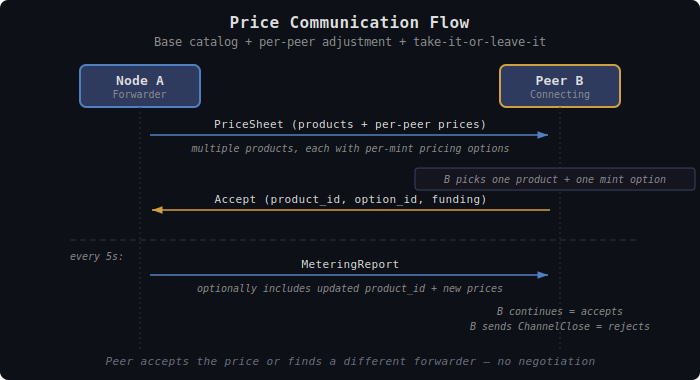

# TollGate Pricing

This document specifies how TollGate peers communicate, negotiate, and dynamically adjust prices for forwarding services.

## Overview

Each TollGate peer charges its own rate for forwarding packets to other peers. Every forwarding relationship is independently priced — there is no global price. Prices are always mint-specific, can be positive, zero, or negative, and can change dynamically based on network conditions, demand, or operator policy.

Pricing has two dimensions, both always present:
- **Time** — price per second of being an active forwarding peer
- **Bytes** — price per byte forwarded

The operator sets either dimension to zero for simpler models. The cost for each settlement interval is:

```
cost_scaled = (elapsed_seconds × price_per_second) + (bytes_forwarded × price_per_byte)
cost = ceil(cost_scaled / pricing_scale)
```

---

## Pricing Scale

Prices can be very small — forwarding a single byte might cost a fraction of a sat. To handle sub-unit precision without floating-point arithmetic, all prices are stored as integers with a shared **pricing scale** divisor.

```
actual_price = integer_price / pricing_scale
```

With `pricing_scale = 1000`:

| Field | Integer value | Actual price |
|-------|--------------|--------------|
| `price_per_byte = 10` | 10 | 0.01 sat/byte |
| `price_per_byte = 1` | 1 | 0.001 sat/byte |
| `price_per_second = 500` | 500 | 0.5 sat/second |
| `price_per_second = 1000` | 1000 | 1.0 sat/second |

The accumulated cost is computed entirely with integer arithmetic:

```
cost_scaled = (seconds × price_per_second) + (bytes × price_per_byte)
cost = ceil(cost_scaled / pricing_scale)
```

The `pricing_scale` is part of the product definition and included in the product ID hash. Both peers always agree on the scale. Default: **1000** (milli-unit precision).

---

## Products

A product defines the structural terms of a forwarding service. Each peer subscribes to **exactly one product** at a time. To switch, the peer renegotiates.

### Product Structure

```rust
struct Product {
    id: ProductId,                     // SHA256(bandwidth_limit | pricing_scale | pricing)
    bandwidth_limit: u64,              // bytes/sec, 0 = unlimited
    pricing_scale: u64,                // divisor for sub-unit precision (default: 1000)
    pricing: Vec<MintPricing>,         // per-mint pricing
}

struct MintPricing {
    mint_url: String,
    price_per_second: i64,             // scaled integer, signed (negative = node pays peer)
    price_per_byte: i64,               // scaled integer, signed
    unit: String,                      // "sat", "msat", "usd"
}
```

### Product Identity

```
product_id = SHA256(bandwidth_limit | pricing_scale | pricing)
```

The product ID includes **all** fields — structure and prices. Any change (bandwidth, scale, or price) produces a new ID. The peer compares IDs to instantly detect whether renegotiation is needed. This is cheap (one hash comparison) and unambiguous — no need to diff individual fields.

### Examples

**Internet gateway (pure usage-based):**
```yaml
id: "a1b2c3..."
bandwidth_limit: 0                             # unlimited
pricing_scale: 1000
pricing:
  - mint: "https://mint.example.com"
    price_per_second: 0                        # no time charge
    price_per_byte: 10                         # 0.01 sat per byte
    unit: "sat"
```

**Always-on presence (flat rate, capped bandwidth):**
```yaml
id: "d4e5f6..."
bandwidth_limit: 10000                         # 10 KB/s cap
pricing_scale: 1000
pricing:
  - mint: "https://mint.example.com"
    price_per_second: 100                      # 0.1 sat per second
    price_per_byte: 0                          # no usage charge
    unit: "sat"
```

**Premium tier (base + usage):**
```yaml
id: "e5f6g7..."
bandwidth_limit: 0                             # unlimited
pricing_scale: 1000
pricing:
  - mint: "https://mint.example.com"
    price_per_second: 50                       # 0.05 sat/sec base
    price_per_byte: 5                          # 0.005 sat/byte on top
    unit: "sat"
```

**Negative pricing (attract traffic):**
```yaml
id: "g7h8i9..."
bandwidth_limit: 0
pricing_scale: 1000
pricing:
  - mint: "https://mint.example.com"
    price_per_second: 0
    price_per_byte: -2                         # node PAYS peer 0.002 sat/byte
    unit: "sat"
```

**Multi-mint with currency discount:**
```yaml
id: "j1k2l3..."
bandwidth_limit: 0
pricing_scale: 1000
pricing:
  - mint: "https://mint.example.com"
    price_per_second: 0
    price_per_byte: 10                         # 0.01 sat/byte
    unit: "sat"
  - mint: "https://mint.eu"
    price_per_second: 0
    price_per_byte: 8                          # 0.008 sat/byte — discount for preferred mint
    unit: "sat"
```

---

## Price Communication



### Base Catalog

Each node publishes a **base catalog** of its products with base prices. This is the default offering visible to all peers before any per-peer adjustment.

### Per-Peer Price Sheet

When a peer connects, the node sends a **peer-specific price sheet** derived from the base catalog. The price sheet may adjust prices up or down based on:
- Link quality metrics (ETX, loss rate, latency)
- Operator-configured peer overrides
- Dynamic pricing strategy
- Current load/congestion

The adjustment can be the identity function (no change) for simple deployments — the peer-specific sheet simply echoes the base catalog.

### Price Flow

```
1. Node A publishes base catalog (products + base prices)
2. Peer B connects
3. Node A sends B a peer-specific price sheet
4. B accepts (opens Spilman channel) or disconnects
5. At each settlement interval, A may send updated prices
6. B sees new price and must accept before next interval, or channel closes
```

---

## Price Negotiation

**Take-it-or-leave-it.** The forwarder sets the price. The peer accepts or finds a different peer. The mesh provides alternatives — if a node's prices are too high, traffic routes around it.

```
A → B: "Price sheet: [product, prices per mint]"
B: accepts (opens channel) or disconnects
```

**One message. Zero negotiation.**

The only negotiable parameter is the **settlement interval**, because it affects both sides. Both peers send their acceptable range. The actual interval is the **average of the overlapping portion**:

```
A's range: [3s, 10s]
B's range: [5s, 30s]
Overlap:   [5s, 10s]
Interval:  (5 + 10) / 2 = 7.5s
```

If the ranges don't overlap, negotiation fails. This is deterministic — both sides compute the same result, no extra round-trip.

### Price Changes

Prices can change at each settlement interval. The forwarder includes updated prices in the settlement message. The peer must:
- **Accept** — continue with new prices at the next interval
- **Reject** — close the channel (can renegotiate or disconnect)

There is no grace period. The new price takes effect at the next interval. Each settlement is also a renegotiation opportunity — the peer always has the option to walk away.

---

## Dynamic Pricing

### Inputs

The pricing function maps available inputs to per-peer prices:

```
price(peer, product) → (price_per_second, price_per_byte)
```

Available inputs:

**Peer metrics** (from FIPS MMP or NetworkAdapter):
| Metric | Type | Pricing relevance |
|--------|------|-------------------|
| `srtt_ms` | f64 | Higher latency = more buffering cost |
| `loss_rate` | f64 | Higher loss = wasted forwarding effort |
| `etx` | f64 | Direct measure of retransmission cost |
| `goodput_bps` | f64 | Capacity utilization indicator |
| `jitter` | u32 | Service quality indicator |
| Trend (rising/falling/stable) | enum | Predict near-future conditions |

**Node state:**
- Number of active paying peers (load)
- Total forwarding throughput (capacity utilization)
- Available channel balance (liquidity)

**Operator config:**
- Base price per product
- Floor and ceiling prices
- Time-of-day schedules
- Per-peer overrides (by npub)

### Strategies

**Fixed:**
```
price = base_price
```

**Cost-plus** (mirrors FIPS link cost formula):
```
price = base_price × etx × (1 + srtt_ms / 100)
```

**Demand-based:**
```
price = base_price × (1 + active_peers / max_peers)
```

**Quality-tiered:**
```
if loss_rate < 0.01 and srtt_ms < 10:
    price = premium_price
elif loss_rate < 0.05 and srtt_ms < 50:
    price = standard_price
else:
    price = discount_price
```

**Operator-scripted:**
Custom function (config DSL, Lua, WASM) computes price from all available inputs.

### When Prices Change

Prices update **at settlement intervals** (default: every 5 seconds). The updated price is piggybacked on the settlement message — no extra round-trips. This is the natural renegotiation point.

---

## Operator Controls

### Base Price Configuration

```yaml
products:
  - name: "standard"
    bandwidth_limit: 0
    pricing_scale: 1000
    base_pricing:
      - mint: "https://mint.example.com"
        base_price_per_second: 0
        base_price_per_byte: 10
        unit: "sat"
        price_per_byte_floor: 5       # never go below
        price_per_byte_ceiling: 50    # never go above

  - name: "always-on"
    bandwidth_limit: 10000
    pricing_scale: 1000
    base_pricing:
      - mint: "https://mint.example.com"
        base_price_per_second: 100
        base_price_per_byte: 0
        unit: "sat"
        price_per_second_floor: 0
        price_per_second_ceiling: 1000
```

### Dynamic Pricing Rules

```yaml
dynamic_pricing:
  enabled: true
  strategy: "cost_plus"
  factors:
    etx_weight: 1.0
    latency_weight: 0.01
    congestion_weight: 0.5
```

### Peer Policies

```yaml
peer_overrides:
  "npub1abc...":
    price_multiplier: 0.0          # free peering (zero-price)
  "npub1def...":
    price_multiplier: 0.5          # 50% discount
  "npub1ghi...":
    blocked: true                  # refuse service

settlement:
  default_interval_ms: 5000
```

---

## Design Decisions

| Decision | Resolution | Rationale |
|----------|-----------|-----------|
| Pricing dimensions | Always both: price/second + price/byte | Operator sets either to 0 for simpler models |
| Pricing precision | Integer with pricing_scale divisor (default 1000) | Avoids floating-point, supports sub-unit prices |
| Products per peer | One at a time | Keeps metering simple, no product interaction |
| Price communication | Base catalog + per-peer price sheet | Public base, private adjustments |
| Negotiation | Take-it-or-leave-it | Simplest; mesh provides alternatives |
| Price changes | At settlement intervals, piggybacked | No extra round-trips |
| Price commitment | New price at next interval; peer accepts or closes | Each settlement = renegotiation opportunity |
| Price discovery | Direct peers only, no propagation | Future: profit-aware routing |
| Currency arbitrage | Feature — operators discount preferred mints | Market efficiency |
| Negative pricing | Signed price fields from day one | Core economic mechanism |
| Unlimited bandwidth | `bandwidth_limit = 0` | Simple sentinel value |
| Settlement interval | Both peers send acceptable range; actual = average of overlap | Deterministic, no extra round-trip, both sides agree |
| Product identity | `SHA256(bandwidth_limit \| pricing_scale \| pricing)` | Any change detected with one hash comparison |
