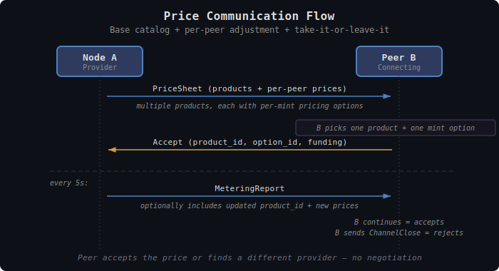

# TollGate Pricing

This document specifies how TollGate peers communicate, negotiate, and dynamically adjust prices for delivery services.

## Overview

Each TollGate peer charges its own rate for delivering resources to other peers. Every delivery relationship is independently priced — there is no global price. Prices are always mint-specific, can be positive, zero, or negative, and can change dynamically based on conditions, demand, or operator policy.

Pricing has two dimensions, both always present:
- **Time** — price per second of being an active peer
- **Units** — price per unit delivered

The operator sets either dimension to zero for simpler models. The cost for each metering interval is:

```
cost_scaled = (elapsed_seconds × price_per_second) + (units_delivered × price_per_unit)
cost = ceil(cost_scaled / pricing_scale)
```

---

## Pricing Scale

Prices can be very small — delivering a single unit might cost a fraction of a sat. To handle sub-unit precision without floating-point arithmetic, all prices are stored as integers with a shared **pricing scale** divisor.

```
actual_price = integer_price / pricing_scale
```

With `pricing_scale = 1000`:

| Field | Integer value | Actual price |
|-------|--------------|--------------|
| `price_per_unit = 10` | 10 | 0.01 sat/unit |
| `price_per_unit = 1` | 1 | 0.001 sat/unit |
| `price_per_second = 500` | 500 | 0.5 sat/second |
| `price_per_second = 1000` | 1000 | 1.0 sat/second |

The accumulated cost is computed entirely with integer arithmetic:

```
cost_scaled = (seconds × price_per_second) + (units × price_per_unit)
cost = ceil(cost_scaled / pricing_scale)
```

The `pricing_scale` is part of the product definition and included in the product ID hash. Both peers always agree on the scale. Default: **1000** (milli-unit precision).

---

## Products

A product defines the structural terms of a delivery service. Each peer subscribes to **exactly one product** at a time. To switch, the peer renegotiates.

### Product Structure

```rust
struct Product {
    id: ProductId,                     // SHA256 over canonical layout — see Product Identity
    pricing_scale: u32,                // divisor for sub-unit precision (default: 1000)
    pricing: Vec<MintPricing>,         // per-mint pricing
    extensions: Vec<u8>,               // opaque, implementation-specific parameters
}

struct MintPricing {
    mint_url: String,
    price_per_second: i64,             // scaled integer, signed (negative = node pays peer)
    price_per_unit: i64,               // scaled integer, signed
    mint_unit: String,                 // "sat", "msat", "usd"
}
```

The `extensions` field carries implementation-specific parameters (e.g., bandwidth limits for network resources, quality tiers for compute resources). The core protocol treats extensions as opaque bytes — only the implementation interprets them.

### Product Identity

The product ID is a 32-byte `SHA256` over an explicit, fixed byte layout — **not**
a hash of a CBOR encoding. Hashing CBOR would be ambiguous: two encoders can
order map keys differently and produce different IDs for the same product,
silently breaking product matching across implementations (Rust, Go, esp32). The
fixed layout below, behind a domain-separation tag, removes that ambiguity. All
multi-byte integers are **big-endian**.

```
preimage =
    "tollgate/product-id/v1"          // domain tag, ASCII, no terminator
    pricing_scale                     // u32, big-endian
    count(mint_options)               // u32, big-endian
    for each mint_option, sorted by mint_url bytes ascending:
        len(mint_url)                 // u32, big-endian
        mint_url                      // raw UTF-8 bytes
        price_per_second              // i64, big-endian
        price_per_unit                // i64, big-endian
        len(mint_unit)                // u32, big-endian
        mint_unit                     // raw UTF-8 bytes ("sat", "msat", …)
    len(extensions)                   // u32, big-endian
    extensions                        // opaque bytes, hashed verbatim

product_id = SHA256(preimage)
```

`extensions` is hashed verbatim as an opaque byte string: the producer
serializes it once and every implementation hashes the identical bytes, so the
core never has to agree on how to re-encode it. Sorting mint options by
`mint_url` makes the ID independent of declaration order.

The product ID includes **all** pricing-relevant fields. Any change (scale,
price, mint set, or extensions) produces a new ID, so a peer detects whether
renegotiation is needed with one hash comparison — no need to diff individual
fields.

### Examples

> The examples below show network-specific configurations (sat/unit where units are bytes). These are implementation-specific — the core protocol treats units and extensions as opaque.

**Internet gateway (pure usage-based):**
```yaml
id: "a1b2c3..."
pricing_scale: 1000
pricing:
  - mint_url: "https://mint.example.com"
    price_per_second: 0                        # no time charge
    price_per_unit: 10                         # 0.01 sat per unit
    mint_unit: "sat"
extensions: []                                 # no constraints
```

**Always-on presence (flat rate, capped):**
```yaml
id: "d4e5f6..."
pricing_scale: 1000
pricing:
  - mint_url: "https://mint.example.com"
    price_per_second: 100                      # 0.1 sat per second
    price_per_unit: 0                          # no usage charge
    mint_unit: "sat"
extensions: [bandwidth_limit: 10000]           # implementation-specific: 10 KB/s cap
```

**Premium tier (base + usage):**
```yaml
id: "e5f6g7..."
pricing_scale: 1000
pricing:
  - mint_url: "https://mint.example.com"
    price_per_second: 50                       # 0.05 sat/sec base
    price_per_unit: 5                          # 0.005 sat/unit on top
    mint_unit: "sat"
extensions: []
```

**Negative pricing (attract resources):**
```yaml
id: "g7h8i9..."
pricing_scale: 1000
pricing:
  - mint_url: "https://mint.example.com"
    price_per_second: 0
    price_per_unit: -2                         # node PAYS peer 0.002 sat/unit
    mint_unit: "sat"
extensions: []
```

**Multi-mint with currency discount:**
```yaml
id: "j1k2l3..."
pricing_scale: 1000
pricing:
  - mint_url: "https://mint.example.com"
    price_per_second: 0
    price_per_unit: 10                         # 0.01 sat/unit
    mint_unit: "sat"
  - mint_url: "https://mint.eu"
    price_per_second: 0
    price_per_unit: 8                          # 0.008 sat/unit — discount for preferred mint
    mint_unit: "sat"
extensions: []
```

---

## Price Communication


<details><summary>Text version</summary>

```
  A → B: PriceSheet (products + per-peer prices)
         multiple products, each with per-mint pricing and extensions

         B picks one product + one mint option

  B → A: Accept (product_id, option_id, funding)

  ─── at each metering interval ───
  A → B: MeteringReport (+ optional new prices)
         B continues = accepts new price
         B sends ChannelClose = rejects

  Take-it-or-leave-it: peer accepts or finds a different provider
```
</details>

### Base Catalog

Each node publishes a **base catalog** of its products with base prices. This is the default offering visible to all peers before any per-peer adjustment.

### Per-Peer Price Sheet

When a peer connects, the node sends a **peer-specific price sheet** derived from the base catalog. The price sheet may adjust prices up or down based on:
- Quality metrics (implementation-specific)
- Operator-configured peer overrides
- Dynamic pricing strategy
- Current load/congestion

The adjustment can be the identity function (no change) for simple deployments — the peer-specific sheet simply echoes the base catalog.

### Price Flow

```
1. Node A publishes base catalog (products + base prices)
2. Peer B connects
3. Node A sends B a peer-specific price sheet
4. B accepts (opens Spilman channel) or disconnects
5. At each metering interval, A may send updated prices
6. B sees new price and must accept before next interval, or channel closes
```

---

## Price Negotiation

**Take-it-or-leave-it.** The provider sets the price. The peer accepts or finds a different peer. The system provides alternatives — if a node's prices are too high, resources route around it.

```
A → B: "Price sheet: [product, prices per mint]"
B: accepts (opens channel) or disconnects
```

**One message. Zero negotiation.**

The only negotiable parameter is the **metering interval**, because it affects both sides. Both peers send their acceptable range. The actual interval is the **average of the overlapping portion**:

```
A's range: [3s, 10s]
B's range: [5s, 30s]
Overlap:   [5s, 10s]
Interval:  (5 + 10) / 2 = 7.5s
```

If the ranges don't overlap, negotiation fails. This is deterministic — both sides compute the same result, no extra round-trip.

### Price Changes

Prices can change at each metering interval. The provider includes updated prices in the MeteringReport. The peer must:
- **Accept** — continue with new prices at the next interval
- **Reject** — close the channel (can renegotiate or disconnect)

There is no grace period. The new price takes effect at the next interval. Each metering interval is also a renegotiation opportunity — the peer always has the option to walk away.

---

## Dynamic Pricing

### Inputs

The pricing function maps available inputs to per-peer prices:

```
price(peer, product) → (price_per_second, price_per_unit)
```

Available inputs:

**Peer metrics** (from ResourceAdapter):

Peer metrics are an opaque map of key-value pairs. The core protocol does not define specific metric keys — the implementation provides whatever metrics are relevant for its resource type.

```rust
pub type PeerMetrics = HashMap<String, MetricValue>;

enum MetricValue {
    Float(f64),
    Int(i64),
    Text(String),
    Bool(bool),
}
```

Example metric keys (implementation-specific):
| Key | Type | Pricing relevance |
|-----|------|-------------------|
| `"srtt_ms"` | Float | Higher latency = more buffering cost |
| `"loss_rate"` | Float | Higher loss = wasted delivery effort |
| `"etx"` | Float | Direct measure of retransmission cost |
| `"goodput_bps"` | Float | Capacity utilization indicator |
| `"jitter"` | Int | Service quality indicator |
| `"trend"` | Text | Predict near-future conditions |

**Node state:**
- Number of active paying peers (load)
- Total delivery throughput (capacity utilization)
- Available channel balance (liquidity)

**Operator config:**
- Base price per product
- Floor and ceiling prices
- Time-of-day schedules
- Per-peer overrides (by npub)

### Strategies

**Fixed:**
```
price = base_price
```

**Cost-plus** (example using network metrics):
```
price = base_price × metric('etx') × (1 + metric('srtt_ms') / 100)
```

**Demand-based:**
```
price = base_price × (1 + active_peers / max_peers)
```

**Quality-tiered:**
```
if metric('loss_rate') < 0.01 and metric('srtt_ms') < 10:
    price = premium_price
elif metric('loss_rate') < 0.05 and metric('srtt_ms') < 50:
    price = standard_price
else:
    price = discount_price
```

**Operator-scripted:**
Custom function (config DSL, Lua, WASM) computes price from all available inputs. Metric keys are implementation-specific — the pricing function accesses them via `metric('key')` lookups.

### When Prices Change

Prices update **at metering intervals** (default: every 5 seconds). The updated price is piggybacked on the MeteringReport — no extra round-trips. This is the natural renegotiation point.

---

## Operator Controls

### Base Price Configuration

```yaml
products:
  - name: "standard"
    pricing_scale: 1000
    base_pricing:
      - mint_url: "https://mint.example.com"
        base_price_per_second: 0
        base_price_per_unit: 10
        mint_unit: "sat"
        price_per_unit_floor: 5       # never go below
        price_per_unit_ceiling: 50    # never go above
    extensions: []

  - name: "always-on"
    pricing_scale: 1000
    base_pricing:
      - mint_url: "https://mint.example.com"
        base_price_per_second: 100
        base_price_per_unit: 0
        mint_unit: "sat"
        price_per_second_floor: 0
        price_per_second_ceiling: 1000
    extensions:                        # implementation-specific
      bandwidth_limit: 10000
```

### Dynamic Pricing Rules

```yaml
dynamic_pricing:
  enabled: true
  strategy: "cost_plus"
  metric_weights:                      # keys are opaque metric names from ResourceAdapter
    "etx": 1.0
    "srtt_ms": 0.01
    "congestion": 0.5
```

### Peer Policies

```yaml
peer_overrides:
  "npub1abc...":
    price_multiplier: 0.0          # free peering (zero-price)
  "npub1def...":
    price_multiplier: 0.5          # 50% discount
  "npub1ghi...":
    blocked: true                  # refuse service

metering:
  default_interval_ms: 5000
```

---

## Design Decisions

| Decision | Resolution | Rationale |
|----------|-----------|-----------|
| Pricing dimensions | Always both: price/second + price/unit | Operator sets either to 0 for simpler models |
| Pricing precision | Integer with pricing_scale divisor (default 1000) | Avoids floating-point, supports sub-unit prices |
| Products per peer | One at a time | Keeps metering simple, no product interaction |
| Price communication | Base catalog + per-peer price sheet | Public base, private adjustments |
| Negotiation | Take-it-or-leave-it | Simplest; mesh provides alternatives |
| Price changes | At metering intervals, piggybacked | No extra round-trips |
| Price commitment | New price at next interval; peer accepts or closes | Each metering interval = renegotiation opportunity |
| Price discovery | Direct peers only, no propagation | Future: profit-aware routing |
| Currency arbitrage | Feature — operators discount preferred mints | Market efficiency |
| Negative pricing | Signed price fields from day one | Core economic mechanism |
| Product extensions | Opaque CBOR blob for implementation-specific fields | Core hashes but doesn't interpret |
| Metering interval | Both peers send acceptable range; actual = average of overlap | Deterministic, no extra round-trip, both sides agree |
| Product identity | `SHA256` over a canonical byte layout (see Product Identity) | Any change detected with one hash comparison; layout is cross-implementation stable |
