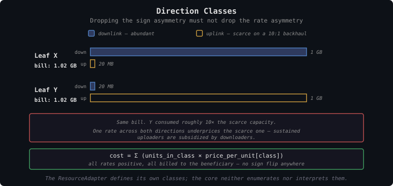
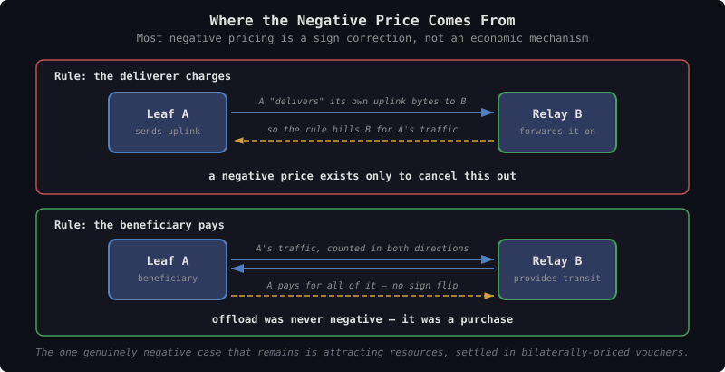

# TollGate Pricing

This document specifies how TollGate peers price delivery. The short version:
**the protocol does not price delivery at all.**

Payment is in vouchers — Cashu tokens denominated in the resource itself,
issued by the node that will deliver it
([tollgate-vouchers.md](tollgate-vouchers.md)). One voucher byte buys one
byte of delivery. There is no rate to quote, no product to select, and no
multiplier to apply.

What something costs in money is settled when a peer **acquires** vouchers,
on a market or directly from the issuer. That is outside the protocol, in
the same way that how a peer acquired sats has always been outside it.

---

## Delivery Is One Voucher Per Unit

A node meters units delivered to a peer and collects the same number of that
node's own vouchers. The exchange is one-to-one by construction: a voucher
*is* a claim on one unit of that node's capacity, so redeeming `n` of them
is delivering `n` units.

```
units delivered this interval = n
vouchers collected            = n
```

This is why products, pricing scales, price sheets, floors, ceilings,
per-peer multipliers and dynamic pricing formulas are all gone. They existed
to answer "how many sats per byte?", and that question has moved to the
market.

Consequences worth stating plainly:

- **A node's price is expressed by what its vouchers sell for.** A node that
  wants more revenue per byte issues fewer vouchers or sells them dearer. It
  does not renegotiate anything with its peers.
- **Prices cannot change mid-session under a peer.** The peer already holds
  the vouchers; their claim is fixed. The old design's take-it-or-leave-it
  price update at every metering interval no longer exists.
- **Per-peer pricing still works**, without per-peer machinery. A node that
  wants to favor one peer sells that peer vouchers more cheaply, or gives
  them away. Nothing in the protocol has to know.

---

## Direction Classes

Uplink and downlink are not the same good. Asymmetric backhaul (DSL, cable,
cellular) runs 5:1 to 20:1, so a byte carried in the scarce direction costs
the operator far more than one in the abundant direction.


<details><summary>Text version</summary>

```
Leaf X: 1 GB down, 20 MB up   → 1.02 GB of vouchers
Leaf Y: 1 GB up,   20 MB down → 1.02 GB of vouchers

On a 10:1 uplink-constrained backhaul, Y consumed ~10× the scarce capacity
for the same number of vouchers. Sustained uploaders would be subsidized
by downloaders.
```
</details>

A node therefore issues a **separate keyset per direction class**, and the
one-voucher-per-unit rule applies within a class. An uplink voucher and a
downlink voucher both claim one byte, of different things.

| Resource | Classes |
|---|---|
| Network forwarding | `up`, `down` |
| Electricity | `import`, `export` |
| Single-class resource | one class, behaves as before |

The scarcity difference shows up where it belongs — in what each class sells
for. Uplink vouchers cost more sats because uplink is scarcer. The protocol
still does no arithmetic.

The ResourceAdapter defines its own class names and tags metered units with
them. The core neither enumerates nor interprets them.

---

## The One Price In The Protocol

Exactly one price is quoted peer-to-peer: **the price of a peer's own
vouchers**, which is what makes paid acceptance work
([tollgate-vouchers.md](tollgate-vouchers.md)).

A leaf's upload is the case that needs it. The relay gains nothing from
receiving a leaf's outgoing traffic, so the leaf has to pay for it — but on
that leg the leaf is the deliverer, and the deliverer-charges rule would
have the relay owing the leaf. Paid acceptance settles it outside the
payment flow: the leaf pays the relay, in relay-vouchers, to hold
leaf-vouchers. Both directions then run at ordinary positive prices.


<details><summary>Text version</summary>

```
  Rule: the deliverer charges
    Leaf A ──── "delivers" its own uplink bytes ────→ Relay B
    Leaf A ←─── so the rule bills B for A's traffic ── Relay B

  Paid acceptance
    Leaf A ──── pays B to hold A-vouchers ─────────→ Relay B
    Leaf A ←─── B pays for the upload with them ──── Relay B
    both directions positive; the negative price sits on the voucher leg
```
</details>

The voucher price is **signed and crosses zero**, on the same convention as
everywhere else in this design:

| Voucher price | Meaning |
|---|---|
| Positive | The peer wants these vouchers and buys them |
| Zero | An even swap |
| Negative | The issuer pays to have them held — paid acceptance |
| Refused | No price works; the peering runs one-way |

**Refused is the default.** A node that has not been configured to accept
other nodes' vouchers refuses, and the peering falls back to ordinary
one-direction payment.

---

## Never Price Traffic Acceptance

Paying a peer to accept **vouchers** is safe: whether it took them can be
checked, and it gains nothing by taking them and lying.

Paying a peer to accept **traffic** is not, and must never be added back.
Accepting traffic can be faked — the peer takes it, bills for it, and
discards it, having done no work. Under such a price, discarding becomes the
most profitable thing it can do, and metering cannot tell the difference
because it counts what was delivered to the peer, not what the peer did
next.

Three specific hazards, recorded so they are not reintroduced:

- **Sink peers.** Advertise attractive terms for accepting traffic, receive,
  bill, discard. Zero cost, full revenue.
- **Cheapest route is a blackhole.** Peer identities are free, so a sink can
  undercut honest forwarders indefinitely. Currently defused only because
  routing is a non-goal — TollGate does not influence path selection.
  Price-aware routing **must not** be adopted alongside any price for
  traffic acceptance.
- **Margin squeeze.** A peer floods a node whose terms for accepting traffic
  are below that node's own onward cost.

Traffic is therefore always priced as **transit**, paid by whoever the
traffic is for, and verified by that party end-to-end. It stops paying when
nothing arrives.

### The Case That Cannot Be Removed

Negative pricing on delivery survives for one thing: **getting rid of
surplus** — a node with more of something than it can use, paying others to
take it. It cannot pay in its own vouchers, because those vouchers are a
claim on the very thing it is shedding.

For network forwarding this does not arise; every apparent example is
ordinary buying seen backwards. For **electricity it is real** — grids do go
to negative prices — and `tollgate-core` is resource-agnostic, so it is in
scope.

Electricity is also the safe case: the meter is physical and the resource is
conserved, so whether it was actually consumed can be measured, which is
never true of forwarded bytes. Negative delivery prices are therefore
permitted only where the ResourceAdapter declares the resource conserved and
physically metered, and require an absolute spending budget when enabled —
see `subsidy` in
[tollgate-configuration.md](tollgate-configuration.md).

---

## Zero-Price Peering

Two nodes under one operator, or any pair that agrees to it, can skip
payment entirely. Neither issues vouchers to the other and no metering or
balance updates occur. This is unchanged from the previous design and stays
the simplest path for free peering.

**Zero-price is not transitive.** It means free for that peer's own traffic,
never free for anything that peer is nominally the beneficiary of.
Otherwise a zero-priced peer becomes a way to launder free transit for
others.

---

## Where Prices Actually Come From

Since the protocol prices nothing, price discovery happens where vouchers
change hands for money:

- **Directly from the issuer.** A node sells its own vouchers for sats, at
  whatever it chooses. This is the whole mechanism for most peerings.
- **On a market.** Vouchers from many issuers trade against sats. What an
  issuer's vouchers fetch relative to their face value is a public,
  continuously updated measure of how much the network expects that issuer
  to deliver — a reliability signal the previous design had no equivalent of.

Neither is required by the protocol. See
[tollgate-vouchers.md](tollgate-vouchers.md).

---

## Design Decisions

| Decision | Resolution | Rationale |
|----------|-----------|-----------|
| Delivery pricing | None in the protocol — one voucher per unit delivered | A voucher is a claim on one unit, so redemption is delivery. Money prices are set where vouchers are acquired |
| Products | Removed | They existed to structure "sats per byte", which the market now answers |
| Price sheets, scales, floors, ceilings, multipliers, dynamic formulas | Removed | Same reason; a node adjusts revenue by what it sells vouchers for |
| Per-peer pricing | Sell that peer vouchers cheaper | Same capability, no per-peer machinery in the protocol |
| Mid-session price changes | Not possible | The peer already holds the vouchers and their claim is fixed |
| Direction classes | Separate keyset per class; one voucher per unit within a class | Keeps the protocol free of arithmetic while letting scarce directions cost more in the market |
| Voucher price | The only peer-to-peer price; signed, crossing zero | Makes paid acceptance work without any negative number reaching the payment flow |
| Foreign vouchers | Refused by default | The peering falls back to ordinary one-direction payment |
| Traffic acceptance | Never priced | Acceptance can be faked; discarding would become the most profitable strategy |
| Price-aware routing | Blocked while any price for traffic acceptance exists | Free identities plus paid acceptance plus price-driven path selection selects for blackholes |
| Negative delivery prices | Only for a conserved, physically metered resource, with an absolute budget | Bytes can be quietly discarded; watt-hours cannot |
| Zero-price peering | Kept, and not transitive | Simplest path for free peering; transitivity would launder free transit |
