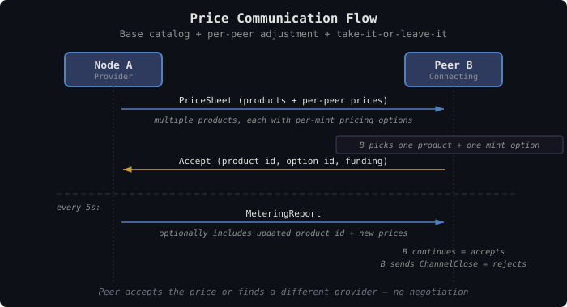

# TollGate Pricing

This document specifies how TollGate peers communicate, negotiate, and dynamically adjust prices for delivery services.

## Overview

Each TollGate peer charges its own rate for delivering resources to other peers. Every delivery relationship is independently priced — there is no global price. Prices are always mint-specific, can be positive, zero, or negative, and can change dynamically based on conditions, demand, or operator policy.

Pricing has two dimensions, both always present:
- **Time** — price per second of being an active peer
- **Units** — price per unit delivered

The operator sets either dimension to zero for simpler models. The cost for each metering interval is:

```
cost_scaled = (elapsed_seconds × price_per_second) + (units_delivered × price_per_unit)
cost = ceil(cost_scaled / pricing_scale)
```

---

## Pricing Scale

Prices can be very small — delivering a single unit might cost a fraction of a sat. To handle sub-unit precision without floating-point arithmetic, all prices are stored as integers with a shared **pricing scale** divisor.

```
actual_price = integer_price / pricing_scale
```

With `pricing_scale = 1000`:

| Field | Integer value | Actual price |
|-------|--------------|--------------|
| `price_per_unit = 10` | 10 | 0.01 sat/unit |
| `price_per_unit = 1` | 1 | 0.001 sat/unit |
| `price_per_second = 500` | 500 | 0.5 sat/second |
| `price_per_second = 1000` | 1000 | 1.0 sat/second |

The accumulated cost is computed entirely with integer arithmetic:

```
cost_scaled = (seconds × price_per_second) + (units × price_per_unit)
cost = ceil(cost_scaled / pricing_scale)
```

The `pricing_scale` is part of the product definition and included in the product ID hash. Both peers always agree on the scale. Default: **1000** (milli-unit precision).

---

## Products

A product defines the structural terms of a delivery service. Each peer subscribes to **exactly one product** at a time. To switch, the peer renegotiates.

### Product Structure

```rust
struct Product {
    id: ProductId,                     // SHA256 over canonical layout — see Product Identity
    pricing_scale: u32,                // divisor for sub-unit precision (default: 1000)
    pricing: Vec<MintPricing>,         // per-mint pricing
    extensions: Vec<u8>,               // opaque, implementation-specific parameters
}

struct MintPricing {
    mint_url: String,
    price_per_second: i64,             // scaled integer, signed (negative = node pays peer)
    price_per_unit: i64,               // scaled integer, signed
    mint_unit: String,                 // "sat", "msat", "usd"
}
```

The `extensions` field carries implementation-specific parameters (e.g., bandwidth limits for network resources, quality tiers for compute resources). The core protocol treats extensions as opaque bytes — only the implementation interprets them.

### Product Identity

The product ID is a 32-byte `SHA256` over an explicit, fixed byte layout — **not**
a hash of a CBOR encoding. Hashing CBOR would be ambiguous: two encoders can
order map keys differently and produce different IDs for the same product,
silently breaking product matching across implementations (Rust, Go, esp32). The
fixed layout below, behind a domain-separation tag, removes that ambiguity. All
multi-byte integers are **big-endian**.

```
preimage =
    "tollgate/product-id/v1"          // domain tag, ASCII, no terminator
    pricing_scale                     // u32, big-endian
    count(mint_options)               // u32, big-endian
    for each mint_option, sorted by mint_url bytes ascending:
        len(mint_url)                 // u32, big-endian
        mint_url                      // raw UTF-8 bytes
        price_per_second              // i64, big-endian
        price_per_unit                // i64, big-endian
        len(mint_unit)                // u32, big-endian
        mint_unit                     // raw UTF-8 bytes ("sat", "msat", …)
    len(extensions)                   // u32, big-endian
    extensions                        // opaque bytes, hashed verbatim

product_id = SHA256(preimage)
```

`extensions` is hashed verbatim as an opaque byte string: the producer
serializes it once and every implementation hashes the identical bytes, so the
core never has to agree on how to re-encode it. Sorting mint options by
`mint_url` makes the ID independent of declaration order.

The product ID includes **all** pricing-relevant fields. Any change (scale,
price, mint set, or extensions) produces a new ID, so a peer detects whether
renegotiation is needed with one hash comparison — no need to diff individual
fields.

### Examples

> The examples below show network-specific configurations (sat/unit where units are bytes). These are implementation-specific — the core protocol treats units and extensions as opaque.

**Internet gateway (pure usage-based):**
```yaml
id: "a1b2c3..."
pricing_scale: 1000
pricing:
  - mint_url: "https://mint.example.com"
    price_per_second: 0                        # no time charge
    price_per_unit: 10                         # 0.01 sat per unit
    mint_unit: "sat"
extensions: []                                 # no constraints
```

**Always-on presence (flat rate, capped):**
```yaml
id: "d4e5f6..."
pricing_scale: 1000
pricing:
  - mint_url: "https://mint.example.com"
    price_per_second: 100                      # 0.1 sat per second
    price_per_unit: 0                          # no usage charge
    mint_unit: "sat"
extensions: [bandwidth_limit: 10000]           # implementation-specific: 10 KB/s cap
```

**Premium tier (base + usage):**
```yaml
id: "e5f6g7..."
pricing_scale: 1000
pricing:
  - mint_url: "https://mint.example.com"
    price_per_second: 50                       # 0.05 sat/sec base
    price_per_unit: 5                          # 0.005 sat/unit on top
    mint_unit: "sat"
extensions: []
```

**Negative pricing (attract resources):**
```yaml
id: "g7h8i9..."
pricing_scale: 1000
pricing:
  - mint_url: "https://mint.example.com"
    price_per_second: 0
    price_per_unit: -2                         # node PAYS peer 0.002 sat/unit
    mint_unit: "sat"
extensions: []
```

**Multi-mint with currency discount:**
```yaml
id: "j1k2l3..."
pricing_scale: 1000
pricing:
  - mint_url: "https://mint.example.com"
    price_per_second: 0
    price_per_unit: 10                         # 0.01 sat/unit
    mint_unit: "sat"
  - mint_url: "https://mint.eu"
    price_per_second: 0
    price_per_unit: 8                          # 0.008 sat/unit — discount for preferred mint
    mint_unit: "sat"
extensions: []
```

---

## Price Communication


<details><summary>Text version</summary>

```
  A → B: PriceSheet (products + per-peer prices)
         multiple products, each with per-mint pricing and extensions

         B picks one product + one mint option

  B → A: Accept (product_id, option_id, funding)

  ─── at each metering interval ───
  A → B: MeteringReport (+ optional new prices)
         B continues = accepts new price
         B sends ChannelClose = rejects

  Take-it-or-leave-it: peer accepts or finds a different provider
```
</details>

### Base Catalog

Each node publishes a **base catalog** of its products with base prices. This is the default offering visible to all peers before any per-peer adjustment.

### Per-Peer Price Sheet

When a peer connects, the node sends a **peer-specific price sheet** derived from the base catalog. The price sheet may adjust prices up or down based on:
- Quality metrics (implementation-specific)
- Operator-configured peer overrides
- Dynamic pricing strategy
- Current load/congestion

The adjustment can be the identity function (no change) for simple deployments — the peer-specific sheet simply echoes the base catalog.

### Price Flow

```
1. Node A publishes base catalog (products + base prices)
2. Peer B connects
3. Node A sends B a peer-specific price sheet
4. B accepts (opens Spilman channel) or disconnects
5. At each metering interval, A may send updated prices
6. B sees new price and must accept before next interval, or channel closes
```

---

## Price Negotiation

**Take-it-or-leave-it.** The provider sets the price. The peer accepts or finds a different peer. The system provides alternatives — if a node's prices are too high, resources route around it.

```
A → B: "Price sheet: [product, prices per mint]"
B: accepts (opens channel) or disconnects
```

**One message. Zero negotiation.**

The only negotiable parameter is the **metering interval**, because it affects both sides. Both peers send their acceptable range. The actual interval is the **average of the overlapping portion**:

```
A's range: [3s, 10s]
B's range: [5s, 30s]
Overlap:   [5s, 10s]
Interval:  (5 + 10) / 2 = 7.5s
```

If the ranges don't overlap, negotiation fails. This is deterministic — both sides compute the same result, no extra round-trip.

### Price Changes

Prices can change at each metering interval. The provider includes updated prices in the MeteringReport. The peer must:
- **Accept** — continue with new prices at the next interval
- **Reject** — close the channel (can renegotiate or disconnect)

There is no grace period. The new price takes effect at the next interval. Each metering interval is also a renegotiation opportunity — the peer always has the option to walk away.

---

## Dynamic Pricing

### Inputs

The pricing function maps available inputs to per-peer prices:

```
price(peer, product) → (price_per_second, price_per_unit)
```

Available inputs:

**Peer metrics** (from ResourceAdapter):

Peer metrics are an opaque map of key-value pairs. The core protocol does not define specific metric keys — the implementation provides whatever metrics are relevant for its resource type.

```rust
pub type PeerMetrics = HashMap<String, MetricValue>;

enum MetricValue {
    Float(f64),
    Int(i64),
    Text(String),
    Bool(bool),
}
```

Example metric keys (implementation-specific):
| Key | Type | Pricing relevance |
|-----|------|-------------------|
| `"srtt_ms"` | Float | Higher latency = more buffering cost |
| `"loss_rate"` | Float | Higher loss = wasted delivery effort |
| `"etx"` | Float | Direct measure of retransmission cost |
| `"goodput_bps"` | Float | Capacity utilization indicator |
| `"jitter"` | Int | Service quality indicator |
| `"trend"` | Text | Predict near-future conditions |

**Node state:**
- Number of active paying peers (load)
- Total delivery throughput (capacity utilization)
- Available channel balance (liquidity)

**Operator config:**
- Base price per product
- Floor and ceiling prices
- Time-of-day schedules
- Per-peer overrides (by npub)

### Strategies

**Fixed:**
```
price = base_price
```

**Cost-plus** (example using network metrics):
```
price = base_price × metric('etx') × (1 + metric('srtt_ms') / 100)
```

**Demand-based:**
```
price = base_price × (1 + active_peers / max_peers)
```

**Quality-tiered:**
```
if metric('loss_rate') < 0.01 and metric('srtt_ms') < 10:
    price = premium_price
elif metric('loss_rate') < 0.05 and metric('srtt_ms') < 50:
    price = standard_price
else:
    price = discount_price
```

**Operator-scripted:**
Custom function (config DSL, Lua, WASM) computes price from all available inputs. Metric keys are implementation-specific — the pricing function accesses them via `metric('key')` lookups.

### When Prices Change

Prices update **at metering intervals** (default: every 5 seconds). The updated price is piggybacked on the MeteringReport — no extra round-trips. This is the natural renegotiation point.

---

## Negative Pricing

A negative price inverts who pays: the node delivering the resource pays the
peer receiving it. This is a deliberate mechanism (a leaf subsidizing its
peers to carry its outgoing traffic, a node attracting resources), but it
inverts the incentive structure that makes positive pricing self-correcting,
and every rule written assuming "the deliverer is the payee" must be
re-derived.

### The structural asymmetry

A positive price ties payment to **delivery**: if the provider stops
delivering, the customer stops paying. A negative price ties payment to
**acceptance** — and acceptance is trivial to fake. A peer can accept
traffic, bill for it, and discard it, having done no work at all.

Metering counts what was delivered to the peer, not what the peer did with
it afterwards ([tollgate-metering.md](tollgate-metering.md)); best-effort
delivery is an explicit non-goal boundary in
[tollgate-intro.md](tollgate-intro.md). Discarding is therefore invisible to
the payment layer. Under a positive price this does not matter, because
discarding costs the discarder its revenue. Under a negative price
discarding is the *most* profitable strategy available.

Three consequences follow:

- **Sink peers.** Advertise an attractive acceptance price, receive, bill,
  discard. Zero cost, full revenue.
- **Cheapest route is a blackhole.** Peer identities are free, so a sink can
  undercut honest forwarders indefinitely. This is currently defused only
  because routing is a non-goal — TollGate does not influence path
  selection. The "profit-aware routing" direction noted under Price
  Discovery **must not** be adopted while unbounded negative pricing exists:
  price-aware routing plus free identities plus paid acceptance selects for
  blackholes by construction.
- **Margin squeeze.** A peer floods a node whose acceptance price is below
  that node's own onward cost. The node loses value per unit delivered.

### Required constraints

Negative prices are permitted, but subject to the following:

1. **Subsidy is bounded by an absolute budget, not by a multiplier.** See
   `subsidy` in [tollgate-configuration.md](tollgate-configuration.md).
   Budgets apply per peer *and* in aggregate; a per-peer budget alone is
   defeated by creating more peers.

2. **Price bounds are applied to magnitude with explicit sign handling.**
   `price_floor_multiplier` and `price_ceiling_multiplier` are defined
   relative to a positive base. Applied naively to a negative base they
   invert: with `base = -10`, a "ceiling" of `10.0` permits `-100` — ten
   times *deeper* subsidy than the base, under a name that reads as
   protection. Bounds on negative prices must be expressed as absolute
   limits.

3. **Metric-scaled formulas must not be applied to a negative base.** The
   cost-plus strategies above scale price with link quality metrics, which
   are measured *against the peer being priced*. That is self-correcting for
   a positive price — a worse link costs more, and the customer leaves if it
   is not worth it — but perverse for a negative one:

   ```
   base = -10, metric('etx') = 5, metric('srtt_ms') = 500
   price = -10 × 5 × (1 + 500/100) = -300
   ```

   A peer that deliberately degrades its own link collects thirty times the
   intended subsidy, automatically, with no operator in the loop. Subsidy
   must scale with observed usefulness, never with cost-of-delivery.

4. **Billing uses the deliverer-favoring count.** Under a negative price
   the deliverer is the payer, so the transit-loss rule resolves to the
   *lower* of the two counts. See
   [tollgate-metering.md](tollgate-metering.md).

5. **Subsidy channels do not grow.** `capacity_growth_factor` is not applied
   to channels funded because the price is negative. See
   [tollgate-payment-channels.md](tollgate-payment-channels.md).

### Preferred form: payer-discretionary subsidy

Where a subsidy is needed at all, expressing it as a per-unit price is the
weakest available option, because it lets the payee invoice for acceptance.
The stronger form is **payer-discretionary**: the paying node decides at
each interval how much to transfer, based on its own observation of whether
the traffic achieved anything.

This costs almost nothing to adopt — the payer already holds the only signal
that matters — and it removes the sink's ability to bill at all. A sink can
still accept and discard; it simply earns nothing for doing so.

### Resolution: price the service, subsidize in own vouchers

The constraints above bound the damage. They do not remove the incentive — a
sink can still collect up to its budget. The decided direction removes the
those cases altogether instead, in two parts.

**1. Price the service, not the delivery direction.** The rule "the deliverer
charges" is wrong for uplink: a leaf *delivers* its own outgoing traffic to
its relay, so the rule bills the relay for the leaf's traffic, and a negative
price is then needed to cancel that out. Most negative pricing is not an
economic mechanism at all — it is a sign correction for a mis-stated rule.

Metering instead counts **units handled on behalf of a peer**, in both
directions, and bills that peer. The leaf's uplink and its downlink are both
its own traffic; it pays for both. Offload stops being negative because it
was never negative — it was a purchase.


<details><summary>Text version</summary>

```
  Rule: the deliverer charges
    Leaf A ──── "delivers" its own uplink bytes ────→ Relay B
    Leaf A ←─── so the rule bills B for A's traffic ── Relay B
    a negative price exists only to cancel this out

  Rule: the beneficiary pays
    Leaf A ←─── A's traffic, counted both directions ──→ Relay B
    Leaf A ──── A pays for all of it — no sign flip ──→ Relay B
    offload was never negative — it was a purchase
```
</details>

**2. Settle the remaining case with paid acceptance.** Normally a node pays
in the vouchers of whoever is delivering, and that is the end of it. One
case does not fit: attracting resources, where a node wants its peer to hold
its vouchers even though the peer has no use for them. There the node
**pays the peer to take them**, in the peer's own vouchers, at an acceptance
price the peer quotes.

Note this is not a giveaway. A node with unwanted capacity subsidizes by
buying its peer's vouchers, not by printing its own. Two properties follow:
the subsidy and the revenue use the same vouchers, so a node cannot inflate
the subsidy without debasing the vouchers its paying customers hold; and
there is no standing outbound channel to auto-refill, so the drain cannot
start regardless of how the operator configures the node.

The price of a node's vouchers is a single price that crosses zero, on the
same sign convention as everything else here. Positive means the peer wants
them enough to buy them; negative means the node must pay to have them
taken; refused means the node simply pays in the peer's vouchers, which is
part 1. Normal operation and paid acceptance are the same price at different
points, not two mechanisms. See
[tollgate-vouchers.md](tollgate-vouchers.md).

Together these leave no case where a node pays a per-unit negative price for
*accepting traffic*. The negative price does not disappear — under paid
acceptance a peer is still paid to take another node's vouchers — but it
moves onto something that can be checked. Whether a peer took the vouchers
is a fact; whether it forwarded the traffic is not.

The hazard was never the negative sign. It was pricing acceptance of
something whose acceptance can be faked. With that moved, the wallet drain,
the metric-manipulation path, and the sign-inverted metering rule stop being
possible at all rather than merely being bounded.

Both parts are **future work** — part 1 changes what the meter counts and
reaches into the ResourceAdapter and the reconciliation path. The
constraints above stand in the meantime.

### Direction Classes

Deleting the *sign* asymmetry must not delete the *rate* asymmetry. They are
different things, and the current model conflates them:

- **Sign asymmetry** — who pays, depending on which way units move. Broken;
  removed by part 1 above.
- **Rate asymmetry** — what it costs, depending on which way units move.
  Physical, and must be kept.

Uplink and downlink are not the same good. Asymmetric backhaul (DSL, cable,
cellular) runs 5:1 to 20:1. A single `price_per_unit` applied to units
handled in both directions underprices the scarce one.

Pricing therefore carries a rate per **direction class**, all rates positive,
all billed to the beneficiary.


<details><summary>Text version</summary>

```
Leaf X: 1 GB down, 20 MB up   → billed for 1.02 GB
Leaf Y: 1 GB up,   20 MB down → billed for 1.02 GB

On a 10:1 uplink-constrained backhaul, Y consumed ~10× the scarce capacity
for the same price. Sustained uploaders are subsidized by downloaders.

Fix — one positive rate per class, all billed to the beneficiary:

  cost = Σ (units_in_class × price_per_unit[class])
```
</details>

The ResourceAdapter defines its own classes and tags metered units with
them; the core neither enumerates nor interprets them. A network adapter
emits `up`/`down`, an electricity adapter `import`/`export`, a single-class
resource emits one class and behaves exactly as today.

### Known limitations of beneficiary-pays

**Unsolicited inbound is billed to the recipient.** Traffic pushed at a peer
from elsewhere is "handled on behalf of" that peer, so the peer pays for a
flood directed at it. This is not introduced by the change — the current
deliverer-charges rule bills the same peer for the same bytes — but neither
model resolves it. Mitigation belongs to the access-control layer, not to
pricing.

**Zero-price peerings must not be transitive.** Once attribution decides who
pays, a peer with `price_multiplier: 0.0` becomes a laundering channel:
route traffic under that peer's beneficiary tag and it is free. Zero-price
must mean "free for that peer's own traffic", never "free for anything that
peer is nominally the beneficiary of".

### Where negative pricing is unavoidable

The genuinely irreducible case is **surplus disposal**: a node with excess
of a resource it must shed, paying others to absorb it. This does not
meaningfully arise for network forwarding — every apparent instance is
ordinary purchasing viewed backwards, where the "subsidizing" node is in
fact buying uplink. It is real for **electricity**, where negative prices
occur in actual grids, and `tollgate-core` is resource-agnostic.

Electricity is also the safe case: the meter is physical and the resource is
conserved, so consumption is verifiable in a way that bytes-forwarded is
not. Negative pricing is hazardous precisely where the resource can be
silently discarded.

Recommended gate: keep signed price fields in the wire format, but permit
negative values only where the ResourceAdapter declares the resource
conserved and physically metered, and require an absolute subsidy budget
whenever they are enabled.

The deeper observation is recorded in
[tollgate-vouchers.md](tollgate-vouchers.md): negative pricing is largely a
symptom of pricing the delivery *direction* rather than the *service
received*. Priced the latter way, most of the cases above become ordinary
positive payments, and the ways they can be abused disappear with them.

---

## Operator Controls

### Base Price Configuration

```yaml
products:
  - name: "standard"
    pricing_scale: 1000
    base_pricing:
      - mint_url: "https://mint.example.com"
        base_price_per_second: 0
        base_price_per_unit: 10
        mint_unit: "sat"
        price_per_unit_floor: 5       # never go below
        price_per_unit_ceiling: 50    # never go above
    extensions: []

  - name: "always-on"
    pricing_scale: 1000
    base_pricing:
      - mint_url: "https://mint.example.com"
        base_price_per_second: 100
        base_price_per_unit: 0
        mint_unit: "sat"
        price_per_second_floor: 0
        price_per_second_ceiling: 1000
    extensions:                        # implementation-specific
      bandwidth_limit: 10000
```

### Dynamic Pricing Rules

```yaml
dynamic_pricing:
  enabled: true
  strategy: "cost_plus"
  metric_weights:                      # keys are opaque metric names from ResourceAdapter
    "etx": 1.0
    "srtt_ms": 0.01
    "congestion": 0.5
```

### Subsidy Limits

Any product with a negative price requires an absolute spending bound. See
[tollgate-configuration.md](tollgate-configuration.md) for the full schema.

```yaml
subsidy:
  enabled: false                   # negative prices refused unless true
  max_per_peer_per_hour: 0         # absolute cap, sats
  max_total_per_hour: 0            # aggregate across all peers, sats
  require_conserved_resource: true # only for physically metered resources
```

### Peer Policies

```yaml
peer_overrides:
  "npub1abc...":
    price_multiplier: 0.0          # free peering (zero-price)
  "npub1def...":
    price_multiplier: 0.5          # 50% discount
  "npub1ghi...":
    blocked: true                  # refuse service

metering:
  default_interval_ms: 5000
```

---

## Design Decisions

| Decision | Resolution | Rationale |
|----------|-----------|-----------|
| Pricing dimensions | Always both: price/second + price/unit | Operator sets either to 0 for simpler models |
| Pricing precision | Integer with pricing_scale divisor (default 1000) | Avoids floating-point, supports sub-unit prices |
| Products per peer | One at a time | Keeps metering simple, no product interaction |
| Price communication | Base catalog + per-peer price sheet | Public base, private adjustments |
| Negotiation | Take-it-or-leave-it | Simplest; mesh provides alternatives |
| Price changes | At metering intervals, piggybacked | No extra round-trips |
| Price commitment | New price at next interval; peer accepts or closes | Each metering interval = renegotiation opportunity |
| Price discovery | Direct peers only, no propagation | Future: profit-aware routing |
| Currency arbitrage | Feature — operators discount preferred mints | Market efficiency |
| Negative pricing | Signed price fields from day one, subject to the constraints in Negative Pricing | Core economic mechanism, but it inverts the incentives that make positive pricing self-correcting |
| Negative price bounds | Absolute subsidy budgets, per peer and aggregate | Multiplier-based floors/ceilings invert sign and read as protection while permitting the opposite |
| Metric-scaled negative prices | Forbidden | The peer controls the metrics that would set its own subsidy |
| Subsidy form | Payer-discretionary transfer preferred over per-unit price | Removes the payee's ability to invoice for mere acceptance |
| Price-aware routing | Blocked while unbounded negative pricing exists | Free identities + paid acceptance + price-driven path selection selects for blackholes |
| Negative pricing, resolution | Price the service (beneficiary pays both directions) + settle the remaining case in bilaterally-priced vouchers — **future work** | Removes those cases rather than bounding them; offload was never negative, and attract becomes a deliberate purchase of the peer's vouchers with no channel to auto-refill |
| Relationship between the two parts | The same voucher price at different points, not two mechanisms | As the payer's vouchers become less wanted their price falls through zero; once the peer refuses them the payer pays in the peer's vouchers only, which is part 1 |
| Direction classes | Rate per adapter-defined class, all positive, billed to the beneficiary | Deleting the sign asymmetry must not delete the rate asymmetry — uplink and downlink are different goods |
| Unsolicited inbound | Billed to the recipient; unresolved | Pre-existing under deliverer-charges too; mitigation belongs to access control |
| Zero-price peerings | Not transitive — free for that peer's own traffic only | Otherwise a zero-priced peer launders free transit for others once attribution decides who pays |
| Product extensions | Opaque CBOR blob for implementation-specific fields | Core hashes but doesn't interpret |
| Metering interval | Both peers send acceptable range; actual = average of overlap | Deterministic, no extra round-trip, both sides agree |
| Product identity | `SHA256` over a canonical byte layout (see Product Identity) | Any change detected with one hash comparison; layout is cross-implementation stable |
