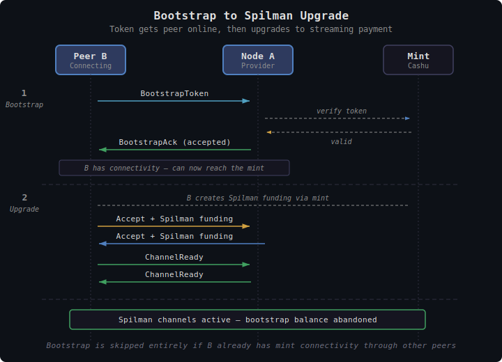
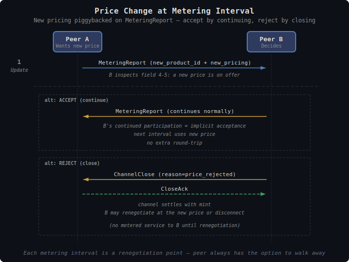
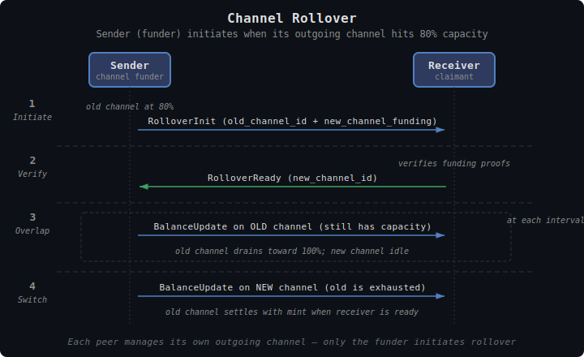
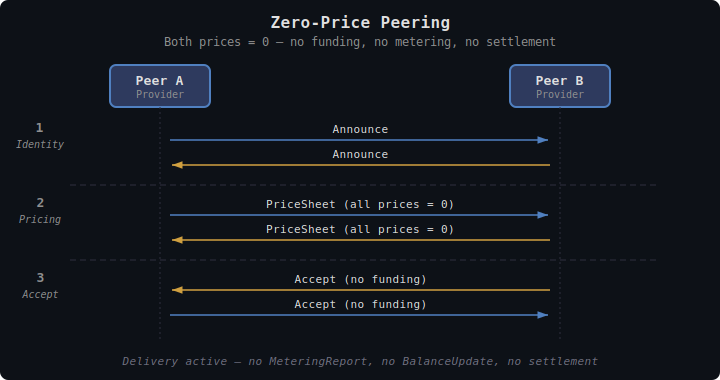

# TollGate Protocol

This document specifies the wire protocol for communication between TollGate peers — the messages exchanged, their encoding, and their sequencing.

## Overview

The TollGate protocol is a set of messages exchanged between authenticated peers to negotiate pricing, establish payment channels, meter resource delivery, and settle balances. It is **transport-agnostic** — messages can travel over any bidirectional channel between peers (FIPS session, TCP socket, HTTP, custom transport). The implementation provides the transport; the protocol defines the messages.

**No handshake.** Peers are already authenticated out-of-band (by FIPS Noise IK, WireGuard, etc.). The TollGate protocol begins with an Announce message.

---

## Encoding

All messages use **CBOR** ([RFC 8949](https://www.rfc-editor.org/rfc/rfc8949)) encoding.

**Why CBOR over binary (FIPS-style)?**
- TollGate is transport-agnostic — messages may traverse different substrates. Self-describing format avoids custom parsers per transport.
- Variable-length fields (mint URLs, product lists) are natural in CBOR, awkward in fixed binary.
- Well-supported in Rust (`ciborium`, `minicbor`), Go, Python, TypeScript — important for interop with Cashu Spilman ecosystem.
- Compact enough for constrained devices (ESP32). CBOR is more compact than JSON, comparable to Protocol Buffers for small messages.

**Why not JSON?**
- Larger on the wire. Parsing overhead on constrained devices.

**Why not FIPS-style binary?**
- TollGate messages contain variable-length strings (mint URLs, units) and nested structures (product lists). Binary encoding for these is complex and fragile.
- FIPS binary encoding is optimized for fixed-structure, high-frequency, low-latency packets (TreeAnnounce, MMP reports). TollGate messages are infrequent (every 5s) and don't need that level of optimization.

### Message Structure

Each TollGate message is a CBOR map with a `type` field (integer) as discriminator:

```cbor
{
  0: <message_type>,    // u8 — message type tag
  ...                   // type-specific fields
}
```

Field keys are small integers (not strings) for compactness:

| Key | Name | Present in |
|-----|------|-----------|
| 0 | `type` | All messages |
| 1-9 | Type-specific fields | Varies |

How messages are framed on the wire depends on the transport — see [Transports](#transports).

---

## Transports

The protocol is transport-agnostic, but each transport has a concrete spec for how CBOR messages are framed, exchanged, and how peers detect failure. v1 defines two transports: **HTTP polling** and **WebSocket**. Both run on default port **4747**.

### HTTP polling

Suitable for open access (public hotspots) and constrained clients. Stateless on the wire — each request is a complete bidirectional exchange.

**Endpoint:** `POST /tollgate/v1/exchange`

**Content type:** `application/cbor` for both request and response.

**Framing:** request and response bodies each contain zero or more CBOR messages, each prefixed with a 2-byte little-endian length:

```
+------------+-----------------+------------+-----------------+----
|  len (LE)  |  CBOR message   |  len (LE)  |  CBOR message   | ...
+------------+-----------------+------------+-----------------+----
   2 bytes      <len> bytes       2 bytes      <len> bytes
```

An empty body is valid (no messages queued / nothing to send).

**Bidirectionality:** every POST is a full exchange. The request body carries messages from the client to the server; the response body carries messages the server has queued for the client since the last poll. There is no separate inbox endpoint.

**Identity:** the sender's pubkey is established by the Announce message (always the first message of a new session). The server tracks per-pubkey state keyed by that pubkey. There is no separate authentication header — TollGate runs on top of whatever transport-layer authentication the deployment uses (none, by default, in IP peering).

**Polling cadence:** the client polls at the negotiated metering interval (default: 5 seconds). When the client knows it is expecting an immediate response (e.g., during initial channel setup), it may poll more aggressively until the response arrives.

**Failure detection:** the server marks a peer disconnected if no poll is received within `3 × metering_interval`. The client detects server failure when an HTTP request fails (network error, 5xx). On either case, both sides clean up channel state per [Reboot / State Loss](tollgate-payment-channels.md#reboot--state-loss).

**Reconnection:** a new Announce starts a fresh session. If the server receives a duplicate-pubkey reconnection while it still holds state for that pubkey, the friendly path (sharing back channel state) applies — see the reboot section above.

### WebSocket

Suitable for higher-frequency exchanges, infrastructure peering, and lower-latency operation.

**Endpoint:** `GET /tollgate/v1/ws` (HTTP Upgrade to WebSocket)

**Framing:** each WebSocket binary frame contains exactly one CBOR message. No length prefix — the frame boundary delimits the message. Text frames are not used.

**Bidirectionality:** native. Either side may send a message at any time.

**Identity:** the client sends Announce as the first frame after connection open. The server replies with its own Announce.

**Failure detection:** WebSocket close frame, missing ping/pong (default: 30s ping interval, 90s timeout), or TCP-level disconnect. Both sides should send Disconnect (CBOR) before closing the WebSocket where possible, so the peer knows it was orderly.

**Reconnection:** opening a new WebSocket starts a fresh session. Same duplicate-pubkey reconnection path as HTTP polling.

---

## Message Types

| Type | Name | Direction | Purpose |
|------|------|-----------|---------|
| 0x00 | Announce | Bidirectional | "I am a TollGate node" — protocol version, pubkey |
| 0x01 | PriceSheet | Bidirectional | Offer products and per-peer pricing (each side sends) |
| 0x02 | Accept | Bidirectional | Accept price sheet, provide Spilman funding |
| 0x03 | ChannelReady | Bidirectional | Confirm Spilman channel funded and active |
| 0x04 | MeteringReport | Bidirectional | Unsigned resource stats for this interval |
| 0x05 | BalanceUpdate | Net debtor → creditor | Signed Spilman update for the net amount owed |
| 0x06 | BalanceAck | Net creditor → debtor | Confirm balance update accepted |
| 0x07 | BootstrapToken | Peer → Provider | Regular Cashu token (pre-channel bootstrap) |
| 0x08 | BootstrapAck | Provider → Peer | Acknowledge bootstrap token |
| 0x09 | RolloverInit | Sender → Receiver | New channel alongside exhausting one |
| 0x0A | RolloverReady | Receiver → Sender | New channel funded, ready |
| 0x0B | ChannelClose | Either → Either | Request cooperative close |
| 0x0C | CloseAck | Either → Either | Acknowledge close |
| 0x0D | Reject | Either → Either | Reject proposal (with reason) |
| 0x0E | Disconnect | Either → Either | Orderly teardown |

---

## Message Definitions

### 0x00 Announce

First message sent by each peer after network-layer authentication. Identifies the sender as a TollGate node, declares the protocol version, and signals which optional capabilities it supports.

```cbor
{
  0: 0x00,                         // type: Announce
  1: <protocol_version>,           // u8 — current: 1
  2: <pubkey>,                     // bytes(33) — sender's compressed secp256k1 public key
  3: <unit>,                       // text — "bytes", "wh", "ml", etc.
  4: <capabilities>,               // u32 — bitfield of supported capabilities
}
```

Both peers send Announce. If versions don't match, the peer with the lower version sends Reject. No other message exchange occurs before Announce.

**Capability bits** (field 4):

| Bit | Name | Meaning |
|-----|------|---------|
| `0x01` | SPILMAN | Peer can fund and sign Spilman channels. If unset, the peer is bootstrap-only — see [tollgate-bootstrap.md](tollgate-bootstrap.md). |
| `0x02`–`0x80000000` | reserved | Must be zero in v1. Reserved for future capabilities (e.g., FSP transport, batch settlement). |

Bootstrap-token support, zero-price peering, and channel rollover are universal in v1 and don't need capability bits — they fall out of the existing message set.

A peer with SPILMAN unset will not send Accept with channel funding; the session runs entirely on BootstrapToken messages. A SPILMAN-capable peer connecting to a bootstrap-only peer skips the receiving-channel funding (no point — the peer never charges) and only opens its own outgoing channel if it intends to charge for delivery to the bootstrap-only peer.

### 0x01 PriceSheet

Sent by each peer after Announce. Contains one or more product offerings with per-peer pricing. The peer chooses one product and one mint option. This is the "take it or leave it" offer.

```cbor
{
  0: 0x01,                         // type: PriceSheet
  1: [                             // array of products
    {
      1: <product_id>,             // bytes(32) — SHA256 of full product (including pricing)
      2: <extensions>,              // bytes — CBOR-encoded implementation-specific fields
      3: <pricing_scale>,          // u32 — default 1000
      4: [                         // array of mint options
        {
          1: <option_id>,          // bytes(32) — SHA256(mint_url | mint_unit)
          2: <mint_url>,           // text — mint URL
          3: <price_per_second>,   // i64 — scaled integer
          4: <price_per_unit>,          // i64 — scaled integer
          5: <mint_unit>,          // text — "sat", "msat", "usd"
        },
        ...
      ],
    },
    ...
  ],
  2: [<min_interval_ms>, <max_interval_ms>],  // [u32, u32] — metering interval range
}
```

### 0x02 Accept

Sent by the peer to accept the price sheet. References the chosen product and mint option by their hashed IDs — no ambiguity about which pricing was selected.

```cbor
{
  0: 0x02,                         // type: Accept
  1: <product_id>,                 // bytes(32) — echoes the accepted product
  2: <option_id>,                  // bytes(32) — chosen mint option (by hash)
  3: [<min_interval_ms>, <max_interval_ms>],  // [u32, u32] — peer's interval range
  4: <channel_funding>,            // bytes — Spilman funding proofs (CBOR-encoded)
}
```

The metering interval is resolved deterministically by both sides:
```
overlap = max(A.min, B.min) .. min(A.max, B.max)
interval = (overlap.start + overlap.end) / 2
```

If ranges don't overlap, the Accept is implicitly rejected.

### 0x03 ChannelReady

Sent after the receiver verifies funding proofs and the channel is active.

```cbor
{
  0: 0x03,                         // type: ChannelReady
  1: <channel_id>,                 // bytes(32) — Spilman channel ID
  2: <direction>,                  // u8 — 0 = A→B, 1 = B→A
}
```

Both peers send ChannelReady for their respective channel directions. Resource metering begins when both channels are ready.

### Metering Baseline

When a session starts (both ChannelReady messages exchanged), both sides reset their metering counters to zero. This establishes a shared baseline — if either node restarted, its counters were already at zero; if neither restarted, both agree to start fresh from this point.

All MeteringReport values are **cumulative since session start** (the ChannelReady baseline). Each side computes the interval delta as `current_cumulative - previous_cumulative`. This makes the protocol self-healing: if a MeteringReport is lost, duplicated, or delivered out of order, the next report still carries the correct totals — no data is lost and no sequence numbers are needed. The Spilman channel's cumulative balance is the authoritative payment record, and metering counters only need to be consistent within the current session.

### 0x04 MeteringReport

Sent by both peers at each metering interval. Contains **unsigned** resource stats only — no balance signature. This exchange allows both sides to compute the same cost and determine the net.

```cbor
{
  0: 0x04,                         // type: MeteringReport
  1: <elapsed_ms>,                 // u64 — milliseconds since session start (cumulative)
  2: <delivered>,                   // u64 — cumulative units we delivered TO this peer since session start
  3: <received>,                    // u64 — cumulative units we received FROM this peer since session start
  4: <new_product_id>,             // bytes(32) | null — updated product ID for next interval
  5: <new_pricing>,                // array | null — updated pricing if product_id changed
}
```

Both peers send MeteringReport. Each side computes the interval delta (`current_cumulative - previous_cumulative`) for delivered and received units. Once both reports are received, each side independently computes:
1. Cost A owes B = B's pricing × units B delivered to A this interval + B's time price × elapsed
2. Cost B owes A = A's pricing × units A delivered to B this interval + A's time price × elapsed
3. Net = cost A owes B - cost B owes A
4. If net > 0: A is the debtor (sends BalanceUpdate on A→B channel)
5. If net < 0: B is the debtor (sends BalanceUpdate on B→A channel)
6. If net = 0: no BalanceUpdate needed

This is deterministic — both sides compute the same result from the same inputs.

**Fields 4-5** are the price renegotiation mechanism. If the provider wants to change prices, it includes the new product_id and pricing. The peer must accept (by continuing with next MeteringReport) or reject (by sending ChannelClose).

### 0x05 BalanceUpdate

Sent by the **net debtor** after both MeteringReports have been exchanged. Contains the signed Spilman balance update for only the net amount owed.

```cbor
{
  0: 0x05,                         // type: BalanceUpdate
  1: <channel_id>,                 // bytes(32) — the debtor's Spilman channel
  2: <cumulative_balance>,         // u64 — new cumulative balance on this channel
  3: <balance_signature>,          // bytes(64) — Schnorr signature over balance update
  4: <net_amount>,                 // u64 — the net amount being charged this interval
}
```

### 0x06 BalanceAck

Sent by the creditor to confirm the balance update.

```cbor
{
  0: 0x06,                         // type: BalanceAck
  1: <channel_id>,                 // bytes(32)
  2: <accepted_balance>,           // u64 — the cumulative balance we acknowledge
}
```

### 0x07 BootstrapToken

Sent when a peer can't reach a mint and needs to pay with a regular Cashu token to get online.

```cbor
{
  0: 0x07,                         // type: BootstrapToken
  1: <token>,                      // bytes — raw Cashu token (NUT-00 format)
}
```

### 0x08 BootstrapAck

```cbor
{
  0: 0x08,                         // type: BootstrapAck
  1: <status>,                     // u8 — 0 = accepted (verified), 1 = rejected
  2: <reason>,                     // text | null — rejection reason
}
```

The provider must verify the token with the mint before sending `accepted`. If the mint is unreachable, the response is `rejected` with reason "mint unreachable" — there is no pending / trust-on-faith mode. See [tollgate-bootstrap.md](tollgate-bootstrap.md) for the full bootstrap policy.

### 0x09 RolloverInit

Sent by the channel sender (the funder) when its outgoing channel approaches exhaustion (default: 80% capacity used). Each channel does carry shared state (cumulative balance, signatures), but rollover is initiated by the funder alone — only the party putting up new funds needs to decide when to do it. There is no leader/follower coordination across the two channels in a peer pair.

```cbor
{
  0: 0x09,                         // type: RolloverInit
  1: <old_channel_id>,             // bytes(32) — current exhausting channel
  2: <new_channel_funding>,        // bytes — Spilman funding proofs for new channel
}
```

### 0x0A RolloverReady

```cbor
{
  0: 0x0A,                         // type: RolloverReady
  1: <old_channel_id>,             // bytes(32)
  2: <new_channel_id>,             // bytes(32) — new Spilman channel ID
}
```

After RolloverReady, the old channel continues draining to 100%. Once exhausted, charges continue on the new channel seamlessly.

### 0x0B ChannelClose

Request cooperative close of a channel.

```cbor
{
  0: 0x0B,                         // type: ChannelClose
  1: <channel_id>,                 // bytes(32)
  2: <final_balance>,              // u64 — proposed final balance
  3: <final_signature>,            // bytes(64) — signature over final balance
  4: <reason>,                     // u8 — 0 = normal, 1 = price_rejected, 2 = peer_leaving
}
```

### 0x0C CloseAck

```cbor
{
  0: 0x0C,                         // type: CloseAck
  1: <channel_id>,                 // bytes(32)
  2: <accepted_balance>,           // u64 — agreed final balance
}
```

### 0x0D Reject

General-purpose rejection for any proposal.

```cbor
{
  0: 0x0D,                         // type: Reject
  1: <rejected_type>,              // u8 — type of message being rejected
  2: <reason_code>,                // u8 — machine-readable reason
  3: <reason_text>,                // text | null — human-readable reason
}
```

**Reason codes:**

| Code | Meaning |
|------|---------|
| 0x01 | Price too high |
| 0x02 | Mint not accepted |
| 0x03 | Unit not accepted |
| 0x04 | Metering interval out of range |
| 0x05 | Channel funding invalid |
| 0x06 | Balance verification failed |
| 0x07 | Transit loss tolerance exceeded |
| 0x08 | Product changed, renegotiation required |
| 0x09 | Protocol version unsupported |
| 0xFF | Other (see reason_text) |

### 0x0E Disconnect

Orderly teardown of the entire TollGate relationship.

```cbor
{
  0: 0x0E,                         // type: Disconnect
  1: <reason_code>,                // u8 — same codes as Reject
}
```

---

## Message Sequences

Both sides send PriceSheet and Accept because each charges independently. The interval flow is deterministic: both sides have the same metering data and pricing, so they compute the same net independently.

### Normal Connection (Peer Already Online)


<details><summary>Text version</summary>

```
  1. Identity
     A → B: Announce (v1, pubkey_A, capabilities)
     B → A: Announce (v1, pubkey_B, capabilities)

  2. Pricing
     A → B: PriceSheet (products, prices)
     B → A: PriceSheet (products, prices)

  3. Channels
     B → A: Accept + funding (B→A channel)
     A → B: Accept + funding (A→B channel)
     B → A: ChannelReady (B→A)
     A → B: ChannelReady (A→B)

  4. Settle (repeat every metering interval)
     A → B: MeteringReport (cumulative delivered, received)
     B → A: MeteringReport (cumulative delivered, received)
     [both compute net]
     debtor → creditor: BalanceUpdate (signed)
     creditor → debtor: BalanceAck
```
</details>

### Bootstrap Connection (Peer Offline, No Mint)


<details><summary>Text version</summary>

```
  1. Bootstrap (B has no mint path)
     A → B: Announce
     B → A: Announce
     A → B: PriceSheet
     B → A: BootstrapToken (regular Cashu token)
     A → B: BootstrapAck (status=accepted)
     [A grants B metered access — enough for B to reach a mint]

  2. Upgrade to Spilman (B now has mint connectivity)
     B → A: PriceSheet
     A → B: Accept (with Spilman funding)
     B → A: Accept (with Spilman funding)
     B → A: ChannelReady
     A → B: ChannelReady
     [Spilman channels active — remaining bootstrap balance abandoned]
```
</details>

### Price Change at Metering Interval


<details><summary>Text version</summary>

```
  A wants to raise price for B:

  A → B: MeteringReport (fields 4-5: new_product_id + new_pricing)

  alt: ACCEPT (continue)
       B → A: MeteringReport (continues normally)
       [next interval uses new price]

  alt: REJECT (close)
       B → A: ChannelClose (reason=price_rejected)
       A → B: CloseAck
       [channel settles, B may renegotiate or disconnect]
```
</details>

### Channel Rollover


<details><summary>Text version</summary>

```
  Channel B→A at 80% capacity:

  Sender → Receiver: RolloverInit (old channel + new funding)
  Receiver → Sender: RolloverReady (new channel ID)

  [old channel continues draining to 100%]
  [once exhausted, charges continue on new channel]
  [old channel settles with mint when possible]
```
</details>

### Zero-Price Peering


<details><summary>Text version</summary>

```
  A → B: Announce
  B → A: Announce

  A → B: PriceSheet (all prices = 0)
  B → A: PriceSheet (all prices = 0)
  B → A: Accept (no Spilman funding — zero price)
  A → B: Accept (no Spilman funding — zero price)

  [delivery active, no metering, no balance update messages]
```
</details>

---

## Protocol Versioning

The protocol version is declared in the Announce message (field 1). Both peers must support the same version. If versions don't match, the peer with the lower version sends Reject with reason code 0x09 (protocol version unsupported).

Version negotiation is outside scope for v1 — both peers must run the same version. Future versions may add a version negotiation step.

---

## Size Estimates

Typical message sizes (CBOR encoded):

| Message | Estimated size |
|---------|---------------|
| Announce | ~40 bytes |
| PriceSheet (1 product, 1 mint) | ~120 bytes |
| PriceSheet (2 products, 3 mints) | ~350 bytes |
| Accept | ~200 bytes (dominated by Spilman funding) |
| ChannelReady | ~40 bytes |
| MeteringReport | ~50 bytes |
| BalanceUpdate | ~110 bytes |
| BalanceAck | ~40 bytes |
| BootstrapToken | Variable (Cashu token size) |
| RolloverInit | ~200 bytes (Spilman funding) |
| ChannelClose | ~110 bytes |
| Disconnect | ~10 bytes |

These are infrequent messages (every 5s at the metering interval, one-time for setup). CBOR overhead is negligible compared to the resource being metered.

---

## Design Decisions

| Decision | Resolution | Rationale |
|----------|-----------|-----------|
| Encoding | CBOR (RFC 8949) | Compact, self-describing, handles variable strings/arrays, cross-platform |
| Framing | Per-transport — HTTP polling uses 2-byte LE length prefix; WebSocket uses frame boundaries | Each transport already has a natural boundary mechanism; reuse it |
| Field keys | Small integers, not strings | Compact, avoids string overhead in CBOR |
| Message discrimination | Integer `type` field (key 0) | Simple, extensible |
| First message | Announce (protocol version + pubkey) | Identifies TollGate capability before negotiation |
| Mint option ID | SHA256(mint_url \| mint_unit) | Unambiguous reference to chosen pricing option |
| Metering counters | Cumulative since session start, not deltas | Self-healing: lost/duplicated reports don't corrupt accounting |
| Interval flow | MeteringReport (both) → BalanceUpdate (net debtor only) → Ack | Deterministic netting, only net amount moves |
| Price changes | Piggybacked on MeteringReport (fields 4-5) | No extra round-trips |
| Zero-price mode | Accept without funding, skip metering | Simplest path for free peering |
| Channel ownership | Each peer manages its own outgoing channel | Channels carry shared state, but rollover is initiated by the funder alone — only the party putting up new funds decides when to do it |
| Capability signaling | u32 bitfield in Announce (field 4) | Lets peers know up front whether the other side can run Spilman; extensible via reserved bits |
| Versioning | Single byte in Announce, must-match | Simple for v1, can add negotiation later |
| Reject | General-purpose with reason codes | One message type handles all rejection scenarios |
