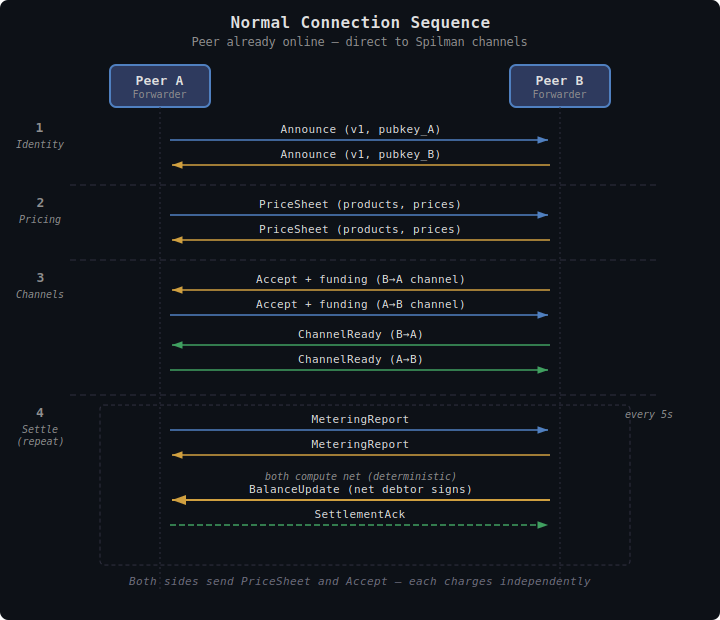

# TollGate Protocol

This document specifies the wire protocol for communication between TollGate peers — the messages exchanged, their encoding, and their sequencing.

## Overview

The TollGate protocol is a set of messages exchanged between authenticated peers to negotiate pricing, establish payment channels, meter traffic, and settle balances. It is **transport-agnostic** — messages can travel over any bidirectional channel between peers (FIPS session, TCP socket, HTTP, custom transport). The implementation provides the transport; the protocol defines the messages.

**No handshake.** Peers are already authenticated out-of-band (by FIPS Noise IK, WireGuard, etc.). The TollGate protocol begins with an Announce message.

---

## Encoding

All messages use **CBOR** ([RFC 8949](https://www.rfc-editor.org/rfc/rfc8949)) encoding.

**Why CBOR over binary (FIPS-style)?**
- TollGate is transport-agnostic — messages may traverse different substrates. Self-describing format avoids custom parsers per transport.
- Variable-length fields (mint URLs, product lists) are natural in CBOR, awkward in fixed binary.
- Well-supported in Rust (`ciborium`, `minicbor`), Go, Python, TypeScript — important for interop with Cashu Spilman ecosystem.
- Compact enough for constrained devices (ESP32). CBOR is more compact than JSON, comparable to Protocol Buffers for small messages.

**Why not JSON?**
- Larger on the wire. Parsing overhead on constrained devices.

**Why not FIPS-style binary?**
- TollGate messages contain variable-length strings (mint URLs, units) and nested structures (product lists). Binary encoding for these is complex and fragile.
- FIPS binary encoding is optimized for fixed-structure, high-frequency, low-latency packets (TreeAnnounce, MMP reports). TollGate messages are infrequent (every 5s) and don't need that level of optimization.

### Message Framing

Each TollGate message is a CBOR map with a `type` field (integer) as discriminator:

```cbor
{
  0: <message_type>,    // u8 — message type tag
  ...                   // type-specific fields
}
```

Field keys are small integers (not strings) for compactness:

| Key | Name | Present in |
|-----|------|-----------|
| 0 | `type` | All messages |
| 1-9 | Type-specific fields | Varies |

When carried over a stream transport (TCP, FIPS session), each message is prefixed with a 2-byte little-endian length. Datagram transports use natural message boundaries.

---

## Message Types

| Type | Name | Direction | Purpose |
|------|------|-----------|---------|
| 0x00 | Announce | Bidirectional | "I am a TollGate node" — protocol version, pubkey |
| 0x01 | PriceSheet | Bidirectional | Offer products and per-peer pricing (each side sends) |
| 0x02 | Accept | Bidirectional | Accept price sheet, provide Spilman funding |
| 0x03 | ChannelReady | Bidirectional | Confirm Spilman channel funded and active |
| 0x04 | MeteringReport | Bidirectional | Unsigned traffic stats for this interval |
| 0x05 | BalanceUpdate | Net debtor → creditor | Signed Spilman update for the net amount owed |
| 0x06 | SettlementAck | Net creditor → debtor | Confirm balance update accepted |
| 0x07 | BootstrapToken | Peer → Forwarder | Regular Cashu token (pre-channel bootstrap) |
| 0x08 | BootstrapAck | Forwarder → Peer | Acknowledge bootstrap token |
| 0x09 | RolloverInit | Leader → Follower | New channel alongside exhausting one |
| 0x0A | RolloverReady | Follower → Leader | New channel funded, ready |
| 0x0B | ChannelClose | Either → Either | Request cooperative close |
| 0x0C | CloseAck | Either → Either | Acknowledge close |
| 0x0D | Reject | Either → Either | Reject proposal (with reason) |
| 0x0E | Disconnect | Either → Either | Orderly teardown |

---

## Message Definitions

### 0x00 Announce

First message sent by each peer after network-layer authentication. Identifies the sender as a TollGate node and declares the protocol version.

```cbor
{
  0: 0x00,                         // type: Announce
  1: <protocol_version>,           // u8 — current: 1
  2: <pubkey>,                     // bytes(33) — sender's compressed secp256k1 public key
}
```

Both peers send Announce. If versions don't match, the peer with the lower version sends Reject. No other message exchange occurs before Announce.

### 0x01 PriceSheet

Sent by each peer after Announce. Contains one or more product offerings with per-peer pricing. The peer chooses one product and one mint option. This is the "take it or leave it" offer.

```cbor
{
  0: 0x01,                         // type: PriceSheet
  1: [                             // array of products
    {
      1: <product_id>,             // bytes(32) — SHA256 of full product (including pricing)
      2: <bandwidth_limit>,        // u64 — bytes/sec, 0 = unlimited
      3: <pricing_scale>,          // u64 — default 1000
      4: [                         // array of mint options
        {
          1: <option_id>,          // bytes(32) — SHA256(mint_url | unit)
          2: <mint_url>,           // text — mint URL
          3: <price_per_second>,   // i64 — scaled integer
          4: <price_per_byte>,     // i64 — scaled integer
          5: <unit>,               // text — "sat", "msat", "usd"
        },
        ...
      ],
    },
    ...
  ],
  2: [<min_interval_ms>, <max_interval_ms>],  // [u32, u32] — settlement interval range
}
```

### 0x02 Accept

Sent by the peer to accept the price sheet. References the chosen product and mint option by their hashed IDs — no ambiguity about which pricing was selected.

```cbor
{
  0: 0x02,                         // type: Accept
  1: <product_id>,                 // bytes(32) — echoes the accepted product
  2: <option_id>,                  // bytes(32) — chosen mint option (by hash)
  3: [<min_interval_ms>, <max_interval_ms>],  // [u32, u32] — peer's interval range
  4: <channel_funding>,            // bytes — Spilman funding proofs (CBOR-encoded)
}
```

The settlement interval is resolved deterministically by both sides:
```
overlap = max(A.min, B.min) .. min(A.max, B.max)
interval = (overlap.start + overlap.end) / 2
```

If ranges don't overlap, the Accept is implicitly rejected.

### 0x03 ChannelReady

Sent after the receiver verifies funding proofs and the channel is active.

```cbor
{
  0: 0x03,                         // type: ChannelReady
  1: <channel_id>,                 // bytes(32) — Spilman channel ID
  2: <direction>,                  // u8 — 0 = A→B, 1 = B→A
}
```

Both peers send ChannelReady for their respective channel directions. Traffic metering begins when both channels are ready.

### Metering Baseline

When a session starts (both ChannelReady messages exchanged), both sides reset their metering counters to zero. This establishes a shared baseline — if either node restarted, its counters were already at zero; if neither restarted, both agree to start fresh from this point.

All MeteringReport values are **deltas since the last report**, not cumulative from some epoch. The first MeteringReport after ChannelReady covers the interval from baseline to the first settlement tick. This means node restarts are transparent — the Spilman channel's cumulative balance is the authoritative payment record, and metering counters only need to be consistent within the current session.

### 0x04 MeteringReport

Sent by both peers at each settlement interval. Contains **unsigned** traffic stats only — no balance signature. This exchange allows both sides to compute the same cost and determine the net.

```cbor
{
  0: 0x04,                         // type: MeteringReport
  1: <elapsed_ms>,                 // u64 — milliseconds since last settlement
  2: <bytes_forwarded>,            // u64 — bytes we forwarded TO this peer this interval
  3: <bytes_received>,             // u64 — bytes we received FROM this peer this interval
  4: <new_product_id>,             // bytes(32) | null — updated product ID for next interval
  5: <new_pricing>,                // array | null — updated pricing if product_id changed
}
```

Both peers send MeteringReport. Once both reports are received, each side independently computes:
1. Cost A owes B = B's pricing applied to A's forwarded bytes + elapsed time
2. Cost B owes A = A's pricing applied to B's forwarded bytes + elapsed time
3. Net = cost A owes B - cost B owes A
4. If net > 0: A is the debtor (sends BalanceUpdate on A→B channel)
5. If net < 0: B is the debtor (sends BalanceUpdate on B→A channel)
6. If net = 0: no BalanceUpdate needed

This is deterministic — both sides compute the same result from the same inputs.

**Fields 4-5** are the price renegotiation mechanism. If the forwarder wants to change prices, it includes the new product_id and pricing. The peer must accept (by continuing with next MeteringReport) or reject (by sending ChannelClose).

### 0x05 BalanceUpdate

Sent by the **net debtor** after both MeteringReports have been exchanged. Contains the signed Spilman balance update for only the net amount owed.

```cbor
{
  0: 0x05,                         // type: BalanceUpdate
  1: <channel_id>,                 // bytes(32) — the debtor's Spilman channel
  2: <cumulative_balance>,         // u64 — new cumulative balance on this channel
  3: <balance_signature>,          // bytes(64) — Schnorr signature over balance update
  4: <net_amount>,                 // u64 — the net amount being settled this interval
}
```

### 0x06 SettlementAck

Sent by the creditor to confirm the balance update.

```cbor
{
  0: 0x06,                         // type: SettlementAck
  1: <channel_id>,                 // bytes(32)
  2: <accepted_balance>,           // u64 — the cumulative balance we acknowledge
}
```

### 0x07 BootstrapToken

Sent when a peer can't reach a mint and needs to pay with a regular Cashu token to get online.

```cbor
{
  0: 0x07,                         // type: BootstrapToken
  1: <token>,                      // bytes — raw Cashu token (NUT-00 format)
}
```

### 0x08 BootstrapAck

```cbor
{
  0: 0x08,                         // type: BootstrapAck
  1: <status>,                     // u8 — 0 = accepted (pending verification), 1 = rejected
  2: <reason>,                     // text | null — rejection reason
}
```

When offline, the forwarder accepts the token into a pending buffer (status=0) but cannot verify it until mint connectivity returns.

### 0x09 RolloverInit

Sent by the channel leader (lowest pubkey) when a channel approaches exhaustion (default: 80% capacity used).

```cbor
{
  0: 0x09,                         // type: RolloverInit
  1: <old_channel_id>,             // bytes(32) — current exhausting channel
  2: <new_channel_funding>,        // bytes — Spilman funding proofs for new channel
}
```

### 0x0A RolloverReady

```cbor
{
  0: 0x0A,                         // type: RolloverReady
  1: <old_channel_id>,             // bytes(32)
  2: <new_channel_id>,             // bytes(32) — new Spilman channel ID
}
```

After RolloverReady, the old channel continues draining to 100%. Once exhausted, charges continue on the new channel seamlessly.

### 0x0B ChannelClose

Request cooperative close of a channel.

```cbor
{
  0: 0x0B,                         // type: ChannelClose
  1: <channel_id>,                 // bytes(32)
  2: <final_balance>,              // u64 — proposed final balance
  3: <final_signature>,            // bytes(64) — signature over final balance
  4: <reason>,                     // u8 — 0 = normal, 1 = price_rejected, 2 = peer_leaving
}
```

### 0x0C CloseAck

```cbor
{
  0: 0x0C,                         // type: CloseAck
  1: <channel_id>,                 // bytes(32)
  2: <accepted_balance>,           // u64 — agreed final balance
}
```

### 0x0D Reject

General-purpose rejection for any proposal.

```cbor
{
  0: 0x0D,                         // type: Reject
  1: <rejected_type>,              // u8 — type of message being rejected
  2: <reason_code>,                // u8 — machine-readable reason
  3: <reason_text>,                // text | null — human-readable reason
}
```

**Reason codes:**

| Code | Meaning |
|------|---------|
| 0x01 | Price too high |
| 0x02 | Mint not accepted |
| 0x03 | Unit not accepted |
| 0x04 | Settlement interval out of range |
| 0x05 | Channel funding invalid |
| 0x06 | Balance verification failed |
| 0x07 | Drift tolerance exceeded |
| 0x08 | Product changed, renegotiation required |
| 0x09 | Protocol version unsupported |
| 0xFF | Other (see reason_text) |

### 0x0E Disconnect

Orderly teardown of the entire TollGate relationship.

```cbor
{
  0: 0x0E,                         // type: Disconnect
  1: <reason_code>,                // u8 — same codes as Reject
}
```

---

## Message Sequences

### Normal Connection (Peer Already Online)



```
Peer B connects to Node A (already authenticated by network layer)

A → B: Announce (protocol v1, pubkey_A)
B → A: Announce (protocol v1, pubkey_B)

A → B: PriceSheet (A's products, pricing, interval range)
B → A: PriceSheet (B's products, pricing, interval range)
B → A: Accept (chosen product_id + option_id from A's sheet, Spilman funding for B→A channel)
A → B: Accept (chosen product_id + option_id from B's sheet, Spilman funding for A→B channel)
B → A: ChannelReady (B→A channel)
A → B: ChannelReady (A→B channel)

[metering begins — both channels active]

every <interval>:
  A → B: MeteringReport (bytes forwarded, bytes received, elapsed)
  B → A: MeteringReport (bytes forwarded, bytes received, elapsed)

  [both compute net: who owes whom and how much]

  debtor → creditor: BalanceUpdate (signed, net amount on debtor's channel)
  creditor → debtor: SettlementAck
```

Both sides send PriceSheet and Accept because each charges independently. The settlement flow is deterministic: both sides have the same metering data and pricing, so they compute the same net independently.

### Bootstrap Connection (Peer Offline, No Mint)

```
A → B: Announce
B → A: Announce

A → B: PriceSheet
B → A: BootstrapToken (regular Cashu token)
A → B: BootstrapAck (status=accepted, pending verification)

[A grants B limited connectivity — enough to reach a mint]

B reaches mint, creates Spilman funding:
B → A: PriceSheet
A → B: Accept (with Spilman funding)
B → A: Accept (with Spilman funding)
... continues as normal connection
```

### Price Change at Settlement

```
A wants to raise price for B:

A → B: MeteringReport (fields 4-5: new_product_id + new_pricing)
B → A: MeteringReport (acknowledges by continuing)

[next interval uses new price]

OR:

A → B: MeteringReport (fields 4-5: new_product_id + new_pricing)
B → A: ChannelClose (reason=price_rejected)
A → B: CloseAck

[channel settles, B may renegotiate or disconnect]
```

### Channel Rollover

```
Channel B→A at 80% capacity:

Leader → Follower: RolloverInit (old channel + new funding)
Follower → Leader: RolloverReady (new channel ID)

[old channel continues draining to 100%]
[once exhausted, charges continue on new channel]
[old channel settles with mint when possible]
```

### Zero-Price Peering

```
A → B: Announce
B → A: Announce

A → B: PriceSheet (all prices = 0)
B → A: PriceSheet (all prices = 0)
B → A: Accept (no Spilman funding — zero price)
A → B: Accept (no Spilman funding — zero price)

[forwarding active, no metering, no settlement messages]
```

---

## Protocol Versioning

The protocol version is declared in the Announce message (field 1). Both peers must support the same version. If versions don't match, the peer with the lower version sends Reject with reason code 0x09 (protocol version unsupported).

Version negotiation is outside scope for v1 — both peers must run the same version. Future versions may add a version negotiation step.

---

## Size Estimates

Typical message sizes (CBOR encoded):

| Message | Estimated size |
|---------|---------------|
| Announce | ~40 bytes |
| PriceSheet (1 product, 1 mint) | ~120 bytes |
| PriceSheet (2 products, 3 mints) | ~350 bytes |
| Accept | ~200 bytes (dominated by Spilman funding) |
| ChannelReady | ~40 bytes |
| MeteringReport | ~50 bytes |
| BalanceUpdate | ~110 bytes |
| SettlementAck | ~40 bytes |
| BootstrapToken | Variable (Cashu token size) |
| RolloverInit | ~200 bytes (Spilman funding) |
| ChannelClose | ~110 bytes |
| Disconnect | ~10 bytes |

These are infrequent messages (every 5s for settlement, one-time for setup). CBOR overhead is negligible compared to traffic being metered.

---

## Design Decisions

| Decision | Resolution | Rationale |
|----------|-----------|-----------|
| Encoding | CBOR (RFC 8949) | Compact, self-describing, handles variable strings/arrays, cross-platform |
| Framing | 2-byte LE length prefix (stream) or datagram boundaries | Simple, matches FIPS pattern |
| Field keys | Small integers, not strings | Compact, avoids string overhead in CBOR |
| Message discrimination | Integer `type` field (key 0) | Simple, extensible |
| First message | Announce (protocol version + pubkey) | Identifies TollGate capability before negotiation |
| Mint option ID | SHA256(mint_url \| unit) | Unambiguous reference to chosen pricing option |
| Settlement flow | MeteringReport (both) → BalanceUpdate (net debtor only) → Ack | Deterministic netting, only net amount moves |
| Price changes | Piggybacked on MeteringReport (fields 4-5) | No extra round-trips |
| Zero-price mode | Accept without funding, skip metering | Simplest path for free peering |
| Channel leadership | Lowest pubkey leads rollover | Deterministic, avoids coordination races |
| Versioning | Single byte in Announce, must-match | Simple for v1, can add negotiation later |
| Reject | General-purpose with reason codes | One message type handles all rejection scenarios |
