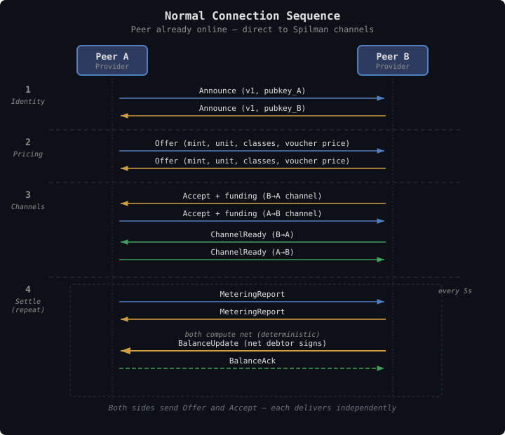
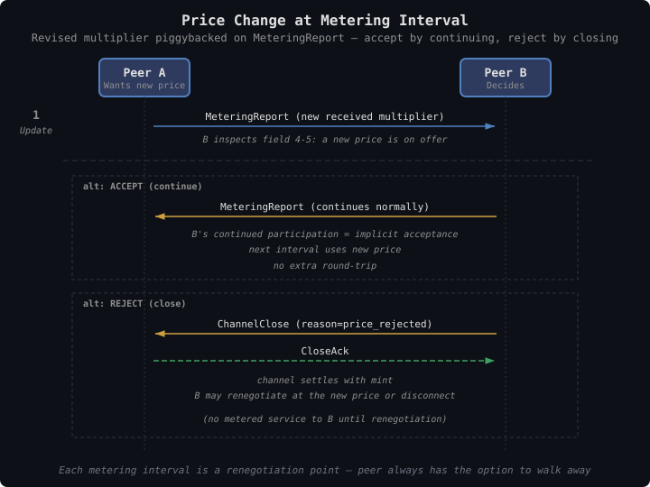
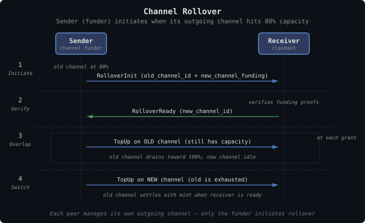
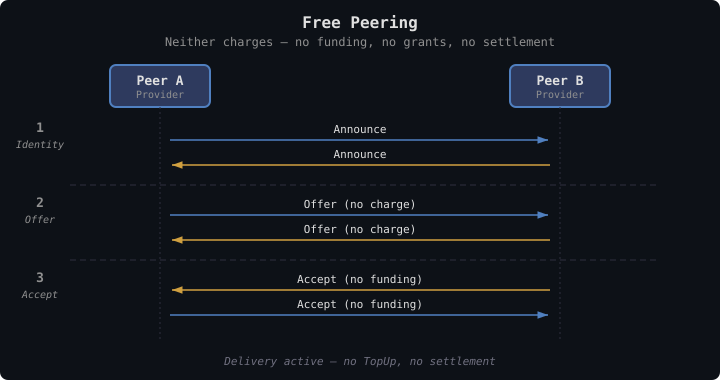

# TollGate Protocol

This document specifies the wire protocol for communication between TollGate peers — the messages exchanged, their encoding, and their sequencing.

## Overview

The TollGate protocol is a set of messages exchanged between authenticated peers to agree what is accepted, establish payment channels, and buy capacity in advance. It is **transport-agnostic** — messages can travel over any bidirectional channel between peers (FIPS session, TCP socket, HTTP, custom transport). The implementation provides the transport; the protocol defines the messages.

**No handshake.** Peers are already authenticated out-of-band (by FIPS Noise IK, WireGuard, etc.). The TollGate protocol begins with an Announce message.

---

## Encoding

All messages use **CBOR** ([RFC 8949](https://www.rfc-editor.org/rfc/rfc8949)) encoding.

**Why CBOR over binary (FIPS-style)?**
- TollGate is transport-agnostic — messages may traverse different substrates. Self-describing format avoids custom parsers per transport.
- Variable-length fields (mint URLs, units) are natural in CBOR, awkward in fixed binary.
- Well-supported in Rust (`ciborium`, `minicbor`), Go, Python, TypeScript — important for interop with Cashu Spilman ecosystem.
- Compact enough for constrained devices (ESP32). CBOR is more compact than JSON, comparable to Protocol Buffers for small messages.

**Why not JSON?**
- Larger on the wire. Parsing overhead on constrained devices.

**Why not FIPS-style binary?**
- TollGate messages contain variable-length strings (mint URLs, units). Binary encoding for these is complex and fragile.
- FIPS binary encoding is optimized for fixed-structure, high-frequency, low-latency packets (TreeAnnounce, MMP reports). TollGate messages are infrequent — a handful at setup, then one per grant — and don't need that level of optimization.

### Message Structure

Each TollGate message is a CBOR map with a `type` field (integer) as discriminator:

```cbor
{
  0: <message_type>,    // u8 — message type tag
  ...                   // type-specific fields
}
```

Field keys are small integers (not strings) for compactness:

| Key | Name | Present in |
|-----|------|-----------|
| 0 | `type` | All messages |
| 1-9 | Type-specific fields | Varies |

How messages are framed on the wire depends on the transport — see [Transports](#transports).

---

## Protocol Boundary

The payment protocol and the market are deliberately separate, and the
separation is structural rather than a convention:

- **No amount in any TollGate message is denominated in money.** Messages
  count units and vouchers. Sats appear nowhere.
- **No TollGate message buys, sells or swaps a voucher.** Acquiring vouchers
  happens before a session and outside it.
- **Market operations use their own endpoints and their own protocol** — see
  [market-protocol.md](../market/market-protocol.md). They may be served by a
  different process, a different host, or a third party entirely.
- **A node that offers no market services is fully functional.** It sells its
  own vouchers through its Cashu mint, or does not sell them at all, and
  peers arrive holding what they need.

The Offer carries no price at all. It names which mints this node will take
payment in, and one unsigned multiplier saying how much a unit carried
*outward* on the peer's behalf counts. Neither is denominated in money.

---

## Transports

The protocol is transport-agnostic, but each transport needs a concrete spec
for how CBOR messages are framed, how peers detect failure, and how sessions
resume. **v1 defines one: raw TCP.** HTTP polling and WebSocket are recorded
below as future alternatives for the cases raw TCP cannot reach.

**The transport carries no security burden.** The end goal is FIPS, where a
Noise IK handshake mutually authenticates and encrypts every link before
TollGate sees the peer ([peering-fips.md](../network-peering/peering-fips.md)).
On plain IP without FIPS the operator chooses what to wrap the connection in —
nothing, TLS, WireGuard, mTLS — and accepts the trade-off; see Transport Layer
Security in [peering-ip.md](../network-peering/peering-ip.md).

### Raw TCP

Default port **4747**.

**Why this one first.** Peerings are adjacent by construction — hop-by-hop
payment means the counterparty is one link away, usually the LAN or WiFi the
peer just associated with. There are no proxies, TLS terminators or corporate
middleboxes in between, which is the usual argument for dressing a protocol up
as HTTP. Skipping that costs nothing here and saves a great deal on
constrained devices: no HTTP parsing, no SHA-1 or base64 for a WebSocket
upgrade, no frame parser with three payload-length encodings, no masking, no
ping/pong, no close handshake. Read two bytes, read the body, hand it to the
CBOR decoder.

The wire saving is incidental — a few bytes per message. The code saving is
the point.

**Framing:** each CBOR message is prefixed with a 2-byte little-endian length.

```
+------------+-----------------+------------+-----------------+----
|  len (LE)  |  CBOR message   |  len (LE)  |  CBOR message   | ...
+------------+-----------------+------------+-----------------+----
   2 bytes      <len> bytes       2 bytes      <len> bytes
```

The 2-byte prefix caps a message at 65535 bytes, which is a useful bound in
itself: a peer cannot announce a huge length and make the receiver allocate for
it. No TollGate message comes close to the cap.

**Bidirectionality:** native. Either side may send at any time.

**Identity:** each side sends Announce as its first message. Per-peer state is
keyed by the pubkey it carries.

**Failure detection:** no keepalive, because nothing needs to detect a peer
that stops paying — its grant expires, it drops to the minimum flow allowance,
and the link is left in a state that costs nothing to hold open. A peer that
sends nothing at all for `stale_timeout_seconds` (default 60) is dropped, which
covers both setup and a peer content to sit on the free allowance. The knob
already exists in [tollgate-configuration.md](tollgate-configuration.md).

**Orderly teardown:** send Disconnect, then close. A bare FIN is treated as an
unclean disconnect and triggers the same cleanup as a timeout — see
[Reboot / State Loss](tollgate-payment-channels.md#reboot--state-loss).

**Reconnection:** a new connection starts a fresh session with a new Announce.
If the listener still holds state for that pubkey, the friendly path applies
and it shares the channel state back.

### Future: HTTP polling

Raw TCP fails where something between the peers blocks an unusual port. That is
not the common case for adjacent peerings, but it is real for
internet-traversing infrastructure peering — a relay paying a known upstream
across the public internet — and for any deployment behind a hostile network.

The shape, if it is added: `POST /tollgate/v1/exchange`, `application/cbor`,
request and response bodies each carrying zero or more messages with the same
2-byte length framing. Every POST is a full exchange: the request carries
client-to-server messages, the response carries whatever the server has
queued. Client polls when it has something to send or is waiting on a
TopUpReject; the server marks a peer gone after `stale_timeout_seconds`.

Being stateless on the wire, it also suits a client that cannot hold a
connection open.

### Future: WebSocket

For clients that must look like a browser, or reach through something that
only passes HTTP. `GET /tollgate/v1/ws` with an HTTP Upgrade, one CBOR message
per binary frame — the frame boundary replaces the length prefix. Liveness via
ping/pong rather than the transport's own idle timeout.

This is the only option that a browser can originate, since JavaScript cannot
open a raw socket. Whether that matters depends on whether a browser is ever a
TollGate peer; human-facing UI is currently a non-goal
([tollgate-intro.md](tollgate-intro.md)).

---

## Message Types

| Type | Name | Direction | Purpose |
|------|------|-----------|---------|
| 0x00 | Announce | Bidirectional | "I am a TollGate node" — protocol version, pubkey |
| 0x01 | Offer | Bidirectional | Accepted mints, unit, window range, received multiplier |
| 0x02 | Accept | Bidirectional | Accept the offer, provide Spilman funding |
| 0x03 | ChannelReady | Bidirectional | Confirm Spilman channel funded and active |
| 0x04 | TopUp | Payer → provider | Signed Spilman update buying a rate for a bounded window |
| 0x05 | TopUpReject | Provider → payer | Refuse a grant, with the rate that would be accepted |
| 0x06 | RolloverInit | Sender → Receiver | New channel alongside exhausting one |
| 0x07 | RolloverReady | Receiver → Sender | New channel funded, ready |
| 0x08 | ChannelClose | Either → Either | Request cooperative close |
| 0x09 | CloseAck | Either → Either | Acknowledge close |
| 0x0A | Reject | Either → Either | Reject proposal (with reason) |
| 0x0B | Disconnect | Either → Either | Orderly teardown |

---

## Message Definitions

### 0x00 Announce

First message sent by each peer after network-layer authentication. Identifies the sender as a TollGate node, declares the protocol version, and signals which optional capabilities it supports.

```cbor
{
  0: 0x00,                         // type: Announce
  1: <protocol_version>,           // u8 — current: 1
  2: <pubkey>,                     // bytes(33) — sender's compressed secp256k1 public key
  3: <unit>,                       // text — "bytes", "wh", "ml", etc.
  4: <capabilities>,               // u32 — bitfield of supported capabilities
}
```

Both peers send Announce. If versions don't match, the peer with the lower version sends Reject. No other message exchange occurs before Announce.

**Capability bits** (field 4):

| Bit | Name | Meaning |
|-----|------|---------|
| `0x01`–`0x80000000` | reserved | Must be zero in v1. Reserved for future capabilities (e.g., FSP transport, batch settlement). |

Spilman support is universal in v1 — there is no per-token payment mode to signal. Free peering and channel rollover fall out of the existing message set and need no capability bit either.

### 0x01 Offer

Sent by each peer after Announce. Declares which mints the sender will take
payment in, and how welcome the peer's outgoing traffic is.

```cbor
{
  0: 0x01,                         // type: Offer
  1: [<mint_url>, ...],            // text array — mints accepted, most preferred
                                   //   first; at least one entry
  2: <unit>,                       // text — "byte", "wh", "ml"
  3: [<min_window_ms>, <max_window_ms>],  // [u32, u32] — grant window bounds
  4: <received_multiplier>,        // u16 — surcharge on units I receive from you,
                                   //   on top of you paying for what I deliver.
                                   //   Default 0 = no surcharge
}
```

Field 1 is ordered: the first entry is what the sender would rather hold, and
a payer that can fund in any of them should fund in the earliest it can. An
Offer with an empty list is malformed — a node that will take no payment has
nothing to offer.

**There is no price here.** Delivery is one voucher per unit
([tollgate-vouchers.md](tollgate-vouchers.md)), and what a voucher costs in
money is settled on the market. A mint is either accepted or it is not —
there is no haircut, because what an issuer's paper is worth is expressed in
what you pay for it, not in a discount applied at settlement.

The sender's **own** mint need not appear at all. A peer never needs it: it
funds its channel in one of the mints this node listed, and this node pays the
peer in one of the mints the *peer* listed. A pure pass-through relay can
therefore name its upstream's mint alone and never issue vouchers of its own.

**Field 3 bounds what the payer may ask for.** Every payment is a grant of
units to be spent inside a window the payer chooses, and the rate it buys is
the one divided by the other ([tollgate-vouchers.md](tollgate-vouchers.md)).
The payer picks any window in this range, per grant, without negotiating.

- `max_window_ms` caps how far ahead capacity can be bought, which is what
  stops a buyer accumulating off-peak claims to spend at peak.
- `min_window_ms` caps how often a grant can arrive, and therefore how many
  signature verifications per second a payer can impose. On a constrained
  provider that is the binding limit, not bandwidth.

The base rule is symmetric and needs no field: **each side pays for what it
received**, which is what the other delivered. Both owe, both fund a channel,
and each buys its own grants.

`received_multiplier` is a surcharge on top of that, for the case where a node
would rather not carry what a peer pushes at it. It defaults to `0`. It is
applied as a **consumption weight**: a unit the peer uploads draws `m` units
from that peer's grant, where a unit it downloads draws one. Because the peer
is still paid for delivering, the **net** rate on its upload is `m − 1`: `1`
makes the upload free, `2` charges it at the same rate as a download, `k + 1`
charges it at `k` times ([tollgate-vouchers.md](tollgate-vouchers.md)).

It is **unsigned**. A negative surcharge would mean paying a peer on top of
already paying for its delivery, compounding into the sink hazard
([tollgate-hazards.md](tollgate-hazards.md)) — so it is unrepresentable rather
than merely forbidden.

Keysets are fetched from each mint by ordinary Cashu means (NUT-01/02). The
protocol does not restate them.

The multiplier is the only field that can change mid-session, by sending a
revised Offer. It takes effect on the payer's **next** grant — a grant already
bought is priced at the multiplier that was in force when it was bought. The
accepted-mint set is fixed for the session, because a peer's channel is funded
in a specific mint and dropping it would strand the channel.

### 0x02 Accept

Sent by the peer to accept the offer and fund its outgoing channel.

```cbor
{
  0: 0x02,                         // type: Accept
  1: <channel_funding>,            // bytes — Spilman funding proofs (CBOR-encoded)
}
```

There is nothing to echo back. The payer picks a mint from the list the offer
already carried; the unit and multiplier admit no choice; and the window is
chosen per grant rather than agreed once, so there is no range to reconcile.

Funding the channel buys nothing on its own. It opens the channel the grants
will be signed against.

### 0x03 ChannelReady

Sent after the receiver verifies funding proofs and the channel is active.

```cbor
{
  0: 0x03,                         // type: ChannelReady
  1: <channel_id>,                 // bytes(32) — Spilman channel ID
}
```

Sent by the party that verified the funding, which is the party that will be
paid on that channel — so the direction is implied by who sent it and needs no
field. Both peers send one, for the channel each will receive on. Delivery may
begin as soon as a channel's first grant arrives.

### Grant State

When a session starts (both ChannelReady messages exchanged), each side zeroes
the grant state it keeps for the peer paying it:

```
authorized   0        cumulative units the payer has signed for, ever
consumed     0        cumulative units drawn against them
deadline     —        when the current grant stops being spendable
```

`authorized − consumed` is what the peer may still spend, and it is never
negative. Nothing here is exchanged: the payer knows what it signed, the
provider knows what it delivered, and neither has to tell the other.

### 0x04 TopUp

Sent by the payer whenever it wants capacity. It is the Spilman balance update
and the purchase of a rate in one message, and it is the **only** payment
message in the protocol.

```cbor
{
  0: 0x04,                         // type: TopUp
  1: [                             // array — one entry per channel, 1..=8
       [<channel_id>,              //   bytes(32) — a Spilman channel of the payer's
        <cumulative>,              //   u64 — total units authorized on THAT channel, ever
        <signature>],              //   bytes(64) — Schnorr over (channel_id, cumulative)
       ...
     ],
  2: <window_ms>,                  // u32 — spend the grant within this long, from receipt
}
```

**The grant is the combined increase across every update.** One message may
ratchet several channels, which is what lets a single purchase span a channel
that is filling up and its replacement, and what lets a payer holding vouchers
from more than one accepted mint spend from several at once. The unit is the
same whoever issued it; only the issuer differs.

The array is capped at **8** entries. Each one costs the provider a signature
verification, and `min_window_ms` bounds only how *often* a TopUp may arrive —
without a cap the array would multiply straight through that budget, which on a
constrained provider is the binding limit rather than bandwidth.

On receipt, with `signed[c]` the cumulative total already ratcheted on channel
`c`:

```
for each update:
    verify signature
    require the channel is one we recognise   // funded, verified, not yet settled
    require cumulative > signed[channel]
    require cumulative <= capacity[channel]
    require the channel appears only once

grant      = Σ (cumulative - signed[channel])   // this purchase alone
require min_window_ms <= window_ms <= max_window_ms

for each update: signed[channel] = cumulative
consumed   = authorized                  // the old grant's remainder burns now
authorized = authorized + grant
deadline   = now + window_ms
rate       = grant / window_ms           // fixed for the life of the grant
```

**Applied atomically.** If any update fails, the whole message is refused —
applying some of them would leave the grant a different size from the one the
payer asked for and paid for.

**A grant replaces the previous one, it does not add to it.** Buying again
before the old window runs out forfeits whatever was left of it. That is the
payer's risk and it is what makes the product bandwidth rather than a stored
quantity of bytes: capacity that was not used is gone, exactly as it is for the
provider, who cannot sell a second twice either.

The forfeit is bounded by the window the payer chose, so **window length is the
payer's risk dial.** Short windows keep the loss from raising the rate mid-flight
small and reaction quick, at the cost of more signature verifications. Long
windows cut message count and punish misjudgment.

**`cumulative` is monotonic**, which is what the Spilman ratchet requires — the
provider always holds the highest-value state and can settle it at any time.
Monotonicity also makes TopUp idempotent: a lost message costs nothing because
the next one carries the correct total, and a reordered one is discarded by the
`cumulative > authorized` check. **So no acknowledgment is needed**, and a payer
may raise its rate and start using it without waiting a round trip.

`window_ms` is measured **from receipt**, not against a timestamp, so the two
sides need no clock agreement. Flight time makes the payer's usable window
marginally shorter than the number it asked for, which errs in the provider's
favor.

**Consumption is weighted by the multiplier.** The provider draws down a single
grant for both directions of the link:

```
consumed += delivered + received × received_multiplier
```

At `m = 0` the peer's uploads draw nothing and the provider pays for them out of
its own grant on the other channel. At `m = 2` an uploaded unit draws the same
as a downloaded one. A peer that wants to upload heavily therefore has to buy a
larger grant, which is enforced by the shaper as the traffic happens instead of
appearing on a bill afterward.

**At the deadline** the provider sets `consumed = authorized`. Unspent capacity
expires and the payment is kept. Traffic does not stop dead — it falls back to
the minimum flow allowance ([tollgate-vouchers.md](tollgate-vouchers.md)), which
is what keeps a link alive between grants.

### 0x05 TopUpReject

Sent when the provider will not honor a grant — most often because the rate
would oversubscribe capacity it has already committed to other peers.

```cbor
{
  0: 0x05,                         // type: TopUpReject
  1: [                             // array — the states we are not ratcheting to
       [<channel_id>,              //   bytes(32)
        <cumulative>],             //   u64
       ...
     ],
  2: <max_rate_available>,         // u64 — units per second we would accept
  3: <reason>,                     // u8 — see Reject reason codes
}
```

The refused states are echoed in full because a purchase may span several
channels, so one channel id no longer identifies which purchase was refused.
Signatures are not echoed — the payer already holds them, and this message is
rare.

Declining to ratchet is already enough to leave the payer's money untouched —
an unclaimed Spilman state is worth nothing to the provider. The message exists
so the payer learns in one round trip instead of inferring it from throughput
that never arrived, and `max_rate_available` lets it re-purchase immediately at
a rate that will be taken.

This is admission control, and it is only possible because the payer states the
rate it wants up front for a bounded horizon. The provider can sum committed
rates across peers and refuse before taking the money.

### 0x06 RolloverInit

Sent by the channel sender (the funder) when its outgoing channel approaches exhaustion (default: 80% capacity used). Each channel does carry shared state (cumulative balance, signatures), but rollover is initiated by the funder alone — only the party putting up new funds needs to decide when to do it. There is no leader/follower coordination across the two channels in a peer pair.

```cbor
{
  0: 0x06,                         // type: RolloverInit
  1: <old_channel_id>,             // bytes(32) — current exhausting channel
  2: <new_channel_funding>,        // bytes — Spilman funding proofs for new channel
}
```

### 0x07 RolloverReady

```cbor
{
  0: 0x07,                         // type: RolloverReady
  1: <old_channel_id>,             // bytes(32)
  2: <new_channel_id>,             // bytes(32) — new Spilman channel ID
}
```

After RolloverReady, the old channel continues draining to 100%. Once exhausted, charges continue on the new channel seamlessly.

### 0x08 ChannelClose

Request cooperative close of a channel.

```cbor
{
  0: 0x08,                         // type: ChannelClose
  1: <channel_id>,                 // bytes(32)
  2: <final_balance>,              // u64 — proposed final balance
  3: <final_signature>,            // bytes(64) — signature over final balance
  4: <reason>,                     // u8 — 0 = normal, 1 = price_rejected, 2 = peer_leaving
}
```

### 0x09 CloseAck

```cbor
{
  0: 0x09,                         // type: CloseAck
  1: <channel_id>,                 // bytes(32)
  2: <accepted_balance>,           // u64 — agreed final balance
}
```

### 0x0A Reject

General-purpose rejection for any proposal.

```cbor
{
  0: 0x0A,                         // type: Reject
  1: <rejected_type>,              // u8 — type of message being rejected
  2: <reason_code>,                // u8 — machine-readable reason
  3: <reason_text>,                // text | null — human-readable reason
}
```

**Reason codes:**

| Code | Meaning |
|------|---------|
| 0x01 | Received multiplier unacceptable |
| 0x02 | Mint not in the accepted set |
| 0x03 | Unit not accepted |
| 0x04 | Grant window out of range |
| 0x05 | Channel funding invalid |
| 0x06 | Grant signature invalid, or cumulative not increasing |
| 0x07 | Rate exceeds available capacity |
| 0x08 | Grant exceeds remaining channel capacity |
| 0x09 | Protocol version unsupported |
| 0xFF | Other (see reason_text) |

### 0x0B Disconnect

Orderly teardown of the entire TollGate relationship.

```cbor
{
  0: 0x0B,                         // type: Disconnect
  1: <reason_code>,                // u8 — same codes as Reject
}
```

---

## Message Sequences

Both sides send Offer and Accept because each delivers independently. After
that the two payment streams are unsynchronized — each side tops up on its own
schedule, for its own windows, and neither waits for the other.

### Connection


<details><summary>Text version</summary>

```
  1. Identity
     A → B: Announce (v1, pubkey_A, capabilities)
     B → A: Announce (v1, pubkey_B, capabilities)

  2. Offer
     A → B: Offer (accepted mints, unit, window range, multiplier)
     B → A: Offer (accepted mints, unit, window range, multiplier)

  3. Channels
     B → A: Accept + funding (B→A channel)
     A → B: Accept + funding (A→B channel)
     A → B: ChannelReady   (A verified B's funding)
     B → A: ChannelReady   (B verified A's funding)

  4. Buy (each side, whenever it wants, no acknowledgment)
     A → B: TopUp (cumulative, window)    A buys a rate from B
     B → A: TopUp (cumulative, window)    B buys a rate from A
     ... each repeats before its own deadline, on its own schedule
```
</details>

A peer arrives already holding the other side's vouchers, or it gets no
service. There is no pre-channel phase.

### Raising the Rate Mid-Window

```
  B holds a grant from A: 6.25 M units over a 5 s window, 1.25 M/s.

  t=0    A → B: TopUp (cumulative 6.25M, window 5000)
                B shapes A to 1.25 M/s, deadline t=5

  t=3    A's traffic spikes. A does not wait for t=5.
         A → B: TopUp (cumulative 106.25M, window 5000)
                grant     = 106.25M - 6.25M = 100M
                rate      = 100M / 5 s = 20 M/s
                deadline  = t=8
                the 2.5 M A had left from the first grant burn at t=3

  No acknowledgment, no boundary to wait for. A may start pushing
  at the new rate immediately; the worst case is one RTT of shaping
  at the old rate while the message lands.
```

### Multiplier Change


<details><summary>Text version</summary>

```
  A wants to change what it charges for traffic B pushes at it:

  A → B: Offer (revised received multiplier, same mints and unit)

  alt: ACCEPT (continue)
       B → A: TopUp (next grant, priced at the new multiplier)

  alt: REJECT (close)
       B → A: ChannelClose (reason=price_rejected)
       A → B: CloseAck
       [channel settles, B may renegotiate or disconnect]

  A grant already bought keeps the multiplier it was bought under.
  Delivery is never repriced — B already holds A's vouchers.
```
</details>

### Channel Rollover


<details><summary>Text version</summary>

```
  Channel B→A at 80% capacity:

  Sender → Receiver: RolloverInit (old channel + new funding)
  Receiver → Sender: RolloverReady (new channel ID)

  [old channel continues draining to 100%]
  [once exhausted, charges continue on new channel]
  [old channel settles with mint when possible]
```
</details>

### Free Peering


<details><summary>Text version</summary>

```
  A → B: Announce
  B → A: Announce

  A → B: Offer (no charge)
  B → A: Offer (no charge)
  B → A: Accept (no Spilman funding — neither charges)
  A → B: Accept (no Spilman funding — neither charges)

  [delivery active, no grants, no TopUp messages]
```
</details>

---

## Protocol Versioning

The protocol version is declared in the Announce message (field 1). Both peers must support the same version. If versions don't match, the peer with the lower version sends Reject with reason code 0x09 (protocol version unsupported).

Version negotiation is outside scope for v1 — both peers must run the same version. Future versions may add a version negotiation step.

---

## Size Estimates

Typical message sizes (CBOR encoded):

| Message | Estimated size |
|---------|---------------|
| Announce | ~40 bytes |
| Offer (one mint) | ~80 bytes |
| Offer (3 accepted mints) | ~180 bytes |
| Accept | ~180 bytes (dominated by Spilman funding) |
| ChannelReady | ~40 bytes |
| TopUp | ~120 bytes (dominated by the signature) |
| TopUpReject | ~50 bytes |
| RolloverInit | ~200 bytes (Spilman funding) |
| ChannelClose | ~110 bytes |
| Disconnect | ~10 bytes |

Plus 2 bytes of length prefix per message. Setup messages are one-time. TopUp is the only one that repeats, at whatever rate the payer chooses within `min_window_ms`, and at ~120 bytes against a grant measured in megabytes the framing overhead is negligible. What is not negligible is the signature verification each one costs the provider, which is why `min_window_ms` exists.

---

## Design Decisions

| Decision | Resolution | Rationale |
|----------|-----------|-----------|
| Encoding | CBOR (RFC 8949) | Compact, self-describing, handles variable strings/arrays, cross-platform |
| Transport | Raw TCP for v1; HTTP polling and WebSocket recorded as future alternatives | Peerings are adjacent, so nothing sits between the peers to require HTTP dressing. Saves HTTP parsing, an upgrade handshake, a frame parser, masking and ping/pong on constrained devices |
| Framing | 2-byte little-endian length prefix per message | Also caps a message at 65535 bytes, so a peer cannot make the receiver allocate for a claimed huge length |
| Transport security | None at this layer | FIPS Noise IK authenticates and encrypts before TollGate sees the peer; on plain IP the operator wraps the connection as it sees fit |
| Keepalive | None | Non-payment is self-enforcing: the grant expires, the peer drops to the minimum flow allowance, and nothing has to detect anything. Setup uses `stale_timeout_seconds`, since no grant exists yet |
| Field keys | Small integers, not strings | Compact, avoids string overhead in CBOR |
| Message discrimination | Integer `type` field (key 0) | Simple, extensible |
| First message | Announce (protocol version + pubkey) | Identifies TollGate capability before negotiation |
| Payment timing | Prepaid: the grant is bought before the traffic it covers | Holding a voucher is already a claim on the issuer, so prepaying adds no trust that was not already there. Postpaying would add provider credit risk on top of it for nothing |
| Payment message | One — TopUp, which is the Spilman update and the purchase at once | Settlement, metering exchange and balance acknowledgment all collapse into it |
| Channels per purchase | An array of updates, capped at 8; the grant is their combined increase, applied atomically | A cumulative total only means anything against the channel it was signed on, so spanning a rollover — or spending from several accepted mints — needs several ratchets in one message. Splitting them across messages would leave the provider unable to tell one purchase from two, and a partial application would make the grant size ambiguous |
| Grant semantics | A grant replaces the previous one; the remainder burns | Selling a rate rather than a stored quantity. Without forfeiture a buyer could accumulate off-peak claims and spend them at peak |
| Grant state | Cumulative authorized, never decreasing | Satisfies the Spilman ratchet and makes TopUp idempotent, so lost and reordered messages are harmless and no acknowledgment is needed |
| Reaction latency | One message, no round trip | Fire-and-forget is safe because the state is cumulative, so a payer can raise its rate and use it immediately |
| Window bounds | `[min_window_ms, max_window_ms]`, provider-set, payer chooses per grant | `max` bounds buying off-peak for peak; `min` bounds signature verifications per second, which is the binding constraint on a constrained provider |
| Admission control | TopUpReject carries the rate that would be accepted | The payer states its rate up front for a bounded horizon, so the provider can refuse before taking the money instead of shaping afterward |
| Delivery pricing | None in the protocol — one voucher per unit, both directions | A voucher is a claim on one unit, so redemption is delivery |
| Accepted mints | One ordered list, at least one entry, no prices | Accept or refuse is binary. What an issuer's paper is worth is expressed in what you pay for it on the market, not in a settlement discount |
| Who pays | Each side pays for what it received, and buys its own grants | Both directions are funded independently, so there is no reverse payment anywhere |
| Received multiplier | Unsigned u16 per peer, applied as a consumption weight | Prices scarce uplink and signals how welcome a peer's traffic is. As a weight it is enforced by the shaper as traffic happens rather than appearing on a bill. Unsigned makes paying a peer to send traffic unrepresentable rather than merely forbidden |
| Metering counts | Unchanged: delivered and received, raw — but local | Measurement never changed. What changed is that it stopped being an input to payment, so the counters are no longer exchanged |
| Market operations | Separate endpoints and a separate protocol; never TollGate messages | Buying and swapping vouchers is not part of paying for delivery, and a node that offers neither is fully functional |
| Money in the protocol | Never appears | Sats are a market concern; the payment protocol only ever counts units and vouchers |
| Message numbering | Contiguous, 0x00–0x0B | No reserved gaps. v1 is unreleased, so the codes describe the protocol as designed rather than its history |
| ChannelReady direction | Implied by the sender | The party that verified the funding is the party that will be paid on that channel, so a direction field would restate what the sender already says |
| Free mode | Accept without funding, skip metering | Simplest path for free peering |
| Channel ownership | Each peer manages its own outgoing channel | Channels carry shared state, but rollover is initiated by the funder alone — only the party putting up new funds decides when to do it |
| Capability signaling | u32 bitfield in Announce (field 4), all bits reserved in v1 | Spilman is universal now that per-token payment is gone; the field stays for future use |
| Versioning | Single byte in Announce, must-match | Simple for v1, can add negotiation later |
| Reject | General-purpose with reason codes | One message type handles all rejection scenarios |
