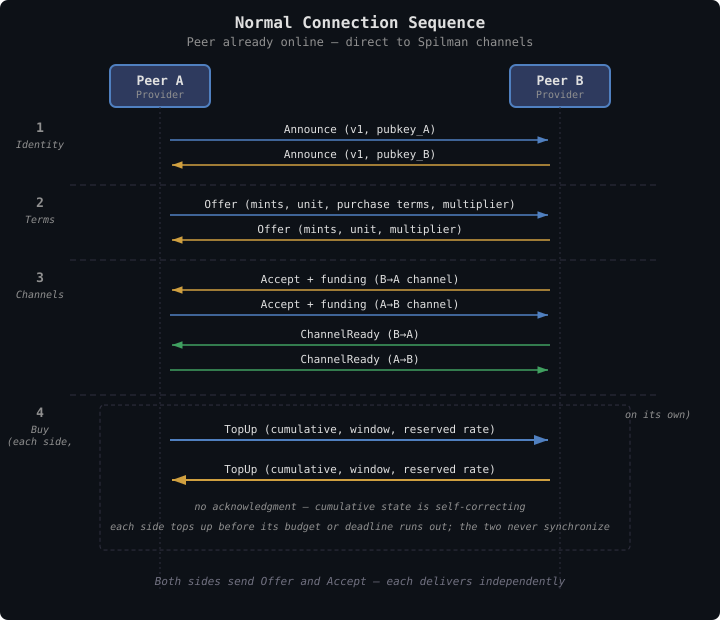
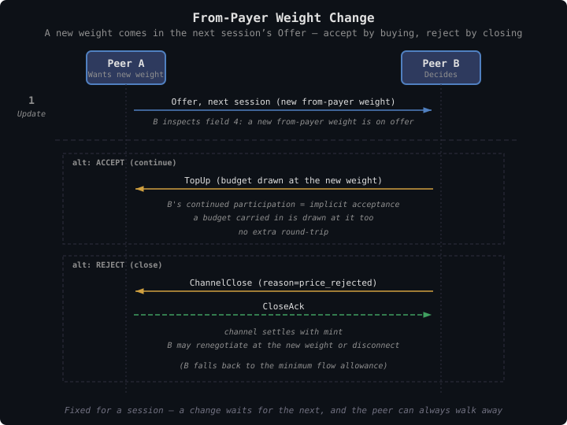
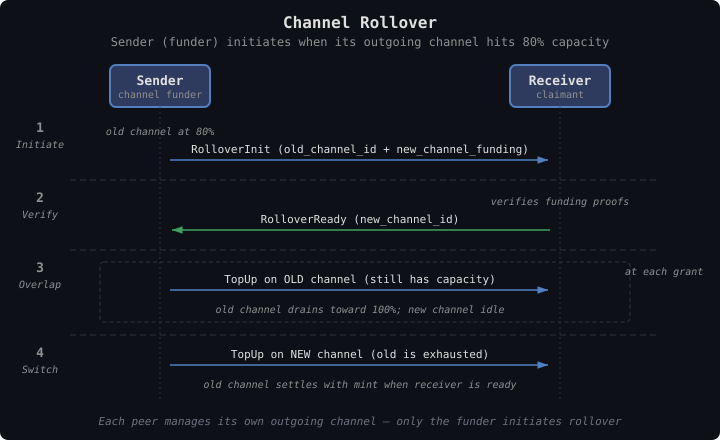
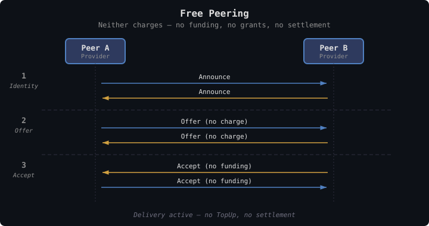

# TollGate Protocol

This document specifies the wire protocol for communication between TollGate peers — the messages exchanged, their encoding, and their sequencing.

## Overview

The TollGate protocol is a set of messages exchanged between authenticated peers to agree what is accepted, establish payment channels, and buy capacity in advance. It is **transport-agnostic** — messages can travel over any bidirectional channel between peers (FIPS session, TCP socket, HTTP, custom transport). The implementation provides the transport; the protocol defines the messages.

**No handshake.** Peers are already authenticated out-of-band (by FIPS Noise IK, WireGuard, etc.). The TollGate protocol begins with an Announce message.

---

## Encoding

All messages use **CBOR** ([RFC 8949](https://www.rfc-editor.org/rfc/rfc8949)) encoding.

**The normative definition of every message is the CDDL
([RFC 8610](https://www.rfc-editor.org/rfc/rfc8610)) schema
[`crates/tollgate-protocol/tollgate.cddl`](../../../crates/tollgate-protocol/tollgate.cddl):**
each key, its type, fixed sizes, which fields are optional and what their
absence means, and the unknown-key rule. This document explains the messages;
where the two differ, the schema wins. The codec's tests validate everything
it encodes against the schema, so when the code and the schema disagree, the
code is wrong, or both change in the same PR. The Spilman backend's funding
blob, opaque at this layer, has its own schema in
[`funding.cddl`](../../../crates/tollgate-net/src/channel/spilman/funding.cddl).

**Why CBOR over binary (FIPS-style)?**
- TollGate is transport-agnostic — messages may traverse different substrates. Self-describing format avoids custom parsers per transport.
- Variable-length fields (mint URLs, units) are natural in CBOR, awkward in fixed binary.
- Well-supported in Rust (`ciborium`, `minicbor`), Go, Python, TypeScript — important for interop with Cashu Spilman ecosystem.
- Compact enough for constrained devices (ESP32). CBOR is more compact than JSON, comparable to Protocol Buffers for small messages.

**Why not JSON?**
- Larger on the wire. Parsing overhead on constrained devices.

**Why not FIPS-style binary?**
- TollGate messages contain variable-length strings (mint URLs, units). Binary encoding for these is complex and fragile.
- FIPS binary encoding is optimized for fixed-structure, high-frequency, low-latency packets (TreeAnnounce, MMP reports). TollGate messages are infrequent — a handful at setup, then one per purchase — and don't need that level of optimization.

### Message Structure

Each TollGate message is a CBOR map with a `type` field (integer) as discriminator:

```cbor
{
  0: <message_type>,    // u8 — message type tag
  ...                   // type-specific fields
}
```

Field keys are small integers (not strings) for compactness:

| Key | Name | Present in |
|-----|------|-----------|
| 0 | `type` | All messages |
| 1-9 | Type-specific fields | Varies |

How messages are framed on the wire depends on the transport — see [Transports](#transports).

---

## Protocol Boundary

The payment protocol and the market are deliberately separate, and the
separation is structural rather than a convention:

- **No amount in any TollGate message is denominated in money.** Messages
  count units and vouchers. Sats appear nowhere.
- **No TollGate message buys, sells or swaps a voucher.** Acquiring vouchers
  happens before a session and outside it.
- **Market operations use their own endpoints and their own protocol** — see
  [market-protocol.md](../market/market-protocol.md). On a node they are
  served by `merchantd`, not the daemon that speaks this protocol
  ([tollgate-daemons.md](tollgate-daemons.md)); they may equally be served by
  a different host or a third party entirely.
- **A node that offers no market services is fully functional as a
  provider.** Its mint gives its vouchers away (auto-accept) or issues none to
  the public, and peers arrive holding what they need.

The Offer carries no price at all. It names which mints this node will take
payment in, and one unsigned weight saying how much a unit from the customer
counts against a unit to it. Neither is denominated in money.

---

## Transports

The protocol is transport-agnostic, but each transport needs a concrete spec
for how CBOR messages are framed, how peers detect failure, and how sessions
resume. **The protocol defines one: raw TCP.** HTTP polling and WebSocket are recorded
below as future alternatives for the cases raw TCP cannot reach.

**The transport carries no security burden.** The end goal is FIPS, where a
Noise IK handshake mutually authenticates and encrypts every link before
TollGate sees the peer ([peering-fips.md](../network-peering/peering-fips.md)).
On plain IP without FIPS the operator chooses what to wrap the connection in —
nothing, TLS, WireGuard, mTLS — and accepts the trade-off; see Transport Layer
Security in [peering-ip.md](../network-peering/peering-ip.md).

### Raw TCP

Default port **4747**.

**Why this one first.** Peerings are adjacent by construction — hop-by-hop
payment means the counterparty is one link away, usually the LAN or WiFi the
peer just associated with. There are no proxies, TLS terminators or corporate
middleboxes in between, which is the usual argument for dressing a protocol up
as HTTP. Skipping that costs nothing here and saves a great deal on
constrained devices: no HTTP parsing, no SHA-1 or base64 for a WebSocket
upgrade, no frame parser with three payload-length encodings, no masking, no
ping/pong, no close handshake. Read two bytes, read the body, hand it to the
CBOR decoder.

The wire saving is incidental — a few bytes per message. The code saving is
the point.

**Framing:** each CBOR message is prefixed with a 2-byte little-endian length.

```
+------------+-----------------+------------+-----------------+----
|  len (LE)  |  CBOR message   |  len (LE)  |  CBOR message   | ...
+------------+-----------------+------------+-----------------+----
   2 bytes      <len> bytes       2 bytes      <len> bytes
```

The 2-byte prefix caps a message at 65535 bytes, which is a useful bound in
itself: a peer cannot announce a huge length and make the receiver allocate for
it. No TollGate message comes close to the cap.

**Bidirectionality:** native. Either side may send at any time.

**Identity:** each side sends Announce as its first message. Per-peer state is
keyed by the pubkey it carries.

**Failure detection:** nothing needs to detect a peer that stops paying — its
budget runs out, it drops to the minimum flow allowance, and the link is left in
a state that costs nothing to hold open. What is detected is silence: a peer
that sends nothing at all for `stale_timeout_seconds` (default 60) is dropped.
The knob already exists in
[tollgate-configuration.md](tollgate-configuration.md).

**Keepalive:** silence has to mean dead, so no live node stays silent. A node
that has sent a peer nothing for a third of its own `stale_timeout_seconds`
(20 s by default, and the default's third when its own timeout is `0`) sends
that peer its Offer again. The payment streams alone do not guarantee a peer
hears from us: a TopUp is never answered, so a provider its payer does not
charge (Offer field 5) buys nothing back and would otherwise say nothing after
setup, and its payer would drop a healthy session once a minute. Free peering,
where neither side charges, is silent in both directions the same way.

The keepalive is the Offer rather than a new message because every node
already takes a revised Offer at any time, and one that revises nothing does
nothing — so it needs no capability bit, and a node that predates it still
counts it as hearing from us. The caveats:

- A node that predates it sends none. Paired with one, a payer it does not
  charge still drops it after `stale_timeout_seconds`, as before.
- The interval is reckoned from the sender's timeout, since the peer's is not
  advertised; a peer configured with a timeout shorter than a third of ours
  can still drop us.
- The Offer is replayed, not rebuilt: it is the last Offer sent to that peer,
  byte for byte, so a keepalive never changes the peer's terms. An operator
  override made mid-session is sent as a revised Offer when it is made, if it
  changes what that peer is offered — the window range, the smallest reserved
  rate, the gap between purchases, or field 5. A changed upstream weight is
  not: it waits for the peer's next session (see [Offer](#0x01-offer)). A
  payer told in a revision that it is now charged, with no channel toward that
  peer, funds one and sends Accept, as it would have at the opening.

**Orderly teardown:** send Disconnect, then close. The session is over: each
side settles the channels the other paid it on and holds nothing for a return.
A bare FIN is treated as an unclean disconnect and triggers the same cleanup as
a timeout — see
[Reboot / State Loss](tollgate-payment-channels.md#reboot--state-loss).

**Unclean disconnect:** after a bare FIN or `stale_timeout_seconds` of silence,
the session is held for another `stale_timeout_seconds` rather than dropped, so
a peer that comes back after a blip can resume its channels. If it does not, the
channels it paid on are settled. With the timeout at `0` nothing is held, and
they are settled at once.

**Reconnection:** a new connection starts a fresh session with a new Announce.
If the listener still holds state for that pubkey, the friendly path applies
and it shares the channel state back. Where both sides still hold it — a blip
rather than a reboot — the session starts over the kept channels: the channel
ids and the totals signed on them carry over. The payer's budget carries over
whether the channels do or not, as it does into any new session; its
reservation does not ([Grant State](#grant-state)). Each side sends one
ChannelReady per channel it is still paid on, between its Announce and its Offer. A payer that sees its channel named
keeps paying on it and funds nothing; one that does not, funds a new channel
and sends Accept, and an Accept tells the other side to settle the channels it
still held for that payer.

### Future: HTTP polling

Raw TCP fails where something between the peers blocks an unusual port. That is
not the common case for adjacent peerings, but it is real for
internet-traversing infrastructure peering — a relay paying a known upstream
across the public internet — and for any deployment behind a hostile network.

The shape, if it is added: `POST /tollgate/v1/exchange`, `application/cbor`,
request and response bodies each carrying zero or more messages with the same
2-byte length framing. Every POST is a full exchange: the request carries
client-to-server messages, the response carries whatever the server has
queued. Client polls when it has something to send or is waiting on a
TopUpReject; the server marks a peer gone after `stale_timeout_seconds`.

Being stateless on the wire, it also suits a client that cannot hold a
connection open.

### Future: WebSocket

For clients that must look like a browser, or reach through something that
only passes HTTP. `GET /tollgate/v1/ws` with an HTTP Upgrade, one CBOR message
per binary frame — the frame boundary replaces the length prefix. Liveness via
ping/pong rather than the transport's own idle timeout.

This is the only option that a browser can originate, since JavaScript cannot
open a raw socket. Whether that matters depends on whether a browser is ever a
TollGate peer; human-facing UI is currently a non-goal
([tollgate-intro.md](tollgate-intro.md)).

---

## Message Types

| Type | Name | Direction | Purpose |
|------|------|-----------|---------|
| 0x00 | Announce | Bidirectional | "I am a TollGate node" — protocol version, pubkey |
| 0x01 | Offer | Bidirectional | Accepted mints, unit, window range, upstream weight, smallest reserved rate, gap between purchases |
| 0x02 | Accept | Bidirectional | Accept the offer, provide Spilman funding |
| 0x03 | ChannelReady | Bidirectional | Confirm Spilman channel funded and active |
| 0x04 | TopUp | Payer → provider | Signed Spilman update adding to the payer's budget, with a window and a reserved rate |
| 0x05 | TopUpReject | Provider → payer | Refuse a purchase, with its reason and the reserved rate still free |
| 0x06 | RolloverInit | Sender → Receiver | New channel alongside exhausting one |
| 0x07 | RolloverReady | Receiver → Sender | New channel funded, ready |
| 0x08 | ChannelClose | Either → Either | Request cooperative close |
| 0x09 | CloseAck | Either → Either | Acknowledge close |
| 0x0A | Reject | Either → Either | Reject proposal (with reason) |
| 0x0B | Disconnect | Either → Either | Orderly teardown |
| 0x0C | Balance | Provider → payer | What is left of the payer's budget, until when, and its reserved rate |

---

## Message Definitions

### 0x00 Announce

First message sent by each peer after network-layer authentication. Identifies the sender as a TollGate node, declares the protocol version, and signals which optional capabilities it supports.

```cbor
{
  0: 0x00,                         // type: Announce
  1: <protocol_version>,           // u8 — current: 1
  2: <pubkey>,                     // bytes(33) — sender's compressed secp256k1 public key
  3: <unit>,                       // text — "byte", "wh", "ml", etc.
  4: <capabilities>,               // u32 — bitfield of supported capabilities
}
```

Both peers send Announce. If versions don't match, whichever side notices sends Reject and closes the connection. No other message exchange occurs before Announce.

**Capability bits** (field 4):

| Bit | Name | Meaning |
|-----|------|---------|
| `0x01`–`0x80000000` | reserved | Must be zero in v1. Reserved for future capabilities (e.g., FSP transport, batch settlement). |

Spilman support is universal in v1 — there is no per-token payment mode to signal. Free peering (Offer field 5) and channel rollover need no capability bit either.

### 0x01 Offer

Sent by each peer after Announce. Declares which mints the sender will take
payment in, what purchases it accepts, and how much the peer's upstream
counts.

```cbor
{
  0: 0x01,                         // type: Offer
  1: [<mint_url>, ...],            // text array — mints accepted, most preferred
                                   //   first; at least one entry
  2: <unit>,                       // text — "byte", "wh", "ml"
  3: [<min_window_ms>, <max_window_ms>],  // [u64, u64] — windows accepted
  4: <upstream_weight>,            // u16 — what one unit from you draws from
                                   //   your budget, where one unit to you draws
                                   //   one. Default 1; 0 = upstream is free
  5: true,                         // bool, optional — I will not charge you.
                                   //   Written only when true; absent = I charge
  6: <min_reserved_rate>,          // u64 — smallest reserved rate accepted,
                                   //   units/second; 0 = you may reserve nothing
  7: <min_topup_gap_ms>,           // u64 — shortest time between two TopUps
}
```

Field 5 is one-sided: it says only whether the sender charges the receiver,
never whether the receiver charges back. A customer that only buys sends it
to its provider. A receiver that sees it funds no channel toward the sender,
sends it no TopUp, and answers with an Accept whose funding is empty. It is
omitted rather than written as `false`, so the Offer of a node that charges is
byte-for-byte what it was before the field existed, and a peer that predates
it decodes it as charging. It does not relax field 1: the
mint list stays mandatory.

Field 5 changes mid-session only when an operator override for that peer
does, and the sender says so at once with a revised Offer. A receiver that
learns there that it is now charged, and has no channel toward the sender,
funds one and sends Accept with it, as at the opening; one that learns it is
no longer charged stops buying.

Field 1 is ordered: the first entry is what the sender would rather hold, and
a payer that can fund in any of them should fund in the earliest it can. An
Offer with an empty list is malformed — a node that will take no payment has
nothing to offer.

**There is no price here.** Delivery is one voucher per unit
([tollgate-vouchers.md](tollgate-vouchers.md)), and what a voucher costs in
money is settled on the market. A mint is either accepted or it is not —
there is no haircut, because what an issuer's paper is worth is expressed in
what you pay for it, not in a discount applied at settlement.

The sender's **own** mint need not appear at all. A peer never needs it: it
funds its channel in one of the mints this node listed, and this node pays the
peer in one of the mints the *peer* listed. A pure pass-through relay can
therefore name its upstream's mint alone and never issue vouchers of its own.

**Fields 3, 6 and 7 bound what the payer may buy.** Every payment adds units
to the payer's budget, with a window and a reserved rate the payer chooses
([tollgate-vouchers.md](tollgate-vouchers.md#the-one-rule)). The payer picks
any window and any reserved rate these fields allow, per purchase, without
negotiating.

- **Field 3** is the range of windows accepted, in milliseconds. A window
  moves the deadline of the whole budget, so `max_window_ms` is the longest a
  budget can be kept without buying again — a month lets a phone use a data
  pack over weeks. Both ends are u64, so a year (31,536,000,000 ms) fits.
- **Field 6** is the smallest reserved rate accepted. `0` lets a payer reserve
  nothing and pay only for what it moves. Above `0`, every payer reserves at
  least that much, so every second it is carried costs it at least that much.
- **Field 7** is the shortest time the provider accepts between two TopUps
  from the payer. Every TopUp costs the provider signature checks and a write
  to disk, and nothing is lost by buying often, so this is what bounds how
  often a payer can make it do that. On a constrained provider that is the
  binding limit, not bandwidth.

The provider never advertises a `min_window_ms` shorter than its
`min_topup_gap_ms`: a window that short would let a budget expire before the
payer is allowed to renew it.

**Field 4 is the upstream weight.** The provider counts what flows each way
between it and the payer, named from the payer's side: **downstream** is what
goes to the payer, **upstream** what comes from it. A unit downstream draws
one unit from the payer's budget; a unit upstream draws `upstream_weight`
([tollgate-vouchers.md](tollgate-vouchers.md#upstream-weight)):

```
moved = downstream + upstream × upstream_weight
```

`1`, the default, charges both directions the same. `10` makes upstream ten
times dearer, as a 100/10 line might. `0` makes it free, which is what a
peering router usually offers. The field is always written.

It is **unsigned**. A negative weight would pay a customer for sending,
compounding into the sink hazard ([tollgate-hazards.md](tollgate-hazards.md))
— so it is unrepresentable rather than merely forbidden.

A payer that will not buy at the weight offered — one above its own limit
([tollgate-configuration.md](tollgate-configuration.md#buying)) — answers
the Offer with Reject, reason 0x01, and funds no channel. It pays nothing.

Keysets are fetched from each mint by ordinary Cashu means (NUT-01/02). The
protocol does not restate them.

**The upstream weight is fixed for the session.** Every purchase adds to one
budget, so a weight that changed mid-session would reprice units already
bought. A changed weight is sent in the Offer of the payer's **next**
session, and from then on the budget is drawn at it — including a budget
carried into that session.

Fields 3, 5, 6 and 7 can change mid-session, by sending a revised Offer. A
changed window range, smallest reserved rate or gap applies to the payer's
next TopUp; a reservation already made stands until then. A revised Offer
that changes nothing is also the keepalive — see Keepalive under
[Raw TCP](#raw-tcp). The accepted-mint set is fixed for the session, because a
peer's channel is funded in a specific mint and dropping it would strand the
channel.

### 0x02 Accept

Sent by the peer to accept the offer and fund its outgoing channel.

```cbor
{
  0: 0x02,                         // type: Accept
  1: <channel_funding>,            // bytes — Spilman funding proofs (CBOR-encoded)
}
```

There is nothing to echo back. The payer picks a mint from the list the offer
already carried; the unit and upstream weight admit no choice; and the window
and reserved rate are chosen per purchase rather than agreed once, so there is
no range to reconcile.

Funding the channel buys nothing on its own. It opens the channel the
purchases will be signed against.

### 0x03 ChannelReady

Sent after the receiver verifies funding proofs and the channel is active.

```cbor
{
  0: 0x03,                         // type: ChannelReady
  1: <channel_id>,                 // bytes(32) — Spilman channel ID
}
```

Sent by the party that verified the funding, which is the party that will be
paid on that channel — so the direction is implied by who sent it and needs no
field. Both peers send one, for the channel each will receive on. Delivery may
begin as soon as a channel's first purchase arrives, or at once for a payer
that brought a budget with it.

On a reconnect that resumes a session, it is also sent between Announce and
Offer for each channel the sender still holds and is paid on, so the payer
knows before it decides whether to fund — see Reconnection under
[Raw TCP](#raw-tcp).

### Grant State

Each side keeps an account for the peer paying it:

```
authorized     cumulative units the payer may draw, ever
consumed       cumulative units drawn against them
deadline       when what is left stops being spendable
reserved_rate  units per second drawn while the payer is carried, used or not
last_topup     when the payer's last TopUp had its signatures checked
```

`authorized − consumed` is the payer's **budget**: what it may still spend.
It is never negative.

When a session starts (both ChannelReady messages exchanged), the provider
sets `authorized` to the budget this payer left behind, if its deadline has
not passed, and to `0` otherwise; `consumed` to `0`; `deadline` to that
budget's deadline; `reserved_rate` to `0`; and `last_topup` to none.

**The budget outlives the session; the reservation does not.** A budget
belongs to the payer, not to a session or a channel. The provider writes it to
disk beside its channel backups
([tollgate-payment-channels.md](tollgate-payment-channels.md#reboot--state-loss))
at every TopUp it accepts and when a session ends: the remaining budget, and
the deadline as a clock time. So it survives a reconnect and a restart of the
provider. A provider that crashes loses at most what was drawn since the last
write, in the payer's favor. The record is kept by the payer's key; under
`enforcer.identity: address` the address is part of it, so the budget comes
back only to the same key from the same address. A record past its deadline is
deleted.

A reservation sets capacity aside for a payer that is connected. It ends with
the session, and a payer that comes back reserves again with its next TopUp.
Until then it is a payer that reserved nothing.

A channel rolling over or settling does not touch the budget. The provider
settles the cumulative totals it was signed, which already paid for every unit
in the budget, spent or not.

**Every tick, the provider draws:**

```
moved    = downstream + upstream × upstream_weight   // since the last tick
drawn    = max(moved, reserved_rate × tick)
consumed = min(authorized, consumed + drawn)
```

This is the one rule of [tollgate-vouchers.md](tollgate-vouchers.md#the-one-rule).
It draws only for a tick in which the provider **carried** the payer: the
session was up and the enforcer was applying the payer's rate. A tick in
which the session was down, or the enforcer was not connected, draws nothing.
A payer that overruns its budget between two readings has `consumed` held at
`authorized`; the overrun is not carried as a debt.

**The payer is shaped to:**

```
speed  = the provider's choice, at least reserved_rate      // burst policy
speed  = min(speed, (authorized - consumed) / tick)         // near zero
rate   = max(speed, minimum flow allowance)
```

How far above the reserved rate the provider carries a payer, and how fast it
carries one that reserved nothing, is its own policy
([tollgate-configuration.md](tollgate-configuration.md#burst)). The second line
only matters near the end: it slows a payer with little budget left so that
it cannot move more than is left before the next tick. With a one-second tick
and 4 MB left, the payer is carried at no more than 4 MB/s. The enforcer is
handed the last line, one number.

**At the deadline** the provider sets `consumed = authorized` and
`reserved_rate = 0`. What was left expires and the payment is kept. When the
budget reaches zero the reservation ends too. Traffic does not stop dead — it
falls back to the minimum flow allowance
([tollgate-vouchers.md](tollgate-vouchers.md)), which is what keeps a link
alive until the next purchase.

### 0x04 TopUp

Sent by the payer whenever it wants capacity. It is the Spilman balance update
and the purchase in one message, and it is the **only** payment message in the
protocol.

```cbor
{
  0: 0x04,                         // type: TopUp
  1: [                             // array — one entry per channel, 1..=8
       [<channel_id>,              //   bytes(32) — a Spilman channel of the payer's
        <cumulative>,              //   u64 — total units authorized on THAT channel, ever
        <signature>],              //   bytes(64) — Schnorr over (channel_id, cumulative)
       ...
     ],
  2: <window_ms>,                  // u64 — keep the budget at least this long, from receipt
  3: <reserved_rate>,              // u64 — units per second to reserve; 0 = none
}
```

**The grant is the combined increase across every update.** One message may
ratchet several channels, which is what lets a single purchase span a channel
that is filling up and its replacement, and what lets a payer holding vouchers
from more than one accepted mint spend from several at once. The unit is the
same whoever issued it; only the issuer differs.

The array is capped at **8** entries. Each one costs the provider a signature
verification, and `min_topup_gap_ms` bounds only how *often* a TopUp may
arrive — without a cap the array would multiply straight through that budget,
which on a constrained provider is the binding limit rather than bandwidth.

On receipt, with `signed[c]` the cumulative total already ratcheted on channel
`c`, `window` and `reserve` the TopUp's fields 2 and 3, and `max_rate` the most
the provider will reserve across all its payers:

```
// before any signature is checked
require now - last_topup >= min_topup_gap_ms      // else TopUpReject, too soon

last_topup = now
for each update:
    verify signature
    require the channel is one we recognise   // funded, verified, not yet settled
    require cumulative > signed[channel]
    require cumulative <= capacity[channel]
    require the channel appears only once

grant      = Σ (cumulative - signed[channel])   // this purchase alone
require min_window_ms <= window <= max_window_ms
require reserve >= min_reserved_rate
require Σ other payers' reserved_rate + reserve <= max_rate

for each update: signed[channel] = cumulative
authorized    = authorized + grant              // what was left is kept
deadline      = max(deadline, now + window)
reserved_rate = reserve                         // replaces the one before
```

**The gap is checked first.** It exists to bound how many signature
verifications a payer can cause, so it has to be checked before any are made.
The host verifies signatures before core sees the message, so the host checks
the gap first, against the time of the last TopUp from that payer whose
signatures it checked, and refuses one that is too soon without verifying
anything. A TopUp refused as too soon does not move that time; one checked for
any other outcome does.

**Applied atomically.** If any update fails, the whole message is refused —
applying some of them would leave the grant a different size from the one the
payer asked for and paid for.

**A grant adds to the budget; nothing is forfeit.** Buying again before the
budget runs out keeps what was left. A payer renewing early pays for each
second once, and loses nothing by renewing as early as it likes.

**A grant never brings the deadline closer.** The new deadline is the later of
the old one and now plus the window, so a short window on a later purchase
does not shorten the life of units already bought. A payer can keep a budget
alive by buying before each deadline; that is accepted
([Design Decisions](#design-decisions)).

**The reserved rate replaces the one before it**, up or down. Raising it is
admission control: the provider sums the reserved rates of all its connected
payers and refuses one that would take the sum past its capacity
([0x05 TopUpReject](#0x05-topupreject)). Lowering it is always accepted. A
TopUp always adds at least one unit, since `cumulative` must rise, so a payer
that only wants to change its reserved rate buys a little with it.

A budget smaller than its reserved rate times its window runs out before the
deadline, and the payer falls to the minimum flow allowance until it buys
again. The provider does not check for it; sizing the budget is the payer's
own accounting.

**`cumulative` is monotonic**, which is what the Spilman ratchet requires — the
provider always holds the highest-value state and can settle it at any time.
Monotonicity also makes TopUp idempotent: a lost message costs nothing because
the next one carries the correct total, and a reordered one buys nothing by the
`cumulative > signed` check. **So no acknowledgment is needed**, and a payer
may buy and start using what it bought without waiting a round trip.

**A TopUp that fails verification** — a signature that does not verify, a total
that does not increase, or a channel named twice — is refused as a whole with
Reject (reason 0x06), not TopUpReject: there is nothing the payer could change
in its purchase that would fix it. One failure may be transient, so the channel
stays open. Failures are counted per channel, and a purchase that verifies
clears the count; after three in a row the provider stops honoring the channel
and settles its last verified state (see
[tollgate-payment-channels.md](tollgate-payment-channels.md#balance-verification-failure)).

The window is measured **from receipt**, not against a timestamp, so the two
sides need no clock agreement. Flight time makes the payer's deadline
marginally earlier than the one it asked for, which errs in the provider's
favor.

**Consumption is weighted by the upstream weight.** The provider draws down
one budget for both directions of the link: at weight `1` a unit the payer
sends draws the same as a unit it receives; at `0` what it sends draws
nothing. A payer that wants to send heavily over a link whose upstream is
dear therefore has to buy more, which is enforced by the shaper as the
traffic happens instead of appearing on a bill afterward.

### 0x05 TopUpReject

Sent when the provider will not honor a purchase that verified: it came too
soon, it asks for a window or reserved rate outside the Offer, its reserved
rate would oversubscribe capacity the provider has already promised, or the
grant exceeds what is left in the channel. A purchase that fails verification
is not declined but rejected, with Reject (0x06); see TopUp above.

```cbor
{
  0: 0x05,                         // type: TopUpReject
  1: [                             // array — the states we are not ratcheting to
       [<channel_id>,              //   bytes(32)
        <cumulative>],             //   u64
       ...
     ],
  2: <max_reserved_rate>,          // u64 — the highest reserved rate we would
                                   //   accept from you now, units/second
  3: <reason>,                     // u8 — see Reject reason codes
}
```

The refused states are echoed in full because a purchase may span several
channels, so one channel id no longer identifies which purchase was refused.
Signatures are not echoed — the payer already holds them, and this message is
rare.

Declining to ratchet is already enough to leave the payer's money untouched —
an unclaimed Spilman state is worth nothing to the provider. The message exists
so the payer learns in one round trip instead of inferring it from throughput
that never arrived, and acts on the reason:

| Reason | What the payer does |
|---|---|
| 0x0A too soon | Waits until `min_topup_gap_ms` has passed since its last TopUp, and sends the purchase again |
| 0x07 reserved rate exceeds capacity | Buys again with a reserved rate no higher than field 2, and holds there for a while before trying higher |
| 0x04 window or reserved rate out of range | Fixes them to the Offer and buys again |
| 0x08 grant exceeds channel capacity | Splits the purchase across its next channel, or funds one |

Field 2 is always present. It is what the provider would accept from this
payer at that moment: its capacity less the other payers' reserved rates.

This is admission control, and it is only possible because the payer states up
front the rate it wants set aside. The provider sums reserved rates across
peers and refuses before taking the money. It counts nothing else: speed it
gives a payer above its reserved rate, or to a payer that reserved nothing,
is spare capacity, which it may withdraw at any time.

### 0x06 RolloverInit

Sent by the channel sender (the funder) when its outgoing channel approaches exhaustion (default: 80% capacity used). Each channel does carry shared state (cumulative balance, signatures), but rollover is initiated by the funder alone — only the party putting up new funds needs to decide when to do it. There is no leader/follower coordination across the two channels in a peer pair.

```cbor
{
  0: 0x06,                         // type: RolloverInit
  1: <old_channel_id>,             // bytes(32) — current exhausting channel
  2: <new_channel_funding>,        // bytes — Spilman funding proofs for new channel
}
```

### 0x07 RolloverReady

```cbor
{
  0: 0x07,                         // type: RolloverReady
  1: <old_channel_id>,             // bytes(32)
  2: <new_channel_id>,             // bytes(32) — new Spilman channel ID
}
```

After RolloverReady, the old channel continues draining to 100%. Once exhausted, charges continue on the new channel seamlessly.

### 0x08 ChannelClose

Request cooperative close of a channel.

```cbor
{
  0: 0x08,                         // type: ChannelClose
  1: <channel_id>,                 // bytes(32)
  2: <final_balance>,              // u64 — proposed final balance
  3: <final_signature>,            // bytes(64) — signature over final balance
  4: <reason>,                     // u8 — 0 = normal, 1 = price_rejected, 2 = peer_leaving
}
```

### 0x09 CloseAck

```cbor
{
  0: 0x09,                         // type: CloseAck
  1: <channel_id>,                 // bytes(32)
  2: <accepted_balance>,           // u64 — agreed final balance
}
```

### 0x0A Reject

General-purpose rejection for any proposal.

```cbor
{
  0: 0x0A,                         // type: Reject
  1: <rejected_type>,              // u8 — type of message being rejected
  2: <reason_code>,                // u8 — machine-readable reason
  3: <reason_text>,                // text | null — human-readable reason
}
```

**Reason codes:**

| Code | Meaning |
|------|---------|
| 0x01 | Upstream weight unacceptable |
| 0x02 | Mint not in the accepted set |
| 0x03 | Unit not accepted |
| 0x04 | Window or reserved rate outside the Offer's range |
| 0x05 | Channel funding invalid |
| 0x06 | Grant signature invalid, or cumulative not increasing |
| 0x07 | Reserved rate exceeds available capacity |
| 0x08 | Grant exceeds remaining channel capacity |
| 0x09 | Protocol version unsupported |
| 0x0A | TopUp too soon after the last (inside `min_topup_gap_ms`) |
| 0xFF | Other (see reason_text) |

### 0x0B Disconnect

Orderly teardown of the entire TollGate relationship.

```cbor
{
  0: 0x0B,                         // type: Disconnect
  1: <reason_code>,                // u8 — same codes as Reject
}
```

### 0x0C Balance

Sent by the provider, to tell the payer what is left of its budget, when it
expires, and what rate it has reserved.

```cbor
{
  0: 0x0C,                         // type: Balance
  1: <remaining>,                  // u64 — authorized − consumed, in units
  2: <expires_in_ms>,              // u64 — time left until the deadline;
                                   //   0 when there is no budget
  3: <reserved_rate>,              // u64 — units/second reserved now; 0 = none
}
```

The deadline is sent as time left, not as a clock time, so the two sides need
no clock agreement, as with the TopUp's window.

It is sent:

- when a session starts, so a payer that reconnects learns the budget it left
  behind, and that its reservation did not come with it — `0` if there is no
  budget
- after every TopUp the provider accepts
- when the budget reaches zero, or expires

**It is information, not an instruction.** Nothing waits for it: a payer uses
what it bought the moment it sends the TopUp. The payer keeps its own count,
from what it signed and what it measured crossing the link, and decides what
to buy from that count, never from a Balance. The two can differ by transit
loss and by when each side reads its counters. A Balance below the payer's own
count is a gap between what it bought and what it got, which the payer scores
like any other ([tollgate-metering.md](tollgate-metering.md#what-the-payer-measures));
it is not a reason to buy more. A provider that understated the budget could
then gain nothing it could not take by delivering less, which the payer
already measures.

---

## Message Sequences

Both sides always send Offer and Accept. The sequence below is a peering,
where each side sells to the other, so both fund a channel. After that the two
payment streams are unsynchronized — each side tops up on its own schedule,
for its own windows, and neither waits for the other.

With a customer, only one side sells. The customer's Offer carries field 5,
so its provider's Accept carries no funding, and only the customer sends
TopUps.

### Connection


<details><summary>Text version</summary>

```
  1. Identity
     A → B: Announce (v1, pubkey_A, capabilities)
     B → A: Announce (v1, pubkey_B, capabilities)

  2. Offer
     A → B: Offer (accepted mints, unit, windows, upstream weight,
                   smallest reserved rate, gap)
     B → A: Offer (the same, B's terms)

  3. Channels
     B → A: Accept + funding (B→A channel)
     A → B: Accept + funding (A→B channel)
     A → B: ChannelReady   (A verified B's funding)
     B → A: ChannelReady   (B verified A's funding)

  4. Buy (each side, whenever it wants, no acknowledgment)
     B → A: Balance (what A has left with B, if anything)
     A → B: Balance (what B has left with A)
     A → B: TopUp (cumulative, window, reserved rate)   A buys from B
     B → A: TopUp (cumulative, window, reserved rate)   B buys from A
     ... each tops up before its budget or deadline runs out,
         on its own schedule
```
</details>

A peer arrives already holding the other side's vouchers, or it gets no
service. There is no pre-channel phase.

### Time at a Speed

```
  B's Offer: windows [1 s, 30 days], smallest reserved rate 0, gap 1 s.
  A wants 5 Mbit/s (625,000 units/s) and renews 2 s before it runs out.

  t=0    A → B: TopUp (cumulative 6.25M, window 10000, reserved 625000)
                budget 6.25M, deadline t=10, B reserves 625,000/s for A
         B → A: Balance (6.25M, 10 s, 625000)

  t=0–8  B draws max(moved, 625,000) every second. A idles from t=3
         to t=5 and those seconds are drawn at 625,000 all the same.

  t=8    budget 1.25M. A adds back what was drawn:
         A → B: TopUp (cumulative 11.25M, window 10000, reserved 625000)
                grant     = 11.25M - 6.25M = 5M
                budget    = 1.25M + 5M = 6.25M     nothing forfeit
                deadline  = max(t=10, t=8 + 10 s) = t=18
         B → A: Balance (6.25M, 10 s, 625000)

  t=16   A → B: TopUp (cumulative 16.25M, window 10000, reserved 625000)
  ...    5M every 8 s: 625,000 units a second, each second paid once.
```

### Changing the Reserved Rate

```
  A holds the budget above: 4.375M left at t=11, signed 11.25M.
  At t=11 its traffic spikes; it wants 20 M/s.

  t=11   A → B: TopUp (cumulative 21.25M, window 10000, reserved 20M)
                grant     = 10M, to be added to what is left
                B checks: other payers' reserved rates + 20M <= max_rate
                ... it does not fit. B has 8M/s free.
         B → A: TopUpReject ([chan, 21.25M], max_reserved_rate 8M,
                             reason 0x07)
                nothing ratcheted; A's budget and reservation unchanged

  t=12   one gap later, 3.75M left:
         A → B: TopUp (cumulative 21.25M, window 10000, reserved 8M)
                budget = 3.75M + 10M = 13.75M, reserved 8M/s,
                deadline = max(t=18, t=22) = t=22
         B → A: Balance (13.75M, 10 s, 8000000)

  No acknowledgment is needed for a TopUp that is taken. A starts
  pushing at the new rate at once; the worst case is one RTT of
  shaping at the old rate while the message lands. A TopUp sent
  before the gap has passed is refused as too soon, before B checks
  any signature, and A sends it again when the gap is up.
```

### Pay for What You Use

```
  B's Offer: windows [1 s, 30 days], smallest reserved rate 0, gap 1 s.

  day 0  A → B: TopUp (cumulative 1G, window 30 days, reserved 0)
                budget 1G, deadline day 30
         B → A: Balance (1G, 30 days, 0)
         A downloads 300M, at whatever speed B gives unreserved payers.
         An idle hour draws nothing.

  +40m   the link drops. B ends the session after stale_timeout,
         writes A's budget (700M) and its deadline to disk, and
         settles A's channel.

  +1h    A reconnects: Announce, Offer, Accept with a new channel
         B → A: Balance (700M, 29 days 23 h, 0)

  day 3  A has used 550M in all. It adds back what it used:
         A → B: TopUp (cumulative 550M on the new channel,
                       window 30 days, reserved 0)
                budget 1G, deadline day 33

  day 33 A has bought nothing since. What is left expires.
```

### Upstream Weight Change


<details><summary>Text version</summary>

```
  A wants to change what B's upstream counts.
  The weight is fixed for a session, so the change waits:

  [B's next session with A starts]
  A → B: Offer (new upstream weight, same mints and unit)

  alt: ACCEPT (continue)
       B → A: TopUp (B's budget, carried in or new, is drawn
                     at the new weight)

  alt: REJECT (close)
       B → A: ChannelClose (reason=price_rejected)
       A → B: CloseAck
       [channel settles, B may renegotiate or disconnect]

  Within a session the weight never changes. Delivery is never
  repriced mid-session — B already holds A's vouchers.
```
</details>

### Channel Rollover


<details><summary>Text version</summary>

```
  Channel B→A at 80% capacity:

  Sender → Receiver: RolloverInit (old channel + new funding)
  Receiver → Sender: RolloverReady (new channel ID)

  [old channel continues draining to 100%]
  [once exhausted, charges continue on new channel]
  [old channel settles with mint when possible]
```
</details>

### Free Peering


<details><summary>Text version</summary>

```
  A → B: Announce
  B → A: Announce

  A → B: Offer (field 5: true — no charge)
  B → A: Offer (field 5: true — no charge)
  B → A: Accept (no Spilman funding — neither charges)
  A → B: Accept (no Spilman funding — neither charges)

  [delivery active, no budgets, no TopUp or Balance messages]
```
</details>

---

## Protocol Versioning

The protocol version is declared in the Announce message (field 1). Both peers must support the same version. If versions don't match, whichever side notices sends Reject with reason code 0x09 (protocol version unsupported) and closes the connection. Both sides may send it; that is harmless.

Version negotiation is outside scope for v1 — both peers must run the same version. Future versions may add a version negotiation step.

---

## Size Estimates

Typical message sizes (CBOR encoded):

| Message | Estimated size |
|---------|---------------|
| Announce | ~40 bytes |
| Offer (one mint) | ~95 bytes |
| Offer (3 accepted mints) | ~195 bytes |
| Accept | ~350 bytes + ~104 per funding proof past the first (Spilman funding) |
| ChannelReady | ~40 bytes |
| TopUp | ~125 bytes (dominated by the signature) |
| TopUpReject | ~50 bytes |
| Balance | ~25 bytes |
| RolloverInit | ~380 bytes + ~104 per funding proof past the first (Spilman funding) |
| ChannelClose | ~110 bytes |
| Disconnect | ~10 bytes |

The Spilman funding carries only what the receiver cannot derive: the channel's
terms, the opening signature, and per funding proof the mint's signature and
DLEQ proof. A channel takes one proof per set bit of its capacity, so a 1 GiB
channel is one proof and one byte short of it is thirty, about 3.4 KB.

Plus 2 bytes of length prefix per message. Setup messages are one-time. TopUp is the only payer message that repeats, as often as the payer chooses within `min_topup_gap_ms`, and at ~125 bytes against a purchase measured in megabytes the framing overhead is negligible. Each accepted one brings back a Balance. What is not negligible is the signature verification each TopUp costs the provider, which is why `min_topup_gap_ms` exists.

---

## Design Decisions

| Decision | Resolution | Rationale |
|----------|-----------|-----------|
| Encoding | CBOR (RFC 8949) | Compact, self-describing, handles variable strings/arrays, cross-platform |
| Transport | Raw TCP; HTTP polling and WebSocket recorded as future alternatives | Peerings are adjacent, so nothing sits between the peers to require HTTP dressing. Saves HTTP parsing, an upgrade handshake, a frame parser, masking and ping/pong on constrained devices |
| Framing | 2-byte little-endian length prefix per message | Also caps a message at 65535 bytes, so a peer cannot make the receiver allocate for a claimed huge length |
| Transport security | None at this layer | FIPS Noise IK authenticates and encrypts before TollGate sees the peer; on plain IP the operator wraps the connection as it sees fit |
| Keepalive | The Offer again, after a third of `stale_timeout_seconds` with nothing sent to that peer | Non-payment is self-enforcing — the budget runs out and the peer drops to the minimum flow allowance — so only silence is detected, and silence must then mean dead. TopUps are never answered, so a provider that buys nothing from its payer would otherwise be silent. An unchanged Offer is already a no-op everywhere, so older nodes need no upgrade to hear it |
| Field keys | Small integers, not strings | Compact, avoids string overhead in CBOR |
| Message discrimination | Integer `type` field (key 0) | Simple, extensible |
| First message | Announce (protocol version + pubkey) | Identifies TollGate capability before negotiation |
| Payment timing | Prepaid: the budget is bought before the traffic it covers | Holding a voucher is already a claim on the issuer, so prepaying adds no trust that was not already there. Postpaying would add provider credit risk on top of it for nothing |
| Payment message | One — TopUp, which is the Spilman update and the purchase at once | Settlement, metering exchange and balance acknowledgment all collapse into it |
| Channels per purchase | An array of updates, capped at 8; the grant is their combined increase, applied atomically | A cumulative total only means anything against the channel it was signed on, so spanning a rollover — or spending from several accepted mints — needs several ratchets in one message. Splitting them across messages would leave the provider unable to tell one purchase from two, and a partial application would make the grant size ambiguous |
| Accounting | One budget, one deadline and one reserved rate per payer. Every tick the provider draws `max(units moved, reserved_rate × tick)`; the leftover expires at the deadline | One rule for both products, and nothing to negotiate. A reserved rate sells time at a speed, because idle seconds drain; no reservation sells volume, paid for as it is used |
| Grant semantics | A grant adds to the budget; nothing is forfeit at a purchase | A payer renewing early pays for each second once. Forfeiting the leftover would charge it twice for whatever it renewed ahead of time |
| Deadline | The later of the old deadline and now plus the TopUp's window | A purchase never shortens the life of units already bought |
| Deadlines kept alive by small purchases | Accepted. A payer may buy one unit before each deadline and keep a budget forever | It buys no claim on the busiest hour: a reserved budget drains at its rate whether used or not, and a payer that reserves nothing is owed no speed, only spare capacity the provider chooses to give |
| Reserved rate | Field 3 of TopUp, chosen by the payer per purchase, at least the Offer's field 6; replaces the previous one; lasts for the session | It is what admission control sums, so it has to be stated up front. Field 6 lets a provider sell only time at a speed. A payer that is not connected needs no capacity set aside |
| Speed above the reserved rate | Provider policy, outside the protocol; the enforcer still receives one rate | The provider promises the reserved rate and nothing more. Whatever it gives beyond that is spare capacity, so it is not something to negotiate or admit |
| TopUp rate limit | Offer field 7, `min_topup_gap_ms`, checked by the host before any signature is verified; refused with reason 0x0A | A TopUp costs signature checks and a disk write, and with nothing forfeit a payer loses nothing by buying often. The gap is what bounds it, and it only bounds the checks if it is checked before them |
| Budget across sessions | Written to disk by the provider, restored at the payer's next session until its deadline; untouched by rollover and settlement | It is already paid for. A reconnect is not a reason to take it, and settlement only collects the money that bought it |
| Draw during an outage | None while the provider is not carrying the payer; the deadline still runs | The payer does not pay for seconds it could not be served, and every budget still ends |
| Overrun near zero | The shaping rate is clipped to what is left per tick; an overrun between readings is not carried as debt | The budget cannot be spent past zero by more than a tick's rounding, and nothing is owed afterward |
| Upstream weight per session | Fixed for a session; a change goes in the next session's Offer, and a carried budget is drawn at the new one | Every purchase adds to one budget, so a change mid-session would reprice units already bought |
| Balance message | Provider → payer, with what is left, time to the deadline and the reserved rate: at session start, after each accepted TopUp, and at zero or expiry. Information only | A payer that reconnects cannot otherwise know what it left behind. The payer decides purchases from its own count, so a provider that understates the budget cannot make it buy more |
| Grant state | Cumulative authorized, never decreasing | Satisfies the Spilman ratchet and makes TopUp idempotent, so lost and reordered messages are harmless and no acknowledgment is needed |
| Reaction latency | One message, no round trip | Fire-and-forget is safe because the state is cumulative, so a payer can raise its reserved rate and use it immediately |
| Window bounds | `[min_window_ms, max_window_ms]` in u64 milliseconds, provider-set, payer chooses per purchase | `max` is how long a budget may be kept without buying again, which a node selling volume sets to a month. A year has to fit. `min` is never below the gap, so a budget cannot expire before its payer may renew it |
| Admission control | Sum of reserved rates against `max_rate`; TopUpReject carries the reserved rate still free and a reason | The payer states the rate it wants set aside up front, so the provider can refuse before taking the money instead of shaping afterward. The reason tells the payer whether to wait, lower its rate, or fix its terms |
| Delivery pricing | None in the protocol — one voucher per unit, both directions | A voucher is a claim on one unit, so redemption is delivery |
| Accepted mints | One ordered list, at least one entry, no prices | Accept or refuse is binary. What an issuer's paper is worth is expressed in what you pay for it on the market, not in a settlement discount |
| Who pays | The customer pays its provider and keeps one budget with it. Peering is both nodes selling, each with its own Offer, budget and channel | One sale, one channel. A customer that only buys sends field 5 and needs no mint; peering needs no mode of its own |
| Upstream weight | Offer field 4, unsigned u16, set by the provider per peer, default 1: `moved = downstream + upstream × upstream_weight` | One number prices a lopsided link and lets a peering router make upstream free. As a weight it is enforced by the shaper as traffic happens rather than appearing on a bill. Unsigned makes paying a customer to send traffic unrepresentable rather than merely forbidden |
| Metering counts | Downstream and upstream, named from the payer's side; raw and local | They are not an input to payment, so the counters are never exchanged |
| Market operations | Separate endpoints and a separate protocol; never TollGate messages | Buying and swapping vouchers is not part of paying for delivery, and a node that offers neither is fully functional |
| Money in the protocol | Never appears | Sats are a market concern; the payment protocol only ever counts units and vouchers |
| Message numbering | Contiguous, 0x00–0x0C | No reserved gaps. v1 is unreleased, so the codes describe the protocol as designed rather than its history |
| ChannelReady direction | Implied by the sender | The party that verified the funding is the party that will be paid on that channel, so a direction field would restate what the sender already says |
| Free mode | Offer field 5, then Accept without funding, skip metering | Simplest path for free peering. The flag is omitted when false, so an Offer from a node that charges is unchanged |
| Channel ownership | Each peer manages its own outgoing channel | Channels carry shared state, but rollover is initiated by the funder alone — only the party putting up new funds decides when to do it |
| Capability signaling | u32 bitfield in Announce (field 4), all bits reserved in v1 | Spilman is universal now that per-token payment is gone; the field stays for future use |
| Versioning | Single byte in Announce, must-match | Simple for v1, can add negotiation later |
| Reject | General-purpose with reason codes | One message type handles all rejection scenarios |
