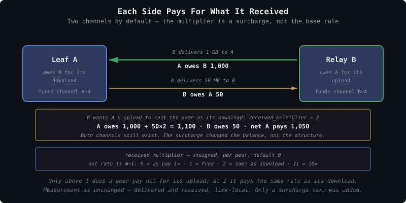
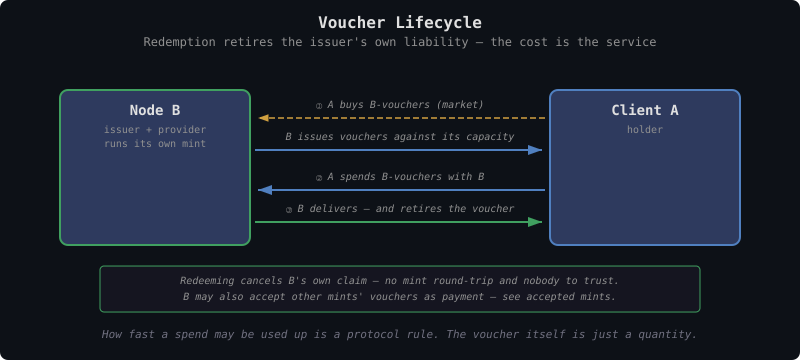
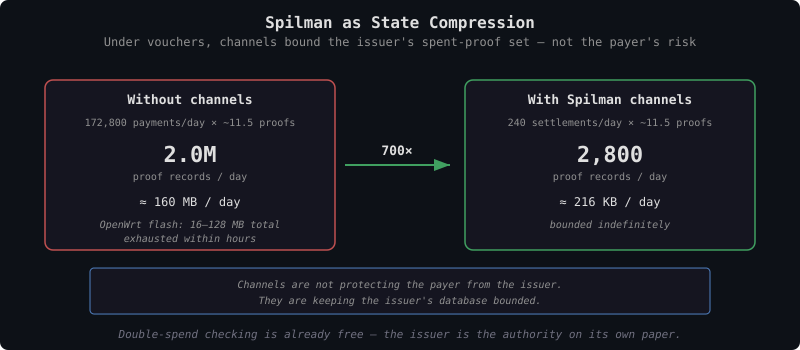

# TollGate Vouchers

This document specifies what TollGate peers pay each other with, and what
delivery costs. [tollgate-payment-channels.md](tollgate-payment-channels.md)
covers how payments are batched;
[tollgate-hazards.md](tollgate-hazards.md) covers what must never be priced.

**Voucher** is the plain name for what a Cashu token *means* when its keyset
is denominated in bytes and its mint is the node that will deliver them: a
bearer claim on that node's capacity, redeemable only against it. Redeeming
it gets you the service, not money.

The protocol term is **Cashu token**, holding **proofs** whose amounts are
powers of two and whose unit is the **byte**. Splitting, combining, DLEQ
verification, P2PK locking and the spent-proof set all work exactly as they
do today.

Three things change, and nothing else:

- the keyset unit is `byte` rather than `sat`
- the mint is run by the node that will deliver those bytes
- redemption means that node delivers, rather than a mint paying out

Each node runs its own mint and issues vouchers against its own capacity.
Two peers settle the exchange rate between their vouchers themselves, with an
optional market on top for price discovery.

---

## Why

Pricing delivery directly means pricing it privately, between each pair of
peers. A peer cannot compare two providers without connecting to both, and
nothing anywhere prices an operator's *reliability* — a node that takes
payment and delivers poorly is noticed only by the peer that already paid it.

Vouchers take pricing out of the protocol entirely and put price discovery
somewhere any node can read it. What an issuer's vouchers fetch is a public,
continuously updated measure of what the network expects it to deliver.

---

## Delivery Costs One Voucher Per Unit

A node collects vouchers from a peer and delivers the same number of units.
The exchange is one-to-one by construction: a voucher *is* a claim on one unit
of capacity, so redeeming `n` of them is delivering `n` units.

```
units delivered = n
vouchers collected = n
```

**There is no price for delivery anywhere in the protocol** — no rate to
quote, no product to select, no multiplier to apply. What a unit costs in
money is settled where a peer acquires vouchers, which the protocol never
sees ([market/](../market/README.md)).

Three consequences:

- **A node's price is what its vouchers sell for.** A node that wants more
  revenue per unit sells its vouchers dearer. It renegotiates nothing with
  its peers.
- **Per-peer pricing needs no per-peer machinery.** Favoring a peer means
  selling that peer vouchers more cheaply, or giving them away.
- **Delivery cannot be repriced mid-session.** The peer already holds the
  vouchers and their claim is fixed.

---

## The Instrument

### Denomination

A proof carries an integer amount in its keyset's unit. For network
forwarding that unit is the **byte**. Amounts are powers of two and any
total is a set of proofs summing to it, exactly as in any other Cashu wallet
— a 1 KiB claim is a single `1024` proof, two of them make 2 KiB, and they
split and combine like any other token.

Other resources use their own quantity unit: watt-hours for electricity, mL
for water. The existing keyset machinery covers all of them unchanged.

### Buying a Rate

A proof holds a quantity and nothing else. What the buyer wants is a rate, so
the rate is expressed by pairing a quantity with a **window** — a span of time
the buyer names, inside which that quantity may be drawn:

```
rate = grant / window

  5,120 bytes over 5 s      1 KiB/s      (2 proofs)
512,000 bytes over 5 s    100 KiB/s      (6 proofs)
512,000 bytes over 1 s    500 KiB/s      (same 6 proofs, shorter window)
```

The window lives in the signed channel state, not in the money. That matters:
a proof denominated in bytes-per-second would only be meaningful against some
particular window, so proofs from different windows would stop being
interchangeable and the accepted-mint set would collapse. Keeping time out of
the instrument is what lets a byte be a byte wherever it is spent, and what
lets vouchers trade at a single price on a market.

Amounts are ordinary Cashu amounts needing no special handling:
`5,120 = 4096 + 1024`, and `512,000 = 125 × 4096` where 125 has six bits set.

### Grants Replace Each Other

A payment is a **grant**: this many units, spendable within this window,
starting when the provider receives it. Buying again **replaces** the grant in
force. Whatever was left of the old one is forfeit at that moment, and the
provider keeps the payment.

```
t=0   buy 6.25 M units, window 5 s      1.25 M/s, expires t=5
t=3   buy   100 M units, window 5 s     20 M/s,   expires t=8
      the 2.5 M left from the first grant burn at t=3
```

This is what makes the product bandwidth rather than a stored quantity of
bytes. Capacity is perishable — a second of it that goes unsold is gone whether
or not anyone paid, and the buyer carries that risk on the seconds it bought.
Without forfeiture, a buyer could accumulate claims off-peak and present them
all at peak, which is selling volume, not bandwidth.

**Raising the rate costs the remainder**, so the exchange rate between
responsiveness and waste is set by window length:

| Situation | Forfeit | As a share of the new grant |
|---|---|---|
| 1.25 M/s, 2 s left, jump to 20 M/s | 2.5 M | 2.5% |
| 20 M/s, 4 s left, jump to 24 M/s | 80 M | 67% |

Large jumps are cheap and small adjustments are punitive, which discourages
fiddling and holds down the provider's verification load. A buyer that wants
fine control uses short windows, where the forfeit can never exceed one
window's worth. That costs more messages, and `min_window_ms` is where the
provider says how many it will take.

**The rate is fixed for the life of the grant** at `grant / window`. Capacity
left unused early is not banked for later — otherwise a buyer that waited would
be entitled to an unbounded burst just before the deadline.

### One Unit Per Resource, Many Issuers

The resource fixes the unit. Every node selling the same resource
denominates the same way, so two units matter per resource — the rate a peer
draws at, and the quantity a voucher holds:

| Resource | Rate — how fast a peer may draw | Voucher unit — what the claim holds |
|---|---|---|
| Network forwarding | bytes/second | bytes |
| Electricity | watts | watt-hours |
| Water | mL/second | mL |

Electricity is the familiar case: capacity is drawn at a rate in watts and
sold in watt-hours. A watt-hour is a rate already multiplied by a duration,
which is the step a voucher takes before it exists. The byte is the network
equivalent of the watt-hour.

The unit is shared; the issuer is not. A 1 KiB voucher from a reliable
gateway and a 1 KiB voucher from an unreliable one both claim 1024 bytes,
and they are worth different amounts. What that difference means, and how it
becomes a public signal about an operator, is covered in
[voucher-price-signal.md](../market/voucher-price-signal.md).

Byte denomination makes metering exact, so every payment lands on a whole
number of units. The cost of that precision is proof count: amounts are
powers of two and a payment takes one proof per set bit, so the count scales
with how many bits the number has. A 1 GiB payment is a 30-bit number and
takes up to 30 proofs, about 15 on average. That is what the spent-proof set
below has to absorb.

### Each Side Pays For What It Received

The base rule is unchanged and symmetric: **a node pays for what it received
from a peer**, which is what that peer delivered. Both sides owe each other,
both fund a channel, and each buys its own grants on its own schedule.

```
A buys from B      the right to receive        (A's download)
B buys from A      the right to receive        (A's upload)
```

For an ordinary peering that is the whole story, and it is why **two channels
is the default**, not an exception. The two streams are independent: different
mints, different windows, bought at different moments.

### The Received Multiplier

That leaves one gap. A leaf's upload is something the leaf *delivers*, so by
the base rule the relay pays the leaf for it — which is backwards when the
relay would rather not carry it at all.

A node closes the gap by adding a **surcharge on what it receives** from a
given peer. It is applied as a weight on how fast that peer's grant is drawn
down:

```
B draws down A's grant as:   delivered + received × m_B
A draws down B's grant as:   delivered + received × m_A
```

> **`received_multiplier`** — a surcharge on units I receive from you.
> Default `0`: no surcharge, the base rule stands.

A unit A downloads draws one unit from A's grant. A unit A uploads draws `m_B`.
So a peer that wants to push a lot has to buy a bigger grant, and the shaper
enforces it as the traffic happens rather than a bill arriving afterward.

Netted out on the leg where A uploads `X` to B, the two grants partly cancel —
B is still buying that upload from A at one unit each:

| `m_B` | B pays A | A pays B | **Net per unit A uploads** |
|---|---|---|---|
| `0` (default) | `X` | — | **B pays 1×** — the traffic is wanted |
| `1` | `X` | `X` | **zero** — upload is free to A |
| `2` | `X` | `2X` | **A pays 1×** — upload costs the same as download |
| `10` | `X` | `10X` | **A pays 9×** |
| `11` | `X` | `11X` | **A pays 10×** — matches a 10:1 backhaul |

**The net rate is `m − 1`, not `m`.** To charge uploads at `k` times the rate
of downloads, set:

```
received_multiplier = k + 1
```

An operator that wants 10× uplink and sets `10` gets 9×. The off-by-one is the
price of the field being unsigned, and it is worth the trade: with no negative
value available, a node can decline traffic as hard as it likes but can never
pay a *bonus* on top of what it already owes for delivery. `0` is the floor,
and `0` is simply the base rule with no surcharge at all.


<details><summary>Text version</summary>

```
Ordinary peering, both multipliers 0:
  A's grant drains on A's downloads      both buy, two channels
  B's grant drains on B's downloads

Relay charging upload at the same rate as download, m_B = 2:
  A's grant drains on A's downloads + 2 × A's uploads
  B's grant drains on A's uploads
  net: A pays 1× for each, in both directions

Relay on a 10:1 backhaul, m_B = 11:
  net: A pays 1× per unit down, 10× per unit up
```
</details>

It is **per peer**, so a node can welcome one peer's traffic and discourage
another's. A grant already bought keeps the multiplier it was bought under; a
revised Offer takes effect on the next one.

**The field is unsigned, and that is load-bearing.** A negative surcharge would
mean paying a peer *on top of* already paying for its delivery — compounding
into the sink hazard, where generating unwanted traffic becomes profitable
([tollgate-hazards.md](tollgate-hazards.md)). Zero is the floor, and zero
already means "I am happy to pay you for this."

---

## Accepted Mints

Because the unit is the same everywhere, a node is not limited to its own
vouchers. A byte-voucher from any mint claims one byte; only the issuer
differs. **A node advertises a list of mints whose vouchers it will take**, in
its Offer, ordered by preference and never empty.

This is a merchant accepting several banks' notes: one unit of account,
several credits, each worth what its issuer is worth.

```yaml
# what this node will take, best first
mint A (upstream provider)     we can spend these onward
own mint                       we issue these
mint C (well-known hub)        widely held
anything else                  refused
```

Order is a preference, not a rule: a payer that holds vouchers from more than
one accepted mint should reach for the earliest, and a node that lists only
one mint has said everything it needs to. Its own mint has no special place —
the relay above would rather be paid in the vouchers it owes upstream.

**Accept or refuse is binary — there is no haircut.** What an issuer's paper
is worth is expressed in what you pay for it on the market, not in a discount
applied at settlement. Taking a mint on means taking its credit, so the
decision to accept it at all is where an operator weighs issuer risk
([issuer-risk.md](../market/issuer-risk.md)).

### What This Buys

**Relays stop holding a currency position.** A relay that buys upstream
transit from A can accept A-vouchers from its downstream customers and spend
them upstream unchanged. No swap, no spread, no rebalancing. This was listed
below as a real cost of the design; multi-mint acceptance removes most of it,
because the vouchers a relay wants to receive are exactly the ones it needs
to pay with.

**Buyers stop swapping per peering.** A client holding vouchers from a mint
several nodes accept can move between them without acquiring anything new.

**Hub vouchers become usable as common currency.** A well-regarded mint's
paper gets accepted broadly because accepting it is cheap and useful, and it
starts functioning as money for the network — without anyone designating it,
and without the protocol knowing. The N-currency problem softens on its own
wherever demand concentrates.

**Market spreads narrow.** Every mint a node accepts is one fewer swap
somebody has to pay for.

### What It Costs

The three properties that make own-voucher redemption cheap hold **only for
own vouchers**:

| Property | Own vouchers | Foreign vouchers |
|---|---|---|
| Settlement cost | Free — cancels a claim | Must be redeemed somewhere else |
| Double-spend check | Local database lookup | Requires reaching that mint |
| Payment liveness | Equals service liveness | Depends on that mint being reachable |

A foreign mint that is also a directly connected peer is one hop away, so
the accepted set should lean toward neighbors and toward mints the node
already buys from. Accepting a distant hub buys flexibility at the price of
needing connectivity to verify.

Accepting a mint also means taking its issuer's credit risk, bounded by how
many of its vouchers the node holds at once.

---

## Normal Operation

One Cashu token buys one grant. Which node's keyset it was minted against
says who owes the delivery; the amount says how much. There is no extra
structure — a wallet that can hold sat-denominated proofs can hold these.

Each direction of a peering is bought on its own. **You pay in the vouchers
of whoever is delivering**, one voucher per unit.


<details><summary>Text version</summary>

```
  1. Node B issues vouchers against its own capacity
  2. Client A acquires B-vouchers — on a market, or directly from B
  3. A spends B-vouchers with B
  4. B redeems: cancels its own claim, delivers the service

  Redemption costs B nothing but the service it already sells.
```
</details>

The same thing happens in the other direction, in the other node's vouchers,
bought separately and on a different schedule. A leaf is no exception: it
delivers its uploads, so its relay buys those from it, and both channels exist.
What makes the leaf a net payer is the relay's received multiplier, not a
missing channel.

That is the whole mechanism for the large majority of peerings. Vouchers can
be acquired **on a market or directly from the issuer**, and the rest of
this document only needs the direct route.

---

## What Improves

**Settlement is free for the provider.** A node receiving its own vouchers
is canceling its own claim. No mint round-trip, no trust in a foreign mint,
nobody to rely on. All the work moves to whoever acquires the vouchers, who
can spread it over many payments.

This applies to the redemption step. A node that also accepts its peers'
vouchers from other mints takes on those issuers, bounded by how many it holds
at once.

**Double-spend checking becomes local.** Today a provider must reach a
third-party mint to confirm a token is unspent, and that network hop is
Spilman's main justification. Under vouchers the provider decides on its own
vouchers: a local database lookup, sub-millisecond, and it works during an
outage.

**Payment works whenever service works.** Today a mint outage blocks
funding, rollover, and settlement even though the link itself is fine
([tollgate-payment-channels.md](tollgate-payment-channels.md), "What Needs
the Mint"). When the provider is the mint, the two fail together — if you
can be served, you can pay.

**A fixed amount for the consumer.** A voucher's claim is a quantity, fixed
when it is acquired. No exposure to the sat price mid-session and no price
sheet changing underneath. What is *not* fixed is when it must be used: a grant
carries a deadline, and capacity left unspent behind it is gone.

**Selling capacity ahead of time.** Issuing vouchers is selling capacity
before delivering it, which is a way to raise funds. A rooftop antenna can
pay for itself against next month's bytes.

**Honest about what it is.** If a node is going to issue a claim at all, a
voucher is the more honest form than node-issued sat-denominated ecash. It
says outright that redemption is service, and promises nothing about being
spendable anywhere else.

---

## Accepted Limitations

These are the costs of the design, accepted deliberately. They are not
resolved.

**Payment is not zero-trust.** What protects a sender from a receiver who
takes payment and disappears is Spilman's time-locked refund, and the mint
is what honors it. When the provider is the mint, the only party who can
cheat is also the party that would have to honor the refund. It will simply
refuse.

No cryptography fixes this. Two things limit it instead:

- **Policy** — the loss is however many vouchers are held or committed at
  once. Hold one grant's worth, risk one grant's worth, and the window is
  the payer's own choice.
- **Reputation** — an issuer that stops redeeming sees its vouchers sell for
  less, which makes everything it issues later worth less too.

That is a workable security model, but it rests on reputation rather than
cryptography. [tollgate-intro.md](tollgate-intro.md) states it in those
terms; any claim of a cryptographic guarantee against a defaulting issuer
would be false.

**Getting hold of vouchers is continuous, not one-time.** Sats can be loaded
in advance from anywhere. Vouchers cannot, because you do not know which
node you will meet. Every new peering needs vouchers acquired before it can
pay for anything. That is not a protocol concern (see Acquiring Vouchers
below), which keeps the protocol small but leaves the peer to solve it — via
another link, a Lightning payment, or a node willing to swap sats locally.

**Relays can end up holding two kinds of vouchers.** A relay paid in its own
vouchers still needs upstream vouchers to pay onward, and rebalancing between
the two is real work on an ESP32.

Two things reduce this, and together they mostly remove it. Accepting the
upstream's mint (see Accepted Mints above) lets the relay take downstream
payment in exactly the paper it needs to spend, so nothing has to be
converted.

What remains is the relay that accepts only its own mint and has no upstream
overlap — an operator choice rather than a structural cost.

**A market needs liquidity that may not appear.** Each issuer is its own
small, thin market, and cross-mint atomic swap has no working
implementation. None of that blocks operation — vouchers can be bought
directly from the issuer. It blocks the **reliability signal**, which is the original reason
for the design and the part least likely to arrive on its own. See
[voucher-price-signal.md](../market/voucher-price-signal.md) and
[voucher-acquisition.md](../market/voucher-acquisition.md).

---

## Spilman Channels

Channels are still needed, but **for a different reason: keeping the
issuer's database small, not preventing theft.**

Checking for double spends locally is cheap, but every spent proof has to be
recorded in the issuer's spent-proof set permanently. That is one record per
**proof**, not per payment — and because amounts are powers of two, a
payment is a set of proofs, roughly one per set bit. Byte denomination makes
those numbers large: a grant of 1 MB/s over a 5 s window is 5,242,880 bytes, a
23-bit number, so about 11–12 proofs per payment.


<details><summary>Text version</summary>

```
10 peers, 5 s windows, 1 MB/s each:
  86400 / 5 × 10              = 172,800 grants/day
  × ~11.5 proofs per payment  ≈ 2.0M proof records/day
  × ~80 bytes per record      ≈ 160 MB/day

Same load with channels (1 h TTL, so ≥24 rollovers/day/channel):
  24 × 10                     = 240 settlements/day
  × ~11.5 proofs each         ≈ 2,800 proof records/day
                              ≈ 216 KB/day
```
</details>

Roughly **700× fewer records**. The decomposition factor applies to both
sides, so it cancels out of the ratio — but it does mean the absolute figure
is far higher than counting one record per payment suggests. OpenWrt targets
have 16–128 MB of flash and ESP32 has far less, so without channels the
spent-proof set alone ends the session within hours.

The channel machinery and the rollover logic therefore both stay, but the
reasoning in
[tollgate-payment-channels.md](tollgate-payment-channels.md) would need
rewriting: channels are not protecting the payer from the issuer, they are
keeping the issuer's database bounded.

Two consequences:

- The local spent-proof check needs an atomic check-and-set if the provider
  runs as more than one process. Straightforward on a router, but it has to
  be specified.
- Cryptographic effort belongs on the **exchange step**, where two parties
  who do not trust each other trade vouchers and neither one issued what the
  other is handing over. That is the only step with a real adversary, and
  the one with no implementation today.

---

## Acquiring Vouchers

**How a peer came to hold vouchers is not the protocol's business**, any
more than how it came to hold sats. It arrives holding vouchers for the node
it wants service from, or it does not get service.

The routes — Lightning mint quotes, direct purchase from the issuer, local
swaps of sat tokens, cross-mint swaps — are covered in
[voucher-acquisition.md](../market/voucher-acquisition.md), along with why the
protocol needs no mechanism for handing a peer its first vouchers.

The one thing worth noting here: a peer can mint, swap and fund against its
counterparty **over the peering link alone**, because the mint it needs is the
peer it is already talking to. Mint reachability is never the obstacle.

Paying per token for a whole session instead of opening channels still
works, but the cost falls on the provider. Every grant's payment lands in
its spent-proof set, which is the growth channels exist to avoid.

---

## Paying Before Delivery

A grant is bought **before** the traffic it covers, not billed afterward. Three
things follow.

**It adds no trust.** Holding an unredeemed voucher is already a claim on the
issuer — that exposure exists the moment a peer acquires vouchers at all.
Prepaying converts a claim into a claim of the same size against the same
party. Billing afterward would instead have the provider extend credit *on top*
of the payer already holding its paper: two exposures where one will do.

**Non-payment enforces itself.** A peer that stops buying simply runs out of
grant and drops to the minimum flow allowance. Nothing has to detect it, no
message announces it, and there is no delivered-but-unpaid balance to chase.
The provider's exposure is not one interval of traffic — it is nothing.

**Reaction is one message, not one interval.** Under postpaid settlement a
rate could only change at a settlement boundary, so a traffic spike waited out
the remainder of the interval. A grant takes effect when it arrives. Because
the signed state is cumulative, a TopUp needs no acknowledgment, so a payer can
send one and immediately start using the rate it just bought; the worst case is
a single round trip of shaping at the old rate. On an adjacent link that is
sub-millisecond.

What the payer gives up is the ability to pay only for what actually arrived.
A grant is consumed whether or not packets land, so transit loss is the buyer's
cost. It remains **measurable one-sided** — the payer knows what it bought and
what arrived, both locally — so the correction needs no protocol and no
cooperation: buy a smaller grant, or buy somewhere else. Delivered against
purchased is a per-provider score that informs which peerings are worth keeping
([tollgate-metering.md](tollgate-metering.md)).

---

## Minimum Flow Allowance

A small amount of traffic every peer gets without paying. It serves two
purposes:

- **Getting started.** A new peer cannot pay until it holds vouchers, and
  it cannot acquire vouchers without connectivity. The allowance breaks that
  circle.
- **Basic access.** An operator may want any peer to be able to do the small
  things — resolve a name, fetch a message — whether or not it is paying.
- **Keeping a link alive between grants.** A grant expires and the next one
  has not arrived yet. Without an allowance the link would go silent, and the
  peer would have no way to send the TopUp that revives it.

```yaml
access:
  minimum_flow:
    enabled: false
    bytes_per_second: 0
```

It is a rate, not a stored quantity, and it is what a peer falls back to
whenever its grant is exhausted or expired. That makes it the floor of the
shaper rather than a separate mechanism.

### Abuse

The allowance is given away, so it can be farmed. Identities are free, so N of
them collect N allowances. Two separate harms follow:

- **Consumption.** N identities draw N allowances of real bandwidth, and one
  machine can run all N over the same physical link.
- **Resale.** Granted vouchers are bearer instruments, so an attacker can
  accumulate and sell them, turning free traffic into sats.

Resale could be closed by issuing the allowance P2PK-locked to the receiving
peer, so only that peer could spend it. The obstacle is that a lock only
holds if it survives **every** swap, including change — otherwise the peer
swaps the locked proof for something else and the lock is gone in one step.
Standard Cashu mints do not preserve locks that way, so this needs modified
mint software or a scheme not yet designed. **Future work**, and out of
scope here.

Until then the allowance is unlocked and resale is bounded by economics
rather than cryptography. At a realistic size — a few KB per second — what
an attacker can farm is worth very little, thinly traded, and issued by one
obscure router, so the effort likely exceeds the return. That argues for
keeping the allowance small; it is not a guarantee.

Consumption is unaffected either way, and still needs an aggregate cap
across all unpaid peers plus a cost to holding an identity — proof-of-work,
a deposit, or an operator allowlist.

The allowance does not accumulate. It is a floor on the shaping rate, so an
unused second of it is gone the same way an unsold second of capacity is —
there is nothing to save up and nothing for an attacker to gather before
spending.

---

## Open Problems

Problems belonging to the market layer — cross-mint swap, liquidity,
selling without redeeming, redemption congestion, operator shutdown — are
tracked in [issuer-risk.md](../market/issuer-risk.md) and
[voucher-acquisition.md](../market/voucher-acquisition.md). What remains
here is protocol-side.

| Problem | Notes |
|---|---|
| Choosing a received multiplier | Every node has to decide, per peer, how much to surcharge what that peer pushes at it. New operator work with no obvious default beyond `0`. |
| Relays holding two kinds of vouchers | A relay that does not accept its upstream's mint sits between two issuers and must keep rebalancing. Accepting it removes the problem; not every relay can. |
| Minimum-flow abuse | N free identities draw N allowances of real bandwidth, and one machine can run all N over the same link. Needs an aggregate cap across unpaid peers plus a cost to holding an identity. |
| Locking the allowance | Issuing it P2PK-locked would close the resale route, but a lock only holds if it survives every swap including change, which standard Cashu mints do not do. Needs modified mint software or a scheme not yet designed. |
| Choosing a window | The payer trades responsiveness against forfeiture and message count, with no obvious default. A provider's `[min_window_ms, max_window_ms]` bounds it but does not choose it. |
| Under-delivery has no public evidence | A payer measures delivered against purchased from its own counters and can act on it, but cannot show it to anyone else. A provider skimming a few percent from every peer stays invisible outside those peerings. Revisitable as a reporting path if it proves common. |
| Admission control policy | A provider can refuse a grant that would oversubscribe, but nothing says how it should divide capacity between peers that all want more, or whether an existing grant may be honored at a reduced rate rather than run to its deadline. |
| Atomic spent-proof check | The local double-spend check needs check-and-set if the provider runs as more than one process. Straightforward on a router, but unspecified. |

---

## Design Decisions

| Decision | Resolution | Rationale |
|----------|-----------|-----------|
| Terminology | "Voucher" is an explanatory name, not a protocol term | The protocol object is a Cashu token holding byte-denominated proofs. Nothing new is defined; the word only names what such a token means |
| Denomination | The byte for network forwarding; each resource's own quantity unit otherwise | A proof carries an integer amount in its keyset's unit, so this is what the existing wallet already handles |
| Proof amounts | Powers of two, as in any Cashu keyset | Nothing about the existing wallet or keyset machinery changes; a payment is a set of proofs that split and combine normally |
| Token vs proof | One token buys one grant; the proofs inside it are the power-of-two pieces its amount decomposes into | Only the proof count changes with amount, and the spent-proof set records proofs — which is what makes channels necessary |
| Unit | Fixed by the resource, one per resource, and always a quantity — watt-hours, not watts | Every node selling the same resource denominates the same way, which is what makes one issuer's vouchers comparable to another's |
| Network unit | The byte | Metering is exact and no payment rounds. The cost is proof count: a 23-bit grant amount takes ~11–12 proofs, which the spent-proof set has to absorb |
| Buying a rate | A grant: a quantity paired with a window the payer names. `rate = grant / window` | A proof holds a quantity and nothing else, so time belongs in the signed state. A bytes-per-second keyset would make proofs from different windows non-interchangeable and break the accepted-mint set |
| Payment timing | Prepaid — the grant is bought before the traffic it covers | Holding a voucher is already a claim on the issuer, so prepaying adds no new exposure. Postpaying would add provider credit risk on top of it. Non-payment then enforces itself: the grant runs out |
| Grant semantics | A new grant replaces the one in force; the remainder is forfeit | This is what makes the product bandwidth rather than stored volume. Without forfeiture a buyer accumulates claims off-peak and presents them at peak |
| Rate within a grant | Fixed at `grant / window`, not banked | Otherwise a buyer that waited would be owed an unbounded burst just before the deadline |
| Reaction latency | One message, no acknowledgment | Cumulative signed state makes TopUp idempotent, so fire-and-forget is safe and a payer can use a rate the moment it buys it |
| Netting | Removed | Prepaid grants are bought at different moments in different mints for different windows. There is no settlement round for the two directions to meet in, so there is nothing to subtract |
| Who pays | Each side pays for what it received, in the vouchers of whoever delivered it | Symmetric and unchanged. Both owe by default, so both fund a channel and buy their own grants |
| Acquiring vouchers | Not a protocol concern — see the market documents | The direct route from the issuer is enough to operate, and checking a voucher takes one hop |
| Received multiplier | An unsigned surcharge per peer on what that peer pushes at us, applied as a consumption weight on its grant, default `0` | Net rate is `m − 1`, so `1` makes a peer's upload free, `2` charges it like a download, `k + 1` charges it `k` times. Unsigned, so a node can never pay a bonus on top of what it already owes for delivery |
| Accepted mints | One ordered list, at least one entry, no prices | One unit of account network-wide makes any mint's vouchers usable. A relay accepting its upstream's mint can spend what it receives without converting |
| Accepted-mint haircuts | None — accept or refuse | What an issuer's paper is worth belongs on the market, not in a settlement discount |
| Foreign voucher cost | Gives up free settlement, local double-spend checks, and payment-liveness-equals-service-liveness | Those three properties hold only for own vouchers, so the accepted set should lean toward neighbors and upstreams |
| Market operations | Separate endpoints and protocol; never TollGate messages | Buying and swapping is not paying for delivery. A node offering neither is fully functional — see [market-protocol.md](../market/market-protocol.md) |
| Minimum flow allowance | A floor on the shaping rate, not a stored quantity | It is what a peer falls back to when its grant expires, which is what keeps a link alive long enough to send the next TopUp. Being a rate, it cannot be accumulated |
| Allowance vouchers | Ordinary unlocked vouchers; keep it small | Locking it would need a mint that preserves locks through swaps and change, which standard Cashu does not do. Small size bounds the resale value economically instead |
| Spilman channels | Kept, to bound the issuer's database rather than to prevent theft | The spent-proof set is ~700× larger without channels |
| Cryptographic effort | Concentrate on the exchange step | The only step with a real adversary once the issuer redeems its own vouchers |
| Trust model | Reputation and exposure limits, not cryptography | When the provider is the mint, the only party who can cheat is the one who would honor the refund. Accepted deliberately |
