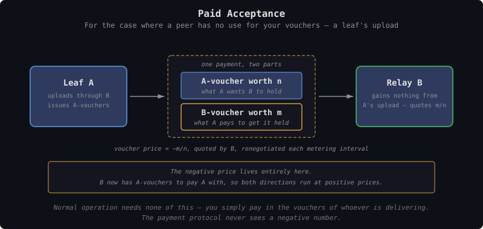
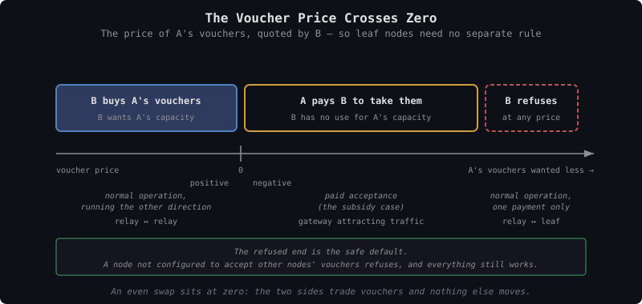
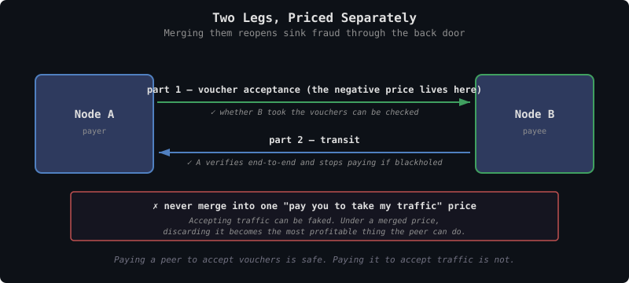

# TollGate Vouchers

This document specifies what TollGate peers pay each other with. It is the
basis for [tollgate-pricing.md](tollgate-pricing.md), which covers what
things cost, and [tollgate-payment-channels.md](tollgate-payment-channels.md),
which covers how payments are batched.

**Voucher** is the plain name for what a Cashu token *means* when its keyset
is denominated in bytes and its mint is the node that will deliver them: a
bearer claim on that node's capacity, redeemable only against it. Redeeming
it gets you the service, not money.

The protocol term is **Cashu token**, holding **proofs** whose amounts are
powers of two and whose unit is the **byte**. Splitting, combining, DLEQ
verification, P2PK locking and the spent-proof set all work exactly as they
do today.

Three things change, and nothing else:

- the keyset unit is `byte` rather than `sat`
- the mint is run by the node that will deliver those bytes
- redemption means that node delivers, rather than a mint paying out

Each node runs its own mint and issues vouchers rather than quoting prices
in sats. Two peers settle the exchange rate between their vouchers
themselves, with an optional market on top for price discovery.

---

## Why

An earlier design priced delivery directly: products, price sheets, per-mint
rates, per-peer multipliers, and a take-it-or-leave-it renegotiation at
every metering interval. It worked, but pricing was private to each pair of
peers. A peer could not compare two providers without connecting to both,
and nothing anywhere priced an operator's *reliability* — a node that took
payment and delivered poorly was noticed only by the peer that had already
paid it.

Vouchers move price discovery out of the private price sheet into a form any
node can read, and take pricing out of the protocol altogether. What an
issuer's vouchers fetch is a public, continuously updated measure of what
the network expects it to deliver.

---

## The Instrument

### Denomination

A proof carries an integer amount in its keyset's unit. For network
forwarding that unit is the **byte**. Amounts are powers of two and any
total is a set of proofs summing to it, exactly as in any other Cashu wallet
— a 1 KiB claim is a single `1024` proof, two of them make 2 KiB, and they
split and combine like any other token.

Other resources use their own quantity unit: watt-hours for electricity, mL
for water. The existing keyset machinery covers all of them unchanged.

### Buying a Rate

The buyer thinks in rates. The metering interval is fixed for the peering
before any payment happens (both peers send an acceptable range and the
interval is the average of the overlap — see the Accept message in
[tollgate-protocol.md](tollgate-protocol.md)), so the amount to hand over
each interval is the product:

```
voucher_amount = desired_rate × interval

5 s interval, 1 KiB/s     1024 × 5       =   5,120 bytes   (2 proofs)
5 s interval, 100 KiB/s   1024 × 100 × 5 = 512,000 bytes   (6 proofs)
```

One voucher settles each interval in both cases. What changes is the amount
it carries and how many proofs that amount decomposes into:
`5,120 = 4096 + 1024`, and `512,000 = 125 × 4096` where 125 has six bits
set. Both are ordinary Cashu amounts needing no special handling.

**Paying more in one interval buys a higher rate for the next.** That is the
whole rate-auction mechanism — see Rate Auction and Token Bucket below.

A byte is a byte wherever it is spent, so two vouchers for the same amount
are interchangeable. That is what lets them trade at a single price on a
market.

### One Unit Per Resource, Many Issuers

The resource fixes the unit. Every node selling the same resource
denominates the same way, so two units matter per resource — the rate a peer
draws at, and the quantity a voucher holds:

| Resource | Rate — how fast a peer may draw | Voucher unit — what the claim holds |
|---|---|---|
| Network forwarding | bytes/second | bytes |
| Electricity | watts | watt-hours |
| Water | mL/second | mL |

Electricity is the familiar case: capacity is drawn at a rate in watts and
sold in watt-hours. A watt-hour is a rate already multiplied by a duration,
which is the step a voucher takes before it exists. The byte is the network
equivalent of the watt-hour.

The unit is shared; the issuer is not. A 1 KiB voucher from a reliable
gateway and a 1 KiB voucher from an unreliable one both claim 1024 bytes,
and they are worth different amounts. What that difference means, and how it
becomes a public signal about an operator, is covered in
[voucher-price-signal.md](../market/voucher-price-signal.md).

Byte denomination makes metering exact, so every payment lands on a whole
number of units. The cost of that precision is proof count: amounts are
powers of two and a payment takes one proof per set bit, so the count scales
with how many bits the number has. A 1 GiB payment is a 30-bit number and
takes up to 30 proofs, about 15 on average. That is what the spent-proof set
below has to absorb.

---

## Accepted Mints

Because the unit is the same everywhere, a node is not limited to its own
vouchers. A byte-voucher from any mint claims one byte; only the issuer
differs. **A node advertises a set of mints whose vouchers it will take**, in
its Offer, and its own mint is simply the first entry.

This is a merchant accepting several banks' notes: one unit of account,
several credits, each worth what its issuer is worth.

```yaml
# what this node will take, and at what price
own mint                     par by definition
mint A (upstream provider)   1.00   — accepted at face value
mint B (neighbor relay)      0.95   — 5% haircut
mint C (well-known hub)      1.00   — widely held, taken at par
anything else                refused
```

The price per mint is the same signed, zero-crossing number as in Paid
Acceptance below. Accepting a mint's vouchers at par when that issuer is
unreliable is a subsidy, so the haircut is where an operator prices issuer
risk ([issuer-risk.md](../market/issuer-risk.md)).

### What This Buys

**Relays stop holding a currency position.** A relay that buys upstream
transit from A can accept A-vouchers from its downstream customers and spend
them upstream unchanged. No swap, no spread, no rebalancing. This was listed
below as a real cost of the design; multi-mint acceptance removes most of it,
because the vouchers a relay wants to receive are exactly the ones it needs
to pay with.

**Buyers stop swapping per peering.** A client holding vouchers from a mint
several nodes accept can move between them without acquiring anything new.

**Hub vouchers become usable as common currency.** A well-regarded mint's
paper gets accepted broadly because accepting it is cheap and useful, and it
starts functioning as money for the network — without anyone designating it,
and without the protocol knowing. The N-currency problem softens on its own
wherever demand concentrates.

**Market spreads narrow.** Every mint a node accepts is one fewer swap
somebody has to pay for.

### What It Costs

The three properties that make own-voucher redemption cheap hold **only for
own vouchers**:

| Property | Own vouchers | Foreign vouchers |
|---|---|---|
| Settlement cost | Free — cancels a claim | Must be redeemed somewhere else |
| Double-spend check | Local database lookup | Requires reaching that mint |
| Payment liveness | Equals service liveness | Depends on that mint being reachable |

A foreign mint that is also a directly connected peer is one hop away, so
the accepted set should lean toward neighbors and toward mints the node
already buys from. Accepting a distant hub buys flexibility at the price of
needing connectivity to verify.

Accepting a mint also means taking its issuer's credit risk, bounded by how
many of its vouchers the node holds at once.

---

## Normal Operation

One Cashu token settles one metering interval. Which node's keyset it was
minted against says who owes the delivery; the amount says how much. There
is no extra structure — a wallet that can hold sat-denominated proofs can
hold these.

Each direction of a peering is settled on its own. **You pay in the vouchers
of whoever is delivering**, one voucher per unit.


<details><summary>Text version</summary>

```
  1. Node B issues vouchers against its own capacity
  2. Client A acquires B-vouchers — on a market, or directly from B
  3. A spends B-vouchers with B
  4. B redeems: cancels its own claim, delivers the service

  Redemption costs B nothing but the service it already sells.
```
</details>

If A also delivers something B wants, the same thing happens in the other
direction with A-vouchers, priced and paid separately. Where A delivers
nothing B wants — a leaf node — that second payment is simply absent.
Nothing has to be zero-priced or cancelled out; there is one payment instead
of two.

That is the whole mechanism for the large majority of peerings. Vouchers can
be acquired **on a market or directly from the issuer**, and the rest of
this document only needs the direct route.

---

## Paid Acceptance

Take a leaf node A peering with its parent relay B. A's download is
straightforward — B delivers it, A pays for it in B-vouchers. A's upload is
the awkward half.

B gains nothing from receiving A's upload. It is not a service A performs
for B; it is traffic B has to carry onward on A's behalf, at a cost to B.
So **A has to pay for its upload too**.

The payment protocol says the deliverer is paid, and on the upload leg the
deliverer is A. Taken literally that has B owing A for A's own outgoing
traffic. Correcting it inside the payment flow would mean signed delivery
prices, sign-aware metering and a spending budget to stop the resulting
subsidy running away.

Paid acceptance corrects it outside the payment flow instead. A issues its
own vouchers, which B has no use for. A **pays B — in B's vouchers — to hold
them**. B now has A-vouchers on hand to pay A with when A delivers its
upload, and both directions run under the ordinary rule with ordinary
positive prices.

**The negative price lives entirely in the price of A's vouchers, so the
payment protocol never sees a negative number.**


<details><summary>Text version</summary>

```
  A → B:  an A-voucher worth n  +  a B-voucher worth m

  The voucher price is −m/n: A pays m to place n, so A's vouchers
  price out negative. Quoted by B, renegotiated at each metering
  interval like any other price.
```
</details>

Following the value through one interval: A hands B `m` B-vouchers plus some
of its own. When A delivers its upload, B pays for it with those same
A-vouchers, and A redeems them — canceling a claim it issued itself, at no
cost to anyone. A's real outlay is the `m` B-vouchers, which is what having
B carry the upload is worth.

The A-voucher side is a float A keeps topped up. If A stops topping it up, B
runs out and cannot pay for A's upload — which costs A nothing, since A
never wanted to be paid for it in the first place.

The voucher price measures one thing: how much B wants A's capacity. The
leaf sits at one end, where B wants it so little that A must pay. A gateway
trying to attract traffic sits at the other, buying its peers' vouchers
because it wants what they deliver — the "attract resources" case from
[tollgate-pricing.md](tollgate-pricing.md), and the same price with the
opposite sign.

### One Price, Crossing Zero

Paid acceptance and normal operation are one price per peering that happens
to cross zero, so leaf nodes need no separate rule.

The price is the price **of A's vouchers**, quoted by B. It follows the same
sign convention as the rest of the design ([tollgate-pricing.md](tollgate-pricing.md),
where `negative = node pays peer`): positive when the vouchers are worth
something, negative when they are a burden someone has to be paid to take.


<details><summary>Text version</summary>

```
  voucher price:  positive ──────── zero ──────── negative ──── refused
                     B buys A's       even swap     A pays B      B will not
                     vouchers                       to take them  hold them
                     │                │             │             at any price
                     │                │             │             │
                     normal operation │             paid          normal
                     in the other     │             acceptance    operation,
                     direction        │                           one payment
```
</details>

- **Positive** — B wants A's vouchers enough to buy them. That is normal
  operation running in the other direction.
- **Zero** — an even swap; the two sides trade vouchers and nothing else
  moves.
- **Negative** — A pays B to take them. Paid acceptance.
- **Refused** — B will not hold A's vouchers at any price. A pays purely in
  B-vouchers, which is normal operation with only one direction.

Above zero this is the same number as the selling price in One Unit Per
Resource, Many Issuers — 1.05 for a node in demand, 0.70 for one the market
doubts. The scale simply continues below zero, where the issuer has to pay
to place its vouchers at all.

The refused end is the **safe default**. A node not configured to accept
other nodes' vouchers refuses, everything still works, and the peering falls
back to normal operation.

Three consequences:

- **A market is not required to operate.** Cross-mint atomic swap and market
  liquidity are still needed for the reliability signal above, but not for
  moving value.
- **Checking a voucher takes one hop.** B validates A-vouchers by asking A,
  the peer it is already connected to and already exchanging metering
  reports with. No third-party mint has to be reachable. The risk that A
  refuses to redeem is unchanged, and is limited by how many A-vouchers B
  agrees to hold — which is what the voucher price controls.
- **Issuing more vouchers does not help the issuer.** B sets the acceptance
  price from its own estimate of A's capacity, not from how many vouchers A
  offers, so printing more only moves the price.

### Pay for Voucher Acceptance, Never for Traffic Acceptance

Paid acceptance is safe because whether B took the vouchers is a fact anyone
can check, and B gains nothing by taking them and lying about it.

The same arrangement applied to traffic is not safe. Accepting traffic can
be faked: the peer takes it, bills for it, and discards it, having done no
work. Discarding becomes the most profitable thing it can do. See the
Negative Pricing section of [tollgate-pricing.md](tollgate-pricing.md).

Traffic must therefore stay priced as **transit**, which the payer checks
end-to-end and stops paying for when nothing arrives. Merging the two into a
single "pay you to take my traffic" price brings that abuse straight back.


<details><summary>Text version</summary>

```
  voucher acceptance — the negative price lives here
  A ─────── pays B to accept A-vouchers ──────→ B
            ✓ whether B took them can be checked directly

  transit — always positive, always the beneficiary paying
  A ←────────── B provides transit ──────────── B
            ✓ A checks end-to-end, stops paying if nothing arrives

  ✗ never merge into one "pay you to take my traffic" price —
    accepting traffic can be faked, and discarding it then becomes
    the most profitable thing the peer can do.
```
</details>

---

## What Improves

**Settlement is free for the provider.** A node receiving its own vouchers
is canceling its own claim. No mint round-trip, no trust in a foreign mint,
nobody to rely on. All the work moves to whoever acquires the vouchers, who
can spread it over many payments.

This applies to the redemption step. A node that also accepts its peers'
vouchers under paid acceptance does take on those issuers, and prices that
risk through the voucher price it quotes.

**Double-spend checking becomes local.** Today a provider must reach a
third-party mint to confirm a token is unspent, and that network hop is
Spilman's main justification. Under vouchers the provider decides on its own
vouchers: a local database lookup, sub-millisecond, and it works during an
outage.

**Payment works whenever service works.** Today a mint outage blocks
funding, rollover, and settlement even though the link itself is fine
([tollgate-payment-channels.md](tollgate-payment-channels.md), "What Needs
the Mint"). When the provider is the mint, the two fail together — if you
can be served, you can pay.

**A fixed amount for the consumer.** You buy 1 GiB and you get 1 GiB. No
exposure to the sat price mid-session, and no price sheet changing under you
at the next interval.

**Selling capacity ahead of time.** Issuing vouchers is selling capacity
before delivering it, which is a way to raise funds. A rooftop antenna can
pay for itself against next month's bytes.

**Honest about what it is.** If a node is going to issue a claim at all, a
voucher is the more honest form than node-issued sat-denominated ecash. It
says outright that redemption is service, and promises nothing about being
spendable anywhere else.

---

## Accepted Limitations

These are the costs of the design, accepted deliberately. They are not
resolved.

**Payment is not zero-trust.** What protects a sender from a receiver who
takes payment and disappears is Spilman's time-locked refund, and the mint
is what honors it. When the provider is the mint, the only party who can
cheat is also the party that would have to honor the refund. It will simply
refuse.

No cryptography fixes this. Two things limit it instead:

- **Policy** — the loss is however many vouchers are held or committed at
  once. Hold one interval's worth, risk one interval's worth. This is the
  same bound already accepted for a receiver who settles and vanishes.
- **Reputation** — an issuer that stops redeeming sees its vouchers sell for
  less, which makes everything it issues later worth less too.

That is a workable security model, but it rests on reputation rather than
cryptography. [tollgate-intro.md](tollgate-intro.md) states it in those
terms; any claim of a cryptographic guarantee against a defaulting issuer
would be false.

**Getting hold of vouchers is continuous, not one-time.** Sats can be loaded
in advance from anywhere. Vouchers cannot, because you do not know which
node you will meet. Every new peering needs vouchers acquired before it can
pay for anything. That is not a protocol concern (see Acquiring Vouchers
below), which keeps the protocol small but leaves the peer to solve it — via
another link, a Lightning payment, or a node willing to swap sats locally.

**Relays can end up holding two kinds of vouchers.** A relay paid in its own
vouchers still needs upstream vouchers to pay onward, and rebalancing between
the two is real work on an ESP32.

Two things reduce this, and together they mostly remove it. Accepting the
upstream's mint (see Accepted Mints above) lets the relay take downstream
payment in exactly the paper it needs to spend, so nothing has to be
converted. And paid acceptance means a relay's own capacity is genuinely
useful to its upstream, because return traffic flows through it, so its
vouchers price positive.

What remains is the relay that accepts only its own mint and has no upstream
overlap — an operator choice rather than a structural cost.

**A market needs liquidity that may not appear.** Each issuer is its own
small, thin market, and cross-mint atomic swap has no working
implementation. None of that blocks operation — vouchers can be bought
directly from the issuer, and paid acceptance exchanges them inside the
peering. It blocks the **reliability signal**, which is the original reason
for the design and the part least likely to arrive on its own. See
[voucher-price-signal.md](../market/voucher-price-signal.md) and
[voucher-acquisition.md](../market/voucher-acquisition.md).

---

## Spilman Channels

Channels are still needed, but **for a different reason: keeping the
issuer's database small, not preventing theft.**

Checking for double spends locally is cheap, but every spent proof has to be
recorded in the issuer's spent-proof set permanently. That is one record per
**proof**, not per payment — and because amounts are powers of two, a
payment is a set of proofs, roughly one per set bit. Byte denomination makes
those numbers large: 1 MB/s over a 5 s interval is 5,242,880 bytes, a 23-bit
number, so about 11–12 proofs per payment.


<details><summary>Text version</summary>

```
10 peers, 5 s interval, 1 MB/s each:
  86400 / 5 × 10              = 172,800 payments/day
  × ~11.5 proofs per payment  ≈ 2.0M proof records/day
  × ~80 bytes per record      ≈ 160 MB/day

Same load with channels (1 h TTL, so ≥24 rollovers/day/channel):
  24 × 10                     = 240 settlements/day
  × ~11.5 proofs each         ≈ 2,800 proof records/day
                              ≈ 216 KB/day
```
</details>

Roughly **700× fewer records**. The decomposition factor applies to both
sides, so it cancels out of the ratio — but it does mean the absolute figure
is far higher than counting one record per payment suggests. OpenWrt targets
have 16–128 MB of flash and ESP32 has far less, so without channels the
spent-proof set alone ends the session within hours.

The channel machinery and the rollover logic therefore both stay, but the
reasoning in
[tollgate-payment-channels.md](tollgate-payment-channels.md) would need
rewriting: channels are not protecting the payer from the issuer, they are
keeping the issuer's database bounded.

Two consequences:

- The local spent-proof check needs an atomic check-and-set if the provider
  runs as more than one process. Straightforward on a router, but it has to
  be specified.
- Cryptographic effort belongs on the **exchange step**, where two parties
  who do not trust each other trade vouchers and neither one issued what the
  other is handing over. That is the only step with a real adversary, and
  the one with no implementation today.

---

## Acquiring Vouchers

**How a peer came to hold vouchers is not the protocol's business**, any
more than how it came to hold sats. It arrives holding vouchers for the node
it wants service from, or it does not get service.

The routes — Lightning mint quotes, direct purchase from the issuer, local
swaps of sat tokens, cross-mint swaps — are covered in
[voucher-acquisition.md](../market/voucher-acquisition.md), along with why
there is no bootstrap mechanism and what removing it cost.

The one thing worth noting here: a peer can mint, swap and fund against its
counterparty **over the peering link alone**, because the mint it needs is
the peer it is already talking to. Mint reachability is never the obstacle
it used to be.

Paying per token for a whole session instead of opening channels still
works, but the cost falls on the provider. Every interval's payment lands in
its spent-proof set, which is the growth channels exist to avoid.

---

## Why the Negative Price Is Safe Here

A peer accepting another node's vouchers *is* being paid to take something
it did not ask for — a negative price, in the ordinary sense. What makes it
safe is that it sits on the **voucher** leg rather than the traffic leg.

Whether B took the vouchers is a fact. B gains nothing by taking them and
lying about it. Whether B did anything useful with traffic is not a fact
anyone can establish, which is why the same arrangement is dangerous there
(see Never Price Traffic Acceptance in
[tollgate-pricing.md](tollgate-pricing.md)).

**The hazard was never the negative sign. It is pricing acceptance of
something whose acceptance can be faked.**

Two further properties follow from paying in vouchers rather than money.

**The instrument filters out sinks.** A pays B in B's vouchers, which exist
only because B issued them, against capacity somebody believed it would
deliver. A node whose service nobody wants has no vouchers in circulation
and therefore **cannot be paid at all**. Fake identities and traffic
discarders are excluded by what you pay with, before any policy has to
notice them.

**Subsidy and revenue use the same vouchers.** A node cannot increase its
subsidy without making the vouchers its paying customers hold worth less.
Issuing beyond capacity dilutes every outstanding claim, including the ones
it sold for real money, so overissuing punishes the issuer directly rather
than merely being detectable. A node receiving its own vouchers back is
canceling a claim it previously sold, so a subsidy can never exceed what the
issuer already earned by selling those vouchers.

**There is no wallet to drain.** A money-denominated subsidy drains because
the paying node funds an outgoing channel that rolls over automatically — an
unattended loop limited only by wallet balance. Under paid acceptance there
is no standing outgoing channel to refill. Every subsidy payment is a
deliberate purchase of the peer's vouchers, in a fixed amount, at a quoted
price. The worst case is a subsidy that does not work, not an empty wallet,
and it holds without the operator configuring anything correctly.

Two problems remain — selling vouchers without redeeming them, and too many
redemptions arriving at once. Both are in Open Problems below.

---

## Rate Auction and Token Bucket

Rather than a fixed bandwidth cap, the payment sets the allowance: what a
peer pays during one interval determines the capacity it gets in the next.
Each interval becomes a small auction for the link.

This is the arithmetic from Buying a Rate, read backwards. The peer hands
over `rate × interval` worth of vouchers, and that quantity is what sets its
allowance for the next interval.

Build it as a **token bucket filled by payment**, not as a hard per-interval
rate cap:

- paid units fill the bucket
- bucket depth sets how much burst is allowed
- drain rate sets sustained throughput

A hard cap recomputed every interval adjusts the rate on the interval
timescale, while TCP adjusts on the round-trip timescale, and the two fight
each other and produce sawtooth throughput. A bucket smooths the same
allocation, allows bursts, and lets the 5 s default metering interval stand
instead of forcing per-second payments and five times the signing load.

This maps onto the existing `extensions.bandwidth_limit` field: the cap
comes from payment history instead of from static configuration.

---

## Minimum Flow Allowance

A small amount of traffic every peer gets without paying. It serves two
purposes:

- **Getting started.** A new peer cannot pay until it holds vouchers, and
  it cannot acquire vouchers without connectivity. The allowance breaks that
  circle.
- **Basic access.** An operator may want any peer to be able to do the small
  things — resolve a name, fetch a message — whether or not it is paying.

```yaml
access:
  minimum_flow:
    enabled: false
    bytes_per_interval: 0
```

### Abuse

The allowance is a subsidy, so it can be farmed. Identities are free, so N
of them collect N allowances. Two separate harms follow:

- **Consumption.** N identities draw N allowances of real bandwidth, and one
  machine can run all N over the same physical link.
- **Resale.** Granted vouchers are bearer instruments, so an attacker can
  accumulate and sell them, turning a service subsidy into sats.

Resale could be closed by issuing the allowance P2PK-locked to the receiving
peer, so only that peer could spend it. The obstacle is that a lock only
holds if it survives **every** swap, including change — otherwise the peer
swaps the locked proof for something else and the lock is gone in one step.
Standard Cashu mints do not preserve locks that way, so this needs modified
mint software or a scheme not yet designed. **Future work**, and out of
scope here.

Until then the allowance is unlocked and resale is bounded by economics
rather than cryptography. At a realistic size — a few KB per interval — what
an attacker can farm is worth very little, thinly traded, and issued by one
obscure router, so the effort likely exceeds the return. That argues for
keeping the allowance small; it is not a guarantee.

Consumption is unaffected either way, and still needs an aggregate cap
across all unpaid peers plus a cost to holding an identity — proof-of-work,
a deposit, or an operator allowlist.

Open: whether the allowance accumulates or expires each interval.
Accumulating lets a peer save up for a burst, which is also how an attacker
gathers a large grant before spending it.

---

## Open Problems

Problems belonging to the market layer — cross-mint swap, liquidity,
selling without redeeming, redemption congestion, operator shutdown — are
tracked in [issuer-risk.md](../market/issuer-risk.md) and
[voucher-acquisition.md](../market/voucher-acquisition.md). What remains
here is protocol-side.

| Problem | Notes |
|---|---|
| Quoting a price for a peer's vouchers | Every node has to price every peer's vouchers, continuously. That is new work for the operator, and a node accepting vouchers at close to full value quietly builds up paper it can never redeem. Refusing foreign vouchers by default avoids the question rather than answering it. |
| Relays holding two kinds of vouchers | Multi-hop relays sit between two issuers and must keep rebalancing. Burdensome on constrained devices. |
| Minimum-flow abuse | N free identities draw N allowances of real bandwidth, and one machine can run all N over the same link. Needs an aggregate cap across unpaid peers plus a cost to holding an identity. |
| Locking the allowance | Issuing it P2PK-locked would close the resale route, but a lock only holds if it survives every swap including change, which standard Cashu mints do not do. Needs modified mint software or a scheme not yet designed. |
| Allowance accumulation | Whether an unspent allowance carries into the next interval. Accumulating helps a peer that needs a burst, and equally helps an attacker gather a large grant before spending it. |
| Atomic spent-proof check | The local double-spend check needs check-and-set if the provider runs as more than one process. Straightforward on a router, but unspecified. |

---

## Design Decisions

| Decision | Resolution | Rationale |
|----------|-----------|-----------|
| Terminology | "Voucher" is an explanatory name, not a protocol term | The protocol object is a Cashu token holding byte-denominated proofs. Nothing new is defined; the word only names what such a token means |
| Denomination | The byte for network forwarding; each resource's own quantity unit otherwise | A proof carries an integer amount in its keyset's unit, so this is what the existing wallet already handles |
| Proof amounts | Powers of two, as in any Cashu keyset | Nothing about the existing wallet or keyset machinery changes; a payment is a set of proofs that split and combine normally |
| Token vs proof | One token settles one interval; the proofs inside it are the power-of-two pieces its amount decomposes into | Only the proof count changes with amount, and the spent-proof set records proofs — which is what makes channels necessary |
| Unit | Fixed by the resource, one per resource, and always a quantity — watt-hours, not watts | Every node selling the same resource denominates the same way, which is what makes one issuer's vouchers comparable to another's |
| Network unit | The byte | Metering is exact and no payment rounds. The cost is proof count: a 23-bit interval amount takes ~11–12 proofs, which the spent-proof set has to absorb |
| Buying a rate | `voucher_amount = desired_rate × interval` | The interval is fixed for the peering before payment starts, so a desired rate converts to an amount by multiplication. Paying more in one interval buys a higher rate for the next |
| Normal operation | Pay in the vouchers of whoever is delivering; each direction priced and paid on its own | Covers the large majority of peerings with one payment and no exchange. A leaf simply has no second payment, rather than a zero or negative one |
| Acquiring vouchers | Not a protocol concern — see the market documents | The direct route from the issuer is enough to operate, and checking a voucher takes one hop |
| Bootstrap tokens | Removed | Provider-as-mint dissolves the mint-reachability problem the mechanism existed for. The state machine, messages, verification path and config block all come out |
| Paid acceptance | Pay a peer to hold your vouchers when it has no use for them | Covers a leaf paying for its own upload. The negative price sits entirely in the voucher price, so the payment protocol runs both directions at positive prices |
| Accepted mints | A set per node, own mint implicitly at par, empty by default | One unit of account network-wide makes any mint's vouchers usable. A relay accepting its upstream's mint can spend what it receives without converting |
| Voucher price | One per accepted mint, crossing zero — above par, par, haircut, zero, negative (paid acceptance), absent | Normal operation and paid acceptance are the same price at different points, so leaf nodes need no separate rule. The price is also where issuer risk is expressed |
| Foreign voucher cost | Gives up free settlement, local double-spend checks, and payment-liveness-equals-service-liveness | Those three properties hold only for own vouchers, so the accepted set should lean toward neighbors and upstreams |
| Market operations | Separate endpoints and protocol; never TollGate messages | Buying and swapping is not paying for delivery. A node offering neither is fully functional — see [market-protocol.md](../market/market-protocol.md) |
| Subsidy funding | Buying the peer's vouchers deliberately, in a fixed amount | No standing outgoing channel to refill, so an unattended drain cannot start |
| Voucher acceptance vs traffic acceptance | Priced separately, never merged | Whether vouchers were accepted can be checked; whether traffic was accepted cannot, and merging them brings back the discard abuse |
| Minimum flow allowance | Ordinary unlocked vouchers; keep it small | Locking it would need a mint that preserves locks through swaps and change, which standard Cashu does not do. Small size bounds the resale value economically instead |
| Spilman channels | Kept, to bound the issuer's database rather than to prevent theft | The spent-proof set is ~700× larger without channels |
| Cryptographic effort | Concentrate on the exchange step | The only step with a real adversary once the issuer redeems its own vouchers |
| Trust model | Reputation and exposure limits, not cryptography | When the provider is the mint, the only party who can cheat is the one who would honor the refund. Accepted deliberately |
