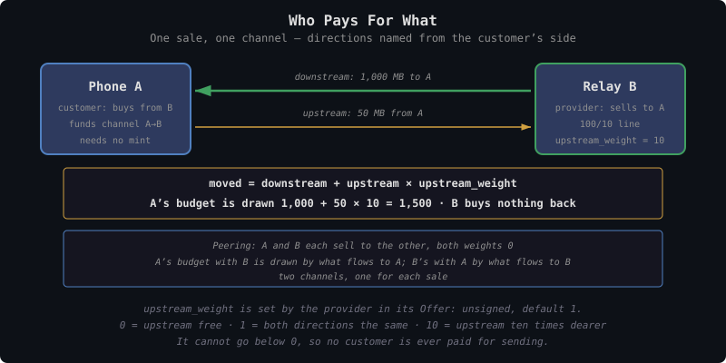
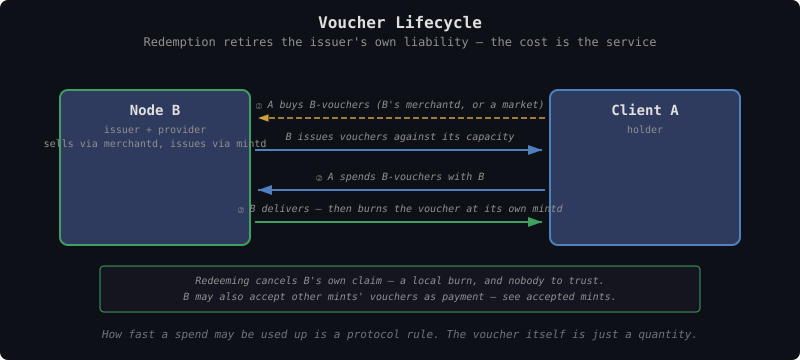
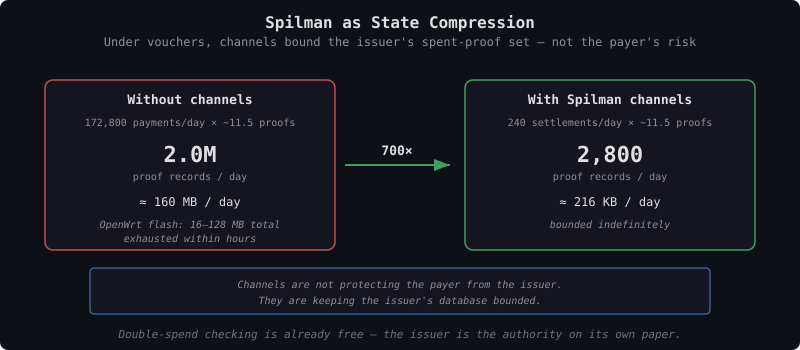

# TollGate Vouchers

This document specifies what TollGate peers pay each other with, and what
delivery costs. [tollgate-payment-channels.md](tollgate-payment-channels.md)
covers how payments are batched;
[tollgate-hazards.md](tollgate-hazards.md) covers what must never be priced.

**Voucher** is the plain name for what a Cashu token *means* when its keyset
is denominated in bytes and its mint is the node that will deliver them: a
bearer claim on that node's capacity, redeemable only against it. Redeeming
it gets you the service, not money.

The protocol term is **Cashu token**, holding **proofs** whose amounts are
powers of two and whose unit is the **byte**. Splitting, combining, DLEQ
verification, P2PK locking and the spent-proof set all work exactly as they
do today.

Three things change, and nothing else:

- the keyset unit is `byte` rather than `sat`
- the mint is run by the node that will deliver those bytes
- redemption means that node delivers, rather than a mint paying out

Each node runs its own mint and issues vouchers against its own capacity.
Two peers settle the exchange rate between their vouchers themselves, with an
optional market on top for price discovery.

---

## Why

Pricing delivery directly means pricing it privately, between each pair of
peers. A peer cannot compare two providers without connecting to both, and
nothing anywhere prices an operator's *reliability* — a node that takes
payment and delivers poorly is noticed only by the peer that already paid it.

Vouchers take pricing out of the protocol entirely and put price discovery
somewhere any node can read it. What an issuer's vouchers fetch is a public,
continuously updated measure of what the network expects it to deliver.

---

## Delivery Costs One Voucher Per Unit

A node collects vouchers from a peer and delivers the same number of units.
The exchange is one-to-one by construction: a voucher *is* a claim on one unit
of capacity, so redeeming `n` of them is delivering `n` units.

```
units delivered = n
vouchers collected = n
```

**There is no price for delivery anywhere in the protocol** — no rate to
quote, no product to select, no multiplier to apply. What a unit costs in
money is settled where a peer acquires vouchers, which the protocol never
sees ([market/](../market/README.md)).

Three consequences:

- **A node's price is what its vouchers sell for.** A node that wants more
  revenue per unit sells its vouchers dearer. It renegotiates nothing with
  its peers.
- **Per-peer pricing needs no per-peer machinery.** Favoring a peer means
  selling that peer vouchers more cheaply, or giving them away.
- **Delivery cannot be repriced mid-session.** The peer already holds the
  vouchers and their claim is fixed.

---

## The Instrument

### Denomination

A proof carries an integer amount in its keyset's unit. For network
forwarding that unit is the **byte**. Amounts are powers of two and any
total is a set of proofs summing to it, exactly as in any other Cashu wallet
— a 1 KiB claim is a single `1024` proof, two of them make 2 KiB, and they
split and combine like any other token.

Other resources use their own quantity unit: watt-hours for electricity, mL
for water. The existing keyset machinery covers all of them unchanged.

### A Budget and a Deadline

A proof holds a quantity and nothing else. To turn quantities into service,
the provider keeps one account for each peer that pays it:

- a **budget**: the units the payer has paid for and not yet used
- a **deadline**: when whatever is left of the budget expires
- a **reserved rate**: the speed the payer has booked, in units per second

A payment is a **grant**: a number of units, sent with a **window** and a
reserved rate, both chosen by the payer. The grant is **added** to the
budget. Nothing already in the budget is lost when a new grant arrives. The
window moves the deadline: it becomes the later of the old deadline and now
plus the window, so a grant never brings a deadline closer. The reserved rate
replaces the one before it.

The window lives in the signed channel state, not in the money. That matters:
a proof denominated in bytes-per-second would only be meaningful against some
particular window, so proofs from different windows would stop being
interchangeable and the accepted-mint set would collapse. Keeping time out of
the instrument is what lets a byte be a byte wherever it is spent, and what
lets vouchers trade at a single price on a market.

Amounts are ordinary Cashu amounts needing no special handling:
`5,120 = 4096 + 1024`, and `512,000 = 125 × 4096` where 125 has six bits set.

### The One Rule

Every second, the provider takes units out of the budget:

```
drawn each second = max(units moved, reserved rate × 1 s)
```

`units moved` is the peer's traffic in that second, its uploads weighted by
the received multiplier ([below](#the-received-multiplier)). Whatever is left
when the deadline comes expires, and the provider keeps the payment.

That one rule sells two things, and the only difference between them is the
reserved rate the payer picks:

- **Time at a speed.** The payer reserves a rate. Each second costs at least
  that rate, whether the payer uses it or not, because the provider has set
  that capacity aside for it. A second it moves more costs what it moved.
- **Pay for what you use.** The payer reserves nothing. An idle second costs
  nothing, and a busy one costs what it moved. The budget lasts until it is
  used up or the deadline comes.

Nothing is negotiated. A provider says what it will
accept in its Offer — the windows, the smallest reserved rate, and how often a
peer may buy ([tollgate-protocol.md](tollgate-protocol.md#0x01-offer)) — and
each payer picks inside that. A provider that sets a smallest reserved rate
above zero sells only time at a speed.

A budget smaller than its reserved rate times its window runs out before the
deadline. The payer then falls to the minimum flow allowance until it buys
again. That is the payer's own sizing, not something the provider checks.

### Time at a Speed

A buyer wants 5 Mbit/s, which is 625,000 bytes a second. It asks for 10 s
windows and buys again 2 s before its budget would run out:

```
t=0    TopUp: grant 6,250,000, window 10 s, reserved 625,000/s
                                    budget 6,250,000   deadline t=10
t=0–8  draws 625,000 a second, used or not
       (t=3–5 idle: still 625,000 a second)
t=8                                 budget 1,250,000   left over, kept
t=8    TopUp: grant 5,000,000, window 10 s, reserved 625,000/s
                                    budget 6,250,000   deadline t=18
t=16   TopUp: grant 5,000,000, ...  budget 6,250,000   deadline t=26
...    every 8 s, 5,000,000: exactly 625,000 a second
```

The buyer adds back only what was drawn since its last purchase, so its
budget stays the same size from one purchase to the next. The 1.25 M left at
each purchase is not paid for twice: it stays in the budget and is drawn in
the next seconds like any other unit. Renewing early costs nothing, so the
buyer can renew as early as it likes to be safe from a late message.

When the buyer stops, the budget drains at the reserved rate and reaches zero
at the deadline, because it was sized at the reserved rate times the window.
Nothing is left over to expire.

### Pay for What You Use

A phone buys 1 GB from a hotspot that accepts windows up to 30 days and lets
payers reserve nothing:

```
day 0      TopUp: grant 1,000 MB, window 30 days, reserved 0
                                    budget 1,000 MB    deadline day 30
day 0      downloads 300 MB         budget   700 MB
           idle for an hour         budget   700 MB    nothing drawn
           downloads 250 MB         budget   450 MB
day 3      TopUp: grant 550 MB, window 30 days, reserved 0
                                    budget 1,000 MB    deadline day 33
day 33     nothing bought since     what is left expires
```

The phone too adds back only what it used. How fast it is carried is the
hotspot's choice, from what its reserved payers leave
([Speed Above the Reserved Rate](#speed-above-the-reserved-rate)).

### Speed Above the Reserved Rate

The reserved rate is what the provider has promised. The provider counts
every payer's reserved rate against what it can carry
([tollgate-protocol.md](tollgate-protocol.md#0x05-topupreject)), so all of
them can be served at once. Anything above that is **spare capacity**, and
the provider may give it or keep it. How fast it carries each payer is its
own policy, set in its configuration rather than in the protocol
([tollgate-configuration.md](tollgate-configuration.md#burst)):

- a payer that reserved a rate is carried at least at that rate. With no
  burst set, which is the default, it is carried at exactly that rate
- a payer that reserved nothing is carried at whatever speed the provider
  chooses for it

Either way the enforcer is handed one number per payer, the speed it is
shaped to, and draws are still `max(units moved, reserved rate × 1 s)`. A
payer that bursts above its reserved rate pays for what it moved, and its
budget runs down faster.

Near the end of a budget the provider slows the payer, so it cannot move more
in one tick than is left. At zero it falls to the minimum flow allowance.

### A Budget Belongs to the Payer

A budget is the payer's, not a channel's and not a session's. The provider
keeps it in its own state and writes it to disk beside its channel backups,
so it survives a reconnect, a channel rollover, a channel settlement and a
restart of the provider, until its deadline. A phone that walks out of range
and comes back still has its 700 MB. The money for it is already in the
provider's hands: the channel updates that bought it are what the provider
settles, so settling a channel does not touch the budget.

The reservation is different: it lasts for the session. When a session ends,
the provider stops setting capacity aside for the payer and stops drawing for
it. A payer that comes back gets its budget and deadline, reserves again with
its next purchase, and until then is carried as a payer that reserved
nothing.

**The provider draws only while it is carrying the payer.** A second in which
the session is down, the provider is restarting, or its enforcer is not
connected costs the payer nothing, reserved rate or not. The deadline does not
stop, though: a budget whose deadline passes during an outage is lost.

A budget is also lost when the payer comes back under a different identity —
a new key, or under `enforcer.identity: address` a different address — and
when the provider loses the disk it was written to. Nothing is refunded. The
units were paid for when they were bought, and the protocol has no message
that hands vouchers back.

### How a Buyer Buys

A buyer chooses three things for each provider: a reserved rate, a window,
and how large a budget to hold.

- **Reserved rate.** To buy time at a speed, the buyer reserves a share of the
  demand it sees, within its own bounds and never below the provider's
  smallest. To pay for what it uses, it reserves nothing, where the provider
  allows that.
- **Window.** Any window in the provider's range. A long one costs nothing in
  itself: a reserved budget drains at its rate whatever the window, and an
  unreserved one is only drawn by traffic.
- **Budget.** For time at a speed, the reserved rate times the window. For pay
  per use, an amount the buyer is willing to hold with this provider.

It then **adds back what has drained**. Each purchase brings the budget back
up to the size it wants, never further, so the budget does not grow from one
purchase to the next. It buys again a little before its budget or its
deadline would run out, whichever comes first, and only while something wants
the link: observed demand, or a standing demand its operator set. It changes
its reserved rate with the same purchase, raising it at once when demand
outgrows it. There is nothing to forfeit, so there is no reason to hold back
a purchase.

It handles a refusal by its reason
([tollgate-protocol.md](tollgate-protocol.md#0x05-topupreject)):

- **Too soon**: it waits out the provider's shortest gap between purchases,
  and sends the purchase again.
- **Capacity**: it lowers its reserved rate to what the provider says is
  free, and holds there for a while before trying higher.
- **Out of range**: it fixes its window or reserved rate to the Offer.

The buyer keeps its own count of the budget, from what it signed and what it
measured crossing the link. The provider also reports the budget in a
**Balance** message ([tollgate-protocol.md](tollgate-protocol.md#0x0c-balance)).
The buyer treats that as information, not as an instruction: it never buys
more because a Balance says less is left than its own count does. A Balance
below its own count is a gap between bought and delivered, and goes into the
same score as any other ([tollgate-metering.md](tollgate-metering.md)).

### One Unit Per Resource, Many Issuers

The resource fixes the unit. Every node selling the same resource
denominates the same way, so two units matter per resource — the rate a peer
draws at, and the quantity a voucher holds:

| Resource | Rate — how fast a peer may draw | Voucher unit — what the claim holds |
|---|---|---|
| Network forwarding | bytes/second | bytes |
| Electricity | watts | watt-hours |
| Water | mL/second | mL |

Electricity is the familiar case: capacity is drawn at a rate in watts and
sold in watt-hours. A watt-hour is a rate already multiplied by a duration,
which is the step a voucher takes before it exists. The byte is the network
equivalent of the watt-hour.

The unit is shared; the issuer is not. A 1 KiB voucher from a reliable
gateway and a 1 KiB voucher from an unreliable one both claim 1024 bytes,
and they are worth different amounts. What that difference means, and how it
becomes a public signal about an operator, is covered in
[voucher-price-signal.md](../market/voucher-price-signal.md).

Byte denomination makes metering exact, so every payment lands on a whole
number of units. The cost of that precision is proof count: amounts are
powers of two and a payment takes one proof per set bit, so the count scales
with how many bits the number has. A 1 GiB payment is a 30-bit number and
takes up to 30 proofs, about 15 on average. That is what the spent-proof set
below has to absorb.

### Each Side Pays For What It Received

The base rule is unchanged and symmetric: **a node pays for what it received
from a peer**, which is what that peer delivered. Both sides owe each other,
both fund a channel, and each buys from the other on its own schedule.

```
A buys from B      the right to receive        (A's download)
B buys from A      the right to receive        (A's upload)
```

For an ordinary peering that is the whole story, and it is why **two channels
is the default**, not an exception. The two streams are independent: different
mints, different budgets, bought at different moments.

### The Received Multiplier

That leaves one gap. A leaf's upload is something the leaf *delivers*, so by
the base rule the relay pays the leaf for it — which is backwards when the
relay would rather not carry it at all.

A node closes the gap by adding a **surcharge on what it receives** from a
given peer. It is applied as a weight on how fast that peer's budget is drawn
down:

```
B draws down A's budget as:   delivered + received × m_B
A draws down B's budget as:   delivered + received × m_A
```

> **`received_multiplier`** — a surcharge on units I receive from you.
> Default `0`: no surcharge, the base rule stands.

A unit A downloads draws one unit from A's budget. A unit A uploads draws `m_B`.
So a peer that wants to push a lot has to buy more, and the shaper
enforces it as the traffic happens rather than a bill arriving afterward.

Netted out on the leg where A uploads `X` to B, the two payments partly cancel —
B is still buying that upload from A at one unit each:

| `m_B` | B pays A | A pays B | **Net per unit A uploads** |
|---|---|---|---|
| `0` (default) | `X` | — | **B pays 1×** — the traffic is wanted |
| `1` | `X` | `X` | **zero** — upload is free to A |
| `2` | `X` | `2X` | **A pays 1×** — upload costs the same as download |
| `10` | `X` | `10X` | **A pays 9×** |
| `11` | `X` | `11X` | **A pays 10×** — matches a 10:1 backhaul |

**The net rate is `m − 1`, not `m`.** To charge uploads at `k` times the rate
of downloads, set:

```
received_multiplier = k + 1
```

An operator that wants 10× uplink and sets `10` gets 9×. The off-by-one is the
price of the field being unsigned, and it is worth the trade: with no negative
value available, a node can decline traffic as hard as it likes but can never
pay a *bonus* on top of what it already owes for delivery. `0` is the floor,
and `0` is simply the base rule with no surcharge at all.


<details><summary>Text version</summary>

```
Ordinary peering, both multipliers 0:
  A's budget drains on A's downloads      both buy, two channels
  B's budget drains on B's downloads

Relay charging upload at the same rate as download, m_B = 2:
  A's budget drains on A's downloads + 2 × A's uploads
  B's budget drains on A's uploads
  net: A pays 1× for each, in both directions

Relay on a 10:1 backhaul, m_B = 11:
  net: A pays 1× per unit down, 10× per unit up
```
</details>

It is **per peer**, so a node can welcome one peer's traffic and discourage
another's. It is **fixed for a session**: the multiplier in the Offer that
opened the session is the one the budget is drawn at until the session ends. A
changed multiplier applies from the peer's next session, and a budget carried
into that session is drawn at the new one.

**The field is unsigned, and that is load-bearing.** A negative surcharge would
mean paying a peer *on top of* already paying for its delivery — compounding
into the sink hazard, where generating unwanted traffic becomes profitable
([tollgate-hazards.md](tollgate-hazards.md)). Zero is the floor, and zero
already means "I am happy to pay you for this."

---

## Accepted Mints

Because the unit is the same everywhere, a node is not limited to its own
vouchers. A byte-voucher from any mint claims one byte; only the issuer
differs. **A node advertises a list of mints whose vouchers it will take**, in
its Offer, ordered by preference and never empty.

This is a merchant accepting several banks' notes: one unit of account,
several credits, each worth what its issuer is worth.

```yaml
# what this node will take, best first
mint A (upstream provider)     we can spend these onward
own mint                       we issue these
mint C (well-known hub)        widely held
anything else                  refused
```

Order is a preference, not a rule: a payer that holds vouchers from more than
one accepted mint should reach for the earliest, and a node that lists only
one mint has said everything it needs to. Its own mint has no special place —
the relay above would rather be paid in the vouchers it owes upstream.

What happens to another mint's vouchers after settlement is set per mint in
`tollgated`: **keep** them, swapped at their mint and deposited with
`merchantd`, or **burn** them at their mint where they are worth nothing to
this node ([tollgate-daemons.md](tollgate-daemons.md#other-mints-keep-or-burn)).
The node's own vouchers are always burned once delivered.

**Accept or refuse is binary — there is no haircut.** What an issuer's paper
is worth is expressed in what you pay for it on the market, not in a discount
applied at settlement. Taking a mint on means taking its credit, so the
decision to accept it at all is where an operator weighs issuer risk
([issuer-risk.md](../market/issuer-risk.md)).

### What This Buys

**Relays stop holding a currency position.** A relay that buys upstream
transit from A can accept A-vouchers from its downstream customers and spend
them upstream. Settling the channel swaps them at A, `merchantd` keeps the
proceeds, and they come back to `tollgated` the next time it funds a channel
to A ([tollgate-daemons.md](tollgate-daemons.md)). No market swap, no spread,
no rebalancing. This was listed
below as a real cost of the design; multi-mint acceptance removes most of it,
because the vouchers a relay wants to receive are exactly the ones it needs
to pay with.

**Buyers stop swapping per peering.** A client holding vouchers from a mint
several nodes accept can move between them without acquiring anything new.

**Hub vouchers become usable as common currency.** A well-regarded mint's
paper gets accepted broadly because accepting it is cheap and useful, and it
starts functioning as money for the network — without anyone designating it,
and without the protocol knowing. The N-currency problem softens on its own
wherever demand concentrates.

**Market spreads narrow.** Every mint a node accepts is one fewer swap
somebody has to pay for.

### What It Costs

The three properties that make own-voucher redemption cheap hold **only for
own vouchers**:

| Property | Own vouchers | Foreign vouchers |
|---|---|---|
| Settlement cost | Free — burned at `mintd`, which cancels a claim | Settled at that mint, then kept or burned there |
| Double-spend check | Lookup at `mintd`, on the same machine | Requires reaching that mint |
| Payment liveness | Equals service liveness | Depends on that mint being reachable |

**The accepted set is exactly what the operator lists** — any mint, a
neighbor's or not. Nothing about where a mint sits in the network puts it on
the list or keeps it off. Each one listed costs two things:

- **Reachability**, always: the node verifies funding and settles at that
  mint, so it must be reachable before a channel funded in it expires.
- **Credit**, only for a mint set to `keep`: the node holds that issuer's
  paper — in `merchantd` — until it is spent or redeemed. A mint set to `burn`
  holds nothing, so its issuer's credit does not matter; accepting it is free
  service, rationed by how much of that issuer's paper the peer can get.

Unsettled channels carry both, for any foreign mint, until they settle.

---

## Normal Operation

One Cashu token buys one grant. Which node's keyset it was minted against
says who owes the delivery; the amount says how much. There is no extra
structure — a wallet that can hold sat-denominated proofs can hold these.

Each direction of a peering is bought on its own. **You pay in the vouchers
of whoever is delivering**, one voucher per unit.


<details><summary>Text version</summary>

```
  1. Node B issues vouchers against its own capacity
  2. Client A acquires B-vouchers — on a market, or directly from B
  3. A spends B-vouchers with B
  4. B delivers the service, settles, and burns the vouchers at its
     own mintd: the claim is honored, so it is cancelled

  Redemption costs B nothing but the service it already sells.
```
</details>

The same thing happens in the other direction, in the other node's vouchers,
bought separately and on a different schedule. A leaf is no exception: it
delivers its uploads, so its relay buys those from it, and both channels exist.
What makes the leaf a net payer is the relay's received multiplier, not a
missing channel.

That is the whole mechanism for the large majority of peerings. Vouchers can
be acquired **on a market or directly from the issuer**, and the rest of
this document only needs the direct route.

---

## What Improves

**Settlement is free for the provider.** A node receiving its own vouchers
is canceling its own claim: `tollgated` settles and burns at its own `mintd`,
over a local socket. No foreign mint round-trip, no trust in a foreign mint,
nobody to rely on. All the work moves to whoever acquires the vouchers, who
can spread it over many payments.

This applies to the redemption step. A node that also accepts its peers'
vouchers from other mints takes on those issuers, bounded by how many it holds
at once.

**Double-spend checking becomes local.** Today a provider must reach a
third-party mint to confirm a token is unspent, and that network hop is
Spilman's main justification. Under vouchers the provider decides on its own
vouchers: a lookup in its own `mintd`'s database, on the same machine,
sub-millisecond, and it works during an outage.

**Payment works whenever service works.** Today a mint outage blocks
funding, rollover, and settlement even though the link itself is fine
([tollgate-payment-channels.md](tollgate-payment-channels.md), "What Needs
the Mint"). When the provider is the mint, the two fail together — if you
can be served, you can pay.

**A fixed amount for the consumer.** A voucher's claim is a quantity, fixed
when it is acquired. No exposure to the sat price mid-session and no price
sheet changing underneath. What is *not* fixed is when it must be used: a
budget carries a deadline, and capacity left unspent behind it is gone.

**Selling capacity ahead of time.** Issuing vouchers is selling capacity
before delivering it, which is a way to raise funds. A rooftop antenna can
pay for itself against next month's bytes.

**Honest about what it is.** If a node is going to issue a claim at all, a
voucher is the more honest form than node-issued sat-denominated ecash. It
says outright that redemption is service, and promises nothing about being
spendable anywhere else.

---

## Accepted Limitations

These are the costs of the design, accepted deliberately. They are not
resolved.

**Payment is not zero-trust.** What protects a sender from a receiver who
takes payment and disappears is Spilman's time-locked refund, and the mint
is what honors it. When the provider is the mint, the only party who can
cheat is also the party that would have to honor the refund. It will simply
refuse.

No cryptography fixes this. Two things limit it instead:

- **Policy** — the loss is however many vouchers are held or committed at
  once. A payer risks its unspent budget with a provider, and how large that
  is, is the payer's own choice: it can hold a few seconds' worth and top up
  often, or a month's.
- **Reputation** — an issuer that stops redeeming sees its vouchers sell for
  less, which makes everything it issues later worth less too.

That is a workable security model, but it rests on reputation rather than
cryptography. [tollgate-intro.md](tollgate-intro.md) states it in those
terms; any claim of a cryptographic guarantee against a defaulting issuer
would be false.

**Getting hold of vouchers is continuous, not one-time.** Sats can be loaded
in advance from anywhere. Vouchers cannot, because you do not know which
node you will meet. Every new peering needs vouchers acquired before it can
pay for anything. That is not a protocol concern (see Acquiring Vouchers
below), which keeps the protocol small but leaves the peer to solve it — via
another link, a Lightning payment, or a node willing to swap sats locally.

**Relays can end up holding two kinds of vouchers.** A relay paid in its own
vouchers burns them on delivery, and still needs upstream vouchers to pay
onward — which `merchantd` has to buy with what its sales brought in.
Keeping that conversion going is real work on an ESP32.

Two things reduce this, and together they mostly remove it. Accepting the
upstream's mint (see Accepted Mints above) lets the relay take downstream
payment in exactly the paper it needs to spend, so nothing has to be
converted.

What remains is the relay that accepts only its own mint and has no upstream
overlap — an operator choice rather than a structural cost.

**A market needs liquidity that may not appear.** Each issuer is its own
small, thin market, and cross-mint atomic swap has no working
implementation. None of that blocks operation — vouchers can be bought
directly from the issuer. It blocks the **reliability signal**, which is the original reason
for the design and the part least likely to arrive on its own. See
[voucher-price-signal.md](../market/voucher-price-signal.md) and
[voucher-acquisition.md](../market/voucher-acquisition.md).

---

## Spilman Channels

Channels are still needed, but **for a different reason: keeping the
issuer's database small, not preventing theft.**

Checking for double spends locally is cheap, but every spent proof has to be
recorded in the issuer's spent-proof set permanently. That is one record per
**proof**, not per payment — and because amounts are powers of two, a
payment is a set of proofs, roughly one per set bit. Byte denomination makes
those numbers large: a grant of 1 MB/s over a 5 s window is 5,242,880 bytes, a
23-bit number, so about 11–12 proofs per payment.


<details><summary>Text version</summary>

```
10 peers, 5 s windows, 1 MB/s each:
  86400 / 5 × 10              = 172,800 grants/day
  × ~11.5 proofs per payment  ≈ 2.0M proof records/day
  × ~80 bytes per record      ≈ 160 MB/day

Same load with channels (1 h TTL, so ≥24 rollovers/day/channel):
  24 × 10                     = 240 settlements/day
  × ~11.5 proofs each         ≈ 2,800 proof records/day
                              ≈ 216 KB/day
```
</details>

Roughly **700× fewer records**. The decomposition factor applies to both
sides, so it cancels out of the ratio — but it does mean the absolute figure
is far higher than counting one record per payment suggests. OpenWrt targets
have 16–128 MB of flash and ESP32 has far less, so without channels the
spent-proof set alone ends the session within hours.

The channel machinery and the rollover logic therefore both stay, but the
reasoning in
[tollgate-payment-channels.md](tollgate-payment-channels.md) would need
rewriting: channels are not protecting the payer from the issuer, they are
keeping the issuer's database bounded.

Two consequences:

- The spent-proof set needs an atomic check-and-set. It lives in `mintd` alone
  ([tollgate-daemons.md](tollgate-daemons.md)), so that is one process's
  database transaction — but it has to be specified.
- Cryptographic effort belongs on the **exchange step**, where two parties
  who do not trust each other trade vouchers and neither one issued what the
  other is handing over. That is the only step with a real adversary, and
  the one with no implementation today.

---

## Acquiring Vouchers

**How a peer came to hold vouchers is not the protocol's business**, any
more than how it came to hold sats. It arrives holding vouchers for the node
it wants service from, or it does not get service.

The routes — buying over Lightning or directly from the issuer's `merchantd`,
local swaps of sat tokens, cross-mint swaps — are covered in
[voucher-acquisition.md](../market/voucher-acquisition.md), along with why the
protocol needs no mechanism for handing a peer its first vouchers. The
issuer's `mintd` takes no money; issuing is `merchantd`'s, or free where the
mint auto-accepts ([tollgate-daemons.md](tollgate-daemons.md)).

The one thing worth noting here: a peer can buy, swap and fund against its
counterparty **over the peering link alone**, because the issuer it needs is
the peer it is already talking to. Mint reachability is never the obstacle.

Inside a node, acquiring is `merchantd`'s job. `tollgated` holds no vouchers:
when it funds a channel it asks `merchantd` for the counterparty's
([tollgate-daemons.md](tollgate-daemons.md#funding-upstream)).

Paying per token for a whole session instead of opening channels still
works, but the cost falls on the provider. Every grant's payment lands in
its spent-proof set, which is the growth channels exist to avoid.

---

## Paying Before Delivery

A grant is bought **before** the traffic it covers, not billed afterward. Three
things follow.

**It adds no trust.** Holding an unredeemed voucher is already a claim on the
issuer — that exposure exists the moment a peer acquires vouchers at all.
Prepaying converts a claim into a claim of the same size against the same
party. Billing afterward would instead have the provider extend credit *on top*
of the payer already holding its paper: two exposures where one will do.

**Non-payment enforces itself.** A peer that stops buying simply runs out of
budget and drops to the minimum flow allowance. Nothing has to detect it, no
message announces it, and there is no delivered-but-unpaid balance to chase.
The provider's exposure is not one interval of traffic — it is nothing.

**Reaction is one message, not one interval.** Under postpaid settlement a
rate could only change at a settlement boundary, so a traffic spike waited out
the remainder of the interval. A grant takes effect when it arrives. Because
the signed state is cumulative, a TopUp needs no acknowledgment, so a payer can
send one and immediately start using what it just bought; the worst case is
a single round trip of shaping at the old rate. On an adjacent link that is
sub-millisecond.

What the payer gives up is the ability to pay only for what actually arrived.
A budget is drawn whether or not packets land, so transit loss is the buyer's
cost. It remains **measurable one-sided** — the payer knows what it bought and
what arrived, both locally — so the correction needs no protocol and no
cooperation: buy less, or buy somewhere else. Delivered against
purchased is a per-provider score that informs which peerings are worth keeping
([tollgate-metering.md](tollgate-metering.md)).

---

## Minimum Flow Allowance

A small, free rate of traffic every peer gets without paying. It serves three
purposes:

- **Getting started.** A new peer cannot pay until it holds vouchers, and
  it cannot acquire vouchers without connectivity. The allowance breaks that
  circle.
- **Basic access.** An operator may want any peer to be able to do the small
  things — resolve a name, fetch a message — whether or not it is paying.
- **Keeping a link alive between purchases.** A budget runs out or expires
  and the next purchase has not arrived yet. Without an allowance the link would go silent, and the
  peer would have no way to send the TopUp that revives it.

```yaml
access:
  minimum_flow:
    enabled: false
    bytes_per_second: 0
```

It is a rate, not a stored quantity, and it is what a peer falls back to
whenever its budget is used up or expired. That makes it the floor of the
shaper rather than a separate mechanism.

**No vouchers are issued for it.** The allowance is delivery the node gives
away, not a payment it makes: nothing is minted, nothing changes hands, and
nothing is drawn from a budget. Handing out free vouchers is a way of selling
them, and so belongs to `merchantd` and the market
([../market/README.md](../market/README.md)), or to `mintd`'s auto-accept
([tollgate-daemons.md](tollgate-daemons.md#auto-accept)) — not to the protocol.

### Abuse

The allowance is given away, so it can be farmed. Identities are free, so N of
them collect N allowances: N identities draw N allowances of real bandwidth,
and one machine can run all N over the same physical link.

Because the allowance is a rate and never a token, there is nothing to resell:
an attacker can use the bandwidth while connected, but cannot carry any of it
away or turn it into sats.

Consumption still needs an aggregate cap across all unpaid peers plus a cost
to holding an identity — proof-of-work, a deposit, or an operator allowlist.

The allowance does not accumulate. It is a floor on the shaping rate, so an
unused second of it is gone the same way an unsold second of capacity is —
there is nothing to save up and nothing for an attacker to gather before
spending.

---

## Open Problems

Problems belonging to the market layer — cross-mint swap, liquidity,
selling without redeeming, redemption congestion, operator shutdown — are
tracked in [issuer-risk.md](../market/issuer-risk.md) and
[voucher-acquisition.md](../market/voucher-acquisition.md). What remains
here is protocol-side.

| Problem | Notes |
|---|---|
| Choosing a received multiplier | Every node has to decide, per peer, how much to surcharge what that peer pushes at it. New operator work with no obvious default beyond `0`. |
| Relays holding two kinds of vouchers | A relay that does not accept its upstream's mint burns what it is paid and has `merchantd` buy the upstream's paper with its sales revenue, continuously. Accepting the upstream's mint with `keep` removes the problem; not every relay can. |
| Minimum-flow abuse | N free identities draw N allowances of real bandwidth, and one machine can run all N over the same link. Needs an aggregate cap across unpaid peers plus a cost to holding an identity. |
| Choosing a budget | The payer trades message count against how much it holds with one provider. A provider's window range bounds the window but does not choose the size. |
| Deadlines kept alive by tiny purchases | A payer can keep a budget from expiring forever by buying one unit before each deadline. Accepted: a reserved budget drains anyway, and an unreserved one is never owed speed, so a long-lived budget is no claim on the busiest hour — see [Design Decisions](#design-decisions). |
| Claiming someone else's budget | Under `enforcer.identity: address` the network does not prove a key, so a carried budget is restored to whoever comes back with the payer's key from the payer's address. A device that takes over a departed payer's address and announces its key can draw the whole budget. Under `pubkey` the network proves the key and this does not arise. |
| Deadline during an outage | The provider draws nothing while it is not carrying a payer, but the deadline keeps running. A budget whose deadline passes while the provider or its enforcer is down is lost. |
| Under-delivery has no public evidence | A payer measures delivered against purchased from its own counters and can act on it, but cannot show it to anyone else. A provider skimming a few percent from every peer stays invisible outside those peerings. Revisitable as a reporting path if it proves common. |
| Admission control policy | A provider can refuse a reserved rate that would oversubscribe, but nothing says how it should divide capacity between peers that all want more, or whether a reservation may be honored at a reduced rate. |
| Sharing spare capacity | Speed above the reserved rate is the provider's to give. Today that is a fixed setting per node or per peer; nothing shares it out by load. |
| Atomic spent-proof check | The spent-proof set lives in `mintd` alone, so check-and-set is one process's transaction. Straightforward, but unspecified. |

---

## Design Decisions

| Decision | Resolution | Rationale |
|----------|-----------|-----------|
| Terminology | "Voucher" is an explanatory name, not a protocol term | The protocol object is a Cashu token holding byte-denominated proofs. Nothing new is defined; the word only names what such a token means |
| Denomination | The byte for network forwarding; each resource's own quantity unit otherwise | A proof carries an integer amount in its keyset's unit, so this is what the existing wallet already handles |
| Proof amounts | Powers of two, as in any Cashu keyset | Nothing about the existing wallet or keyset machinery changes; a payment is a set of proofs that split and combine normally |
| Token vs proof | One token buys one grant; the proofs inside it are the power-of-two pieces its amount decomposes into | Only the proof count changes with amount, and the spent-proof set records proofs — which is what makes channels necessary |
| Unit | Fixed by the resource, one per resource, and always a quantity — watt-hours, not watts | Every node selling the same resource denominates the same way, which is what makes one issuer's vouchers comparable to another's |
| Network unit | The byte | Metering is exact and no payment rounds. The cost is proof count: a 23-bit grant amount takes ~11–12 proofs, which the spent-proof set has to absorb |
| Accounting | One budget, one deadline and one reserved rate per payer. A grant adds to the budget; the deadline becomes the later of the old one and now plus the window | A proof holds a quantity and nothing else, so time belongs in the signed state. A bytes-per-second keyset would make proofs from different windows non-interchangeable and break the accepted-mint set |
| The one rule | Every second the provider draws `max(units moved, reserved rate × 1 s)`; what is left expires at the deadline | One formula sells both products. A reserved rate makes it time at a speed, because idle seconds drain; no reservation makes it pay for what you use. The payer picks, inside what the provider allows |
| Nothing forfeit at a purchase | A grant adds; the leftover stays in the budget | A buyer renewing early pays for each second once. Replacing the leftover would charge it twice for whatever it renewed ahead of time |
| Deadline | The later of the old deadline and now plus the window, so a purchase never brings it closer | The payer chose a window for the units it already holds. A shorter window on a later purchase should not take them away |
| Long-lived budgets | A payer may keep a budget alive indefinitely by buying before each deadline, even a single unit. Accepted | It cannot be used to hoard peak capacity: while a payer reserves a rate, idle seconds drain the budget at that rate, so holding a reservation costs what it promises; and a payer that reserves nothing is owed no speed at all, only what the provider chooses to spare |
| Speed above the reserved rate | Provider policy, not protocol; the enforcer still receives one rate | The provider promises the reserved rate and admits reservations against its capacity. What it gives beyond that is spare capacity, which it may give or withhold |
| Budget lifetime | The payer's, kept across reconnects, rollovers, settlements and restarts, until its deadline. The reservation lasts only for the session | The budget is already paid for. A reservation sets capacity aside, which a payer that is not connected has no use for |
| Outages | Nothing is drawn while the provider is not carrying the payer; the deadline still runs | The payer should not pay for seconds it could not be served. The deadline is kept so that a budget always ends |
| Multiplier | Fixed for a session; a change applies from the next | Every grant adds to one budget, so a multiplier that changed mid-session would reprice units already bought |
| Payment timing | Prepaid — the budget is bought before the traffic it covers | Holding a voucher is already a claim on the issuer, so prepaying adds no new exposure. Postpaying would add provider credit risk on top of it. Non-payment then enforces itself: the budget runs out |
| Reaction latency | One message, no acknowledgment | Cumulative signed state makes TopUp idempotent, so fire-and-forget is safe and a payer can use what it bought the moment it buys it |
| Buyer | Adds back what has drained, renews before its budget or deadline runs out, and acts on a refusal by its reason | Nothing is forfeit, so there is nothing to time and no reason to hold a purchase back. Topping up only what drained keeps a budget the same size from one purchase to the next |
| Balance | Reported by the provider, kept by the payer as information only | A payer that reconnects cannot otherwise know what it left behind. Treating the number as an instruction would let a provider that understates it make the payer buy more |
| Who pays | Each side pays for what it received, in the vouchers of whoever delivered it | Symmetric and unchanged. Both owe by default, so both fund a channel and each keeps a budget with the other |
| Acquiring vouchers | Not a protocol concern — see the market documents. Inside a node, `merchantd` acquires; `tollgated` asks it per funding | The direct route from the issuer is enough to operate, and checking a voucher takes one hop. The protocol daemon holds nothing of value |
| Received multiplier | An unsigned surcharge per peer on what that peer pushes at us, applied as a consumption weight on its budget, default `0` | Net rate is `m − 1`, so `1` makes a peer's upload free, `2` charges it like a download, `k + 1` charges it `k` times. Unsigned, so a node can never pay a bonus on top of what it already owes for delivery |
| Accepted mints | One ordered list, at least one entry, no prices | One unit of account network-wide makes any mint's vouchers usable. A relay accepting its upstream's mint can spend what it receives without converting |
| Accepted-mint haircuts | None — accept or refuse | What an issuer's paper is worth belongs on the market, not in a settlement discount |
| After settlement | Own vouchers burned at `mintd`; another mint's kept (deposited with `merchantd`) or burned, set per mint | The claim on this node has been honored. Whether another issuer's paper is worth anything depends on the relationship — see [tollgate-daemons.md](tollgate-daemons.md) |
| Foreign voucher cost | Gives up free settlement, local double-spend checks, and payment-liveness-equals-service-liveness | Those three properties hold only for own vouchers. The accepted set is the operator's explicit list, any mint; each costs reachability, and credit only if kept |
| Market operations | Separate endpoints and protocol; never TollGate messages | Buying and swapping is not paying for delivery. A node offering neither is fully functional — see [market-protocol.md](../market/market-protocol.md) |
| Minimum flow allowance | A floor on the shaping rate, not a stored quantity | It is what a peer falls back to when its budget runs out or expires, which is what keeps a link alive long enough to send the next TopUp. Being a rate, it cannot be accumulated |
| Allowance vouchers | None — the allowance is delivery, not payment | Free vouchers are `merchantd`'s or `mintd` auto-accept's matter. As a rate it cannot be resold or accumulated, so there is nothing to lock |
| Spilman channels | Kept, to bound the issuer's database rather than to prevent theft | The spent-proof set is ~700× larger without channels |
| Cryptographic effort | Concentrate on the exchange step | The only step with a real adversary once the issuer redeems its own vouchers |
| Trust model | Reputation and exposure limits, not cryptography | When the provider is the mint, the only party who can cheat is the one who would honor the refund. Accepted deliberately |
