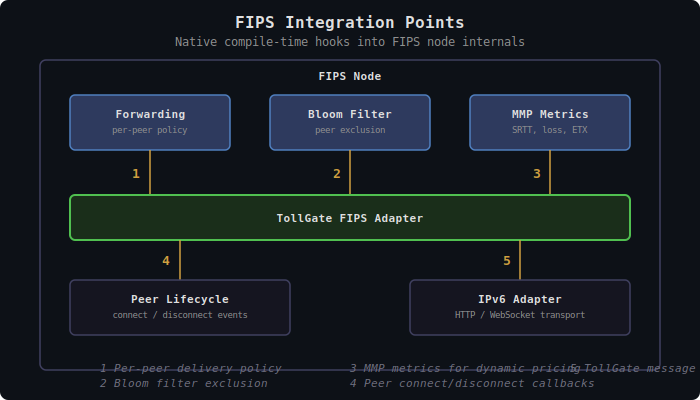

# TollGate Peering: FIPS Mesh Networks

This document describes how TollGate integrates with [FIPS](https://github.com/nicobao/fips) (Free Internetworking Peering System) — the primary deployment target. It covers the FIPS-specific ResourceAdapter implementation, how TollGate hooks into FIPS internals, and what FIPS modifications are required.

## Overview

FIPS provides everything TollGate needs from a network layer:
- **Peer authentication**: Noise IK handshakes mutually authenticate every peer
- **Encrypted forwarding**: All traffic is encrypted hop-by-hop (FMP) and end-to-end (FSP)
- **Self-organizing topology**: Spanning tree + bloom filters for routing without central coordination
- **Per-peer metrics**: MMP provides SRTT, loss, ETX, goodput, jitter per link
- **Session layer**: FSP provides port-based service dispatch for TollGate messages

TollGate integrates with FIPS at **compile time** as native Rust code — not as a sidecar or external process. The TollGate FIPS adapter directly accesses FIPS node internals for maximum performance and minimal latency on the forwarding path.

---

## Integration Points

TollGate hooks into FIPS at five points:


<details><summary>Text version</summary>

```
  ┌──────────────── FIPS Node ────────────────────┐
  │                                                │
  │  ┌───────────┐  ┌───────────┐  ┌───────────┐  │
  │  │Forwarding │  │  Bloom    │  │   MMP     │  │
  │  │  policy   │  │  Filter   │  │  Metrics  │  │
  │  └─────┬─────┘  └─────┬─────┘  └─────┬─────┘  │
  │       ①│              ②│             ③│        │
  │  ┌─────┴───────────────┴──────────────┴─────┐  │
  │  │       TollGate FIPS Adapter              │  │
  │  └─────┬────────────────────────────┬───────┘  │
  │       ④│                           ⑤│          │
  │  ┌─────┴─────┐              ┌──────┴──────┐   │
  │  │   Peer    │              │    IPv6     │   │
  │  │ Lifecycle │              │   Adapter   │   │
  │  └───────────┘              └─────────────┘   │
  └────────────────────────────────────────────────┘

  ① Per-peer forwarding policy (local_only / full)
  ② Bloom filter exclusion (inferred from policy)
  ③ MMP metrics for dynamic pricing
  ④ Peer connect/disconnect callbacks
  ⑤ TollGate message transport (HTTP over IPv6)
```
</details>

### 1. Per-Peer Forwarding Policy

TollGate sets a per-peer forwarding policy in FIPS. For blocked peers (`None`, `Suspended`), FIPS restricts the peer to **local-only traffic**:

- Traffic **from** this peer addressed **to this node**: Allowed (the peer can still communicate with us — TollGate protocol, payment negotiation)
- Traffic **from** this peer addressed **to other nodes** (transit): Dropped
- Traffic **from other nodes** destined **to or through** this peer: Not forwarded to this peer

For allowed peers (`Bootstrap`, `Active`, `ZeroPrice`), FIPS forwards normally — no restrictions.

This is a data-plane policy, not a control-plane hook. FIPS simply needs to know: "for peer X, restrict to local-only" or "for peer X, forward normally."

**Required FIPS change**: Ability to set a per-peer forwarding policy — `local_only` (blocked) or `full` (allowed). The **default policy for new peers must be `local_only`** — so that a newly connected peer doesn't get full forwarding in the window between FIPS authenticating it and TollGate detecting it. FIPS enforces this in its existing forwarding path.

### 2. Bloom Filter Exclusion

TollGate controls which peers appear in bloom filter computation. Unpaid peers (`None`, `Suspended`) are excluded — their node_addr is not added to the bloom filter advertised to other peers. This prevents traffic from being routed toward a peer that will have it dropped at the gate.

When a peer's access level changes:
- `None` -> `Bootstrap`/`Active`/`ZeroPrice`: Add to bloom filters immediately, trigger FilterAnnounce
- `Bootstrap`/`Active` -> `Suspended`: Remove from bloom filters **after a delay** (default: 30 seconds) to avoid flapping. If the peer recovers (tops up, funds new channel) within the delay, the removal is cancelled and the peer stays visible. This prevents rapid bloom filter churn when a peer temporarily exhausts balance.
- `Suspended` -> `Bootstrap`/`Active`: Re-add to bloom filters immediately (cancel any pending removal)

**Required FIPS change**: An API to include/exclude specific peers from bloom filter computation, inferred from the forwarding policy.

### 3. MMP Metrics Feed

TollGate consumes FIPS MMP metrics for dynamic pricing. Per-peer metrics are available after the Noise IK handshake completes and MMP starts reporting:

| MMP Metric | TollGate use |
|-----------|-------------|
| `srtt_ms` | Latency-based pricing adjustment |
| `loss_rate` | Loss-based pricing (wasted forwarding effort) |
| `etx` | Direct forwarding cost metric |
| `smoothed_etx` | Stable cost baseline |
| `goodput_bps` | Capacity utilization / congestion signal |
| `jitter` | Service quality indicator |
| Trend indicators | Predict near-future conditions |

The adapter subscribes to MMP metric updates and exposes them via `peer_metrics()`. Since integration is native, this is a direct read from the peer's MMP state — no control socket overhead.

### 4. Peer Lifecycle Events

FIPS notifies TollGate when peers connect and disconnect:

- **Peer authenticated** (Noise IK handshake complete): TollGate creates a new peer state, sets access to `None`, begins TollGate protocol exchange
- **Peer disconnected** (link lost or orderly disconnect): TollGate cleans up peer state, closes any open channels, queues settlement

**Required FIPS change**: Callbacks for peer connect/disconnect events, providing the peer's public key and node_addr.

### 5. TollGate Protocol Transport

Initially, TollGate protocol messages travel over **HTTP through the FIPS IPv6 adapter**. FIPS provides an IPv6 TUN interface (`fips0`) that maps each peer's npub to an `fd00::/8` address. TollGate uses HTTP polling or WebSocket over this IPv6 interface — the same transport options as IP peering, but riding on the FIPS mesh.

This approach works today without any FIPS modifications to the session layer.

**Future**: When FSP port-based service dispatch is available, TollGate can register on a dedicated FSP port for more efficient message delivery — eliminating HTTP overhead. This is an optimization, not a requirement for the initial implementation.

---

## ResourceAdapter Implementation

### set_peer_access()

Maps TollGate access levels to FIPS forwarding policy and bloom filter state:

```rust
fn set_peer_access(&self, peer: &Pubkey, access: AccessLevel) -> Result<(), AdapterError> {
    let node_addr = NodeAddr::from_pubkey(peer);

    match access {
        AccessLevel::None | AccessLevel::Suspended => {
            // Restrict peer to local-only traffic (no transit forwarding)
            // Bloom filter exclusion is inferred — restricted peers are excluded
            self.node.set_peer_forwarding_policy(node_addr, ForwardingPolicy::LocalOnly);
        }
        AccessLevel::Bootstrap | AccessLevel::Active | AccessLevel::ZeroPrice => {
            // Allow full forwarding for this peer
            // Bloom filter inclusion is inferred — allowed peers are included
            self.node.set_peer_forwarding_policy(node_addr, ForwardingPolicy::Full);
        }
    }
    Ok(())
}
```

FIPS enforces the policy in its existing forwarding path. `LocalOnly` means only traffic addressed to this node is accepted from the peer; all transit is dropped.

### subscribe_meter()

FIPS tracks per-peer link stats. The adapter wraps these as a `MeterStream`:

```rust
fn subscribe_meter(&self, peer: &Pubkey) -> Result<MeterStream, AdapterError> {
    let node_addr = NodeAddr::from_pubkey(peer);

    // FIPS tracks per-peer forwarded bytes
    // Expose as watch channels that update on each forwarded packet
    let delivered = self.node.peer_outbound_bytes_watch(node_addr);
    let received = self.node.peer_inbound_bytes_watch(node_addr);

    Ok(MeterStream {
        delivered,
        received,
    })
}
```

**Required FIPS change**: Per-peer byte counters (delivered and received) exposed as watchable values. FIPS already tracks per-peer `LinkStats` — just needs to be exposed.

### peer_metrics()

Direct read from the peer's MMP state:

```rust
fn peer_metrics(&self, peer: &Pubkey) -> Option<PeerMetrics> {
    let node_addr = NodeAddr::from_pubkey(peer);
    let mmp = self.node.get_peer_mmp(node_addr)?;

    Some(PeerMetrics {
        srtt_ms: Some(mmp.srtt_ms),
        loss_rate: Some(mmp.loss_rate),
        etx: Some(mmp.smoothed_etx),
        goodput_bps: Some(mmp.goodput_bps),
        jitter_ms: Some(mmp.jitter as u32),
    })
}
```

No control socket overhead — native access to MMP state.

---

## Peer Identification

FIPS peers are identified by:
- **Public key**: secp256k1 compressed public key (33 bytes) — same as TollGate's peer identifier
- **node_addr**: SHA-256 hash of public key, truncated to 16 bytes — used in packet headers and bloom filters

The adapter maps between the two as needed. TollGate protocol uses pubkey; FIPS forwarding uses node_addr. The mapping is deterministic (`node_addr = SHA256(pubkey)[..16]`).

---

## TollGate Message Delivery

### Initial: HTTP over IPv6 Adapter

TollGate messages are delivered via HTTP (polling or WebSocket) over the FIPS IPv6 adapter. Each FIPS peer has a deterministic `fd00::/8` IPv6 address derived from their pubkey. TollGate connects to the peer's IPv6 address on a configured HTTP port.

This uses the same transport mechanisms as [peering-ip.md](peering-ip.md) — the FIPS IPv6 adapter makes the mesh look like a regular IPv6 network to TollGate.

### Future: Native FSP Port

When FSP port-based dispatch is available in FIPS, TollGate can register a dedicated service port for direct message delivery without HTTP overhead.

---

## Dynamic Pricing with MMP

FIPS MMP provides the richest metric set of any TollGate deployment target. The pricing engine can use:

### Cost-Plus Pricing (Recommended Default)

```
price = base_price x etx x (1 + srtt_ms / 100)
```

This mirrors FIPS's own link cost formula (`link_cost = etx x (1 + srtt_ms / 100)`). Higher ETX or latency = higher forwarding cost = higher price. The operator sets `base_price`; the formula scales it by actual link quality.

### Congestion-Aware Pricing

```
if goodput_trend == "falling" and loss_trend == "rising":
    price *= congestion_multiplier  // e.g., 1.5x
```

When MMP detects degrading link quality (falling goodput, rising loss), the node raises prices to reduce demand. As conditions improve, prices drop back.

### Quality-Tiered Pricing

Use MMP metrics to classify link quality and apply different product prices:

| Quality tier | Conditions | Price |
|-------------|------------|-------|
| Premium | loss < 1%, SRTT < 10ms | Highest |
| Standard | loss < 5%, SRTT < 50ms | Medium |
| Economy | loss < 10%, SRTT < 200ms | Lowest |
| Degraded | loss >= 10% or SRTT >= 200ms | Minimum / negative |

---

## FIPS Feature Requests Summary

The following FIPS modifications are required for TollGate integration. Full details in [FIPS_FEATURE_REQUESTS.md](../v1-to-v2-migration/FIPS_FEATURE_REQUESTS.md).

| Feature | Purpose | Priority |
|---------|---------|----------|
| Per-peer forwarding policy | Set `local_only` or `full` forwarding per peer (default: `local_only`) | Critical |
| Bloom filter exclusion | Withhold unpaid peers from bloom filter computation | Critical |
| Per-peer traffic counters | Outbound/inbound byte counts per peer | Critical |
| Peer lifecycle callbacks | Notify on peer connect/disconnect | Critical |
| MMP metrics access | Direct read of per-peer MMP state | High |
| Future: FSP port dispatch | TollGate messages on native FSP port | Low (future, optimization) |
| Future: payment-aware routing | Well-paying peers get favorable routing | Low (future) |

---

## Differences from IP Peering

| Aspect | FIPS | IP |
|--------|------|-----|
| Integration | Native compile-time | External (firewall rules, counters) |
| Forwarding policy | FIPS per-peer `local_only`/`full` | nftables/iptables rules |
| Bloom filters | Controlled by TollGate | N/A |
| Metering counters | Direct from FIPS per-peer stats | Firewall accounting |
| Metrics | MMP (SRTT, loss, ETX, goodput, jitter) | None / coarse |
| Peer discovery | Automatic (FIPS mesh protocol) | Dynamic probing / static |
| Authentication | Noise IK (automatic) | Unauthenticated (default) |
| Message transport | HTTP over IPv6 adapter (initially), FSP port (future) | HTTP polling / WebSocket |
| Latency overhead | Minimal (native code) | Higher (firewall rule updates, HTTP) |

---

## Design Decisions

| Decision | Resolution | Rationale |
|----------|-----------|-----------|
| Integration model | Compile-time, native Rust | Minimal latency on forwarding path, direct access to internals |
| Forwarding policy | Per-peer `local_only` or `full`, enforced by FIPS | Simple data-plane policy, not a control-plane hook |
| Default new-peer policy | `local_only` | Closes race window between FIPS auth and TollGate detection |
| Bloom filter control | Inferred from forwarding policy, with 30s removal delay | Prevents flapping on temporary balance exhaustion |
| Metering counters | Per-peer watch channels from FIPS | Continuous push, snapshot at settlement |
| Metrics | Direct MMP state read | No control socket overhead |
| Message transport (initial) | HTTP over FIPS IPv6 adapter | Works today, no FIPS session layer changes needed |
| Message transport (future) | Native FSP port | Optimization, eliminates HTTP overhead |
| Default pricing strategy | Cost-plus using ETX and SRTT | Mirrors FIPS's own link cost formula |
| Peer identification | pubkey <-> node_addr mapping | Deterministic, same keypair serves both |
