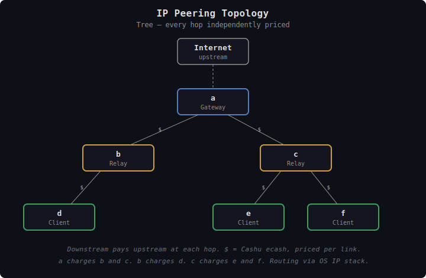
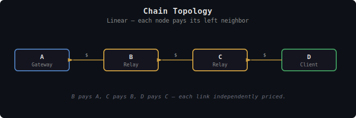
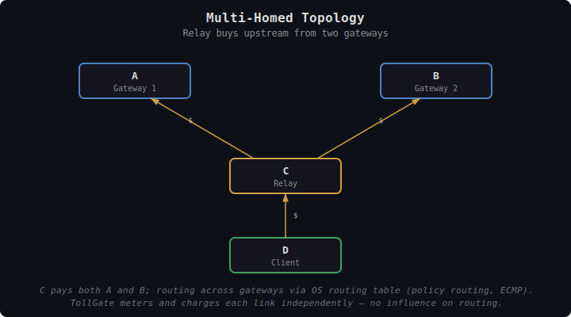

# TollGate Peering: Traditional IP Networks

This document describes how `tollgate-net` is realized on a traditional IP network: the topology assumptions, how peers discover each other, the authentication choices available to the operator, and the IP-specific `ResourceAdapter` implementation (firewall rules and traffic accounting). The wire-level TollGate protocol and the resource-agnostic core logic are unchanged from any other deployment — this document covers only what is IP-specific.

---

## Overview

On a traditional IP network, peers connect over plain IP. There is no self-organizing mesh, no spanning tree. Peers are configured or discovered via simple mechanisms, and forwarding is handled by the OS IP stack.

`tollgate-net` runs on each node, listens on default port **4747** for incoming TollGate sessions, and gates forwarded traffic with firewall rules.

---

## Topology

The typical topology is a **tree or chain**: an upstream provider sells connectivity to downstream customers, who may resell further. This is the classic ISP model — but with TollGate, every hop is independently priced and paid for with Cashu ecash.


<details><summary>Text version</summary>

```
                  Internet
                     |
                    [a]              Gateway
                   /   \
                 [b]   [c]           Relays
                  |    / \
                 [d] [e] [f]         Clients

  Each link independently priced. Downstream pays upstream:
  - a charges b and c
  - b charges d
  - c charges e and f
  Routing handled by OS IP stack.
```
</details>

### Chain


<details><summary>Text version</summary>

```
[A: Gateway] ←─$── [B: Relay] ←─$── [C: Relay] ←─$── [D: Client]
```

Linear topology. Each node pays its left neighbor for forwarding.
</details>

### Multi-Homed


<details><summary>Text version</summary>

```
  [A: Gateway 1]    [B: Gateway 2]
       ↑   $              $   ↑
        \                /
         [C: Relay]
              ↑   $
              |
         [D: Client]
```

C has two upstream peers and pays both. Traffic routes across them via the OS routing table (policy routing, ECMP). TollGate does not influence routing — it meters and charges each link independently.
</details>

Nothing prevents a mesh-like topology over IP (multiple peers, redundant paths), but without a mesh routing protocol, `tollgate-net` relies on the OS IP stack for all forwarding decisions.

---

## Peer Discovery and Configuration

Discovery has three modes: **listening** (passive, common to all platforms), **probing** (active, platform-specific and pluggable), and **static configuration**. They coexist — most deployments use some combination.

### Listening (Common)

Every node listens on port **4747** for incoming TollGate sessions. Any peer that connects and sends a valid Announce is accepted as a TollGate peer. For open hotspots and public gateways, this is the only discovery mechanism needed: clients reach out, the operator answers.

### Probing (Pluggable, Platform-Specific)

When the node should *initiate* sessions to nearby devices (e.g., a router probing newly-associated WiFi clients, or a phone scanning the local subnet), `tollgate-net` exposes a pluggable discovery interface. Each platform implements it differently because the kernel/OS hooks for "a new device showed up nearby" vary widely:

| Platform | Probing source |
|---|---|
| **OpenWrt / Linux router** | DHCP lease events (`dnsmasq.leases`), hostapd association events, ARP-watch |
| **Linux desktop / server** | NetworkManager events, netlink `RTM_NEWNEIGH` for ARP-table changes |
| **macOS** | System Configuration framework (`SCDynamicStore`) for network interface and routing changes |
| **Windows** | WMI events or `NetworkInformation` API for network change notifications |
| **Android** | `ConnectivityManager` + `WifiP2pManager` for nearby-device discovery |

Each implementation produces a stream of "candidate peer" addresses. `tollgate-net` then attempts the TollGate Announce handshake against each candidate; if it responds with a valid Announce, a session begins. Candidates that don't respond are skipped and may be retried later.

The probing interface is opt-in. Open-hotspot deployments rely on listening alone — no probing needed.

### Static Configuration

The operator can also pre-configure known peers:

```yaml
peers:
  - pubkey: "02abc..."
    endpoint: "192.168.1.1:4747"

  - pubkey: "03def..."
    endpoint: "192.168.1.100:4747"
```

Static peers are attempted on startup and reconnected on failure. This is the right answer for fixed infrastructure peering (a relay that always pays a known upstream gateway) and for multi-hop topologies where dynamic probing on a local subnet wouldn't reach the intended peer.

Each peer relationship is independently priced and negotiated. There is no concept of "upstream" or "downstream" at the TollGate level — pricing determines the economic direction.

---

## Peer Authentication

TollGate identifies peers by pubkey. The Announce message carries the peer's compressed secp256k1 pubkey, and `tollgate-core` keys all per-peer state by it.

**Authenticating that pubkey** — proving the peer holds the matching private key — is platform-dependent:

- **On FIPS** (for reference): the pubkey is authenticated by the Noise IK handshake before TollGate sees the peer. Identity is cryptographically tied to the pubkey by the network layer; the peer cannot connect without it.
- **On IP**: the pubkey in the Announce is self-declared. Without an additional step, anyone can claim any pubkey. Two ways to bind the pubkey to the peer:
  1. **Challenge-response** at session setup: `tollgate-net` sends a random nonce, the peer signs it with the private key matching the claimed pubkey. Required before granting `Active` access in any deployment where it matters who the peer is.
  2. **An authenticating transport layer**: run over WireGuard or mTLS where the transport already authenticates the peer's key. The TollGate pubkey can be the same key as the WireGuard/cert key, collapsing the two checks into one layer. See Transport Layer Security below.

For open-hotspot deployments where every peer is anonymous and the only requirement is "they paid," challenge-response can be skipped — the economic exposure is bounded per peer (no pay, no service), and a peer cannot impersonate another peer's channels because Spilman balance updates require the channel funder's private-key signature. Two peers claiming the same pubkey at session setup will collide; implementations should reject duplicate pubkey connections or require challenge-response in high-risk deployments.

### MAC spoofing on IP

On a shared L2 segment (Ethernet, WiFi without WPA), MAC addresses are trivially spoofable. This is hard to prevent without an authentication layer below — WPA-PSK / WPA-EAP at L2, or WireGuard / IPsec at L3. For TollGate this matters mostly during *discovery and probing*: a spoofed MAC can make a host look like a "new device" to ARP-watch hooks, causing repeated probe attempts. It does not weaken peer identity itself (pubkey-bound, not MAC-bound).

---

## Transport Layer Security

Confidentiality and integrity of TollGate messages on the wire is a **separate concern from peer authentication** and is the implementation's responsibility. `tollgate-core` does not mandate a transport-security choice; the deployer picks one based on threat model and accepts the trade-off.

| Choice | What it provides | Risk profile |
|---|---|---|
| **Plain HTTP / WS** (default) | None | A network attacker can read messages and **intercept bootstrap tokens** in flight — Cashu ecash is a bearer instrument, so whoever has the token bytes can redeem them at the mint. Returns to the attacker are low (bootstrap amounts are small by design), but the legitimate peer's payment can be stolen, forcing it to retry with a fresh token — **locally disruptive** even though aggregate economic damage is bounded. Spilman BalanceUpdates cannot be hijacked (the receiver's multisig key is required to redeem). Metadata (who paid what, when) is also public. |
| **TLS (HTTPS / WSS)** | Confidentiality + integrity | Standard server-cert TLS; no peer authentication unless mTLS is enabled. |
| **WireGuard tunnel** | Confidentiality + integrity + peer authentication | The WireGuard pubkey can be the same key as the TollGate pubkey, collapsing transport security and peer authentication into one layer. Natural fit for infrastructure peering. |
| **Mutual TLS** | Confidentiality + integrity + peer authentication | Cert-chain authentication; suitable for managed infrastructure. |

For open hotspots — where bootstrap tokens are the common payment path — plain HTTP is functional but leaves those tokens visible to anyone on the segment. The economic exposure per peer is small, but a determined attacker on the local segment can disrupt service by racing to redeem intercepted tokens. Operators who want to mitigate this should run TLS/HTTPS at minimum (encrypts the wire so tokens are not visible), or a WireGuard/mTLS tunnel where peer authentication also matters. For infrastructure peering, WireGuard is the natural fit — both transport security and peer authentication in one layer.

---

## ResourceAdapter Implementation

`tollgate-net` provides a `ResourceAdapter` implementation that hooks `tollgate-core` into the kernel networking stack. The implementation has three responsibilities: gate forwarding via firewall rules, expose per-peer traffic counters, and (optionally) supply peer metrics for dynamic pricing.

### Access Control via Firewall Rules

Access control is enforced via **firewall rules** (nftables, iptables, pf):

| Access level | Firewall action |
|-------------|----------------|
| `None` | Drop all forwarded traffic from/to this peer's IP. Allow traffic to local ports (TollGate protocol). |
| `Active` | Allow forwarded traffic from/to this peer's IP. |
| `ZeroPrice` | Allow forwarded traffic from/to this peer's IP. |
| `Suspended` | Same as `None` — drop forwarded, allow local. |

`set_peer_access()` translates to firewall rule changes. The peer's IP address (from the TollGate session connection) is the identifier. Bloom filter inference is a no-op — bloom filters are not part of the IP model.

### Per-Peer Metering Counters

`tollgate-core` requires a `MeterStream` per peer with two cumulative counters: `delivered` (bytes we forwarded toward the peer) and `received` (bytes the peer forwarded toward us). On IP, `tollgate-net` builds these by attaching kernel counters to each connected peer.

**nftables accounting (default).** When a peer connects, `tollgate-net` adds two `counter` rules on the `FORWARD` chain — one matching the peer's IP as destination (delivered) and one matching the peer's IP as source (received). The rules carry the peer's pubkey as a comment for traceability. Every metering interval the implementation reads the byte counts, computes the delta against the previous snapshot, and pushes the new cumulative total into the `MeterStream`'s `watch::Sender`. On peer disconnect the rules are removed.

```
# Conceptual nftables rules attached when peer 02abc... (10.0.0.42) becomes Active:
table inet tollgate {
  chain forward {
    ip daddr 10.0.0.42 counter comment "tollgate:02abc..."   # delivered to peer
    ip saddr 10.0.0.42 counter comment "tollgate:02abc..."   # received from peer
  }
}
```

**Interface-level counters.** If the deployment puts each peer on a dedicated interface (VLAN, GRE tunnel, separate WireGuard peer), the kernel's interface rx/tx byte counters can serve as the source instead — slightly cheaper than nftables but requires interface-per-peer provisioning.

The two sources are interchangeable from `tollgate-core`'s perspective; the choice is operational.

### Peer Metrics

IP networks provide no rich link-quality metrics out of the box. `peer_metrics()` returns `None` by default.

If the operator wants dynamic pricing, `tollgate-net` can optionally provide:
- **Ping-based RTT**: periodic ICMP pings to measure latency
- **Loss estimation**: derived from ping success rate
- **Static estimates**: operator-configured values per peer

These are coarse approximations. Dynamic pricing on plain IP is less granular than on networks that publish detailed link-quality metrics.

---

## Transport for TollGate Messages

The wire-level transport spec — endpoints, framing, polling cadence, failure detection — is defined in [tollgate-protocol.md](../core/tollgate-protocol.md#transports). v1 supports **HTTP polling** and **WebSocket**, both on default port **4747**. This section covers IP-specific deployment notes only.

### HTTP polling (`POST /tollgate/v1/exchange`)

- Suitable for constrained clients and open-access hotspot scenarios.
- Works through NATs, proxies, and firewalls — any HTTP client can participate.
- Stateless on the server: no need to maintain open connections per peer.
- Polling cadence equals the metering interval (default 5s); clients may poll more aggressively during initial channel setup.

### WebSocket (`GET /tollgate/v1/ws`)

- Suitable for higher-frequency metering and large numbers of peers.
- Persistent connection, lower latency than polling.
- The deployment must accommodate long-lived connections — load balancer timeouts, NAT keepalive, idle disconnects.

### Future: Tunnel-Based Transport

For authenticated deployments, the same HTTP / WebSocket transports can run inside an encrypted tunnel (WireGuard, TLS). The transport spec is unchanged — the tunnel is invisible to TollGate.

---

## Limitations

- **No automatic failover**: if an upstream peer goes down, the operator must reconfigure routing. There is no protocol-level rerouting.
- **No rich dynamic pricing**: without per-link metrics, pricing inputs are limited to coarse estimates (ping RTT, loss) or static configuration.
- **Simpler peer discovery**: dynamic probing works on a local network but does not scale to multi-hop topologies. Operators bridging multiple subnets configure peers statically.

---

## Design Decisions

| Decision | Resolution | Rationale |
|----------|-----------|-----------|
| Authentication | Unauthenticated by default | Open access is the primary use case; payment is the gatekeeper |
| Access control | Firewall rules (nftables/iptables) | Standard IP mechanism, per-peer by IP |
| Metering counters | nftables accounting (default) or interface stats | Per-peer granularity at the kernel level |
| Peer metrics | None by default; optional ICMP / static | No built-in metrics on plain IP |
| Peer discovery | Dynamic probing, static config, or open access | Local network probing; static config for multi-hop |
| TollGate transport | HTTP polling (simple) or WebSocket (real-time) | Works without tunnels, through NATs |
| Routing | OS IP stack | Separation of concerns — TollGate handles payment, not routing |
