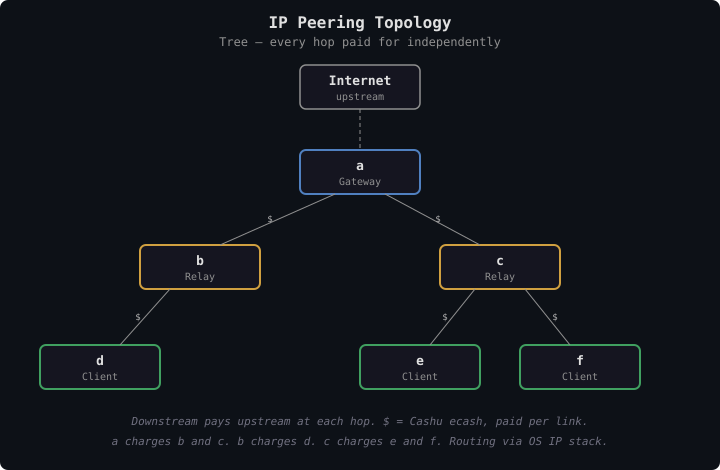
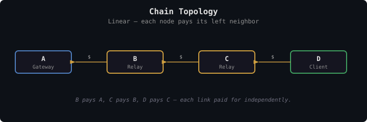
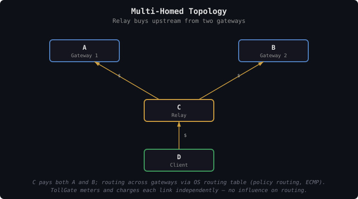

# TollGate Peering: Traditional IP Networks

This document describes how `tollgate-net` is realized on a traditional IP network: the topology assumptions, how peers discover each other, the authentication choices available to the operator, and the IP-specific `ResourceAdapter` implementation (firewall rules and traffic accounting). The wire-level TollGate protocol and the resource-agnostic core logic are unchanged from any other deployment — this document covers only what is IP-specific.

---

## Overview

On a traditional IP network, peers connect over plain IP. There is no self-organizing mesh, no spanning tree. Peers are configured or discovered via simple mechanisms, and forwarding is handled by the OS IP stack.

`tollgate-net` runs on each node, listens on default port **4747** for incoming TollGate sessions, and gates forwarded traffic with firewall rules.

---

## Topology

The typical topology is a **tree or chain**: an upstream provider sells connectivity to downstream customers, who may resell further. This is the classic ISP model — but with TollGate, every hop is its own commercial relationship, paid for with Cashu ecash.


<details><summary>Text version</summary>

```
                  Internet
                     |
                    [a]              Gateway
                   /   \
                 [b]   [c]           Relays
                  |    / \
                 [d] [e] [f]         Clients

  Each link paid for independently. Downstream pays upstream:
  - a charges b and c
  - b charges d
  - c charges e and f
  Routing handled by OS IP stack.
```
</details>

### Chain


<details><summary>Text version</summary>

```
[A: Gateway] ←─$── [B: Relay] ←─$── [C: Relay] ←─$── [D: Client]
```

Linear topology. Each node pays its left neighbor for forwarding.
</details>

### Multi-Homed


<details><summary>Text version</summary>

```
  [A: Gateway 1]    [B: Gateway 2]
       ↑   $              $   ↑
        \                /
         [C: Relay]
              ↑   $
              |
         [D: Client]
```

C has two upstream peers and pays both. Traffic routes across them via the OS routing table (policy routing, ECMP). TollGate does not influence routing — it meters and charges each link independently.
</details>

Nothing prevents a mesh-like topology over IP (multiple peers, redundant paths), but without a mesh routing protocol, `tollgate-net` relies on the OS IP stack for all forwarding decisions.

---

## Peer Discovery and Configuration

Discovery has three modes: **listening** (passive, common to all platforms), **probing** (active, platform-specific and pluggable), and **static configuration**. They coexist — most deployments use some combination.

### Listening (Common)

Every node listens on port **4747** for incoming TollGate sessions. Any peer that connects and sends a valid Announce is accepted as a TollGate peer. For open hotspots and public gateways, this is the only discovery mechanism needed: clients reach out, the operator answers.

### Probing (Pluggable, Platform-Specific)

When the node should *initiate* sessions to nearby devices (e.g., a router probing newly-associated WiFi clients, or a phone scanning the local subnet), `tollgate-net` exposes a pluggable discovery interface. Each platform implements it differently because the kernel/OS hooks for "a new device showed up nearby" vary widely:

| Platform | Probing source |
|---|---|
| **OpenWrt / Linux router** | DHCP lease events (`dnsmasq.leases`), hostapd association events, ARP-watch |
| **Linux desktop / server** | NetworkManager events, netlink `RTM_NEWNEIGH` for ARP-table changes |
| **macOS** | System Configuration framework (`SCDynamicStore`) for network interface and routing changes |
| **Windows** | WMI events or `NetworkInformation` API for network change notifications |
| **Android** | `ConnectivityManager` + `WifiP2pManager` for nearby-device discovery |

Each implementation produces a stream of "candidate peer" addresses. `tollgate-net` then attempts the TollGate Announce handshake against each candidate; if it responds with a valid Announce, a session begins. Candidates that don't respond are skipped and may be retried later.

The probing interface is opt-in. Open-hotspot deployments rely on listening alone — no probing needed.

### Static Configuration

The operator can also pre-configure known peers:

```yaml
peers:
  - pubkey: "02abc..."
    endpoint: "192.168.1.1:4747"

  - pubkey: "03def..."
    endpoint: "192.168.1.100:4747"
```

Static peers are attempted on startup and reconnected on failure. This is the right answer for fixed infrastructure peering (a relay that always pays a known upstream gateway) and for multi-hop topologies where dynamic probing on a local subnet wouldn't reach the intended peer.

Each peer relationship is independent. There is no concept of "upstream" or "downstream" at the TollGate level — each side pays for what it receives, and which way the money mostly flows follows from who receives more. The one place the distinction exists is the kernel adapter's counters (see [Per-Peer Metering Counters](#per-peer-metering-counters)), and it reads it from the routing table rather than from the protocol.

---

## Peer Authentication

TollGate identifies peers by pubkey. The Announce message carries the peer's compressed secp256k1 pubkey, and `tollgate-core` keys all per-peer state by it.

**Authenticating that pubkey** — proving the peer holds the matching private key — is platform-dependent:

- **On FIPS** (for reference): the pubkey is authenticated by the Noise IK handshake before TollGate sees the peer. Identity is cryptographically tied to the pubkey by the network layer; the peer cannot connect without it.
- **On IP**: the pubkey in the Announce is self-declared, and the delivery path gates by IP address. **Impersonation cannot be reliably prevented on a plain IP network.**

What that exposes: an attacker that announces a paying peer's pubkey, or takes over its IP address, can draw on the service that peer paid for. What it does not expose: the attacker cannot spend or redirect the victim's money, because every balance update needs the channel funder's private-key signature. The loss is bounded by the grant in force — service stolen, not funds. Two sessions claiming the same pubkey collide, and an implementation should refuse the second.

For open-hotspot deployments, where every peer is anonymous and the only requirement is "they paid," that bound is the protection. Where it matters who the peer is, the deployment should run over a network that authenticates peers — FIPS does, and so do WireGuard or mTLS tunnels. Binding the TollGate pubkey to such a layer (challenge-response at session setup, or the TollGate key doubling as the tunnel key) is **future work**.

### MAC spoofing on IP

On a shared L2 segment (Ethernet, WiFi without WPA), MAC addresses are trivially spoofable. This is hard to prevent without an authentication layer below — WPA-PSK / WPA-EAP at L2, or WireGuard / IPsec at L3. For TollGate this matters mostly during *discovery and probing*: a spoofed MAC can make a host look like a "new device" to ARP-watch hooks, causing repeated probe attempts. It does not weaken peer identity itself (pubkey-bound, not MAC-bound).

It does reach metering. An upstream's received bytes are counted by its MAC, so a host on the same segment that forges that MAC has what it sends through us counted as delivered by the upstream: the node over-reads what it drew and buys more than it needed. A customer cannot escape its own metering this way, since it is still counted by its IP; forging the IP as well is the address takeover above. The adapter trusts the segment's link addresses exactly as far as it trusts its IP addresses, and the same remedies (WPA, or a tunnel per peer) apply.

---

## Transport Layer Security

Confidentiality and integrity of TollGate messages on the wire is a **separate concern from peer authentication** and is the implementation's responsibility. `tollgate-core` does not mandate a transport-security choice; the deployer picks one based on threat model and accepts the trade-off.

| Choice | What it provides | Risk profile |
|---|---|---|
| **Plain TCP** (default) | None | Spilman funding proofs travel in Accept and RolloverInit, but they are locked 2-of-2 to both peers' keys, so an eavesdropper cannot redeem them. TopUps cannot be hijacked either — the receiver's key is required to redeem. What is exposed is **metadata**: who funded whom, for how much, and when. An attacker who can modify traffic can still drop or delay messages. |
| **TLS wrapper** | Confidentiality + integrity | Server-cert TLS around the TCP connection; no peer authentication unless mutual. |
| **WireGuard tunnel** | Confidentiality + integrity + peer authentication | The WireGuard pubkey can be the same key as the TollGate pubkey, collapsing transport security and peer authentication into one layer. Natural fit for infrastructure peering. |
| **Mutual TLS** | Confidentiality + integrity + peer authentication | Cert-chain authentication; suitable for managed infrastructure. |

For open hotspots, plain TCP is functional but leaves every payment visible to anyone on the segment. Operators who want to hide that should wrap the connection in TLS at minimum, or use a WireGuard/mTLS tunnel where peer authentication also matters. For infrastructure peering, WireGuard is the natural fit — both transport security and peer authentication in one layer.

---

## ResourceAdapter Implementation

`tollgate-net` provides a `ResourceAdapter` implementation that hooks `tollgate-core` into the kernel networking stack. It has four responsibilities: gate forwarding via firewall rules, **shape each peer to the rate it bought**, expose per-peer traffic counters, and (optionally) supply peer metrics for operator visibility.

Access and rate are **both per peer, and orthogonal**. A grant buys a rate, so a binary gate cannot express what was sold; and an unpaid peer is not simply blocked, because the minimum flow allowance is itself a rate. Every peer therefore carries two settings at all times.

### Access Control via Firewall Rules

Access control is enforced via **firewall rules** (nftables, iptables, pf):

| Access level | Firewall action |
|-------------|----------------|
| `None` | No TollGate session. Forwarded traffic from/to this peer's IP is shaped to the minimum flow allowance, or dropped if the allowance is zero. Traffic to the node itself (TollGate protocol, the mint) is always allowed. |
| `Active` | Allow forwarded traffic from/to this peer's IP. |
| `Free` | Allow forwarded traffic from/to this peer's IP. |

`set_access()` and `set_shaping_rate()` both translate to firewall rule changes: whether a peer's IP is forwarded for is `AccessLevel::carried(rate)` — the level together with the rate core shaped it to — so it is re-evaluated when either changes. The peer's IP address (from the TollGate session connection) is the identifier. Bloom filter inference is a no-op — bloom filters are not part of the IP model.

### Per-Peer Rate via Traffic Control

`set_shaping_rate()` translates to a **traffic-control class per peer** (`tc` HTB) on the interface facing it. The firewall decides *whether* a packet is forwarded; the qdisc decides *how fast*.

Only **forwarded** traffic is classified. The firewall's forward hook marks the packets it forwards toward each peer's own address with that peer's class; a `tc` filter selects the class by the mark. (Counting is separate rules in the same hook; see below.) Traffic to and from the node itself — TollGate messages, the mint — never passes the forward hook, is never marked, and falls into an unshaped default class. Shaping it would throttle the payment that restores the peer's rate.

```
# Conceptual shaping for customer 02abc... (10.0.0.42) at 3.12 MiB/s:
nft add rule inet tollgate forward ip daddr 10.0.0.42 \
    meta mark set 0x70110042                  # mark forwarded packets
tc class replace dev eth0 parent 1: classid 1:42 htb \
    rate 26214400bit burst 32768              # ~10 ms of burst
tc filter replace dev eth0 parent 1: protocol ip prio 1 \
    handle 0x70110042 fw flowid 1:42          # select the class by the mark
```

Four properties the shaper has to have, each of which follows from the payment model rather than from networking practice:

- **The rate changes often.** A payer may buy as often as `min_window_ms` allows — 200 ms by default — and a grant takes effect on arrival with no acknowledgement. Updating a class is cheap; tearing down and rebuilding one is not, so the class is created once per peer and only its rate is replaced.
- **Burst stays tiny — about 10 ms of the rate.** Capacity left unused early is *not* banked: a peer that idles and then bursts is precisely what grants exist to prevent. Burst is also permission to spend the grant ahead of its window, so a generous one makes the grant lapse early and the transfer it carries stall. It must still pass at least one full-sized packet per timer tick. This figure is for the kernel path (`nftables` + `tc`). The `loopback` adapter, which shapes TollGate's own generated traffic in userspace rather than forwarded packets, holds 250 ms instead: its writer is a task that can wake tens of milliseconds late, and a 10 ms bucket would under-deliver what was bought.
- **The allowance is the floor.** A peer with no live grant falls to the minimum flow allowance. The floor is applied by `tollgate-core` before the adapter sees the number, so the adapter always receives a rate it can simply apply. With the allowance at zero the peer's forwarding is blocked instead — and the TopUp that revives it still gets through, because traffic to the node itself is never shaped or blocked.
- **Only the peer's download is shaped.** Its upload is charged through the `received_multiplier`, which drains that peer's own grant faster rather than capping its ingress. A peer that pushes harder exhausts its grant sooner and falls to the allowance — no ingress policer is involved.

### Per-Peer Metering Counters

`tollgate-core` requires a `MeterStream` per peer with two cumulative counters: `delivered` (bytes we forwarded toward the peer) and `received` (bytes the peer forwarded toward us). On IP, `tollgate-net` builds these by attaching kernel counters to each connected peer. **How a counter matches the peer's traffic depends on which side of the relationship the peer is on** — and getting this right is what lets several peers share one interface.

Each peer has two **named counters**, and four maps in the forward chain point packet keys at them. One rule per map covers every peer for the life of the node, so moving a peer between the two ways of counting below is a change of map elements, and its totals carry across. The rules sit after the gate, so a dropped packet is not counted, and in the forward hook, so — as with shaping — only forwarded traffic is counted, after conntrack has undone any NAT:

```
table inet tollgate {
  map down_tx { type ipv4_addr  : counter; }   # customer, by destination IP
  map down_rx { type ipv4_addr  : counter; }   # customer, by source IP
  map up_tx   { type ipv4_addr  : counter; }   # upstream, by the route's next hop
  map up_rx   { type ether_addr : counter; }   # upstream, by the frame's source MAC
  chain forward {
    counter name ip daddr map @down_tx
    counter name ip saddr map @down_rx
    counter name rt ip nexthop map @up_tx
    counter name ether saddr map @up_rx
  }
}
```

**Metering a customer — per-IP (default).** When the peer is the source/sink of the forwarded flow — a downstream peer whose traffic *we* forward — its IP is the source or destination of every forwarded packet. Its IP goes in `down_tx` (delivered) and `down_rx` (received).

**Metering an upstream — per next hop and MAC.** When the peer is one we *buy* from — it forwards our traffic onward — the forwarded packets carry the far endpoints' IPs, **not** the upstream's, so per-IP matching cannot attribute them. What identifies "this arrived from that upstream" is the **link address**: `tollgate-net` resolves the upstream's IP to its MAC (the neighbour table) and counts received bytes by it in `up_rx`. What identifies "we sent this via that upstream" is the **route's next hop**, which the forward hook knows: its IP goes in `up_tx`, and for a destination on the link the next hop is the destination, so traffic addressed to the upstream itself is covered too and no per-IP element is kept. This is what keeps the multi-homed case correct — several upstreams reachable over one shared L2 segment are still metered independently, because each has a distinct MAC and is a distinct next hop.

A peer is counted as an upstream exactly when some route (any table, including every hop of a multipath route) uses it as a gateway; everything else is counted per IP. Routes and the neighbour table are re-read every few seconds, and at once when a peer registers, so a late ARP entry or an operator's reroute moves the peer. Until its MAC is known, an upstream's received side stays on its IP. IPv6 peers stay per IP.

These counts are the node's own: counters are **not exchanged** and are not an input to payment ([tollgate-metering.md](../core/tollgate-metering.md)), so there is no figure to reconcile with the upstream and no drift to arbitrate. What they answer is the payer's own question — delivered against purchased — from local numbers alone.

**Interface counters — dedicated link.** If the deployment puts each peer on its own interface (VLAN, GRE tunnel, separate WireGuard peer), the kernel's interface rx/tx byte counters serve as the source directly, with no per-peer rules — simplest when a peer owns its link, but it cannot disambiguate peers that share an interface.

All three sources are interchangeable from `tollgate-core`'s perspective; the choice is operational and per-peer.

### Peer Metrics

IP networks provide no rich link-quality metrics out of the box. `peer_metrics()` returns `None` by default.

If the operator wants visibility, `tollgate-net` can optionally provide:
- **Ping-based RTT**: periodic ICMP pings to measure latency
- **Loss estimation**: derived from ping success rate
- **Static estimates**: operator-configured values per peer

These are coarse approximations, and they are not inputs to any price — delivery costs one voucher per unit regardless ([tollgate-vouchers.md](../core/tollgate-vouchers.md)). They exist for operator visibility and capacity decisions.

---

## Transport for TollGate Messages

The wire-level transport spec — framing, failure detection, reconnection — is defined in [tollgate-protocol.md](../core/tollgate-protocol.md#transports). TollGate messages travel over **raw TCP** on default port **4747**. Peerings are adjacent, so there is no proxy or NAT between the two ends for an HTTP-shaped transport to get through. This section covers IP-specific deployment notes only.

### Tunnel-Based Transport

For authenticated deployments, raw TCP runs inside an encrypted tunnel (WireGuard, IPsec) exactly as it does bare. The transport spec is unchanged — the tunnel is invisible to TollGate. On FIPS this is what Noise IK already provides, which is why nothing needs wrapping there.

---

## Limitations

- **No automatic failover**: if an upstream peer goes down, the operator must reconfigure routing. There is no protocol-level rerouting.
- **No rich link metrics**: without per-link measurement, operator visibility is limited to coarse estimates (ping RTT, loss) or static configuration. Nothing in the payment path depends on metrics.
- **Simpler peer discovery**: dynamic probing works on a local network but does not scale to multi-hop topologies. Operators bridging multiple subnets configure peers statically.

---

## Design Decisions

| Decision | Resolution | Rationale |
|----------|-----------|-----------|
| Authentication | Unauthenticated by default | Open access is the primary use case; payment is the gatekeeper |
| Access control | Firewall rules (nftables/iptables), per peer by IP | Standard IP mechanism, and the forwarding decision is where it belongs |
| Rate enforcement | A `tc` class per peer, rate replaced as grants arrive | A grant buys a rate, which a binary gate cannot express. Burst stays under a second because unused capacity is not banked |
| Metering counters | nftables accounting (default) or interface stats | Per-peer granularity at the kernel level |
| Peer metrics | None by default; optional ICMP / static | No built-in metrics on plain IP |
| Peer discovery | Dynamic probing, static config, or open access | Local network probing; static config for multi-hop |
| TollGate transport | Raw TCP, port 4747 | Peerings are adjacent; no HTTP parsing on constrained devices |
| Routing | OS IP stack | Separation of concerns — TollGate handles payment, not routing |
