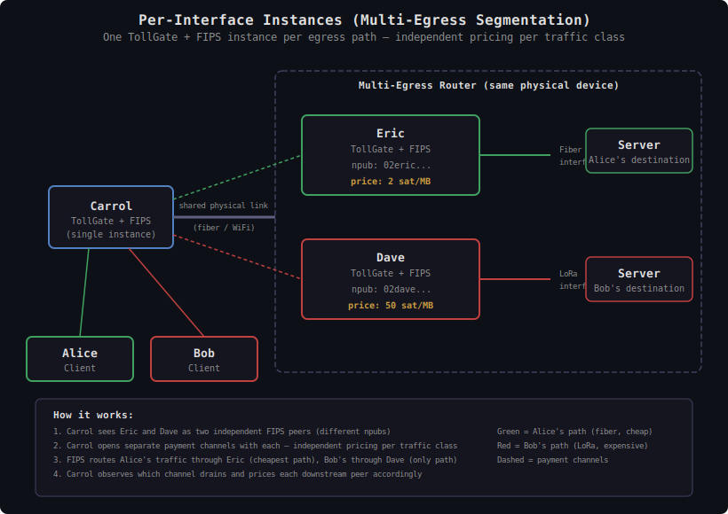

# TollGate Peering: Per-Interface Instances (Multi-Egress Segmentation)

This document describes a deployment pattern for multi-homed routers — devices with multiple egress interfaces of divergent cost (fiber, LoRa, WiFi, LTE). Running one TollGate + FIPS instance per egress interface ensures each traffic class is priced independently, preventing cheap paths from subsidizing expensive ones.

---

## Overview

**Multi-egress segmentation** means running one TollGate + FIPS instance per physical egress interface on a multi-homed router. Each instance is a separate process with its own identity key (npub), its own FIPS daemon, its own pricing, and its own metering. Downstream peers see multiple independent mesh nodes — one per egress path — and open separate payment channels with each.

This pattern requires no changes to the core protocol. It works within the existing one-product-per-peer model by treating each egress interface as a separate peer.

---

## The Problem

Consider a router with two egress paths: a fast fiber connection (cheap per MB) and a slow LoRa radio (expensive per MB). Two clients — Alice and Bob — both send traffic through this router. Alice's traffic is destined for a server reachable via fiber. Bob's traffic is destined for a server reachable only via LoRa.

```
                ┌──────────────────────────┐
                │   Router (single TG)     │
                │                          │
Alice ──→ Carrol ──→ [TollGate] ──→ Fiber ──→ Server_Alice  (cheap)
Bob   ──→ Carrol ──→ [TollGate] ──→ LoRa  ──→ Server_Bob    (expensive)
                │                          │
                └──────────────────────────┘
```

With a single TollGate instance, all traffic shares one price. The operator must either:

- **Price at the expensive rate** — Alice overpays for fiber access, leaving capacity unsaturated.
- **Price at the cheap rate** — the operator loses money on every byte sent over LoRa.
- **Price somewhere in between** — both problems, just less severe.

None of these are good outcomes. The cheap path is penalized by the expensive path's cost structure.

---

## The Solution: Per-Interface Instances

Run one TollGate + FIPS instance per egress interface:


<details><summary>Text version</summary>

```
   Alice                                             Server_Alice
    │    ┌─── green path (cheap) ──────────────────────┤
    │    │    2 sat/MB                                  │
    │    │                                              │
    v    v                                              │
  ┌──────────┐       ┌──────────────────────────────┐  │
  │          │ shared │  Multi-Egress Router         │  │
  │  Carrol  │─link──→│                              │  │
  │          │       │  ┌──────┐     ┌───────────┐  ├──┤
  │ TG + FIPS│       │  │ Eric │────→│ Fiber     │──┘  │
  │          │       │  │TG+FIPS│    │ interface │     │
  └──────────┘       │  │2 sat/MB│   └───────────┘     │
    │    ▲           │  └──────┘                       │
    │    │           │                                  │
    │    │           │  ┌──────┐     ┌───────────┐     │
    │    │           │  │ Dave │────→│ LoRa      │─────┤
    │    │           │  │TG+FIPS│    │ interface │     │
    │    └── red path (expensive) ──→│50 sat/MB  │     │
    │         50 sat/MB              └───────────┘     │
    │                                                  │
   Bob                                            Server_Bob

  Carrol sees Eric and Dave as two independent FIPS peers.
  Separate payment channels. Independent pricing.
  Alice's traffic → Eric (cheapest reachable path).
  Bob's traffic → Dave (only reachable path).
```
</details>

Eric and Dave are two TollGate + FIPS process pairs on the same physical router:

- **Eric** binds to the fiber interface, charges 2 sat/MB
- **Dave** binds to the LoRa interface, charges 50 sat/MB

Carrol sees two independent FIPS peers (different npubs, different mesh identities). Carrol opens separate payment channels with each. Each instance prices based on its own egress cost. No averaging, no cross-subsidy.

---

## How It Works

### Identity and Peering

Each TollGate + FIPS instance has its own identity:

- Own secp256k1 identity key (npub)
- Own FIPS daemon process
- Own configuration, wallet, and channel state

From Carrol's perspective, Eric and Dave are two separate mesh nodes — just like they were on two different physical routers. Carrol discovers them through normal FIPS mesh peering, opens channels with each, and manages them independently.

Eric's FIPS and Dave's FIPS may peer with each other on localhost. This is not harmful — traffic is unlikely to flow through the wrong egress because the economics don't make sense (no reason to send fiber-bound traffic through LoRa). No hard isolation between instances is required.

### Metering

Each instance meters only its own egress interface. Traffic on the fiber interface is metered by Eric. Traffic on the LoRa interface is metered by Dave. No cross-contamination between traffic classes.

### Pricing

Each instance prices based on its own egress cost:

- Eric's cost basis: fiber transit (cheap, high throughput)
- Dave's cost basis: LoRa radio (expensive, low throughput)

Each instance publishes its own PriceSheet. Carrol sees two independent price sheets — one from Eric, one from Dave. Each relationship is negotiated independently.

### Routing: How Carrol Knows Which Peer to Use

Carrol has no destination awareness. Carrol does not know that Alice's server is reachable via fiber or that Bob's server is reachable via LoRa. The routing decision works as follows:

1. **FIPS handles reachability.** FIPS's mesh routing (spanning tree, bloom filters) determines which peers can reach which destinations. FIPS knows that Eric's mesh subtree can reach certain destinations and Dave's can reach others.

2. **TollGate provides cost preferences.** Through the future TollGate → FIPS routing API, Carrol's TollGate tells Carrol's FIPS to prefer the cheaper peer (Eric) when both peers provide a path to the same destination. This is a cost preference, not a routing mandate.

3. **FIPS routes accordingly.** For destinations reachable through both Eric and Dave, FIPS picks Eric (cheaper, per TollGate's preference). For destinations reachable only through Dave (Bob's server), FIPS has no choice and uses Dave.

4. **Carrol observes and prices.** Carrol doesn't need destination knowledge. Carrol observes which upstream payment channel is draining for each downstream peer — this tells Carrol which path that peer's traffic is using. Carrol prices each downstream peer based on the upstream cost of the path their traffic actually takes.

The result: Alice's traffic flows through Eric (cheapest reachable path), Bob's traffic flows through Dave (only reachable path). Each pays only for the path they use.

---

## Carrol's Pricing to Downstream Peers

Carrol charges Alice and Bob each a single price per peering relationship — the standard per-peer pricing model. Carrol does **not** need per-destination pricing. The per-peer pricing model already supports different rates for Alice and Bob.

Carrol's margin is the spread between what it charges downstream and what it pays upstream, per path:

```
Carrol charges Alice:   5 sat/MB
Carrol pays Eric:       2 sat/MB
Carrol's margin:        3 sat/MB

Carrol charges Bob:     55 sat/MB
Carrol pays Dave:      50 sat/MB
Carrol's margin:        5 sat/MB
```

Alice sees one price from Carrol. Bob sees a different price from Carrol. Neither sees the other's price or has visibility into Carrol's upstream costs.

### No exponential price explosion

A natural concern is whether Carrol needs to expose a growing number of prices as the number of hops or destinations increases. It doesn't. Each downstream peer sees exactly one price from Carrol — the rate for the peering relationship. The complexity of multiple upstream paths, multiple traffic classes, and multi-hop routing is internal to Carrol's operation. From the downstream peer's perspective, Carrol is just another TollGate node with a price.

---

## Cascading Across Multiple Hops

The pattern extends naturally to multi-hop meshes. Each hop segments independently with its own per-interface instances.

```
Alice ──→ Carrol ──→ Eric ──→ Frank_Fiber ──→ ... ──→ Server_Alice
Bob   ──→ Carrol ──→ Dave ──→ Frank_LoRa  ──→ ... ──→ Server_Bob
```

If Frank also runs parallel TollGate instances (one for fiber, one for LoRa), the segmentation cascades: Eric pays Frank's fiber instance, Dave pays Frank's LoRa instance. Each hop is an independent bilateral relationship — no coordination needed.

---

## When to Split

Split into separate instances when egress path costs diverge significantly:

- **Split when**: one path costs 2-3x or more than another. The averaging penalty exceeds the operational overhead of running multiple processes.
- **Keep single when**: paths have similar cost structures. A single instance is simpler.

This is an operator decision, not a protocol constraint. The protocol supports both models equally.

---

## Design Decisions

| Decision | Resolution | Rationale |
|----------|-----------|-----------|
| Unit of segmentation | One TollGate + FIPS per egress interface | Clean separation; each instance meters and prices its own path |
| Identity | Separate npub and FIPS daemon per instance | Downstream peers see independent mesh nodes |
| Core protocol changes | None | Works within existing one-product-per-peer model |
| FIPS cross-peering on localhost | Allowed, not harmful | Traffic won't flow through wrong egress due to economics |
| Routing awareness | None in TollGate; FIPS handles reachability | Carrol observes channel drain, doesn't need destination knowledge |
| Cost preference | TollGate routing API tells FIPS to prefer cheaper peer | Economic optimization without destination awareness |
| Downstream pricing | Standard per-peer pricing | No per-destination or per-traffic-class pricing exposed downstream |
| When to split | Operator decision based on cost divergence | Protocol doesn't mandate or prevent splitting |
